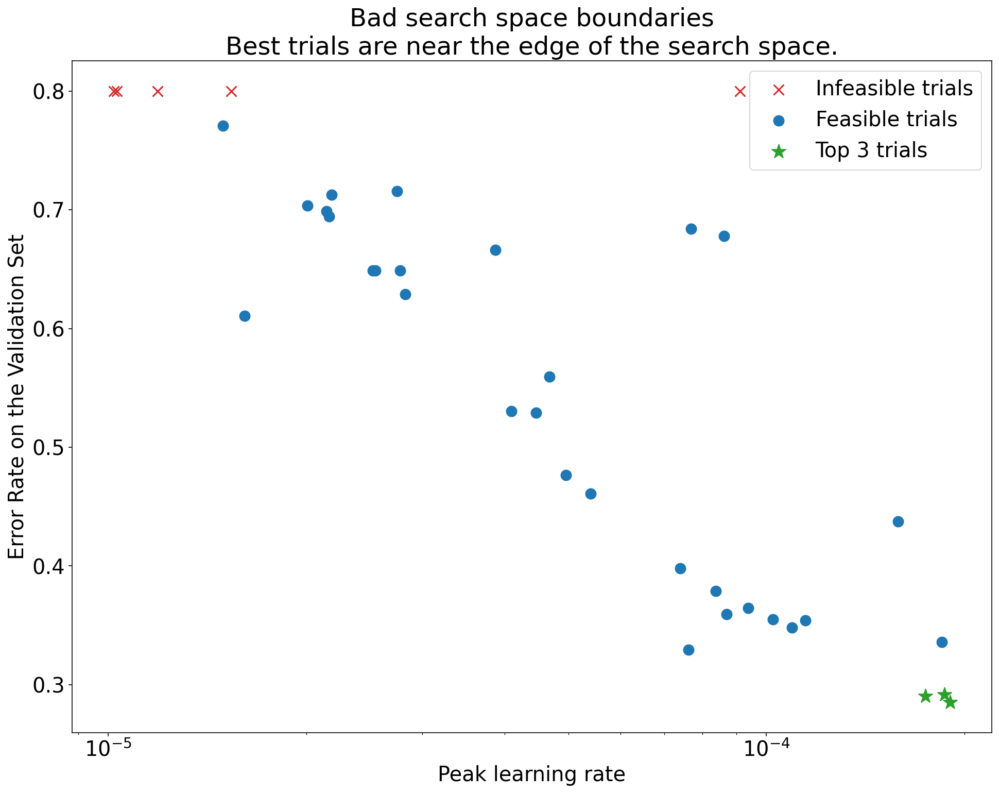
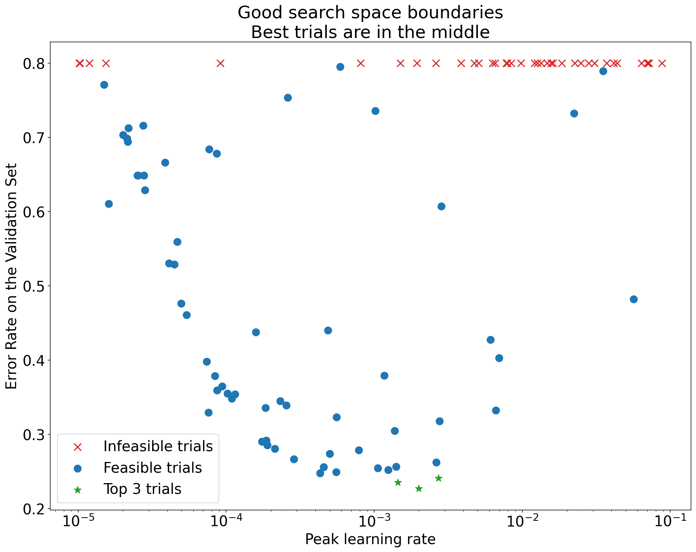
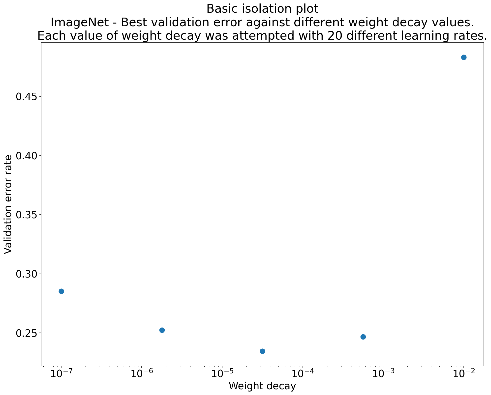
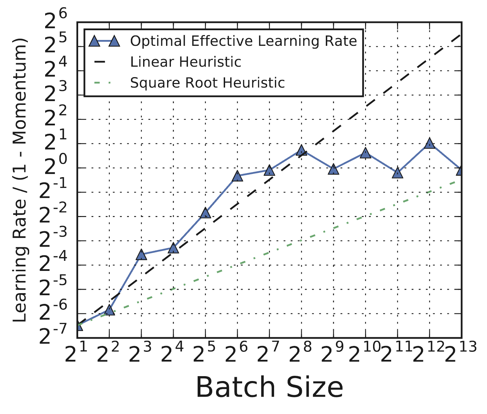
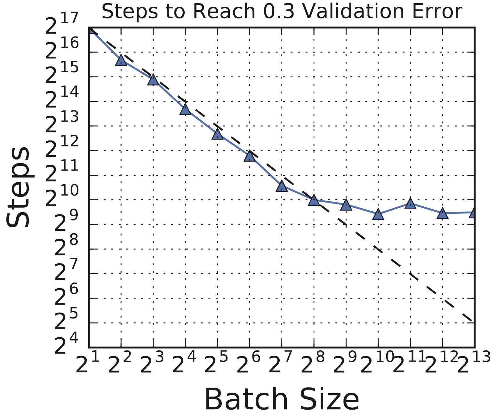
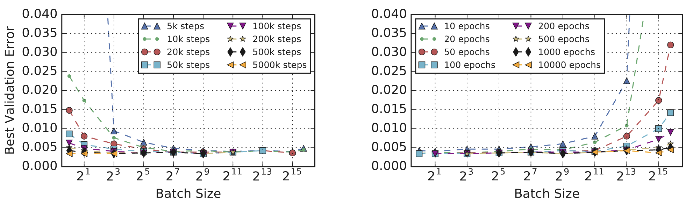

# 10. The tuning playbook

[Deep Learning Tuning Playbook (GitHub)](https://github.com/google-research/tuning_playbook){:target="_blank"}

## Table of contents
1. [From benchmarking to tuning](#1-from-benchmarking-to-tuning)
2. [Starting point](#2-starting-point)
3. [Hyperparameter roles](#3-hyperparameter-roles)
4. [Search methods](#4-search-methods)
5. [Checking your work](#5-checking-your-work)
6. [Batch size](#6-batch-size)
7. [Training duration](#7-training-duration)
8. [Takeaways](#8-takeaways)

## 1. From benchmarking to tuning

In [Lecture 9](../9/notes.md) we showed that you can't evaluate an optimizer without specifying the tuning protocol. The tuning protocol is part of the algorithm. If you compare Adam to SGD without tuning both carefully, your comparison is meaningless.

So what does a good tuning protocol actually look like? How do you tune a deep learning model? Not just the optimizer, but the architecture, the regularization, the schedule, everything.

Most people just try stuff. Change the learning rate, see if it helps. Add dropout, see if it helps. Increase the model size, see if it helps. There's no structure, no way to know if the thing you tried actually helped or if you just got lucky.

The [Deep Learning Tuning Playbook](https://github.com/google-research/tuning_playbook){:target="_blank"} from Google (Godbole et al., 2023) lays out a process for doing this systematically. It's all common sense, but it's common sense that most people don't follow. This lecture walks through the key ideas.

## 2. Starting point

You've picked an optimizer (say AdamW, because that's what people use for your problem). You have a model architecture, a dataset, and a GPU. You have a training loop.

Before you start tuning, you need a baseline.

The playbook says: start simple. Pick a standard architecture for your problem. Use default optimizer settings. Use a constant learning rate. Train for a reasonable number of steps.

The goal is not a good model. The goal is a model that is clearly better than random, that trains without crashing, and that gives you a starting point you can improve from. Starting with something intentionally simple means you're not fighting complexity from day one. For example, start with a constant learning rate before exploring cosine decay, and start with a smaller model before scaling up.

Once you have that, you can start improving it systematically. The key word is *systematically*: the playbook's core idea is to treat tuning as a series of experiments, not random exploration.

## 3. Hyperparameter roles

Here's the framework. Each tuning round is an experiment with a single question:

- "Does adding weight decay help?"
- "What's the best learning rate for this architecture?"
- "Should I use cosine decay or a constant learning rate?"

One question per round. If you try to answer multiple questions at once, you can't tell what caused what.

Within each round, every hyperparameter gets one of three roles:

**Scientific hyperparameters** are what you're investigating. This is the thing you vary to answer your question. For example, "weight decay on vs. off" or "learning rate in $[10^{-4}, 10^{-2}]$."

**Nuisance hyperparameters** are things that aren't your focus but that need to be tuned to make the comparison fair. As we saw in [Lecture 9](../9/notes.md), if you compare two settings without tuning nuisance hyperparameters for each, the comparison is meaningless. For example, if you're testing whether to add weight decay, the learning rate is a nuisance parameter: the optimal learning rate might be different with and without weight decay. You need to tune it separately for each setting of the scientific hyperparameter.

**Fixed hyperparameters** are things you hold constant for this round. This simplifies the experiment, but your conclusions only apply for those fixed values. For example, you might fix the architecture and only study optimizer settings.

The role of a hyperparameter is not intrinsic to it. It depends on the question you're asking in that round. The learning rate might be scientific in one round ("what's the best learning rate?"), nuisance in another ("does weight decay help, after re-tuning the learning rate?"), and fixed in a third ("which activation function works best, holding everything else constant?").

This framework is directly connected to what we learned in [Lecture 9](../9/notes.md). The reason optimizer comparisons go wrong is that people don't handle nuisance hyperparameters properly. The playbook generalizes this idea beyond optimizer comparisons to all of model development.

### 3.1 The incremental strategy

You start from your baseline. You run one experiment. If the change helps, you adopt it as the new baseline. If it doesn't, you discard it. Then you run the next experiment starting from the current baseline. One change at a time, each justified by evidence.

The playbook calls adopting a new baseline a "launch." The final model configuration should be the result of a series of launches, each backed by experimental evidence. This is the opposite of the common practice of making several changes at once and hoping the combination works.

A useful distinction: most of the tuning process should focus on *exploration* (gaining insight into which hyperparameters matter and how they interact) rather than *exploitation* (squeezing out the last bit of validation performance). Save greedy optimization for the end, once you understand the problem well enough to know where to look.

## 4. Search methods

Within each study, you need to search over the nuisance hyperparameters. There are several approaches, and the choice matters.

### 4.1 Grid search

You pick a set of values for each hyperparameter and try every combination. The problem: the number of combinations grows exponentially with the number of hyperparameters. 3 hyperparameters with 5 values each gives you 125 trials. 5 hyperparameters gives you 3,125 trials. This gets expensive fast.

Worse, most of those combinations are wasted. If only 2 of your 5 hyperparameters actually matter, a grid still forces you to try every combination of the other 3, which doesn't tell you anything useful.

### 4.2 Random search

You sample hyperparameter values randomly from specified ranges. Bergstra and Bengio (2012) showed that random search is more efficient than grid search for hyperparameter optimization. The key insight: for most problems, only a few hyperparameters really matter. A grid wastes most of its budget on exact combinations of the unimportant ones. Random search, by contrast, gives you a different value of every hyperparameter on every trial, so you effectively see more distinct values of the ones that matter.

### 4.3 Quasi-random search

Like random search, but the points are chosen to cover the space more uniformly using [low-discrepancy sequences](https://en.wikipedia.org/wiki/Low-discrepancy_sequence){:target="_blank"} (e.g., [Sobol sequences](https://en.wikipedia.org/wiki/Sobol_sequence){:target="_blank"}). Regular random search can produce clumps and gaps by chance. Quasi-random search avoids this by construction, guaranteeing that the points spread out evenly across the search space.

The playbook recommends quasi-random search during the exploration phase for three reasons: it gives uniform coverage of the space, it doesn't adapt to a specific objective (so you can do flexible post-hoc analysis, like re-analyzing results for a different metric), and it's easy to implement.

### 4.4 Bayesian optimization

A sequential strategy. After each trial, you use all the results so far to build a model that predicts performance as a function of the hyperparameters. Then you use that model to decide what to try next, balancing between regions where the model predicts good performance and regions where the model is uncertain and there might be something better.

This is more sample-efficient than random search because each trial is chosen to be maximally informative given what you've already observed. The downside is that it adapts to the objective, which means if you later want to re-analyze the results for a different metric or a different question, the sampling is biased toward what looked good under the original objective.

The playbook recommends Bayesian optimization for the final exploitation phase, when you've already narrowed the search space through exploration and just want to find the single best configuration within it.

## 5. Checking your work

After running the trials in a study, you need to verify that the experiment actually worked before drawing conclusions. There are three things to check.

### 5.1 Search space boundaries

Plot the validation performance of each trial against each hyperparameter. If the best trials are clustered near the edge of your search range, your space is probably too small and the optimum might lie outside it.

*Figure 5.1: A suspicious search space. The best trials (lowest error) cluster near the upper boundary for the learning rate, suggesting the space needs expansion in that direction.*

*Figure 5.2: An adequate search space. The best trials are well within the boundaries, suggesting the chosen range captures the optimum.*

If you find that the best results are at the boundary, expand the search range in that direction and rerun the study. There's no point drawing conclusions from a study where you may not have found the actual optimum.

### 5.2 Training curves

Look at the training and validation curves for the best-performing trials:

- **Overfitting:** If validation error starts increasing while training error keeps decreasing, you have an overfitting problem. You may need to add or strengthen regularization before you can trust comparisons between scientific hyperparameter values.
- **High variance:** If validation error fluctuates significantly late in training, your comparisons may be unreliable. Consider reducing the learning rate, using Polyak averaging, or increasing the validation set size.
- **Convergence:** If the model is still improving significantly at the final step, the training run might be too short. Conversely, if performance saturates early, you might be wasting compute.

### 5.3 Isolation plots

To answer your scientific question, make an **isolation plot**: for each value of the scientific hyperparameter, plot the best performance achieved after optimizing over the nuisance hyperparameters. This gives you an apples-to-apples comparison, because each point on the plot represents the best you could do with that scientific setting given fair tuning of everything else.

*Figure 5.3: An isolation plot. Each point shows the best validation error achieved for a given value of the scientific hyperparameter (e.g., weight decay strength), after optimizing over nuisance hyperparameters (e.g., learning rate) for that value. This makes the comparison fair.*

## 6. Batch size

People commonly treat batch size as something to tune for model performance. The playbook says: don't.

Batch size determines training speed and hardware utilization. It is not something you tune to improve validation accuracy. Shallue et al. (2018) showed this empirically: you can reach comparable validation performance across a wide range of batch sizes, provided you re-tune the learning rate and regularization for each batch size.

The catch is that you *have to* re-tune. If you just double the batch size and keep the same learning rate, things will break. And the optimal learning rate does not follow simple scaling rules. People often claim you should scale the learning rate linearly or by the square root of the batch size, but Shallue et al. found that neither heuristic holds reliably.

*Figure 6.1 (from Shallue et al., 2018, Figure 8c): Optimal effective learning rates for ResNet-8 on CIFAR-10 as a function of batch size. The optimal learning rate deviates substantially from both linear and square-root scaling heuristics (dashed lines). You have to tune it, not apply a formula.*

### 6.1 Batch size and training speed

The relationship between batch size and training speed follows a characteristic pattern. Shallue et al. (2018) demonstrated this across multiple workloads.

*Figure 6.2 (from Shallue et al., 2018, Figure 1c): Steps to result vs. batch size for ResNet-8 on CIFAR-10. There is an initial period of perfect scaling (dashed line) where doubling the batch size halves the number of training steps. This is followed by diminishing returns, and eventually a region of maximal data parallelism where larger batches provide no further speedup.*

Initially there is perfect scaling: double the batch size, halve the number of training steps needed. Then there are diminishing returns. Eventually you reach maximal data parallelism, where increasing the batch size provides no further reduction in training steps.

### 6.2 Step budgets vs. epoch budgets

One more subtlety: comparing batch sizes under a fixed epoch budget vs. a fixed step budget gives opposite conclusions.

*Figure 6.3 (from Shallue et al., 2018, Figure 11a): Best validation error under step budgets (left) vs. epoch budgets (right) for a Simple CNN on MNIST. Step budgets favor large batch sizes (more data per step), while epoch budgets favor small batch sizes (more gradient updates per epoch). The comparison depends entirely on how you measure compute.*

Under a step budget, large batches look better because each step processes more data. Under an epoch budget, small batches look better because they get more gradient updates per pass through the data. This is another case where the evaluation protocol determines the conclusion, similar to what we saw with optimizer comparisons in [Lecture 9](../9/notes.md).

The practical upshot: pick the largest batch size your hardware can handle efficiently, then re-tune everything else. Treat batch size as a property of your hardware setup, not a modeling decision.

## 7. Training duration

Don't tune the number of training steps as a hyperparameter within a study. Fix it.

Use **retrospective checkpoint selection**: save model checkpoints periodically during training, and after the run is complete, select the checkpoint that achieved the best validation performance at any point during training.

This is strictly better than just using the final checkpoint, which might be past the point of best validation performance (due to overfitting or other effects). It also avoids the need for early stopping heuristics, which require choosing thresholds and patience parameters that are themselves hyperparameters you'd need to tune.

The number of training steps you fix should be chosen based on practical constraints and adjusted between rounds of experiments. If the best checkpoint is consistently near the end of the training run, you probably need to train longer. If it's consistently near the beginning, you're wasting compute and can shorten the runs. The optimal training duration can also change as you modify the model or training pipeline (for example, adding data augmentation often increases the number of steps needed for the model to converge).

## 8. Takeaways

1. **Treat tuning as a scientific experiment.** One question per round. Classify hyperparameters as scientific, nuisance, or fixed. This is the same principle that makes optimizer comparisons go wrong when people ignore it ([Lecture 9](../9/notes.md)), applied to all of model development.

2. **Build incrementally.** Start with a simple baseline, make one change at a time, adopt changes only when the evidence is clear.

3. **Use quasi-random search during exploration, Bayesian optimization during exploitation.** Quasi-random search gives uniform coverage and allows flexible post-hoc analysis. Bayesian optimization is more sample-efficient but adapts to the objective.

4. **Check your search spaces.** If the best trials are at the boundary, expand the range and rerun.

5. **Batch size determines training speed, not model quality.** Re-tune learning rate and regularization when you change it. Don't apply simple scaling rules.

6. **Fix training duration and use retrospective checkpoint selection.** Save checkpoints, pick the best one after the fact.

## References

1. **Godbole et al., 2023:** Varun Godbole, George E. Dahl, Justin Gilmer, Christopher J. Shallue, and Zachary Nado. (2023). *Deep Learning Tuning Playbook*. GitHub repository. [Link](https://github.com/google-research/tuning_playbook){:target="_blank"}

2. **Bergstra & Bengio, 2012:** James Bergstra and Yoshua Bengio. (2012). *Random Search for Hyper-Parameter Optimization*. Journal of Machine Learning Research, 13, 281–305. [Link](https://www.jmlr.org/papers/v13/bergstra12a.html){:target="_blank"}

3. **Shallue et al., 2018:** Christopher J. Shallue, Jaehoon Lee, Joseph Antognini, Jascha Sohl-Dickstein, Roy Frostig, and George E. Dahl. (2018). *Measuring the Effects of Data Parallelism on Neural Network Training*. Journal of Machine Learning Research, 20(112), 1–49. [Link](https://arxiv.org/abs/1811.03600){:target="_blank"}
