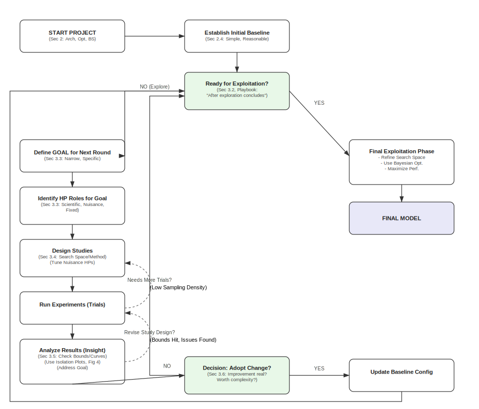
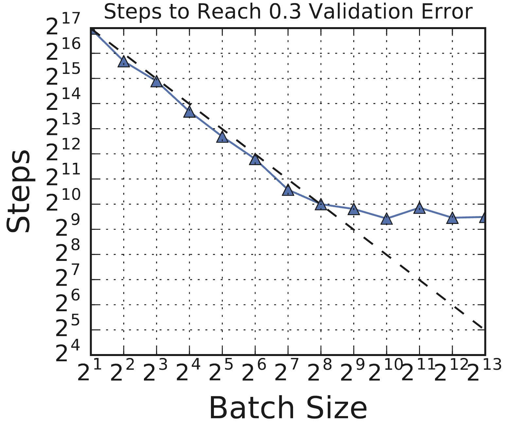
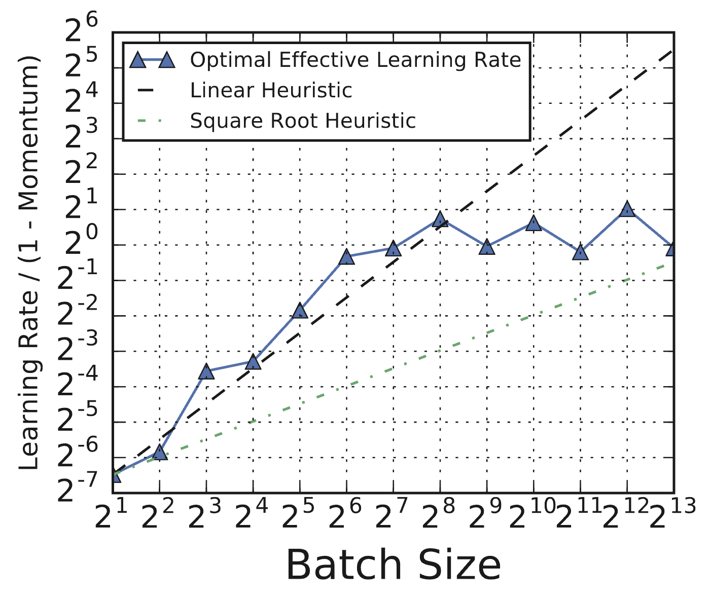
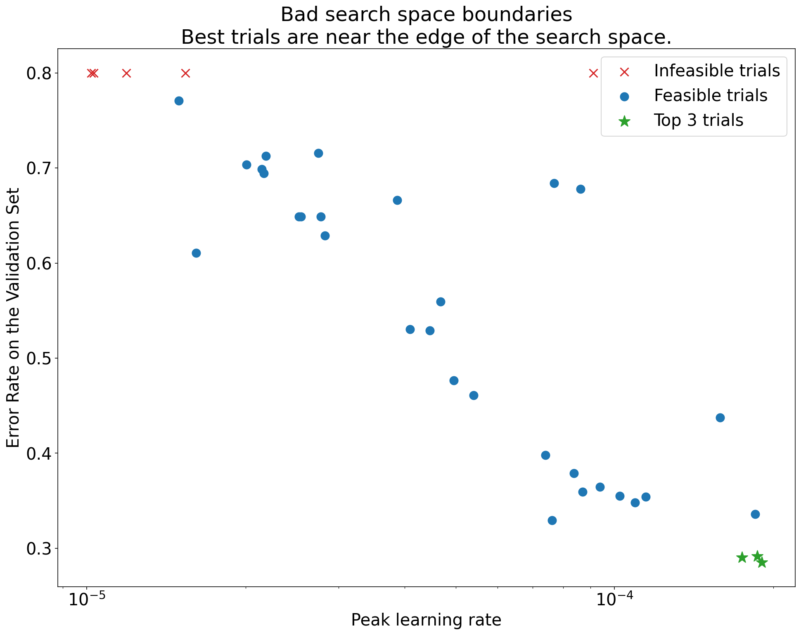
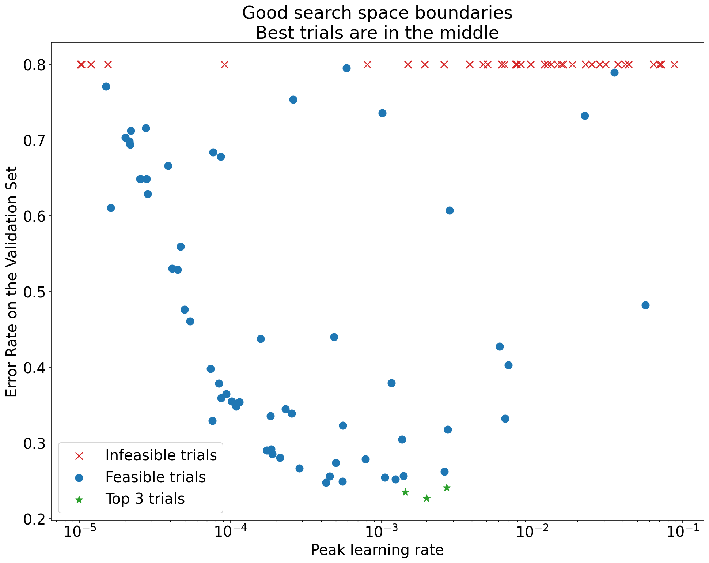

**Lecture 11 Cheat Sheet: A Playbook for Tuning Deep Learning Models**

---

**1. Introduction: Beyond Algorithms to Process**

*   **Problem:** Deep learning success relies heavily on the *process* of tuning, which is often undocumented and ad-hoc. (Ref: Playbook Intro [1])
*   **Goal:** Present a systematic, evidence-based workflow for tuning, based on the Deep Learning Tuning Playbook [1] and empirical findings [2, 3].
*   **Context:** Builds on Lectures 6-9 (algorithms) and Lecture 10 (comparison challenges). Focuses on *how* to tune effectively and reproducibly.

---

**Overall Workflow Visualization:**


*Figure 1: Overview of the iterative tuning process based on the Deep Learning Tuning Playbook [1]. [...] (See full caption in lecture notes)*

---

**2. Initial Setup: Foundational Choices**

*(Goal: Establish a simple, reasonable baseline before iterative tuning)*

*   **Architecture (Sec 2.1):**
    *   Start with established, standard architectures for the task.
    *   Defer custom architectures until later.
    *   Architecture choice implies a *family* (hyperparameters like layers/width tuned later).
*   **Optimizer (Sec 2.2):**
    *   Start with popular, well-understood optimizers (SGD+Momentum, Adam, AdamW - See L7, L9).
    *   Consider the **tuning effort trade-off**: More complex optimizers (e.g., Adam: $η, \beta_1, \beta_2, \epsilon$) require tuning more hyperparameters than simpler ones (e.g., SGD+Momentum: $η, \beta$). (Ref: Playbook [1], implicitly Choi et al. [2])
    *   Option: Start simpler (e.g., Adam with fixed $\beta$s, $\epsilon$) if resources are limited initially.
*   **Batch Size (Sec 2.3):**
    *   Primary role: Governs **training speed** & hardware use.
    *   **NOT** a hyperparameter for directly tuning validation performance. (Ref: Playbook [1], Shallue et al. [3])
    *   Comparable validation accuracy achievable across batch sizes *IF* other HPs (LR, regularization) are **re-tuned**. (Ref: Shallue et al. [3])
    *   **Scaling Pattern:** Steps vs. Batch Size shows: Perfect Scaling -> Diminishing Returns -> Maximal Parallelism.
        
        *(Source: Shallue et al., 2018, Fig 1c)*
    *   **Re-tuning Need:** Optimal LR often *doesn't* follow simple scaling heuristics (linear/sqrt). Regularization needs may also change.
        
        *(Source: Shallue et al., 2018, Fig 8c)*
    *   Epoch budgets vs. Step budgets yield different optimal batch sizes regarding validation error. Step budgets align better with minimizing wall-clock time.
        
        *(Source: Shallue et al., 2018, Fig 11a)*
*   **Initial Baseline (Sec 2.4):**
    *   Aim for: **Simple**, **Resource-Efficient**, **Reasonable Performance** (better than chance).
    *   Start with minimal complexity (e.g., constant LR).
    *   Initial training steps: Trade-off between faster iteration vs. easier schedule tuning (more in Sec 4).

---

**3. The Tuning Process: Iterative & Scientific** (Ref: Fig 1 Workflow)

*(Goal: Improve performance incrementally via exploration and evidence-based decisions)*

*   **Incremental Strategy (Sec 3.1):**
    *   Start simple (baseline).
    *   Introduce changes one at a time.
    *   Adopt changes ("launch" new baseline) *only* based on strong evidence of improvement.
    *   Avoids unnecessary complexity.
*   **Exploration > Exploitation (Sec 3.2):**
    *   **Focus:** Most time spent on **Exploration** (gaining insight into the problem) not **Exploitation** (greedy optimization).
    *   **Benefits:** Understand HP sensitivity/interactions, identify issues (overfitting), avoid spurious improvements, know when tuning saturates.
*   **Structuring Experiments (Sec 3.3):**
    *   Organize into "rounds" with a single, narrow goal.
    *   **Hyperparameter Roles (per round):**

        ```
        - Scientific: Effect being investigated.
        - Nuisance:   Must be optimized over for fair comparison.
        - Fixed:      Held constant (introduces caveats).
        ```

    *   Role depends on the *goal* (e.g., testing weight decay: presence=scientific, strength $λ$=nuisance).
    *   **Critical Importance of Tuning Nuisance HPs:** Fair comparison *requires* optimizing interacting nuisance HPs (like LR) for *each* setting of the scientific HP. Insufficient tuning leads to unreliable conclusions. (Ref: Choi et al. [2])
        
        *(Source: Choi et al., 2019b, Fig 3)*
    *   **Tuning Protocol is Part of the Algorithm:** Optimizer rankings depend heavily on the search space, budget, and method used for tuning. Comparisons are only valid if the protocol is defined and consistent. (Ref: Choi et al. [2])
        
        *(Source: Choi et al., 2019b, Fig 4)*
    *   **Trade-offs:** Balancing resources vs. caveats when deciding nuisance vs. fixed HPs. Optimizer HPs often nuisance; Arch HPs often scientific/fixed.
    *   *Conditional HPs:* Some HPs only exist for certain scientific HP values (e.g., Adam's βs).
*   **Designing Studies (Sec 3.4):**
    *   Study = set of trials (configurations).
    *   Goal: Compare scientific HPs by optimizing over nuisance HPs.
    *   **Search Method:**
        *   *Exploration Phase:* Use **Quasi-Random Search** (non-adaptive, uniform coverage, good for parallelism/analysis). (Ref: Playbook [1], Bousquet et al. [4])
        *   *Exploitation Phase:* Use **Bayesian Optimization** (adaptive, focuses search). (Ref: Playbook [1], Gelbart et al. [5])
    *   **Budget Allocation:** Balance # scientific values vs. nuisance space size vs. sampling density.
*   **Analyzing Results (Sec 3.5):**
    *   Go beyond the primary goal; look for insights & issues.
    *   **Check Search Boundaries:** Use axis plots (Perf vs. HP). Best trials near edge? -> Expand space.
         <!-- Bad -->
         <!-- Good -->
        *(Caption: See Lecture Notes Figure 6)*
    *   **Check Sampling Density:** Is the "good" region well-covered? (Hard to quantify, use plots).
    *   **Examine Training/Validation Curves (Best Trials):**
        *   *Problematic Overfitting?* (Val loss increases) -> Need more regularization.
        *   *High Variance?* (Noisy curves) -> Affects comparison; consider ↑BS, LR decay, Polyak avg.
        *   *Still Improving?* -> Maybe need more steps (Sec 4).
        *   *Saturated Early?* -> Maybe too many steps (Sec 4).
    *   **Use Isolation Plots:** Compare scientific HPs after optimizing nuisance HPs.
        
        *(Caption: See Lecture Notes Figure 7)*
*   **Making Decisions (Sec 3.6):**
    *   Adopt change if improvement > variance (trial & study) and worth added complexity.
    *   Characterize trial variance by rerunning best trials if feasible.

---

**4. Determining Training Duration**

*   **Regimes:** Compute-bound (longer helps) vs. Not compute-bound (performance saturates).
*   **Protocol:**
    *   Use a **fixed `max_train_steps`** for all trials within a study.
    *   **Do NOT tune** `max_train_steps` as a hyperparameter within the study.
    *   Use **retrospective checkpoint selection** (save best checkpoint based on validation performance *during* the run).
    *   Observe where best checkpoints land to inform `max_train_steps` for *future* rounds.
    *   Interacts strongly with LR decay schedule tuning.

---

**5. Conclusion**

*   Effective tuning is a **systematic, iterative, scientific process**, not random tweaking. (Ref: Playbook [1])
*   Focus on **exploration & insight** for most of the process.
*   **The tuning protocol IS part of the algorithm** for empirical comparisons. Fair comparisons require tuning nuisance HPs. (Ref: Choi et al. [2])
*   Adopt changes based on **evidence**, considering variance and complexity.

---
*(References section omitted for brevity in cheat sheet format, but present in main lecture notes)*