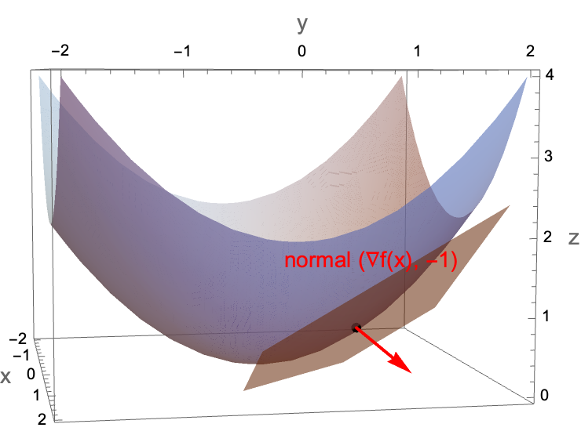
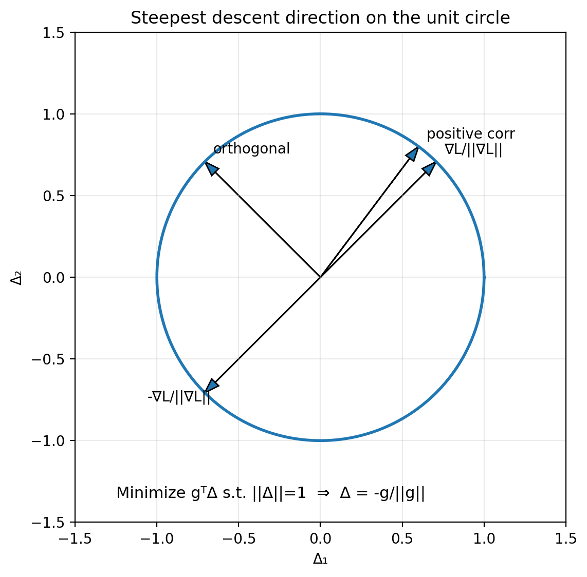
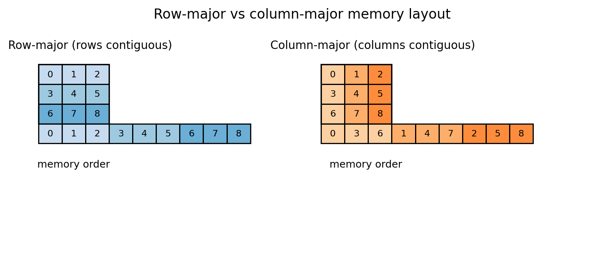
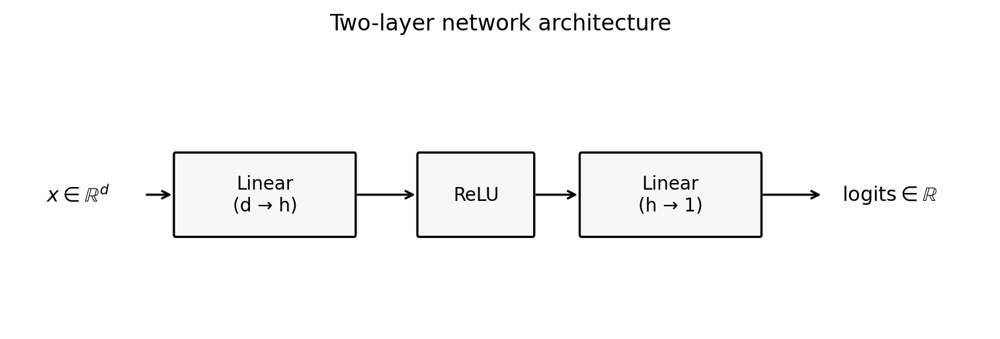
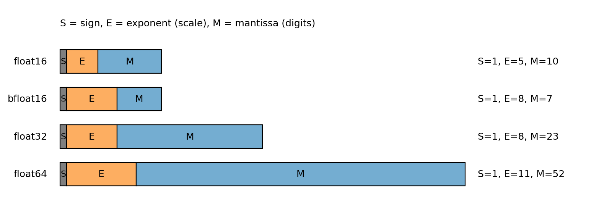
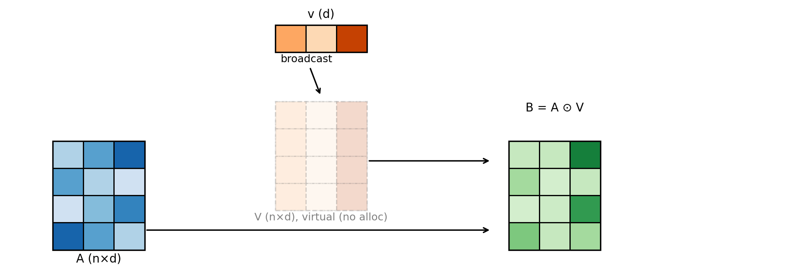
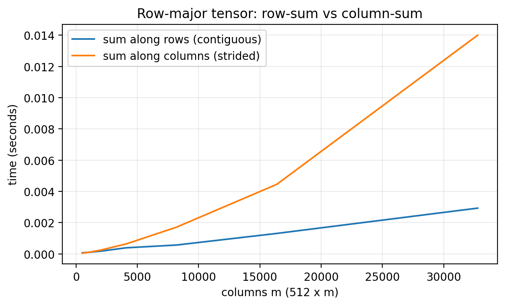
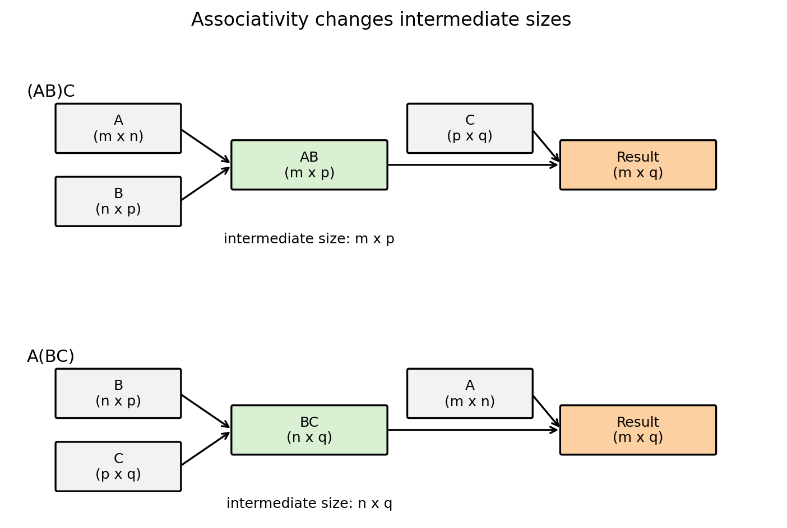

# 3. Optimization and PyTorch basics in higher dimensions


[live demo (colab)](https://colab.research.google.com/github/damek/STAT-4830/blob/main/section/3/live-demo.ipynb)

## Table of contents
1. [Goal of this lecture](#1-goal-of-this-lecture)
2. [Optimization in higher dimensions: definitions and diagnostics](#2-optimization-in-higher-dimensions-definitions-and-diagnostics)
3. [Dev environment: Cursor and uv](#3-dev-environment-cursor-and-uv)
4. [PyTorch tour: tensors, graphs, operations, efficiency, dtypes, devices](#4-pytorch-tour-tensors-graphs-operations-efficiency-dtypes-devices)
5. [Appendix: prompts, scripts, and unit tests for figures](#appendix-prompts-scripts-and-unit-tests-for-figures)

## 1. Goal of this lecture

Up to now, we did almost everything in one dimension so the objects were concrete and you could visualize the dynamics.

In practice, the parameter is almost never a scalar. It is a vector, or a matrix, or a pile of tensors.

This lecture has three goals.

First, we lift the optimization primitives from 1D to $d$ dimensions. Everything is essentially the same. For example, An optimization problem is still defined by a decision variables, an objective, and constraints. We can still motivatve gradient descent from a local linear model. And we use the same diagnostics. What changes is the geometry: $w$ is now a vector $w \in \mathbb{R}^d$ and derivatives become **gradients** (vectors of partial derivatives).

Second, we set up a usable dev environment that you can ship and reproduce. In class I will live-demo how I code with Cursor and how I use an AI agent. In these notes we set up `uv` so you can run course scripts locally or on a remote VM.

Third, we do a higher-dimensional tour of PyTorch. We focus on the aspects we will use later: creating and manipulating tensors, a larger part of the API (reductions, linear algebra, loss functions, `torch.nn`), how autodiff behaves in higher dimensions, efficiency (broadcasting, vectorization, memory layout, matmul order), and dtypes/device placement.


## 2. Optimization in higher dimensions: definitions and diagnostics

This section is a fast restatement in higher dimensions of the beginning material of Lecture 1.

### 2.1 Optimization problems, loss functions, minimizers

An optimization problem is still:

$$
\min_{w \in C} L(w)
$$

- **Decision variable:** $w \in \mathbb{R}^d$ (a vector you choose).
- **Objective / loss:** $L:\mathbb{R}^d \to \mathbb{R}$ (a scalar function you can evaluate).
- **Constraint set (feasible set):** $C \subseteq \mathbb{R}^d$.

Unconstrained problems are those with $C=\mathbb{R}^d$:

$$
\min_{w \in \mathbb{R}^d} L(w)
$$

A point $w^\ast$ is a **(global) minimizer** if $w^\ast \in C$ and

$$
L(w^\ast) \le L(w)
\quad \text{for all } w \in C
$$

The **optimal value** is

$$
L^\ast = \inf_{w \in C} L(w)
$$

In realistic problems, $L^\ast$ is unknown. In toy problems, we sometimes know $L^\ast$ and can plot an objective gap.

### 2.2 Gradients replace derivatives

In 1D, the derivative was a scalar $L'(w)$. In $d$ dimensions, the derivative becomes the **gradient**:

$$
\nabla L(w)=\left(\frac{\partial L}{\partial w_1},\ldots,\frac{\partial L}{\partial w_d}\right).
$$

It is a vector of partial derivatives.

A stationary point (also called a critical point) of an unconstrained differentiable problem is:

$$
\nabla L(w)=0.
$$

An $\varepsilon$-stationary point is:

$$
\|\nabla L(w)\| \le \varepsilon.
$$

Here $\|\|\cdot\|\|$ is a norm. In this course, unless we say otherwise, $\|\|\cdot\|\|$ means the Euclidean norm.

### 2.3 Example you should memorize: $L(w)=\tfrac{1}{2}\|\|w\|\|^2$

This is the higher-dimensional analogue of the parabola.

Define

$$
L(w)=\tfrac{1}{2}\|w\|^2=\tfrac{1}{2}\sum_{j=1}^d w_j^2.
$$

Then the derivative you should know in optimization is:

$$
\nabla L(w)=w.
$$

This one formula is the backbone of a lot of toy models, theory, and sanity checks.

### 2.4 Convexity in higher dimensions

In 1D you can often eyeball convexity from a plot. In higher dimensions we need a definition that does not rely on pictures.

A function $L:\mathbb{R}^d \to \mathbb{R}$ is **convex** if for all $w_1,w_2 \in \mathbb{R}^d$ and all $\theta \in [0,1]$,

$$
L(\theta w_1 + (1-\theta) w_2)
\le
\theta L(w_1) + (1-\theta) L(w_2).
$$

This is the Jensen-style inequality version of the definition.

One payoff you should keep in mind (we will justify it more formally later):

- for a differentiable convex function, any stationary point is a global minimizer.

So for convex problems, “solve” often means “find a point with small gradient norm.”

For nonconvex problems, small gradients can happen far from a minimizer (saddles, flat regions, etc.). The diagnostic interpretation is weaker.


### 2.6 Diagnostics in higher dimensions

The core diagnostics from 1D still make sense.

- **Objective value:** $L(w_k)$.
- **Objective gap:** $L(w_k)-L^\ast$ (only if $L^\ast$ is known).
- **Gradient norm:** $\|\|\nabla L(w_k)\|\|$.

One additional metric that is often useful in practice is a simple plateau metric:

- **Plateau metric (successive objective difference):**

$$
|L(w_{k+1})-L(w_k)|.
$$

This is crude, but it answers a practical question:

- “Are we still making progress step to step, or are we just oscillating around a floor?”

In 1D we sometimes plotted the iterates $w_k$ as well. In high dimensions, that is usually not useful:

- $w_k$ has $d$ entries,
- storing all iterates is $O(Td)$ memory if you keep the whole trajectory,
- even printing $w_k$ each step becomes meaningless hard to parse.

Instead, you monitor low-dimensional summaries: objective values, norms, maybe a few coordinate statistics if you have a reason.

### 2.7 Gradient descent motivation again in $d$ dimensions

We revisit gradient descent because later lectures will change the update rule (SGD, momentum, Adam, etc.), but the local-model derivation is still the spine.

#### The geometric meaning of the gradient

In 1D, the derivative is a slope. In $d$ dimensions, the gradient is the object that replaces slope.

Two equivalent facts that are both worth knowing:

1. **The gradient is the coefficient vector in the best local linear approximation.**
2. **The gradient is normal to the tangent plane of the graph** (equivalently, normal to level sets).

We will use the tangent-plane picture because it makes the linear approximation explicit: for $z=f(x)$, the tangent plane at $x$ has normal $(\nabla f(x), -1)$.

**Figure 3.1: gradient as the normal to the tangent plane of the graph.**  

*Figure 3.1: For $f(x)=\|\|x\|\|^2/2$, the tangent plane gives the first-order approximation; the normal vector is $(\nabla f(x), -1)$.*

#### The first-order Taylor model

Let $L:\mathbb{R}^d \to \mathbb{R}$ be differentiable. Near a point $w$, we have the first-order approximation

$$
L(w+\Delta) \approx L(w) + \nabla L(w)^\top \Delta.
$$

Later in the course we will quantify the error terms and state conditions under which this approximation is accurate.

For now, treat it as the local model that motivates the update rule.

#### Choosing a direction that decreases the local model

Suppose we want to choose $\Delta$ to make the approximation small:

$$
L(w+\Delta) \approx L(w) + \nabla L(w)^\top \Delta.
$$

The only term we can control is the dot product $\nabla L(w)^\top \Delta$.

One might think we should just make $\Delta$ huge and negative so the dot product becomes very negative. However, the Taylor model is only local. If you take $\|\|\Delta\|\|$ too large, the approximation can become garbage and the method can blow up.

So we separate “direction” from “step length.” First ask:

> Among all directions with unit norm $\|\|\Delta\|\|=1$, which one minimizes $\nabla L(w)^\top \Delta$?

By Cauchy–Schwarz,

$$
\nabla L(w)^\top \Delta
\ge
-\|\nabla L(w)\|\|\Delta\|
=
-\|\nabla L(w)\|.
$$

Equality occurs when $\Delta$ points in the opposite direction of $\nabla L(w)$, i.e.,

$$
\Delta^\ast
=
-\frac{\nabla L(w)}{\|\nabla L(w)\|}.
$$

That is the steepest descent direction under the Euclidean norm.

**Figure 3.2: choosing the direction that minimizes the dot product.**  

*Figure 3.2: On the unit circle of directions, the dot product with the gradient is minimized by the unit vector pointing directly opposite the gradient.*

#### Putting the step size back in

In optimization code, we usually do not normalize the direction explicitly. We fold everything into a step size parameter $\eta>0$ and take

$$
\Delta = -\eta \nabla L(w).
$$

Plug this into the first-order approximation:

$$
\begin{aligned}
L(w+\Delta)
&\approx
L(w) + \nabla L(w)^\top \Delta \\
&=
L(w) + \nabla L(w)^\top (-\eta \nabla L(w)) \\
&=
L(w) - \eta \nabla L(w)^\top \nabla L(w) \\
&=
L(w) - \eta \|\nabla L(w)\|^2.
\end{aligned}
$$

So for small enough $\eta$, a gradient descent step decreases the objective to first order.

This is the exact same derivation as in 1D. The only difference is that:

- multiplication becomes an inner product,
- the derivative becomes a gradient,
- the square of the derivative becomes the squared gradient norm.

## 3. Dev environment: Cursor and uv

Now we switch gears to getting up to speed with cursor


### 3.1 In-class demo: Cursor workflow

In class I will live-demo the following in Cursor.

1. **Create a project folder and open it in Cursor.**
2. **Initialize a git repo** (`git init`).
3. **Create a `.gitignore`.**
4. **Make an initial commit** and push to a GitHub repo.
5. **Use agent mode** to:
   - create files in the correct directories,
   - run scripts,
   - fix errors by reading tracebacks.

The point is that you should have a workflow where:

- code lives in a repo,
- you can reproduce an environment,
- you can run scripts and see outputs,
- you can iterate quickly.

### 3.2 What is uv

`uv` is a fast Python environment and package manager. We will use it for two jobs:

1. create a virtual environment (`venv`) for a project,
2. install the dependencies needed to run the course scripts.

### 3.3 What is a virtual environment

A **virtual environment** is an isolated Python installation for a project.

- Inside a venv, `python` and `pip` point to a local environment.
- Packages you install there do not leak into your system Python.
- Different projects can use different package versions without fighting.

One might think “I can just install everything globally.” However, global installs create un-debuggable states:

- you upgrade one package for Project A and Project B breaks,
- your laptop works but a remote VM fails,
- the TA’s environment differs from yours and you cannot reproduce bugs.

A venv is the minimum mechanism that makes Python reproducible.

### 3.4 A minimal uv workflow

Below is the basic workflow we will use.

1. Install `uv` once per machine.
2. Create a venv in the repo (often `.venv/`).
3. Install packages into that venv.
4. Run scripts using the venv Python.

Install `uv` (first time only):

Linux/macOS:

```bash
curl -LsSf https://astral.sh/uv/install.sh | sh
```

Windows (PowerShell):

```powershell
irm https://astral.sh/uv/install.ps1 | iex
```

A typical sequence (Linux/macOS):

```bash
uv venv
source .venv/bin/activate
uv pip install torch matplotlib numpy
python script/gd_1d_torch.py
```

On Windows (PowerShell):

```powershell
uv venv
.\.venv\Scripts\Activate.ps1
uv pip install torch matplotlib numpy
python .\script\gd_1d_torch.py
```

If your environment gets into a bad state, delete `.venv` and recreate it:

Linux/macOS:

```bash
rm -rf .venv
```

Windows (PowerShell):

```powershell
Remove-Item -Recurse -Force .venv
```

We will automate most of this so you can clone a repo and run a single install command.

### 3.5 Agent prompt: build a repo that runs the Lecture 1 script

This is a prompt you can copy and paste into Cursor agent mode. It is written so the agent has no room to “improvise” the directory structure.

#### Prompt to paste into the agent

These are the packages needed to run the code in this section:

- `torch`
- `numpy`
- `matplotlib`
- `pytest`
- `jupyter`

```text
You are in the root of a git repository.

Goal: make this repo runnable on macOS/Linux/Windows using uv.

Requirements:
1) Create directories:
   - script/
   - figures/
   - tests/

2) Add a .gitignore that ignores:
   - .venv/
   - __pycache__/
   - .pytest_cache/
   - *.pyc

3) Create a requirements file at the repo root named:
   requirements.txt
   It must contain:
   - torch
   - matplotlib
   - numpy
   - pytest
   - jupyter

4) Create installer scripts:
   - script/install.sh (macOS/Linux, runnable via: bash script/install.sh)
   - script/install.ps1 (Windows PowerShell, runnable via:
     powershell -ExecutionPolicy Bypass -File .\script\install.ps1)

   Both scripts must:
   - check whether uv is installed
   - if missing, install uv using official Astral install command for that OS
   - create .venv in the repo root
   - install requirements from requirements.txt into .venv via uv
   - print next steps to run script and tests

5) Make script/install.sh executable.

6) Create a README.md that explains:
   - macOS/Linux quickstart
   - Windows PowerShell quickstart
   - how to run each install command
   - how to activate the venv
   - how to run script/gd_1d_torch.py
   - how to run tests

7) Add a pytest test in:
   tests/test_install_and_run.py

   The test must:
   - import os, pathlib, subprocess
   - choose venv python path as:
     - .venv/Scripts/python.exe on Windows
     - .venv/bin/python otherwise
   - run script/gd_1d_torch.py with that interpreter (assume venv exists)
   - assert that figures/gd_torch_quadratic_diagnostics.png exists after running
   - do NOT check timing, only that the script runs and produces the figure

Finally:
- Run only the installer for the current OS.
- Run pytest.
- If anything fails, fix it and rerun until passing.
```

#### Notes on why we do this

- Once `uv` is installed, the “create venv + install deps” step becomes consistent across machines.
- Remote VMs often start with a bare Python install and no packages. An install script saves you from re-deriving the same commands every time.
- Tests are not “extra.” They are how you prevent “it works on my machine” from being your only debugging strategy.

## 4. PyTorch tour: tensors, graphs, operations, efficiency, dtypes, devices

This section is deliberately code-heavy.

In class, I will run these examples live. In the notes, each concept is paired with a minimal runnable snippet.

### 4.1 Conventions for the code blocks

- Every snippet is meant to run in a fresh Python process.
- If a line prints something, I show the output as a comment.
- If output depends on hardware (CPU vs GPU) or timing, I label it as example output.

### 4.2 Tensors in higher dimensions: creation

A tensor is a container for numbers, plus metadata:

- shape,
- dtype,
- device,
- (optionally) autodiff tracking.

#### From Python lists

```python
import torch

x = torch.tensor([1.0, 2.0, 3.0])
A = torch.tensor([[1, 2, 3],
                  [4, 5, 6]])

print("x:", x)
print("A:\n", A)
print("x.shape:", x.shape)
print("A.shape:", A.shape)

# Output:
# x: tensor([1., 2., 3.])
# A:
#  tensor([[1, 2, 3],
#          [4, 5, 6]])
# x.shape: torch.Size([3])
# A.shape: torch.Size([2, 3])
```

#### Indexing with `[]` and `:`

Use `[]` to access elements and slices. `:` means “all entries along that axis.” `-1` means “last.”

```python
import torch

x = torch.tensor([10.0, 20.0, 30.0, 40.0])
A = torch.tensor([[1, 2, 3],
                  [4, 5, 6],
                  [7, 8, 9]])

print("x[0]:", x[0])
print("x[-1]:", x[-1])
print("x[1:3]:", x[1:3])
print("A[0, 1]:", A[0, 1])
print("A[1, :]:", A[1, :])
print("A[:, -1]:", A[:, -1])

# Output:
# x[0]: tensor(10.)
# x[-1]: tensor(40.)
# x[1:3]: tensor([20., 30.])
# A[0, 1]: tensor(2)
# A[1, :]: tensor([4, 5, 6])
# A[:, -1]: tensor([3, 6, 9])
```

#### From and to NumPy

Two important facts:

1. `torch.from_numpy(np_array)` shares memory with NumPy (zero-copy).
2. `.numpy()` shares memory with the tensor when the tensor is on CPU.

```python
import numpy as np
import torch

a_np = np.array([[1.0, 2.0],
                 [3.0, 4.0]], dtype=np.float32)

a_t = torch.from_numpy(a_np)

print("a_t:\n", a_t)
print("same memory?", a_t.data_ptr() == a_np.__array_interface__["data"][0])

a_np[0, 0] = 999.0
print("after modifying numpy, a_t:\n", a_t)

# Output:
# a_t:
#  tensor([[1., 2.],
#          [3., 4.]])
# same memory? True
# after modifying numpy, a_t:
#  tensor([[999.,   2.],
#          [  3.,   4.]])
```

One might think `.numpy()` is a “copy out.” However, on CPU it is typically a view into the same storage. If you need a copy, use `.clone()` first.

#### Random tensors

Gaussian and uniform are the workhorses:

```python
import torch

torch.manual_seed(0)

g = torch.randn(2, 3)   # N(0,1)
u = torch.rand(2, 3)    # Unif[0,1)

print("g:\n", g)
print("u:\n", u)

# Output:
# g:
#  tensor([[ 1.5410, -0.2934, -2.1788],
#          [ 0.5684, -1.0845, -1.3986]])
# u:
#  tensor([[0.4963, 0.7682, 0.0885],
#          [0.1320, 0.3074, 0.6341]])
```

#### `empty`: uninitialized memory

```python
import torch

x = torch.empty(2, 3)
print(x)

# Output:
# tensor([[... random-looking values ...]])
```

Why would you ever do this?

- `torch.empty` allocates memory but does not fill it.
- If you are about to overwrite every entry anyway, `empty` avoids an unnecessary initialization pass.

A common pattern is:

- allocate with `empty`,
- fill with some computation.

#### Zeros and ones

```python
import torch

z = torch.zeros(2, 3)
o = torch.ones(2, 3)

print("zeros:\n", z)
print("ones:\n", o)

# Output:
# zeros:
#  tensor([[0., 0., 0.],
#          [0., 0., 0.]])
# ones:
#  tensor([[1., 1., 1.],
#          [1., 1., 1.]])
```

#### Reference/clone

Two things that look similar in Python are not the same in PyTorch:

- assignment creates a reference (same storage, same graph),
- `clone()` copies data (new storage, graph connection preserved).

```python
import torch

x = torch.tensor([1.0, 2.0, 3.0])

y = x              # reference (no new memory)
z = x.clone()      # data copy (new memory)

print("x.data_ptr:", x.data_ptr())
print("y.data_ptr:", y.data_ptr())
print("z.data_ptr:", z.data_ptr())

y[0] = 999.0
print("after y[0]=999:")
print("x:", x)
print("y:", y)
print("z:", z)

# Output:
# x.data_ptr:  ...
# y.data_ptr:  ... (same as x)
# z.data_ptr:  ... (different)
# after y[0]=999:
# x: tensor([999.,   2.,   3.])
# y: tensor([999.,   2.,   3.])
# z: tensor([1., 2., 3.])
```

So:

- “copy” in casual Python talk often means “another name for the same object.”
- `clone()` means “a new tensor with its own storage.”
- if `x` is tracked, `x.clone()` is still attached to the computation graph; use `x.detach().clone()` to copy without the graph.

### 4.3 Tensor manipulation: shape, reshape, view, concat, squeeze

#### `.numel` and `.shape`

Access to tensor shape and number of elements.

```python
import torch

A = torch.randn(2, 3, 4)
print("A.shape:", A.shape)
print("A.numel():", A.numel())

# Output:
# A.shape: torch.Size([2, 3, 4])
# A.numel(): 24
```

#### Memory layout: contiguous vs non-contiguous

Aside: this will help with `reshape`/`view` below, and it will matter for efficiency later. PyTorch is row-major (C-order) by default, so the last index changes fastest in memory.

PyTorch tensors have **strides**, which describe how to step through memory to move along each dimension. Concretely, the stride tuple tells you how many *elements* you jump in the underlying 1D storage when you increment an index by 1 along each axis.

Example: for a 3×4 row-major tensor, a stride of `(4, 1)` means “move 4 elements to go down one row, move 1 element to go right one column.”

The default layout for a 2D tensor is row-major contiguous in the sense that the last dimension is contiguous.

Transpose changes the stride pattern without moving data.

```python
import torch

A = torch.arange(12).reshape(3, 4)
AT = A.t()

print("A.shape:", A.shape, "stride:", A.stride(), "contiguous:", A.is_contiguous())
print("AT.shape:", AT.shape, "stride:", AT.stride(), "contiguous:", AT.is_contiguous())

# Output:
# A.shape: torch.Size([3, 4]) stride: (4, 1) contiguous: True
# AT.shape: torch.Size([4, 3]) stride: (1, 4) contiguous: False
```

**Figure 3.5: row-major vs column-major intuition.**  

*Figure 3.5: A 2D array is stored in 1D memory. Row-major means row entries are contiguous. Column-major means column entries are contiguous. Strides are the precise way to describe both.*

We will talk about efficiency considerations later, but an actionable rule is:

- if you see `is_contiguous()` is `False` and performance matters, consider making a contiguous copy with `.contiguous()` at an appropriate point.

#### `reshape`: change shape (maybe copy)

```python
import torch

x = torch.arange(12)     # 0,1,...,11
A = x.reshape(3, 4)

print("x:", x)
print("A:\n", A)
print("A.shape:", A.shape)

# Output:
# x: tensor([ 0,  1,  2,  3,  4,  5,  6,  7,  8,  9, 10, 11])
# A:
#  tensor([[ 0,  1,  2,  3],
#          [ 4,  5,  6,  7],
#          [ 8,  9, 10, 11]])
# A.shape: torch.Size([3, 4])
```

You can use `-1` to infer a dimension:

```python
import torch

x = torch.arange(12)
B = x.reshape(2, -1)

print("B.shape:", B.shape)
print("B:\n", B)

# Output:
# B.shape: torch.Size([2, 6])
# B:
#  tensor([[ 0,  1,  2,  3,  4,  5],
#          [ 6,  7,  8,  9, 10, 11]])
```

#### `view`: change shape without copying (requires contiguous layout)

A `view` is a different interpretation of the same memory.

One might think `reshape` and `view` are identical. However:

- `view` requires the tensor to be contiguous in memory,
- `reshape` will return a view when possible, and otherwise it will copy.

So when the tensor is contiguous, `view` and `reshape` are identical: both return a view with no data copy.

A standard way to make a non-contiguous tensor is transpose.

```python
import torch

x = torch.arange(12)
A = x.view(3, 4)   # standalone view example (x is contiguous)
AT = A.t()         # transpose: shape (4,3)

print("A from view:\n", A)
print("A.is_contiguous():", A.is_contiguous())
print("AT.is_contiguous():", AT.is_contiguous())

# Output:
# A from view:
#  tensor([[ 0,  1,  2,  3],
#          [ 4,  5,  6,  7],
#          [ 8,  9, 10, 11]])
# A.is_contiguous(): True
# AT.is_contiguous(): False
```

Now compare `view` vs `reshape`:

```python
import torch

A = torch.arange(12).reshape(3, 4)
AT = A.t()

try:
    v = AT.view(-1)
    print("view worked:", v)
except RuntimeError as e:
    print("view failed:", e)

r = AT.reshape(-1)
print("reshape worked:", r)

# Output:
# view failed: view size is not compatible with input tensor's size and stride ...
# reshape worked: tensor([ 0,  4,  8,  1,  5,  9,  2,  6, 10,  3,  7, 11])
```

#### Concatenation: vertical and horizontal

For 2D tensors:

- concatenate “vertically” means `dim=0` (stack rows),
- concatenate “horizontally” means `dim=1` (stack columns).

```python
import torch

A = torch.tensor([[1, 2, 3],
                  [4, 5, 6]])
B = torch.tensor([[10, 20, 30],
                  [40, 50, 60]])

V = torch.cat([A, B], dim=0)  # vertical
H = torch.cat([A, B], dim=1)  # horizontal

print("V.shape:", V.shape)
print("V:\n", V)
print("H.shape:", H.shape)
print("H:\n", H)

# Output:
# V.shape: torch.Size([4, 3])
# V:
#  tensor([[ 1,  2,  3],
#          [ 4,  5,  6],
#          [10, 20, 30],
#          [40, 50, 60]])
# H.shape: torch.Size([2, 6])
# H:
#  tensor([[ 1,  2,  3, 10, 20, 30],
#          [ 4,  5,  6, 40, 50, 60]])
```

Shape compatibility matters:

```python
import torch

A = torch.zeros(2, 3)
C = torch.zeros(3, 3)

try:
    torch.cat([A, C], dim=1)
except RuntimeError as e:
    print("concat failed:", e)

# Output:
# concat failed: Sizes of tensors must match except in dimension 1 ...
```

#### `squeeze` and `unsqueeze`

Sometimes your tensor has a dimension of size 1 that you want to remove (squeeze), or you want to add a size-1 dimension to make shapes align (unsqueeze).

```python
import torch

v = torch.tensor([1.0, 2.0, 3.0])   # shape (3,)
v_row = v.unsqueeze(0)              # shape (1,3)
v_col = v.unsqueeze(1)              # shape (3,1)

print("v.shape:", v.shape)
print("v_row.shape:", v_row.shape)
print("v_col.shape:", v_col.shape)

# Output:
# v.shape: torch.Size([3])
# v_row.shape: torch.Size([1, 3])
# v_col.shape: torch.Size([3, 1])
```

A practical use: concatenating a single row onto a matrix.

```python
import torch

A = torch.zeros(2, 3)
v = torch.tensor([1.0, 2.0, 3.0])


try:
    A1 = torch.cat([A, v], dim=0)
except RuntimeError as e:
    print("concat failed:", e)

A2 = torch.cat([A, v.unsqueeze(0)], dim=0)
print("A2.shape:", A2.shape)
print(A2)

# Output:
# concat failed: Tensors must have same number of dimensions: got 2 and 1
# A2.shape: torch.Size([3, 3])
# tensor([[0., 0., 0.],
#         [0., 0., 0.],
#         [1., 2., 3.]])
```

### 4.4 A larger tour of the PyTorch API

This is a short tour of things you will use constantly.

#### Entrywise operations

Any scalar function can be applied entrywise.

```python
import torch

x = torch.tensor([1.0, 2.0, 3.0])

print("exp:", torch.exp(x))
print("log:", torch.log(x))
print("sin:", torch.sin(x))
print("x**2:", x**2)
print("x*x:", x*x)

# Output:
# exp: tensor([ 2.7183,  7.3891, 20.0855])
# log: tensor([0.0000, 0.6931, 1.0986])
# sin: tensor([0.8415, 0.9093, 0.1411])
# x**2: tensor([1., 4., 9.])
# x*x: tensor([1., 4., 9.])
```

Two ways to square a vector (`x**2` vs `x*x`) are equivalent here.

#### Reductions replace loops

Reductions compute aggregates over dimensions.

```python
import torch

A = torch.tensor([[1.0, 2.0],
                  [3.0, 4.0]])

print("sum all:", A.sum().item())
print("sum dim=0:", A.sum(dim=0))
print("sum dim=1:", A.sum(dim=1))
print("mean:", A.mean().item())
print("max:", A.max().item())
print("argmax (flattened):", A.argmax().item())

# Output:
# sum all: 10.0
# sum dim=0: tensor([4., 6.])
# sum dim=1: tensor([3., 7.])
# mean: 2.5
# max: 4.0
# argmax (flattened): 3
```


#### Basic linear algebra

```python
import torch

A = torch.tensor([[1.0, 2.0],
                  [3.0, 4.0]])
x = torch.tensor([10.0, 20.0])

print("A.T:\n", A.t())
print("A @ x:", (A @ x))
print("x @ x:", (x @ x))   # inner product for 1D tensors
print("||x||:", torch.norm(x))

# Output:
# A.T:
#  tensor([[1., 3.],
#          [2., 4.]])
# A @ x: tensor([ 50., 110.])
# x @ x: tensor(500.)
# ||x||: tensor(...)
```

#### Matrix-matrix multiplication

```python
import torch

A = torch.randn(2, 3)
B = torch.randn(3, 4)
C = A @ B

print("C.shape:", C.shape)

# Output:
# C.shape: torch.Size([2, 4])
```

What about “multiplying tensors” beyond matrices?

- `@` and `torch.matmul` generalize matrix multiplication to batched dimensions.
- The semantics are precise, but you need to know what dimensions are treated as batch vs matrix dimensions.
- Later we will use `einsum` because it forces you to be explicit about index contractions.

#### Logical ops and masking

```python
import torch

x = torch.tensor([-2.0, -1.0, 0.0, 1.0, 2.0])
mask = x > 0

print("mask:", mask)
print("x[mask]:", x[mask])

# Output:
# mask: tensor([False, False, False,  True,  True])
# x[mask]: tensor([1., 2.])
```

#### Loss functions: `torch.nn.functional`

PyTorch has common losses implemented in numerically stable form.

Pick the loss based on what you are predicting:

- regression (real-valued targets),
- classification (label targets).

For regression, a common choice is mean squared error:

$$
\ell_{\mathrm{MSE}}(\hat y,y) = (\hat y - y)^2,
$$

and in practice we average this over the batch.

`torch.nn.functional.mse_loss(\hat y, y)`.

For classification, models usually output raw scores called **logits**.
A logit is a score before converting to a probability.

For binary classification (yes/no), let $z \in \mathbb{R}$ and $y \in \{0,1\}$:

$$
\ell_{\mathrm{BCE-logits}}(z,y) = -\left(y\log\sigma(z) + (1-y)\log(1-\sigma(z))\right), \quad \sigma(z)=\frac{1}{1+e^{-z}}.
$$

`binary_cross_entropy_with_logits(z, y)` takes one logit per target (also used for multi-label tasks).

For multiclass classification (one correct class out of $C$), let $z \in \mathbb{R}^C$ and class index $y$:

$$
\ell_{\mathrm{CE}}(z,y) = -\log\frac{e^{z_y}}{\sum_{j=1}^C e^{z_j}}.
$$

`torch.nn.functional.cross_entropy(z, y)` takes the full vector of class logits.

Difference in use:

- `cross_entropy`: one label out of $C$ classes (mutually exclusive classes),
- `binary_cross_entropy_with_logits`: yes/no decision(s), independent across labels.

Both classification losses above take logits (raw scores), not probabilities and not log-probabilities.

#### Logistic regression for spam vs not-spam (vectorized)

We will write the whole “model + loss” in code.

Setup:

- data matrix $X \in \mathbb{R}^{n \times d}$,
- labels $y \in \\{0,1\\}^n$,
- parameter vector $w \in \mathbb{R}^d$,
- logits $z = Xw$,
- loss = binary cross entropy on logits.

```python
import torch
import torch.nn.functional as F

torch.manual_seed(0)

n = 8
d = 5

X = torch.randn(n, d)
y = torch.randint(low=0, high=2, size=(n,)).float()  # 0/1 labels

w = torch.randn(d, requires_grad=True)

logits = X @ w                      # shape (n,)
loss = F.binary_cross_entropy_with_logits(logits, y)

print("logits.shape:", logits.shape)
print("loss:", loss.item())

# Output:
# logits.shape: torch.Size([8])
# loss: ...
```


One thing you should note: We used `binary_cross_entropy_with_logits`, not “sigmoid then BCE.” The logits version is more numerically stable.


#### `torch.nn`: a tiny two-layer network

A linear model predicts with $x^\top w$. A neural network predicts with a nonlinear mapping.

We will build:

- Linear layer: $\mathbb{R}^d \to \mathbb{R}^h$,
- ReLU,
- Linear layer: $\mathbb{R}^h \to \mathbb{R}$.

**Figure 3.3: two-layer network architecture.**  

*Figure 3.3: A simple 2-layer MLP: linear layer, ReLU, linear layer. Later we will replace this with transformer blocks.*

```python
import torch
import torch.nn as nn
import torch.nn.functional as F

torch.manual_seed(0)

n = 8
d = 5
h = 16

X = torch.randn(n, d)
y = torch.randint(low=0, high=2, size=(n,)).float()

model = nn.Sequential(
    nn.Linear(d, h),
    nn.ReLU(),
    nn.Linear(h, 1),
)

logits = model(X).squeeze(1)     # shape (n,)
loss = F.binary_cross_entropy_with_logits(logits, y)

print("logits.shape:", logits.shape)
print("loss:", loss.item())

# Output:
# logits.shape: torch.Size([8])
# loss: ...
```


### 4.5 Computational graphs in higher dimensions

We're going to go a bit more in-depth on gradient tracking. 

#### `requires_grad`: turning tracking on

```python
import torch

w = torch.randn(5, requires_grad=True)
L = 0.5 * (w * w).sum()
L.backward()

print("w:", w)
print("grad:", w.grad)

# Output:
# w: tensor([...], requires_grad=True)
# grad: tensor([...])   # should equal w
```

#### Why you “can’t just assign into” a leaf tensor requiring grad

A **leaf tensor** is one that was created by you (not the result of an operation) and has `requires_grad=True`. It is the starting node that accumulates gradients in `.grad`.

If `w` is a leaf tensor with `requires_grad=True`, in-place modifications can break the recorded computation.

```python
import torch

w = torch.randn(3, requires_grad=True)

try:
    w[0] = 0.0
except RuntimeError as e:
    print("in-place assignment failed:", e)

# Output:
# in-place assignment failed: a view of a leaf Variable that requires grad is being used in an in-place operation.
```

A standard pattern is:

1. create a tensor,
2. do any preprocessing (normalization, clipping),
3. then turn on grad tracking.

```python
import torch

w = torch.randn(3)
w = w / w.norm()          # preprocessing while not tracking gradients
w.requires_grad_()        # now start tracking

L = 0.5 * (w * w).sum()
L.backward()

print("w.requires_grad:", w.requires_grad)
print("w.grad:", w.grad)

# Output:
# w.requires_grad: True
# w.grad: tensor([...])
```

#### `detach`: stop tracking, but keep the same storage

`detach()` returns a tensor that shares memory with the original tensor, but is not connected to the computational graph.

Two key questions:

1. Does it point to the same memory?  
2. If you modify the detached tensor, does the original change?

Yes to both.

```python
import torch

w = torch.tensor([1.0, 2.0, 3.0], requires_grad=True)
v = w.detach()

print("same storage?", w.data_ptr() == v.data_ptr())

v[0] = 999.0
print("after modifying v:")
print("w:", w)
print("v:", v)

# Output:
# same storage? True
# after modifying v:
# w: tensor([999.,   2.,   3.], requires_grad=True)
# v: tensor([999.,   2.,   3.])
```

This is useful and dangerous.

Useful when:

- you want a non-tracked view for logging,
- you want to stop gradient tracking for a subcomputation.

Dangerous when:

- you modify the detached tensor and accidentally mutate the tracked parameters.

If you need a non-tracked copy that is safe to mutate, you want `detach().clone()`.

#### `clone`: copy data

We revisit `clone()` here because now we care about autograd, not just storage. The key point: `clone()` copies the data but **preserves the computation graph** when the source is tracked.

`clone()` makes a new tensor with its own storage.

If you clone a tracked tensor, the clone is still connected to the graph (it is not a leaf).
Because it is non-leaf, its `.grad` is not populated by default; gradients accumulate on the original leaf unless you call `retain_grad()` on the clone.

```python
import torch

w = torch.randn(3, requires_grad=True)
c = w.clone()

print("w.is_leaf:", w.is_leaf)
print("c.is_leaf:", c.is_leaf)

L = (c * c).sum()
L.backward()

print("w.grad:", w.grad)

# Output:
# w.is_leaf: True
# c.is_leaf: False
# w.grad: tensor([...])
```

So `clone()` is a data copy, but not a “stop gradient,” meaning gradients still flow back through it.

If you want a copy that is disconnected from the graph:

```python
import torch

w = torch.randn(3, requires_grad=True)
snap = w.detach().clone()

print("snap.requires_grad:", snap.requires_grad)
print("same storage?", w.data_ptr() == snap.data_ptr())

# Output:
# snap.requires_grad: False
# same storage? False
```

#### When do we use `detach().clone()` in practice?

Whenever you want to store values without storing the graph.

Common patterns:

- logging parameter snapshots during training,
- exponential moving averages (EMA) of weights,


#### Autodiff reminder: recorded operations + chain rule

When you write a loss in PyTorch, you are giving PyTorch a computational graph.

In math terms, you are expressing $L$ as a composition:

$$
L = g \circ h \circ r \circ \cdots
$$

PyTorch applies the multivariate chain rule through that recorded composition.

We are not proving the multivariate chain rule here. If you want a clean Jacobian-based explanation, see:

- <https://damek.github.io/STAT-4830/archive/2025/section/5/notes.html#extending-to-higher-dimensions-the-jacobian>

### 4.6 Lingering question: what happens if `backward()` sees a non-scalar tensor?

`backward()` computes derivatives of a scalar loss.

One might think you can do:

- compute a vector output,
- call `backward()`.

But a vector output does not have “the gradient” in the sense we need for optimization. It has a **Jacobian**.

Definition: if $f:\mathbb{R}^d \to \mathbb{R}^m$, the Jacobian is the $m \times d$ matrix of partial derivatives
$$
J_{ij} = \frac{\partial f_i}{\partial x_j}.
$$

PyTorch resolves this by defaulting to **vector–Jacobian products**.

Concretely:

- if `y` is non-scalar, `y.backward()` is ambiguous unless you specify a vector to multiply the Jacobian by.

Here is the failure mode:

```python
import torch

w = torch.tensor([1.0, 2.0, 3.0], requires_grad=True)
y = w * w   # y is vector-valued

try:
    y.backward()
except RuntimeError as e:
    print("backward failed:", e)

# Output:
# backward failed: grad can be implicitly created only for scalar outputs
```

With `backward`, you can pass a vector `v` and get a Jacobian–vector product.

```python
import torch

w = torch.tensor([1.0, 2.0, 3.0], requires_grad=True)
y = w * w

v = torch.tensor([10.0, 20.0, 30.0])   # same shape as y
y.backward(v)

print("w.grad:", w.grad)

# Output:
# w.grad: tensor([ 20.,  80., 180.])
```

Example (quadratic vector):

- $y = (w_1^2,w_2^2,w_3^2)$ has Jacobian $J=\mathrm{diag}(2w_1,2w_2,2w_3)$,
- `y.backward(v)` computes $J^\top v$,
- here that is $(2w_1 v_1,2w_2 v_2,2w_3 v_3)$.

### 4.7 Dtypes: precision, speed, and accumulation

PyTorch supports multiple numeric types.

Common ones:

- floating point: `float16`, `bfloat16`, `float32`, `float64`,
- integers: `int32`, `int64`,
- booleans: `bool`.


What does “precision” mean?

A floating-point number stores three fields: sign, exponent, and mantissa (significand). The exponent sets the scale (where the decimal point sits); the mantissa stores the significant digits. Different float types allocate bits differently.

**Figure 3.8: floating-point bit layouts (sign, exponent, mantissa).**  
  
*Figure 3.8: The exponent controls scale (range); the mantissa controls precision. bfloat16 keeps the float32 exponent width but fewer mantissa bits.*

Lower precision means fewer mantissa bits. That cuts memory and often increases throughput on modern accelerators, but it increases rounding error and can make some computations inaccurate.

When training large language models, it is common for a model to have many groups of parameters, and each group can use a different precision level.

Figuring out which precision is write for your problem is a matter of trial and error. One practical rule of thumb that always applies is to keep accumulators in high precision. What's an accumulator? It is a variable that holds a running sum (loss totals, gradient sums), and rounding error compounds there.
  

#### Accumulation exercise (float16 vs float32)

```python
import torch

# 1000 copies of ~0.01 should sum to ~10.
n = 1000
vals32 = torch.full((n,), 0.0100001, dtype=torch.float32)
vals16 = vals32.to(torch.float16)

# float32 accumulator + float32 values
acc32_32 = torch.tensor(0.0, dtype=torch.float32)
for v in vals32:
    acc32_32 = acc32_32 + v

# float16 accumulator + float16 values
acc16_16 = torch.tensor(0.0, dtype=torch.float16)
for v in vals16:
    acc16_16 = acc16_16 + v

# float32 accumulator + float16 values (implicit upcast of v during addition)
acc32_16 = torch.tensor(0.0, dtype=torch.float32)
for v in vals16:
    acc32_16 = acc32_16 + v

# float32 accumulator + float16 values (explicit upcast)
acc32_16_explicit = torch.tensor(0.0, dtype=torch.float32)
for v in vals16:
    acc32_16_explicit = acc32_16_explicit + v.to(torch.float32)

print("float32 accumulator + float32 values:", acc32_32)
print("float16 accumulator + float16 values:", acc16_16)
print("float32 accumulator + float16 values (implicit upcast):", acc32_16)
print("float32 accumulator + float16 values (explicit upcast):", acc32_16_explicit)

# Output:
# float32 accumulator + float32 values: tensor(10.0001)
# float16 accumulator + float16 values: tensor(9.9531, dtype=torch.float16)
# float32 accumulator + float16 values (implicit upcast): tensor(10.0021)
# float32 accumulator + float16 values (explicit upcast): tensor(10.0021)
```

Interpretation:

- `float16` cannot represent `0.0100001` exactly; it rounds it.
- `float16` accumulation loses additional information because the accumulator itself cannot represent intermediate sums finely.
- `float32` accumulation avoids the accumulator-rounding issue, but you still sum the rounded `float16` values, so you can end up slightly high.


### 4.8 Efficiency issues

Throughout this section, we will:

- do the same computation two ways,
- time them,
- explain why one is better.

Timing is hardware-dependent. You should focus on the order-of-magnitude differences and the reasons, not the exact numbers.

#### In-place operations: the `_` suffix

An **in-place** operation writes its result into the existing tensor’s memory instead of allocating a new tensor.

Many PyTorch operations have an in-place version with a trailing underscore.

Example: `add_` modifies a tensor in place.


```python
import torch

x = torch.tensor([1.0, 2.0, 3.0])
y = torch.tensor([10.0, 20.0, 30.0])

x_out = x + y
print("out-of-place:", x_out)
print("x unchanged:", x)

x_in = x.clone()
x_in.add_(y)
print("in-place:", x_in)

# Output:
# out-of-place: tensor([11., 22., 33.])
# x unchanged: tensor([1., 2., 3.])
# in-place: tensor([11., 22., 33.])
```

Why in-place?

- it avoids allocating a new tensor,
- it can reduce memory traffic.

One might think “always use in-place for speed.” However:

- in-place ops can break autodiff if they overwrite values needed for backward,
- in-place ops can make code harder to reason about.

In training loops, the common safe in-place updates happen under `torch.no_grad()`.

Finally, note that `x = x + y` is **out-of-place** (it allocates a new tensor and rebinds `x`).

#### Broadcasting: matrix–vector Hadamard product

Broadcasting is a rule that lets PyTorch align tensors with different shapes by “stretching” size‑1 dimensions, without allocating the repeated data.

In this section we give a row‑wise example: a vector multiplies each row of a matrix (Hadamard product).

We want to compute:

- matrix $A \in \mathbb{R}^{n \times d}$,
- vector $v \in \mathbb{R}^d$,
- result $B \in \mathbb{R}^{n \times d}$ where $B_{ij} = A_{ij} v_j$.

There are three conceptual ways:

1. Python for-loop (slow, sequential),
2. explicitly repeat the vector into a matrix (extra memory),
3. broadcasting (no extra memory for the repeated matrix).

**Figure 3.4: broadcasting as “virtual replication.”**  

*Figure 3.4: Broadcasting behaves like repeating a vector across rows, but without allocating the repeated matrix.*

Code:

```python
import torch

torch.manual_seed(0)

n = 4
d = 3

A = torch.randn(n, d)
v = torch.randn(d)

B = A * v   # broadcasting: v treated as shape (1,d) and expanded across rows

print("A.shape:", A.shape)
print("v.shape:", v.shape)
print("B.shape:", B.shape)

# Output:
# A.shape: torch.Size([4, 3])
# v.shape: torch.Size([3])
# B.shape: torch.Size([4, 3])
```

Why is broadcasting more efficient?

- it does not allocate an $n \times d$ “tiled” copy of `v`,
- it lets a single kernel implement the computation in parallel,
- the expanded dimensions are represented by stride metadata, not by actual memory.

#### Vectorization beats Python loops

Python loops are slow. The reason is:

- each loop iteration is interpreted, meaning Python executes each iteration step-by-step instead of a compiled kernel,
- each tensor operation call has overhead,
- you prevent PyTorch from launching efficient kernels over large blocks of data.

A long timed example: compute $\sum_i w_i^2$.

```python
import time
import torch

torch.manual_seed(0)

n = 5_000_000
w = torch.randn(n)

# Python loop
t0 = time.perf_counter()
s = 0.0
for i in range(n):
    s += float(w[i] * w[i])
t1 = time.perf_counter()

# Vectorized
t2 = time.perf_counter()
s2 = torch.sum(w * w).item()
t3 = time.perf_counter()

print("loop sum:", s)
print("vec  sum:", s2)
print("loop time (s):", t1 - t0)
print("vec  time (s):", t3 - t2)

# Example output (your times will differ):
# loop sum: 4999584.123...
# vec  sum: 4999584.125...
# loop time (s): 2.80
# vec  time (s): 0.02
```

The numeric values differ slightly because:

- the loop casts each term to Python float and accumulates in Python,
- the vectorized reduction uses PyTorch’s reduction implementation and dtype rules.


#### How memory layout influences efficiency

A cache is small, fast memory near the CPU that holds recently accessed data. One might think memory layout is just bookkeeping. However, it changes which elements are neighbors in memory, which changes cache behavior.

When the CPU loads a cache line into the cache, it brings nearby elements with it. For row-major data, “nearby” means adjacent columns in the same row. For column-major data, “nearby” means adjacent rows in the same column.

That means the same computation can run at different speeds depending on access order. To make this concrete, we sum the same row-major tensor in two ways: along rows (contiguous access) and along columns (strided access). We fix the number of rows and scale the number of columns so the stride gap grows. We average each timing over a few repeats to reduce noise.

```python
import time
import torch
import matplotlib.pyplot as plt

torch.set_num_threads(1)

def time_sum(A, dim, repeats=3):
    t0 = time.perf_counter()
    for _ in range(repeats):
        _ = torch.sum(A, dim=dim)
    t1 = time.perf_counter()
    return t1 - t0

rows = 512
cols_list = [512, 1024, 2048, 4096, 8192, 16384, 32768]
t_row, t_col = [], []

for cols in cols_list:
    A = torch.randn(rows, cols)
    t_row.append(time_sum(A, dim=1))  # contiguous
    t_col.append(time_sum(A, dim=0))  # strided

plt.figure(figsize=(6.5, 4.0))
plt.plot(cols_list, t_row, label="sum along rows (contiguous)")
plt.plot(cols_list, t_col, label="sum along columns (strided)")
plt.xlabel("columns m (512 x m)")
plt.ylabel("time (seconds)")
plt.title("Row-major tensor: row-sum vs column-sum")
plt.grid(True, alpha=0.25)
plt.legend()
plt.tight_layout()
plt.savefig("figures/memory_layout_efficiency.png", dpi=200, bbox_inches="tight")
```

The row-major layout is faster because the inner loop hits contiguous memory. The column-major layout forces strided access and more cache misses.

This loop is intentionally slow to isolate the memory layout effect. In real code, you should use vectorized kernels.


*Figure 3.7: Row-major access is faster on row-major data because the inner loop walks contiguous memory. On column-major data the same loop jumps by a stride and slows down as the matrix grows.*

#### Matmul order: $A(BC)$ vs $(AB)C$

Matrix multiplication is associative mathematically, but not computationally.

Let:

- $A \in \mathbb{R}^{m \times n}$,
- $B \in \mathbb{R}^{n \times p}$,
- $C \in \mathbb{R}^{p \times q}$.

The flop counts differ:

- $(AB)C$ costs about $mnp + mpq$ multiply-adds,
- $A(BC)$ costs about $npq + mnq$ multiply-adds.

The difference can be huge.

**Figure 3.6: associativity changes intermediate sizes.**  

*Figure 3.6: The intermediate matrix in $(AB)C$ has shape $m \times p$. The intermediate in $A(BC)$ has shape $n \times q$. You want the smaller intermediate when possible.*

A concrete timing example (average over 3 runs):

```python
import time
import torch

torch.manual_seed(0)

m, n, p, q = 512, 512, 8, 512

A = torch.randn(m, n)
B = torch.randn(n, p)
C = torch.randn(p, q)

def avg_time(fn, repeats=3):
    times = []
    out = None
    for _ in range(repeats):
        t0 = time.perf_counter()
        out = fn()
        t1 = time.perf_counter()
        times.append(t1 - t0)
    return sum(times) / len(times), out

t_ab, X1 = avg_time(lambda: (A @ B) @ C, repeats=3)
t_bc, X2 = avg_time(lambda: A @ (B @ C), repeats=3)

print("max diff:", (X1 - X2).abs().max().item())
print("avg (AB)C time (s):", t_ab)
print("avg A(BC) time (s):", t_bc)

# Example output (your times will differ):
# max diff: 0.0
# avg (AB)C time (s): 0.03
# avg A(BC) time (s): 0.35
```

The outputs match (up to floating point), but runtime differs because you changed the cost profile.

One might think “PyTorch will figure this out automatically.” However, matrix multiplication order is not generally optimized away for you. You must choose the parentheses.

### 4.9 Devices: CPU, GPU, MPS, TPU

By default, tensors live on CPU.

```python
import torch

x = torch.randn(3)
print("device:", x.device)

# Output:
# device: cpu
```

You can move tensors to a device with `.to(device)`. In PyTorch, `cuda` is used to name NVIDIA GPUs (e.g., `cuda:0` for the first GPU).

```python
import torch

device = torch.device("cuda") if torch.cuda.is_available() else torch.device("cpu")
x = torch.randn(3).to(device)

print("device:", x.device)

# Example output:
# device: cuda:0
```

Newer Macs may have an `mps` device. In my experience, MPS support is fragile! If you are on a Mac and you hit mysterious runtime errors, the first debugging step is often: run on CPU or on a CUDA machine.

```python
import torch

if torch.backends.mps.is_available():
    device = torch.device("mps")
else:
    device = torch.device("cpu")

x = torch.randn(3).to(device)
print("device:", x.device)

# Example output:
# device: mps
```

Other devices exist (TPUs, etc.), typically via additional libraries (e.g., `torch_xla` in Colab). We will not rely on them in this course.

We'll return to this later on in the course, but if you want a concrete GPU mental model, see:

- <https://damek.github.io/random/basic-facts-about-gpus/>
