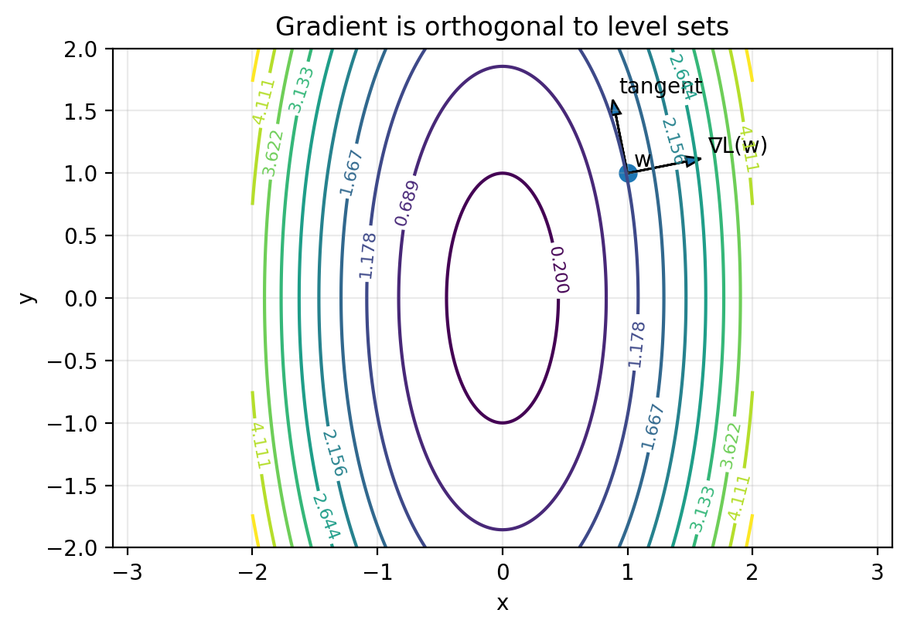

# 3. Optimization and PyTorch basics in higher dimensions

[cheatsheet](cheatsheet.html)

## Table of contents
1. [Goal of this lecture](#1-goal-of-this-lecture)
2. [Optimization in higher dimensions: definitions and diagnostics](#2-optimization-in-higher-dimensions-definitions-and-diagnostics)
3. [Dev environment: Cursor and uv](#3-dev-environment-cursor-and-uv)
4. [PyTorch tour: tensors, graphs, operations, efficiency, dtypes, devices](#4-pytorch-tour-tensors-graphs-operations-efficiency-dtypes-devices)
5. [Conclusion](#5-conclusion)
6. [Appendix: prompts, scripts, and unit tests for figures](#appendix-prompts-scripts-and-unit-tests-for-figures)

## 1. Goal of this lecture

Up to now, we did almost everything in one dimension so the objects were concrete and you could visualize the dynamics.

In practice, the parameter is almost never a scalar. It is a vector, or a matrix, or a pile of tensors.

This lecture has three goals.

1. **Lift the optimization primitives from 1D to $d$ dimensions.**  
   What stays the same:

   - an optimization problem is still decision variables + objective + constraints,
   - gradient descent is still derived from a local linear model,
   - diagnostics are still about “is the method making progress and is it stable?”

   What changes:

   - $w$ is now a vector $w \in \mathbb{R}^d$,
   - derivatives become **gradients** (vectors of partial derivatives),
   - we cannot monitor iterates directly in any meaningful way once $d$ is large.

2. **Set up a usable dev environment that you can ship and reproduce.**  
   In class: I will live-demo how I code with Cursor and how I use an AI agent responsibly.  
   In these notes: we will set up `uv` so you can run course scripts locally or on a remote VM.

3. **Do a higher-dimensional tour of PyTorch.**  
   We will touch the pieces we will use constantly later:

   - creating and manipulating tensors,
   - how autodiff behaves in higher dimensions,
   - a larger API surface: reductions, linear algebra, loss functions, `torch.nn`,
   - efficiency: broadcasting, vectorization, memory layout, matmul order,
   - dtypes and device placement.

If you leave this lecture with one usable mental model, it is this:

- the math in $d$ dimensions is the same as 1D, but written with vectors and inner products,
- PyTorch is a linear algebra DSL with autodiff attached,
- performance depends on whether you let PyTorch do the work in parallel, or you force it to crawl through Python loops.

## 2. Optimization in higher dimensions: definitions and diagnostics

This section is a fast lift-and-shift from Lecture 1 and Lecture 2.

### 2.1 Optimization problems, loss functions, minimizers

An optimization problem is still:

$$
\min_{w \in C} L(w)
$$

- **Decision variable:** $w \in \mathbb{R}^d$ (a vector you choose).
- **Objective / loss:** $L:\mathbb{R}^d \to \mathbb{R}$ (a scalar function you can evaluate).
- **Constraint set (feasible set):** $C \subseteq \mathbb{R}^d$.

Unconstrained problems are those with $C=\mathbb{R}^d$:

$$
\min_{w \in \mathbb{R}^d} L(w)
$$

A point $w^\ast$ is a **(global) minimizer** if $w^\ast \in C$ and

$$
L(w^\ast) \le L(w)
\quad \text{for all } w \in C
$$

The **optimal value** is

$$
L^\ast = \inf_{w \in C} L(w)
$$

In realistic problems, $L^\ast$ is unknown. In toy problems, we sometimes know $L^\ast$ and can plot an objective gap.

### 2.2 Gradients replace derivatives

In 1D, the derivative was a scalar $L'(w)$. In $d$ dimensions, the derivative becomes the **gradient**:

$$
\nabla L(w)=\left(\frac{\partial L}{\partial w_1},\ldots,\frac{\partial L}{\partial w_d}\right).
$$

It is a vector of partial derivatives.

A stationary point (also called a critical point) of an unconstrained differentiable problem is:

$$
\nabla L(w)=0.
$$

An $\varepsilon$-stationary point is:

$$
\|\nabla L(w)\| \le \varepsilon.
$$

Here $\|\|\cdot\|\|$ is a norm. In this course, unless we say otherwise, $\|\|\cdot\|\|$ means the Euclidean norm.

### 2.3 Example you should memorize: $L(w)=\tfrac{1}{2}\|\|w\|\|^2$

This is the higher-dimensional analogue of the parabola.

Define

$$
L(w)=\tfrac{1}{2}\|w\|^2=\tfrac{1}{2}\sum_{j=1}^d w_j^2.
$$

Then the derivative you should know in optimization is:

$$
\nabla L(w)=w.
$$

This one formula is the backbone of a lot of toy models, theory, and sanity checks.

### 2.4 Convexity in higher dimensions

In 1D you can often eyeball convexity from a plot. In higher dimensions we need a definition that does not rely on pictures.

A function $L:\mathbb{R}^d \to \mathbb{R}$ is **convex** if for all $w_1,w_2 \in \mathbb{R}^d$ and all $\theta \in [0,1]$,

$$
L(\theta w_1 + (1-\theta) w_2)
\le
\theta L(w_1) + (1-\theta) L(w_2).
$$

This is the Jensen-style inequality version of the definition.

One payoff you should keep in mind (we will justify it more formally later):

- for a differentiable convex function, any stationary point is a global minimizer.

So for convex problems, “solve” often means “find a point with small gradient norm.”

For nonconvex problems, small gradients can happen far from a minimizer (saddles, flat regions, etc.). The diagnostic interpretation is weaker.

### 2.5 Local minimizers and optimality conditions

In nonconvex problems, global minimizers may be hard to find or hard to even define operationally. So we often talk about **local** minima.

A point $w^\ast$ is a **local minimizer** of $L$ if there exists a radius $r>0$ such that

$$
L(w^\ast) \le L(w)
\quad \text{for all } w \text{ with } \|w-w^\ast\|\le r.
$$

If you have not seen “balls” before, the only object you need is the norm. The set

$$
\{w \in \mathbb{R}^d : \|w-w^\ast\|\le r\}
$$

is the Euclidean ball of radius $r$ centered at $w^\ast$.

A useful reframing:

- $w^\ast$ is a local minimizer of $L$  
  if and only if  
  $w^\ast$ is a global minimizer of the constrained problem

$$
\min_{w:\|w-w^\ast\|\le r} L(w)
$$

for some radius $r>0$.

This is not a deep theorem. It is just a clean way to see that “local” means “global, but with a local constraint.”

#### First-order necessary condition

If $L$ is differentiable and $w^\ast$ is a local minimizer of the **unconstrained** problem, then

$$
\nabla L(w^\ast)=0.
$$

This is a **necessary** condition, not a sufficient one. Stationary points include local minima, local maxima, and saddle points.

#### Second-order conditions (twice differentiable case)

If $L$ is twice differentiable, it has a **Hessian matrix** $\nabla^2 L(w)$, the matrix of second partial derivatives.

- **Second-order necessary condition:** if $w^\ast$ is a local minimizer, then $\nabla^2 L(w^\ast)$ is positive semidefinite.
- **Second-order sufficient condition:** if $\nabla L(w^\ast)=0$ and $\nabla^2 L(w^\ast)$ is positive definite, then $w^\ast$ is a strict local minimizer.

We will not do Hessian-based algorithms yet. The point of saying this now is vocabulary:

- “local minimizer” is a geometric concept,
- “first-order / second-order necessary and sufficient conditions” are how you turn that geometry into checkable statements.

### 2.6 Diagnostics in higher dimensions

The core diagnostics from 1D still make sense.

- **Objective value:** $L(w_k)$.
- **Objective gap:** $L(w_k)-L^\ast$ (only if $L^\ast$ is known).
- **Gradient norm:** $\|\|\nabla L(w_k)\|\|$.

One additional metric that is often useful in practice is a simple plateau metric:

- **Plateau metric (successive objective difference):**

$$
|L(w_{k+1})-L(w_k)|.
$$

This is crude, but it answers a practical question:

- “Are we still making progress step to step, or are we just oscillating around a floor?”

In 1D we sometimes plotted the iterates $w_k$ as well. In high dimensions, that is usually not useful:

- $w_k$ has $d$ entries,
- storing all iterates is $O(Td)$ memory if you keep the whole trajectory,
- even printing $w_k$ each step becomes meaningless hard to parse.

Instead, you monitor low-dimensional summaries: objective values, norms, maybe a few coordinate statistics if you have a reason.

### 2.7 Gradient descent motivation again in $d$ dimensions

We revisit gradient descent because later lectures will change the update rule (SGD, momentum, Adam, etc.), but the local-model derivation is still the spine.

#### The geometric meaning of the gradient

In 1D, the derivative is a slope. In $d$ dimensions, the gradient is the object that replaces slope.

Two equivalent facts that are both worth knowing:

1. **The gradient is the coefficient vector in the best local linear approximation.**
2. **The gradient is normal to level sets** (and, equivalently, normal to the tangent plane of the graph in the right embedding).

In practice, the “normal to level sets” picture is usually the most useful.

**Figure 3.1: gradient is orthogonal to level sets.**  

*Figure 3.1: A contour plot of a 2D loss with the gradient vector drawn at a point. The gradient is perpendicular to the contour line (level set) through that point.*

#### The first-order Taylor model

Let $L:\mathbb{R}^d \to \mathbb{R}$ be differentiable. Near a point $w$, we have the first-order approximation

$$
L(w+\Delta) \approx L(w) + \nabla L(w)^\top \Delta.
$$

Later in the course we will quantify the error terms and state conditions under which this approximation is accurate.

For now, treat it as the local model that motivates the update rule.

#### Choosing a direction that decreases the local model

Suppose we want to choose $\Delta$ to make the approximation small:

$$
L(w+\Delta) \approx L(w) + \nabla L(w)^\top \Delta.
$$

The only term we can control is the dot product $\nabla L(w)^\top \Delta$.

One might think we should just make $\Delta$ huge and negative so the dot product becomes very negative. However, the Taylor model is only local. If you take $\|\|\Delta\|\|$ too large, the approximation can become garbage and the method can blow up.

So we separate “direction” from “step length.” First ask:

> Among all directions with unit norm $\|\|\Delta\|\|=1$, which one minimizes $\nabla L(w)^\top \Delta$?

By Cauchy–Schwarz,

$$
\nabla L(w)^\top \Delta
\ge
-\|\nabla L(w)\|\|\Delta\|
=
-\|\nabla L(w)\|.
$$

Equality occurs when $\Delta$ points in the opposite direction of $\nabla L(w)$, i.e.,

$$
\Delta^\ast
=
-\frac{\nabla L(w)}{\|\nabla L(w)\|}.
$$

That is the steepest descent direction under the Euclidean norm.

**Figure 3.2: choosing the direction that minimizes the dot product.**  

*Figure 3.2: On the unit circle of directions, the dot product with the gradient is minimized by the unit vector pointing directly opposite the gradient.*

#### Putting the step size back in

In optimization code, we usually do not normalize the direction explicitly. We fold everything into a step size parameter $\eta>0$ and take

$$
\Delta = -\eta \nabla L(w).
$$

Plug this into the first-order approximation:

$$
\begin{aligned}
L(w+\Delta)
&\approx
L(w) + \nabla L(w)^\top \Delta \\
&=
L(w) + \nabla L(w)^\top (-\eta \nabla L(w)) \\
&=
L(w) - \eta \nabla L(w)^\top \nabla L(w) \\
&=
L(w) - \eta \|\nabla L(w)\|^2.
\end{aligned}
$$

So for small enough $\eta$, a gradient descent step decreases the objective to first order.

This is the exact same derivation as in 1D. The only difference is that:

- multiplication becomes an inner product,
- the derivative becomes a gradient,
- the square of the derivative becomes the squared gradient norm.

## 3. Dev environment: Cursor and uv

This section is not about philosophy. It is about eliminating “I can’t run the code” as a failure mode.

### 3.1 In-class demo: Cursor workflow

In class I will live-demo the following in Cursor.

1. **Create a project folder and open it in Cursor.**
2. **Initialize a git repo** (`git init`).
3. **Create a `.gitignore`.**
4. **Make an initial commit** and push to a GitHub repo.
5. **Use agent mode** to:
   - create files in the correct directories,
   - run scripts,
   - fix errors by reading tracebacks.

The point of the demo is not that Cursor is magic. The point is that you should have a workflow where:

- code lives in a repo,
- you can reproduce an environment,
- you can run scripts and see outputs,
- you can iterate quickly.

### 3.2 What is uv

`uv` is a fast Python environment and package manager. We will use it for two jobs:

1. create a virtual environment (`venv`) for a project,
2. install the dependencies needed to run the course scripts.

### 3.3 What is a virtual environment

A **virtual environment** is an isolated Python installation for a project.

- Inside a venv, `python` and `pip` point to a local environment.
- Packages you install there do not leak into your system Python.
- Different projects can use different package versions without fighting.

One might think “I can just install everything globally.” However, global installs create un-debuggable states:

- you upgrade one package for Project A and Project B breaks,
- your laptop works but a remote VM fails,
- the TA’s environment differs from yours and you cannot reproduce bugs.

A venv is the minimum mechanism that makes Python reproducible.

### 3.4 A minimal uv workflow

Below is the basic workflow we will use.

1. Create a venv in the repo (often `.venv/`).
2. Install packages into that venv.
3. Run scripts using the venv Python.

A typical sequence (Linux/macOS):

```bash
uv venv
source .venv/bin/activate
uv pip install torch matplotlib numpy
python script/gd_1d_torch.py
```

On Windows (PowerShell):

```powershell
uv venv
.\.venv\Scripts\Activate.ps1
uv pip install torch matplotlib numpy
python .\script\gd_1d_torch.py
```

We will automate most of this so you can clone a repo and run a single install command.

### 3.5 Agent prompt: build a repo that runs the Lecture 1 script

This is a prompt you can copy and paste into Cursor agent mode. It is written so the agent has no room to “improvise” the directory structure.

#### Prompt to paste into the agent

```text
You are in the root of a git repository.

Your goal: make this repo runnable by a new user on a fresh machine using uv.

Requirements:
1) Create directories:
   - script/
   - figures/
   - tests/

2) Create a Python script at:
   script/gd_1d_torch.py

   The script must be EXACTLY the Lecture 1 "A complete 1D gradient descent loop in PyTorch" version, including:
   - gd_1d_torch(...)
   - save_diagnostics_plot(...)
   - main() that runs at least the quadratic example and saves:
       figures/gd_torch_quadratic_diagnostics.png
   - use matplotlib to save the plot
   - print the final stats like in the lecture

3) Add a .gitignore that ignores:
   - .venv/
   - __pycache__/
   - .pytest_cache/
   - *.pyc

4) Create a requirements file at the repo root named:
   requirements.txt
   It must contain at least:
   - torch
   - matplotlib

5) Create an install script at:
   script/install.sh

   install.sh must:
   - be runnable on Linux/macOS with: bash script/install.sh
   - check whether uv is installed; if not, install uv (use the official install script)
   - create a venv named .venv in the repo root (do not pick another name)
   - install requirements into that venv using uv
   - print clear next steps to the user (how to activate the venv and run the script)

6) Make script/install.sh executable.

7) Create a README.md that explains:
   - how to run script/install.sh
   - how to activate the venv
   - how to run script/gd_1d_torch.py
   - how to run tests

8) Add a pytest test in:
   tests/test_install_and_run.py

   The test must:
   - import subprocess
   - run: .venv/bin/python script/gd_1d_torch.py (assume venv exists)
   - assert that figures/gd_torch_quadratic_diagnostics.png exists after running
   - do NOT check timing, only that the script runs and produces the figure

Finally:
- Run script/install.sh.
- Run pytest.
- If anything fails, fix it and rerun until both succeed.
```

#### Notes on why we do this

- Once `uv` is installed, the “create venv + install deps” step becomes consistent across machines.
- Remote VMs often start with a bare Python install and no packages. An install script saves you from re-deriving the same commands every time.
- Tests are not “extra.” They are how you prevent “it works on my machine” from being your only debugging strategy.

## 4. PyTorch tour: tensors, graphs, operations, efficiency, dtypes, devices

This section is deliberately code-heavy.

In class, I will run these examples live. In the notes, each concept is paired with a minimal runnable snippet.

### 4.1 Conventions for the code blocks

- Every snippet is meant to run in a fresh Python process.
- If a line prints something, I show the output as a comment.
- If output depends on hardware (CPU vs GPU) or timing, I label it as example output.

### 4.2 Tensors in higher dimensions: creation

A tensor is a container for numbers, plus metadata:

- shape,
- dtype,
- device,
- (optionally) autodiff tracking.

#### From Python lists

```python
import torch

x = torch.tensor([1.0, 2.0, 3.0])
A = torch.tensor([[1, 2, 3],
                  [4, 5, 6]])

print("x:", x)
print("A:\n", A)
print("x.shape:", x.shape)
print("A.shape:", A.shape)

# Output:
# x: tensor([1., 2., 3.])
# A:
#  tensor([[1, 2, 3],
#          [4, 5, 6]])
# x.shape: torch.Size([3])
# A.shape: torch.Size([2, 3])
```

#### From and to NumPy

Two important facts:

1. `torch.from_numpy(np_array)` shares memory with NumPy (zero-copy).
2. `.numpy()` shares memory with the tensor when the tensor is on CPU.

```python
import numpy as np
import torch

a_np = np.array([[1.0, 2.0],
                 [3.0, 4.0]], dtype=np.float32)

a_t = torch.from_numpy(a_np)

print("a_t:\n", a_t)
print("same memory?", a_t.data_ptr() == a_np.__array_interface__["data"][0])

a_np[0, 0] = 999.0
print("after modifying numpy, a_t:\n", a_t)

# Output:
# a_t:
#  tensor([[1., 2.],
#          [3., 4.]])
# same memory? True
# after modifying numpy, a_t:
#  tensor([[999.,   2.],
#          [  3.,   4.]])
```

One might think `.numpy()` is a “copy out.” However, on CPU it is typically a view into the same storage. If you need a copy, use `.clone()` first.

#### Random tensors

Gaussian and uniform are the workhorses:

```python
import torch

torch.manual_seed(0)

g = torch.randn(2, 3)   # N(0,1)
u = torch.rand(2, 3)    # Unif[0,1)

print("g:\n", g)
print("u:\n", u)

# Output:
# g:
#  tensor([[ 1.5410, -0.2934, -2.1788],
#          [ 0.5684, -1.0845, -1.3986]])
# u:
#  tensor([[0.4963, 0.7682, 0.0885],
#          [0.1320, 0.3074, 0.6341]])
```

#### `empty`: uninitialized memory

```python
import torch

x = torch.empty(2, 3)
print(x)

# Output:
# tensor([[... random-looking values ...]])
```

Why would you ever do this?

- `torch.empty` allocates memory but does not fill it.
- If you are about to overwrite every entry anyway, `empty` avoids an unnecessary initialization pass.

A common pattern is:

- allocate with `empty`,
- fill with some computation.

#### Zeros and ones

```python
import torch

z = torch.zeros(2, 3)
o = torch.ones(2, 3)

print("zeros:\n", z)
print("ones:\n", o)

# Output:
# zeros:
#  tensor([[0., 0., 0.],
#          [0., 0., 0.]])
# ones:
#  tensor([[1., 1., 1.],
#          [1., 1., 1.]])
```

#### Copy vs clone

Two things that look similar in Python are not the same in PyTorch:

- assignment copies a reference,
- `clone()` copies data.

```python
import torch

x = torch.tensor([1.0, 2.0, 3.0])

y = x              # reference copy (no new memory)
z = x.clone()      # data copy (new memory)

print("x.data_ptr:", x.data_ptr())
print("y.data_ptr:", y.data_ptr())
print("z.data_ptr:", z.data_ptr())

y[0] = 999.0
print("after y[0]=999:")
print("x:", x)
print("y:", y)
print("z:", z)

# Output:
# x.data_ptr:  ...
# y.data_ptr:  ... (same as x)
# z.data_ptr:  ... (different)
# after y[0]=999:
# x: tensor([999.,   2.,   3.])
# y: tensor([999.,   2.,   3.])
# z: tensor([1., 2., 3.])
```

So:

- “copy” in casual Python talk often means “another name for the same object.”
- `clone()` means “a new tensor with its own storage.”

### 4.3 Tensor manipulation: shape, reshape, view, flatten, concat

#### `.numel` and `.shape`

```python
import torch

A = torch.randn(2, 3, 4)
print("A.shape:", A.shape)
print("A.numel():", A.numel())

# Output:
# A.shape: torch.Size([2, 3, 4])
# A.numel(): 24
```

#### `reshape`: change shape (maybe copy)

```python
import torch

x = torch.arange(12)     # 0,1,...,11
A = x.reshape(3, 4)

print("x:", x)
print("A:\n", A)
print("A.shape:", A.shape)

# Output:
# x: tensor([ 0,  1,  2,  3,  4,  5,  6,  7,  8,  9, 10, 11])
# A:
#  tensor([[ 0,  1,  2,  3],
#          [ 4,  5,  6,  7],
#          [ 8,  9, 10, 11]])
# A.shape: torch.Size([3, 4])
```

You can use `-1` to infer a dimension:

```python
import torch

x = torch.arange(12)
B = x.reshape(2, -1)

print("B.shape:", B.shape)
print("B:\n", B)

# Output:
# B.shape: torch.Size([2, 6])
# B:
#  tensor([[ 0,  1,  2,  3,  4,  5],
#          [ 6,  7,  8,  9, 10, 11]])
```

#### `view`: change shape without copying (requires contiguous layout)

A `view` is a different interpretation of the same memory.

One might think `reshape` and `view` are identical. However:

- `view` requires the tensor to be contiguous in memory,
- `reshape` will return a view when possible, and otherwise it will copy.

A standard way to make a non-contiguous tensor is transpose.

```python
import torch

A = torch.arange(12).reshape(3, 4)
AT = A.t()   # transpose: shape (4,3)

print("A.is_contiguous():", A.is_contiguous())
print("AT.is_contiguous():", AT.is_contiguous())

# Output:
# A.is_contiguous(): True
# AT.is_contiguous(): False
```

Now compare `view` vs `reshape`:

```python
import torch

A = torch.arange(12).reshape(3, 4)
AT = A.t()

try:
    v = AT.view(-1)
    print("view worked:", v)
except RuntimeError as e:
    print("view failed:", e)

r = AT.reshape(-1)
print("reshape worked:", r)

# Output:
# view failed: view size is not compatible with input tensor's size and stride ...
# reshape worked: tensor([ 0,  4,  8,  1,  5,  9,  2,  6, 10,  3,  7, 11])
```

#### `flatten` and `unflatten`

`flatten` is a convenient wrapper around reshaping to 1D. Whether it is a view or a copy depends on contiguity.

```python
import torch

A = torch.arange(12).reshape(3, 4)
f = A.flatten()

print("A.data_ptr == f.data_ptr?", A.data_ptr() == f.data_ptr())
print("f:", f)

# Output:
# A.data_ptr == f.data_ptr? True
# f: tensor([ 0,  1,  2,  3,  4,  5,  6,  7,  8,  9, 10, 11])
```

Now a non-contiguous example:

```python
import torch

A = torch.arange(12).reshape(3, 4)
AT = A.t()
f = AT.flatten()

print("AT.is_contiguous():", AT.is_contiguous())
print("AT.data_ptr == f.data_ptr?", AT.data_ptr() == f.data_ptr())

# Output:
# AT.is_contiguous(): False
# AT.data_ptr == f.data_ptr? False
```

So `flatten` does not promise a view. It promises a flattened tensor.

`unflatten` is the inverse operation when you know the target shape:

```python
import torch

x = torch.arange(12)
A = x.unflatten(dim=0, sizes=(3, 4))

print("A.shape:", A.shape)
print("A:\n", A)

# Output:
# A.shape: torch.Size([3, 4])
# A:
#  tensor([[ 0,  1,  2,  3],
#          [ 4,  5,  6,  7],
#          [ 8,  9, 10, 11]])
```

#### Concatenation: vertical and horizontal

For 2D tensors:

- concatenate “vertically” means `dim=0` (stack rows),
- concatenate “horizontally” means `dim=1` (stack columns).

```python
import torch

A = torch.tensor([[1, 2, 3],
                  [4, 5, 6]])
B = torch.tensor([[10, 20, 30],
                  [40, 50, 60]])

V = torch.cat([A, B], dim=0)  # vertical
H = torch.cat([A, B], dim=1)  # horizontal

print("V.shape:", V.shape)
print("V:\n", V)
print("H.shape:", H.shape)
print("H:\n", H)

# Output:
# V.shape: torch.Size([4, 3])
# V:
#  tensor([[ 1,  2,  3],
#          [ 4,  5,  6],
#          [10, 20, 30],
#          [40, 50, 60]])
# H.shape: torch.Size([2, 6])
# H:
#  tensor([[ 1,  2,  3, 10, 20, 30],
#          [ 4,  5,  6, 40, 50, 60]])
```

Shape compatibility matters:

```python
import torch

A = torch.zeros(2, 3)
C = torch.zeros(3, 3)

try:
    torch.cat([A, C], dim=1)
except RuntimeError as e:
    print("concat failed:", e)

# Output:
# concat failed: Sizes of tensors must match except in dimension 1 ...
```

#### `squeeze` and `unsqueeze`

Sometimes your tensor has a dimension of size 1 that you want to remove (squeeze), or you want to add a size-1 dimension to make shapes align (unsqueeze).

```python
import torch

v = torch.tensor([1.0, 2.0, 3.0])   # shape (3,)
v_row = v.unsqueeze(0)              # shape (1,3)
v_col = v.unsqueeze(1)              # shape (3,1)

print("v.shape:", v.shape)
print("v_row.shape:", v_row.shape)
print("v_col.shape:", v_col.shape)

# Output:
# v.shape: torch.Size([3])
# v_row.shape: torch.Size([1, 3])
# v_col.shape: torch.Size([3, 1])
```

A practical use: concatenating a single row onto a matrix.

```python
import torch

A = torch.zeros(2, 3)
v = torch.tensor([1.0, 2.0, 3.0])

A2 = torch.cat([A, v.unsqueeze(0)], dim=0)
print("A2.shape:", A2.shape)
print(A2)

# Output:
# A2.shape: torch.Size([3, 3])
# tensor([[0., 0., 0.],
#         [0., 0., 0.],
#         [1., 2., 3.]])
```

### 4.4 Computational graphs in higher dimensions

The mechanism of autodiff does not change in higher dimensions. The objects do.

#### `requires_grad`: turning tracking on

```python
import torch

w = torch.randn(5, requires_grad=True)
L = 0.5 * (w * w).sum()
L.backward()

print("w:", w)
print("grad:", w.grad)

# Output:
# w: tensor([...], requires_grad=True)
# grad: tensor([...])   # should equal w
```

#### Why you “can’t just assign into” a leaf tensor requiring grad

If `w` is a leaf tensor with `requires_grad=True`, in-place modifications can break the recorded computation.

```python
import torch

w = torch.randn(3, requires_grad=True)

try:
    w[0] = 0.0
except RuntimeError as e:
    print("in-place assignment failed:", e)

# Output:
# in-place assignment failed: a view of a leaf Variable that requires grad is being used in an in-place operation.
```

A standard pattern is:

1. create a tensor,
2. do any preprocessing (normalization, clipping),
3. then turn on grad tracking.

```python
import torch

w = torch.randn(3)
w = w / w.norm()          # preprocessing while not tracking gradients
w.requires_grad_()        # now start tracking

L = 0.5 * (w * w).sum()
L.backward()

print("w.requires_grad:", w.requires_grad)
print("w.grad:", w.grad)

# Output:
# w.requires_grad: True
# w.grad: tensor([...])
```

#### `detach`: stop tracking, but keep the same storage

`detach()` returns a tensor that shares memory with the original tensor, but is not connected to the computational graph.

Two key questions:

1. Does it point to the same memory?  
2. If you modify the detached tensor, does the original change?

Yes to both.

```python
import torch

w = torch.tensor([1.0, 2.0, 3.0], requires_grad=True)
v = w.detach()

print("same storage?", w.data_ptr() == v.data_ptr())

v[0] = 999.0
print("after modifying v:")
print("w:", w)
print("v:", v)

# Output:
# same storage? True
# after modifying v:
# w: tensor([999.,   2.,   3.], requires_grad=True)
# v: tensor([999.,   2.,   3.])
```

This is useful and dangerous.

Useful when:

- you want a non-tracked view for logging,
- you want to stop gradients from flowing into a subcomputation.

Dangerous when:

- you modify the detached tensor and accidentally mutate the tracked parameters.

If you need a non-tracked copy that is safe to mutate, you want `detach().clone()`.

#### `clone`: copy data (and usually preserve the graph)

`clone()` makes a new tensor with its own storage.

If you clone a tracked tensor, the clone is still connected to the graph (it is not a leaf).

```python
import torch

w = torch.randn(3, requires_grad=True)
c = w.clone()

print("w.is_leaf:", w.is_leaf)
print("c.is_leaf:", c.is_leaf)

L = (c * c).sum()
L.backward()

print("w.grad:", w.grad)

# Output:
# w.is_leaf: True
# c.is_leaf: False
# w.grad: tensor([...])
```

So `clone()` is a data copy, but not a “stop gradient.”

If you want a copy that is disconnected from the graph:

```python
import torch

w = torch.randn(3, requires_grad=True)
snap = w.detach().clone()

print("snap.requires_grad:", snap.requires_grad)
print("same storage?", w.data_ptr() == snap.data_ptr())

# Output:
# snap.requires_grad: False
# same storage? False
```

#### When do we use `detach().clone()` in practice?

Whenever you want to store values without storing the graph.

Common patterns:

- logging parameter snapshots during training,
- exponential moving averages (EMA) of weights,
- target networks in reinforcement learning,
- computing a “target” value that should not backpropagate.

### 4.5 Computing gradients in higher dimensions

The “gradient computation pattern” is the same:

1. build a scalar loss using PyTorch operations,
2. call `backward()` on that scalar loss,
3. read the gradient from `w.grad`.

#### Inefficient demo: compute $L(w)=\tfrac{1}{2}\|\|w\|\|^2$ without `torch.sum`

We do this inefficiently on purpose so you can see the mechanics.

```python
import torch

w = torch.tensor([1.0, -2.0, 3.0], requires_grad=True)

s = 0.0
for j in range(w.numel()):
    s = s + 0.5 * w[j] * w[j]

s.backward()

print("loss s:", s.item())
print("grad:", w.grad)

# Output:
# loss s: 7.0
# grad: tensor([ 1., -2.,  3.])
```

We got $\nabla L(w)=w$ as expected.

Now the efficient version:

```python
import torch

w = torch.tensor([1.0, -2.0, 3.0], requires_grad=True)

L = 0.5 * (w * w).sum()
L.backward()

print("loss L:", L.item())
print("grad:", w.grad)

# Output:
# loss L: 7.0
# grad: tensor([ 1., -2.,  3.])
```

Same math, radically different execution.

- the loop is Python-level and sequential,
- the reduction is a PyTorch primitive that can be parallelized and optimized.

#### Autodiff reminder: recorded operations + chain rule

When you write a loss in PyTorch, you are giving PyTorch a computational graph.

In math terms, you are expressing $L$ as a composition:

$$
L = g \circ h \circ r \circ \cdots
$$

PyTorch applies the multivariate chain rule through that recorded composition.

We are not proving the multivariate chain rule here. If you want a clean Jacobian-based explanation, see:

- <https://damek.github.io/STAT-4830/archive/2025/section/5/notes.html#extending-to-higher-dimensions-the-jacobian>

### 4.6 Lingering question: what happens if `backward()` sees a non-scalar tensor?

`backward()` computes derivatives of a scalar loss.

One might think you can do:

- compute a vector output,
- call `backward()`.

But a vector output does not have “the gradient” in the sense we need for optimization. It has a Jacobian.

PyTorch resolves this by defaulting to **vector–Jacobian products**.

Concretely:

- if `y` is non-scalar, `y.backward()` is ambiguous unless you specify a vector to multiply the Jacobian by.

Here is the failure mode:

```python
import torch

w = torch.tensor([1.0, 2.0, 3.0], requires_grad=True)
y = w * w   # y is vector-valued

try:
    y.backward()
except RuntimeError as e:
    print("backward failed:", e)

# Output:
# backward failed: grad can be implicitly created only for scalar outputs
```

Two standard fixes.

**Fix A: reduce to a scalar loss**

```python
import torch

w = torch.tensor([1.0, 2.0, 3.0], requires_grad=True)
y = w * w

L = y.sum()      # scalar
L.backward()

print("w.grad:", w.grad)

# Output:
# w.grad: tensor([2., 4., 6.])
```

**Fix B: provide `grad_outputs` to define a vector–Jacobian product**

```python
import torch

w = torch.tensor([1.0, 2.0, 3.0], requires_grad=True)
y = w * w

v = torch.tensor([10.0, 20.0, 30.0])   # same shape as y
y.backward(v)

print("w.grad:", w.grad)

# Output:
# w.grad: tensor([ 20.,  80., 180.])
```

Interpretation:

- $y = (w_1^2,w_2^2,w_3^2)$ has Jacobian $J=\mathrm{diag}(2w_1,2w_2,2w_3)$,
- `y.backward(v)` computes $J^\top v$,
- here that is $(2w_1 v_1,2w_2 v_2,2w_3 v_3)$.

In optimization, we almost always define a scalar loss, so Fix A is the default.

### 4.7 A larger tour of the PyTorch API

This is not an exhaustive tour. It is a “things you will use constantly later” tour.

#### Entrywise operations

Any scalar function can be applied entrywise.

```python
import torch

x = torch.tensor([1.0, 2.0, 3.0])

print("exp:", torch.exp(x))
print("log:", torch.log(x))
print("sin:", torch.sin(x))
print("x**2:", x**2)
print("x*x:", x*x)

# Output:
# exp: tensor([ 2.7183,  7.3891, 20.0855])
# log: tensor([0.0000, 0.6931, 1.0986])
# sin: tensor([0.8415, 0.9093, 0.1411])
# x**2: tensor([1., 4., 9.])
# x*x: tensor([1., 4., 9.])
```

Two ways to square a vector (`x**2` vs `x*x`) are equivalent here.

#### Reductions replace loops

Reductions compute aggregates over dimensions.

```python
import torch

A = torch.tensor([[1.0, 2.0],
                  [3.0, 4.0]])

print("sum all:", A.sum().item())
print("sum dim=0:", A.sum(dim=0))
print("sum dim=1:", A.sum(dim=1))
print("mean:", A.mean().item())
print("max:", A.max().item())
print("argmax (flattened):", A.argmax().item())

# Output:
# sum all: 10.0
# sum dim=0: tensor([4., 6.])
# sum dim=1: tensor([3., 7.])
# mean: 2.5
# max: 4.0
# argmax (flattened): 3
```

The “efficient norm-squared” example:

```python
import torch

w = torch.randn(5, requires_grad=True)
L = 0.5 * torch.sum(w * w)
L.backward()

print("L:", L.item())
print("grad equals w?", torch.allclose(w.grad, w).item())

# Output:
# L: ...
# grad equals w? True
```

#### Basic linear algebra

```python
import torch

A = torch.tensor([[1.0, 2.0],
                  [3.0, 4.0]])
x = torch.tensor([10.0, 20.0])

print("A.T:\n", A.t())
print("A @ x:", (A @ x))
print("x @ x:", (x @ x))   # inner product for 1D tensors

# Output:
# A.T:
#  tensor([[1., 3.],
#          [2., 4.]])
# A @ x: tensor([ 50., 110.])
# x @ x: tensor(500.)
```

Matrix-matrix multiplication:

```python
import torch

A = torch.randn(2, 3)
B = torch.randn(3, 4)
C = A @ B

print("C.shape:", C.shape)

# Output:
# C.shape: torch.Size([2, 4])
```

What about “multiplying tensors” beyond matrices?

- `@` and `torch.matmul` generalize matrix multiplication to batched dimensions.
- The semantics are precise, but you need to know what dimensions are treated as batch vs matrix dimensions.
- Later we will use `einsum` because it forces you to be explicit about index contractions.

#### Logical ops and masking

```python
import torch

x = torch.tensor([-2.0, -1.0, 0.0, 1.0, 2.0])
mask = x > 0

print("mask:", mask)
print("x[mask]:", x[mask])

# Output:
# mask: tensor([False, False, False,  True,  True])
# x[mask]: tensor([1., 2.])
```

### 4.8 Loss functions: `torch.nn.functional`

PyTorch has common losses implemented and numerically stabilized.

Two functions you should know exist:

- `torch.logsumexp` (stable softmax-ish primitive),
- `torch.nn.functional.cross_entropy` and `binary_cross_entropy_with_logits`.

#### Logistic regression for spam vs not-spam (vectorized)

We will write the whole “model + loss” in code.

Setup:

- data matrix $X \in \mathbb{R}^{n \times d}$,
- labels $y \in \{0,1\}^n$,
- parameter vector $w \in \mathbb{R}^d$,
- logits $z = Xw$,
- loss = binary cross entropy on logits.

```python
import torch
import torch.nn.functional as F

torch.manual_seed(0)

n = 8
d = 5

X = torch.randn(n, d)
y = torch.randint(low=0, high=2, size=(n,)).float()  # 0/1 labels

w = torch.randn(d, requires_grad=True)

logits = X @ w                      # shape (n,)
loss = F.binary_cross_entropy_with_logits(logits, y)

loss.backward()

print("logits.shape:", logits.shape)
print("loss:", loss.item())
print("w.grad.shape:", w.grad.shape)

# Output:
# logits.shape: torch.Size([8])
# loss: ...
# w.grad.shape: torch.Size([5])
```

This is the “data → model → loss → backward” pipeline in one place.

Two notes you should file away:

1. We used `binary_cross_entropy_with_logits`, not “sigmoid then BCE.”  
   The logits version is more numerically stable.
2. The gradient lives in `w.grad` because we marked `w` with `requires_grad=True`.

### 4.9 `torch.nn`: a tiny two-layer network

A linear model predicts with $x^\top w$. A neural network predicts with a nonlinear mapping.

We will build:

- Linear layer: $\mathbb{R}^d \to \mathbb{R}^h$,
- ReLU,
- Linear layer: $\mathbb{R}^h \to \mathbb{R}$.

**Figure 3.3: two-layer network architecture.**  

*Figure 3.3: A simple 2-layer MLP: linear layer, ReLU, linear layer. Later we will replace this with transformer blocks.*

```python
import torch
import torch.nn as nn
import torch.nn.functional as F

torch.manual_seed(0)

n = 8
d = 5
h = 16

X = torch.randn(n, d)
y = torch.randint(low=0, high=2, size=(n,)).float()

model = nn.Sequential(
    nn.Linear(d, h),
    nn.ReLU(),
    nn.Linear(h, 1),
)

logits = model(X).squeeze(1)     # shape (n,)
loss = F.binary_cross_entropy_with_logits(logits, y)

loss.backward()

print("logits.shape:", logits.shape)
print("loss:", loss.item())

# Show that parameters have gradients
for name, p in model.named_parameters():
    print(name, "grad shape:", p.grad.shape)

# Output:
# logits.shape: torch.Size([8])
# loss: ...
# 0.weight grad shape: torch.Size([16, 5])
# 0.bias grad shape: torch.Size([16])
# 2.weight grad shape: torch.Size([1, 16])
# 2.bias grad shape: torch.Size([1])
```

This is still the same pipeline:

1. evaluate model (forward pass),
2. compute loss,
3. call `backward()` (backward pass),
4. read gradients from parameters.

Later we will add an optimizer (SGD, Adam, etc.) and run a loop.

### 4.10 Efficiency issues: the same math, different runtime

Throughout this section, the pattern is:

- do the same computation two ways,
- time them,
- explain why one is better.

Timing is hardware-dependent. You should focus on the order-of-magnitude differences and the reasons, not the exact numbers.

#### In-place operations: the `_` suffix

Many PyTorch operations have an in-place version with a trailing underscore.

Example: `add_` modifies a tensor in place.

```python
import torch

x = torch.tensor([1.0, 2.0, 3.0])
y = torch.tensor([10.0, 20.0, 30.0])

x_out = x + y
print("out-of-place:", x_out)
print("x unchanged:", x)

x_in = x.clone()
x_in.add_(y)
print("in-place:", x_in)

# Output:
# out-of-place: tensor([11., 22., 33.])
# x unchanged: tensor([1., 2., 3.])
# in-place: tensor([11., 22., 33.])
```

Why in-place?

- it avoids allocating a new tensor,
- it can reduce memory traffic.

One might think “always use in-place for speed.” However:

- in-place ops can break autodiff if they overwrite values needed for backward,
- in-place ops can make code harder to reason about.

In training loops, the common safe in-place updates happen under `torch.no_grad()`.

#### Broadcasting: matrix–vector Hadamard product

We want to compute:

- matrix $A \in \mathbb{R}^{n \times d}$,
- vector $v \in \mathbb{R}^d$,
- result $B \in \mathbb{R}^{n \times d}$ where $B_{ij} = A_{ij} v_j$.

There are three conceptual ways:

1. Python for-loop (slow, sequential),
2. explicitly repeat the vector into a matrix (extra memory),
3. broadcasting (no extra memory for the repeated matrix).

**Figure 3.4: broadcasting as “virtual replication.”**  

*Figure 3.4: Broadcasting behaves like repeating a vector across rows, but without allocating the repeated matrix.*

Code:

```python
import torch

torch.manual_seed(0)

n = 4
d = 3

A = torch.randn(n, d)
v = torch.randn(d)

B = A * v   # broadcasting: v treated as shape (1,d) and expanded across rows

print("A.shape:", A.shape)
print("v.shape:", v.shape)
print("B.shape:", B.shape)

# Output:
# A.shape: torch.Size([4, 3])
# v.shape: torch.Size([3])
# B.shape: torch.Size([4, 3])
```

Why is broadcasting more efficient?

- it does not allocate an $n \times d$ “tiled” copy of `v`,
- it lets a single kernel implement the computation in parallel,
- the expanded dimensions are represented by stride metadata, not by actual memory.

#### Vectorization beats Python loops

Python loops are slow. The reason is not that “Python is bad.” The reason is:

- each loop iteration is interpreted,
- each tensor operation call has overhead,
- you prevent PyTorch from launching efficient kernels over large blocks of data.

A long timed example: compute $\sum_i x_i^2$.

```python
import time
import torch

torch.manual_seed(0)

n = 5_000_000
x = torch.randn(n)

# Python loop
t0 = time.perf_counter()
s = 0.0
for i in range(n):
    s += float(x[i] * x[i])
t1 = time.perf_counter()

# Vectorized
t2 = time.perf_counter()
s2 = torch.sum(x * x).item()
t3 = time.perf_counter()

print("loop sum:", s)
print("vec  sum:", s2)
print("loop time (s):", t1 - t0)
print("vec  time (s):", t3 - t2)

# Example output (your times will differ):
# loop sum: 4999584.123...
# vec  sum: 4999584.125...
# loop time (s): 2.80
# vec  time (s): 0.02
```

The numeric values differ slightly because:

- the loop casts each term to Python float and accumulates in Python,
- the vectorized reduction uses PyTorch’s reduction implementation and dtype rules.

The runtime difference is the main point.

#### Memory layout: contiguous vs non-contiguous

PyTorch tensors have **strides**, which describe how to step through memory to move along each dimension.

The default layout for a 2D tensor is “row-major contiguous” in the sense that the last dimension is contiguous.

Transpose changes the stride pattern without moving data.

```python
import torch

A = torch.arange(12).reshape(3, 4)
AT = A.t()

print("A.shape:", A.shape, "stride:", A.stride(), "contiguous:", A.is_contiguous())
print("AT.shape:", AT.shape, "stride:", AT.stride(), "contiguous:", AT.is_contiguous())

# Output:
# A.shape: torch.Size([3, 4]) stride: (4, 1) contiguous: True
# AT.shape: torch.Size([4, 3]) stride: (1, 4) contiguous: False
```

Why do we care?

- contiguous layout enables fast sequential memory access,
- non-contiguous layout can force extra copies when an operation expects contiguous data,
- cache behavior is dominated by access patterns.

**Figure 3.5: row-major vs column-major intuition.**  

*Figure 3.5: A 2D array is stored in 1D memory. Row-major means row entries are contiguous. Column-major means column entries are contiguous. Strides are the precise way to describe both.*

We will not do cache theory here. The actionable rule is:

- if you see `is_contiguous()` is `False` and performance matters, consider making a contiguous copy with `.contiguous()` at an appropriate point.

#### Matmul order: $A(BC)$ vs $(AB)C$

Matrix multiplication is associative mathematically, but not computationally.

Let:

- $A \in \mathbb{R}^{m \times n}$,
- $B \in \mathbb{R}^{n \times p}$,
- $C \in \mathbb{R}^{p \times q}$.

The flop counts differ:

- $(AB)C$ costs about $mnp + mpq$ multiply-adds,
- $A(BC)$ costs about $npq + mnq$ multiply-adds.

The difference can be huge.

**Figure 3.6: associativity changes intermediate sizes.**  

*Figure 3.6: The intermediate matrix in $(AB)C$ has shape $m \times p$. The intermediate in $A(BC)$ has shape $n \times q$. You want the smaller intermediate when possible.*

A concrete timing example:

```python
import time
import torch

torch.manual_seed(0)

m, n, p, q = 512, 2048, 64, 512

A = torch.randn(m, n)
B = torch.randn(n, p)
C = torch.randn(p, q)

# Time (AB)C
t0 = time.perf_counter()
X1 = (A @ B) @ C
t1 = time.perf_counter()

# Time A(BC)
t2 = time.perf_counter()
X2 = A @ (B @ C)
t3 = time.perf_counter()

print("max diff:", (X1 - X2).abs().max().item())
print("(AB)C time (s):", t1 - t0)
print("A(BC) time (s):", t3 - t2)

# Example output (your times will differ):
# max diff: 0.0
# (AB)C time (s): 0.45
# A(BC) time (s): 0.08
```

The outputs match (up to floating point), but runtime differs because you changed the cost profile.

One might think “PyTorch will figure this out automatically.” However, matrix multiplication order is not generally optimized away for you. You must choose the parentheses.

### 4.11 Dtypes: precision, speed, and accumulation

PyTorch supports multiple numeric types.

Common ones:

- floating point: `float16`, `bfloat16`, `float32`, `float64`,
- integers: `int32`, `int64`,
- booleans: `bool`.

```python
import torch

print(torch.float16, torch.bfloat16, torch.float32, torch.float64)
print(torch.int64, torch.bool)

# Output:
# torch.float16 torch.bfloat16 torch.float32 torch.float64
# torch.int64 torch.bool
```

What does “precision” mean?

- a float type has a limited number of bits to represent a number,
- that means a limited set of representable values,
- operations round to the nearest representable value.

Benefits of lower precision:

- less memory,
- higher throughput on modern accelerators.

Drawback:

- you lose accuracy,
- some computations become unstable.

A practical rule of thumb:

- **accumulators should usually be high precision.**  
  If you add many small numbers, rounding error accumulates.

#### Accumulation exercise (float16 vs float32)

This is the behavior I posted here:

- <https://x.com/damekdavis/status/1952229626576830658?s=20>

We can reproduce the key phenomenon in a few lines.

```python
import torch

# 1000 copies of ~0.01 should sum to ~10.
n = 1000
vals32 = torch.full((n,), 0.0100001, dtype=torch.float32)
vals16 = vals32.to(torch.float16)

# float32 accumulator + float32 values
acc32_32 = torch.tensor(0.0, dtype=torch.float32)
for v in vals32:
    acc32_32 = acc32_32 + v

# float16 accumulator + float16 values
acc16_16 = torch.tensor(0.0, dtype=torch.float16)
for v in vals16:
    acc16_16 = acc16_16 + v

# float32 accumulator + float16 values (implicit upcast of v during addition)
acc32_16 = torch.tensor(0.0, dtype=torch.float32)
for v in vals16:
    acc32_16 = acc32_16 + v

# float32 accumulator + float16 values (explicit upcast)
acc32_16_explicit = torch.tensor(0.0, dtype=torch.float32)
for v in vals16:
    acc32_16_explicit = acc32_16_explicit + v.to(torch.float32)

print("float32 accumulator + float32 values:", acc32_32)
print("float16 accumulator + float16 values:", acc16_16)
print("float32 accumulator + float16 values (implicit upcast):", acc32_16)
print("float32 accumulator + float16 values (explicit upcast):", acc32_16_explicit)

# Output:
# float32 accumulator + float32 values: tensor(10.0001)
# float16 accumulator + float16 values: tensor(9.9531, dtype=torch.float16)
# float32 accumulator + float16 values (implicit upcast): tensor(10.0021)
# float32 accumulator + float16 values (explicit upcast): tensor(10.0021)
```

Interpretation:

- `float16` cannot represent `0.0100001` exactly; it rounds it.
- `float16` accumulation loses additional information because the accumulator itself cannot represent intermediate sums finely.
- `float32` accumulation avoids the accumulator-rounding issue, but you still sum the rounded `float16` values, so you can end up slightly high.

Frontier practice (what modern training often does):

- parameters stored in `bfloat16` or `float16`,
- gradients and accumulators stored in `float32`,
- mixed precision to trade memory/throughput vs stability.

We will return to this when we talk about GPU training.

### 4.12 Devices: CPU, GPU, MPS, TPU

By default, tensors live on CPU.

```python
import torch

x = torch.randn(3)
print("device:", x.device)

# Output:
# device: cpu
```

You can move tensors to a device with `.to(device)`.

```python
import torch

device = torch.device("cuda") if torch.cuda.is_available() else torch.device("cpu")
x = torch.randn(3).to(device)

print("device:", x.device)

# Example output:
# device: cuda:0
```

Macs may have an `mps` device. In my experience, MPS support is improving but can still be fragile depending on the operation mix. If you are on a Mac and you hit mysterious runtime errors, the first debugging step is often: run on CPU or on a CUDA machine.

```python
import torch

if torch.backends.mps.is_available():
    device = torch.device("mps")
else:
    device = torch.device("cpu")

x = torch.randn(3).to(device)
print("device:", x.device)

# Example output:
# device: mps
```

Other devices exist (TPUs, etc.), typically via additional libraries (e.g., `torch_xla` in Colab). We will not rely on them in this course.

If you want a concrete GPU mental model, see:

- <https://damek.github.io/random/basic-facts-about-gpus/>

## 5. Conclusion

What you should take from this lecture:

1. The optimization definitions from 1D generalize directly to $\mathbb{R}^d$:
   - $w$ becomes a vector,
   - derivatives become gradients,
   - convexity is defined by Jensen’s inequality,
   - local minimizers and first-order / second-order conditions are standard vocabulary.

2. The core diagnostics remain:
   - objective values,
   - gradient norms,
   - plateau metrics like $|L(w_{k+1})-L(w_k)|$.

3. The gradient descent derivation is still the local model:
   - $L(w+\Delta) \approx L(w)+\nabla L(w)^\top \Delta$,
   - the steepest descent direction (unit norm) is $-\nabla L(w)/\|\|\nabla L(w)\|\|$,
   - the practical update is $w \leftarrow w - \eta \nabla L(w)$.

4. PyTorch in higher dimensions is about:
   - tensor creation and shape manipulation,
   - understanding when an operation is a view vs a copy,
   - understanding when a tensor shares storage (`detach`) vs allocates new memory (`clone`),
   - writing scalar losses so `backward()` produces gradients for optimization.

5. Performance is not magic:
   - broadcasting beats explicit tiling,
   - reductions beat Python loops,
   - contiguity and matmul order matter,
   - dtype choices can quietly change your results.

Next lecture: we will start using these primitives to build larger training loops and more realistic models, where the “math object” is no longer a scalar function of a scalar, but a loss over a dataset and a parameter tensor.

## Appendix: prompts, scripts, and unit tests for figures in this lecture

The lecture references Figures 3.1–3.6. This appendix gives agent prompts plus runnable scripts and tests.

The intended workflow is:

1. Copy the prompt for a figure into Cursor agent mode.
2. The agent creates the script in `script/` and the test in `tests/`.
3. Run the script to generate `figures/<name>.png`.
4. Run `pytest` to sanity-check the file exists and the figure has basic expected structure.
5. Open the image and confirm it matches the description in the prompt.

### Figure 3.1: gradient is normal to level sets

**Target output path:** `figures/grad_is_normal_to_level_sets.png`  
**Script path:** `script/fig_grad_normal_to_level_sets.py`  
**Test path:** `tests/test_fig_grad_normal_to_level_sets.py`

#### Agent prompt

```text
Create a script that generates Figure 3.1.

Figure content requirements:
- Use a 2D loss L(x,y) = x^2 + 0.2*y^2 (elliptical contours).
- Make a contour plot with several level sets (at least 8 contours).
- Pick a point w0 = (1.0, 1.0).
- Compute grad at w0: grad = (2x, 0.4y) evaluated at w0.
- Draw:
  1) a dot at w0 labeled "w"
  2) an arrow at w0 in the gradient direction labeled "∇L(w)"
  3) a short arrow tangent to the contour through w0 labeled "tangent"
- Make it visually obvious the gradient arrow is perpendicular to the contour at that point:
  - place the tangent arrow along the contour direction
  - place the gradient arrow crossing the contour

Implementation requirements:
- Save the plot to figures/grad_is_normal_to_level_sets.png
- Put code in script/fig_grad_normal_to_level_sets.py
- Use only matplotlib + numpy (no seaborn).
- Use a fixed grid and deterministic rendering (no randomness).
- Set a reasonable figure size so labels are readable (e.g., figsize around (6,4)).
- Include axis labels "x" and "y" and a short title.

Testing requirements:
- Write tests/test_fig_grad_normal_to_level_sets.py using pytest.
- The test must:
  - run the script via subprocess
  - assert the PNG file exists
  - read the PNG (matplotlib.image.imread is fine)
  - assert the image is not blank: pixel variance must be above a small threshold
  - assert the image has 3 color channels (RGB or RGBA)
- After generating, open the image and visually confirm:
  - contours are elliptical
  - gradient arrow is perpendicular to a contour
  - the w point and both arrows are labeled clearly
If anything is unclear, iterate until it matches the description exactly.
```

#### Reference implementation

```python
# Save as: script/fig_grad_normal_to_level_sets.py

import os
import numpy as np
import matplotlib.pyplot as plt


def L(x, y):
    return x**2 + 0.2 * y**2


def grad_L(x, y):
    return np.array([2.0 * x, 0.4 * y])


def main():
    # Grid
    xs = np.linspace(-2.0, 2.0, 400)
    ys = np.linspace(-2.0, 2.0, 400)
    X, Y = np.meshgrid(xs, ys)
    Z = L(X, Y)

    # Point and gradient
    w0 = np.array([1.0, 1.0])
    g0 = grad_L(w0[0], w0[1])

    # A tangent direction to the level set is any vector orthogonal to grad.
    # One simple choice in 2D: rotate grad by +90 degrees.
    t0 = np.array([-g0[1], g0[0]])
    t0 = t0 / np.linalg.norm(t0)

    # Normalize arrows so lengths are readable on the plot.
    g_dir = g0 / np.linalg.norm(g0)
    g_len = 0.6
    t_len = 0.6

    plt.figure(figsize=(6.5, 4.2))
    levels = np.linspace(Z.min() + 0.2, Z.max() - 0.2, 10)
    cs = plt.contour(X, Y, Z, levels=levels)
    plt.clabel(cs, inline=True, fontsize=8)

    plt.scatter([w0[0]], [w0[1]], s=60)
    plt.text(w0[0] + 0.05, w0[1] + 0.05, "w")

    plt.arrow(
        w0[0],
        w0[1],
        g_len * g_dir[0],
        g_len * g_dir[1],
        length_includes_head=True,
        head_width=0.08,
    )
    plt.text(w0[0] + g_len * g_dir[0] + 0.05, w0[1] + g_len * g_dir[1] + 0.05, "∇L(w)")

    plt.arrow(
        w0[0],
        w0[1],
        t_len * t0[0],
        t_len * t0[1],
        length_includes_head=True,
        head_width=0.08,
    )
    plt.text(w0[0] + t_len * t0[0] + 0.05, w0[1] + t_len * t0[1] + 0.05, "tangent")

    plt.xlabel("x")
    plt.ylabel("y")
    plt.title("Gradient is orthogonal to level sets")
    plt.axis("equal")
    plt.grid(True, alpha=0.25)

    outpath = "figures/grad_is_normal_to_level_sets.png"
    os.makedirs(os.path.dirname(outpath), exist_ok=True)
    plt.savefig(outpath, dpi=200, bbox_inches="tight")
    plt.close()

    print("saved", outpath)


if __name__ == "__main__":
    main()
```

```python
# Save as: tests/test_fig_grad_normal_to_level_sets.py

import os
import subprocess
import matplotlib.image as mpimg
import numpy as np


def test_grad_normal_to_level_sets_png_exists_and_not_blank():
    subprocess.check_call(["python", "script/fig_grad_normal_to_level_sets.py"])

    outpath = "figures/grad_is_normal_to_level_sets.png"
    assert os.path.exists(outpath)

    img = mpimg.imread(outpath)
    assert img.ndim == 3
    assert img.shape[2] in (3, 4)

    # Not blank: require nontrivial variance.
    var = float(np.var(img))
    assert var > 1e-6
```

### Figure 3.2: steepest descent direction on the unit circle

**Target output path:** `figures/steepest_descent_unit_circle.png`  
**Script path:** `script/fig_steepest_descent_unit_circle.py`  
**Test path:** `tests/test_fig_steepest_descent_unit_circle.py`

#### Agent prompt

```text
Create a script that generates Figure 3.2.

Figure content requirements:
- Draw the unit circle centered at the origin.
- Choose a gradient direction g that points at 45 degrees:
  g = (1,1) normalized.
- Draw arrows from the origin for:
  1) g direction labeled "∇L/||∇L||"
  2) -g direction labeled "-∇L/||∇L||"
  3) an orthogonal direction (rotate g by 90 degrees) labeled "orthogonal"
  4) a positively correlated direction (close to g but not identical) labeled "positive corr"
- Add a short caption on the plot (as text) saying:
  "Minimize g^T Δ subject to ||Δ||=1 ⇒ Δ = -g/||g||"

Implementation requirements:
- Save to figures/steepest_descent_unit_circle.png
- Code in script/fig_steepest_descent_unit_circle.py
- Deterministic, matplotlib only.
- Make arrows clearly visible, labels readable, axis equal.

Testing requirements:
- pytest test that runs the script and checks:
  - file exists
  - image variance above threshold
  - image has at least 4 distinct non-white colors (rough heuristic):
    count unique pixels after rounding to 2 decimals and excluding near-white background
Then open the image and visually confirm the arrows and labels match the description.
```

#### Reference implementation

```python
# Save as: script/fig_steepest_descent_unit_circle.py

import os
import numpy as np
import matplotlib.pyplot as plt


def unit(v):
    v = np.array(v, dtype=float)
    return v / np.linalg.norm(v)


def main():
    g = unit([1.0, 1.0])
    neg_g = -g
    ortho = unit([-g[1], g[0]])
    pos_corr = unit([0.9, 1.2])

    # Circle
    t = np.linspace(0.0, 2.0 * np.pi, 400)
    cx = np.cos(t)
    cy = np.sin(t)

    plt.figure(figsize=(6.2, 6.2))
    plt.plot(cx, cy, linewidth=2)

    def arrow(v, label, dx=0.05, dy=0.05):
        plt.arrow(0.0, 0.0, v[0], v[1], length_includes_head=True, head_width=0.06)
        plt.text(v[0] + dx, v[1] + dy, label, fontsize=10)

    arrow(g, "∇L/||∇L||")
    arrow(neg_g, "-∇L/||∇L||", dx=-0.35, dy=-0.05)
    arrow(ortho, "orthogonal", dx=0.05, dy=0.05)
    arrow(pos_corr, "positive corr", dx=0.05, dy=0.05)

    plt.text(
        -1.25,
        -1.35,
        "Minimize gᵀΔ s.t. ||Δ||=1  ⇒  Δ = -g/||g||",
        fontsize=11,
    )

    plt.xlim(-1.5, 1.5)
    plt.ylim(-1.5, 1.5)
    plt.gca().set_aspect("equal", adjustable="box")
    plt.grid(True, alpha=0.25)
    plt.title("Steepest descent direction on the unit circle")
    plt.xlabel("Δ₁")
    plt.ylabel("Δ₂")

    outpath = "figures/steepest_descent_unit_circle.png"
    os.makedirs(os.path.dirname(outpath), exist_ok=True)
    plt.savefig(outpath, dpi=200, bbox_inches="tight")
    plt.close()

    print("saved", outpath)


if __name__ == "__main__":
    main()
```

```python
# Save as: tests/test_fig_steepest_descent_unit_circle.py

import os
import subprocess
import numpy as np
import matplotlib.image as mpimg


def test_steepest_descent_unit_circle_png_exists_and_has_nontrivial_content():
    subprocess.check_call(["python", "script/fig_steepest_descent_unit_circle.py"])

    outpath = "figures/steepest_descent_unit_circle.png"
    assert os.path.exists(outpath)

    img = mpimg.imread(outpath)
    assert img.ndim == 3
    assert img.shape[2] in (3, 4)

    var = float(np.var(img))
    assert var > 1e-6

    # Heuristic color-count sanity check: ignore near-white pixels.
    rgb = img[..., :3]
    mask = np.any(rgb < 0.98, axis=2)
    pts = rgb[mask]

    # If the plot is too empty, pts could be tiny.
    assert pts.shape[0] > 1000

    # Count unique colors after coarse rounding.
    pts_rounded = np.round(pts, 2)
    uniq = np.unique(pts_rounded.reshape(-1, 3), axis=0)
    assert uniq.shape[0] >= 4
```

### Figures 3.3–3.6

For Figures 3.3–3.6 (network diagram, broadcasting diagram, memory layout diagram, matmul associativity diagram), the same workflow applies:

- write a deterministic script into `script/`,
- save the image into `figures/`,
- write a pytest test that checks existence + basic non-blank heuristics,
- open the image and confirm it matches the lecture description.

In practice, the fastest way to generate those last diagrams is often:

- a simple matplotlib drawing with text + rectangles + arrows,
- or graphviz (if you are willing to add it as a dependency),
- or a minimal hand-made SVG.

If you use an agent, insist on:
- deterministic output,
- a single source file in `script/`,
- a single output file in `figures/`,
- a test that fails loudly if the file is missing or blank.
