# 4. Loss functions and models for regression and classification problems

## Table of contents
1. [Purpose: formulating machine learning problems](#1-purpose-formulating-machine-learning-problems)
2. [Example: linear models + sparsity + logistic regression](#2-example-linear-models--sparsity--logistic-regression)
3. [Getting started with models in PyTorch](#3-getting-started-with-models-in-pytorch)
4. [Convolution layers as linear maps with weight sharing](#4-convolution-layers-as-linear-maps-with-weight-sharing)
5. [Introducing `torch.nn.Module` (the standard model container)](#5-introducing-torchnnmodule-the-standard-model-container)
6. [Putting it together: the training loop](#6-putting-it-together-the-training-loop)
7. [Conclusion](#7-conclusion)
8. [Appendix: prompts, scripts, and unit tests for figures](#appendix-prompts-scripts-and-unit-tests-for-figures)

---

## 1. Purpose: formulating machine learning problems

This lecture is about turning a task in which you have data and need predictions into an optimization problem.

We build the problem in stages. Start with **data**: pairs $(x_i, y_i)$ where $x_i$ is an input (a feature vector, an image, a signal) and $y_i$ is a target. The target space depends on the problem, real numbers for regression, class labels for classification.

Next, choose a **model**: a parameterized map $m(\cdot\,; w)$ from inputs to predictions. The parameters $w$ are what we will optimize. In a linear model, $w$ is a single vector; in a neural network, $w$ collects all the weights and biases across every layer.

Then choose a **loss function** $\ell(\widehat{y}, y)$ that scores how bad a prediction $\widehat{y}$ is when the true target is $y$. Composing data, model, and loss gives us the training objective:

$$
L(w) = \frac{1}{n}\sum_{i=1}^n \ell\big(m(x_i; w),\; y_i\big).
$$

When we minimize this, we get a predictor. 

Often we know (or suspect) something about $w$, for instance, that it should be sparse. We can encode this as a **constraint** (a hard rule on $w$) or a **regularizer** (a penalty added to $L$):

$$
\min_w \; L(w) + \lambda R(w).
$$

Constraints and regularizers can also simplify models and improve generalization. This lecture is only about **formulation** and **implementation**, so we will not discuss generalization theory.

The full pipeline:

**Data $\rightarrow$ Model $\rightarrow$ Loss + regularizers/constraints $\rightarrow$ training algorithm (e.g., gradient descent) $\rightarrow$ deploy**

We will now work through each stage with concrete examples.

---

## 2. Example: linear models + sparsity + logistic regression

Let's start with the simplest possible model:

$$
m(x; w) = w^T x.
$$

It is a good first model to fit to data because it is simple and interpretable, and it gives you a baseline on which you can try to improve.

### 2.1 Regression: $y \in \mathbb{R}$

Suppose $x_i \in \mathbb{R}^d$ and $y_i \in \mathbb{R}$. Since the target is real-valued, this is a **regression** problem.

Model: $m(x; w) = w^T x$. Loss (squared):

$$
\ell(\widehat{y}, y) = (\widehat{y} - y)^2.
$$

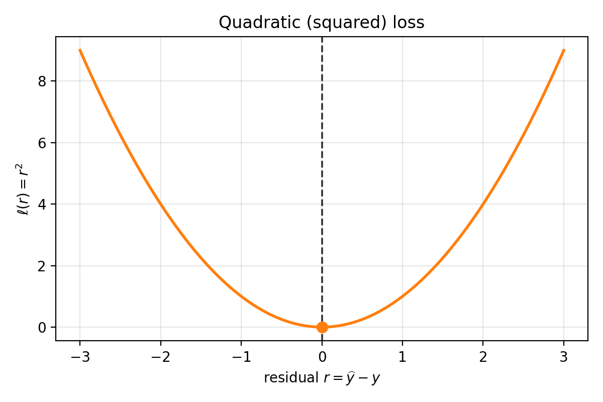

*Quadratic loss as a function of residual $r=\widehat{y}-y$. It is symmetric around $r=0$ and grows quadratically as errors get larger.*

Composing data, model, and loss:

$$
L(w) = \frac{1}{n}\sum_{i=1}^n (w^T x_i - y_i)^2.
$$

This is exactly the pipeline **Data $\rightarrow$ model $\rightarrow$ loss** written as one objective in $w$. Minimize $L(w)$ and you have a predictor.

### 2.2 Sparsity: when you believe $w_\star$ has many zeros

What if you know more about $w_\star$? Suppose you suspect it is **sparse** -- most coordinates are zero.

A natural first thought: constrain $w$ to have at most $s$ nonzero entries. Clean mathematical statement, but two immediate problems:
1. The feasible set is **nonconvex**.
2. We have not built the machinery for gradient-based methods with such constraints.

So we take a different approach.

#### 2.2.1 $\|w\|_0$ regularization (the idea, and why it breaks gradient descent)

Define the $\|w\|_0$ "norm" (not actually a norm):

$$
\|w\|_0 = \sum_{j=1}^d \mathbf{1}(w_j \neq 0).
$$

Then consider

$$
\min_w \; L(w) + \lambda \|w\|_0.
$$

This encodes exactly what we want: penalize the number of nonzeros. Unfortunately, $\|w\|_0$ is combinatorial, what should the derivative of $\mathbf{1}(w_j \neq 0)$ be? PyTorch gradients are useless here.

Convex optimization gives us a way to relax this.

#### 2.2.2 Convex envelope: replace $\|x\|_0$ by something convex

In 1D, $\|\|x\|\|_0$ is $0$ at $x=0$ and $1$ elsewhere. On $[-1,1]$, the function $\lvert x\rvert$ sits below $\|\|x\|\|_0$, and one can show it is the **largest convex function** lying below $\|x\|_0$ on that interval. This largest convex lower bound is called the **convex envelope**.

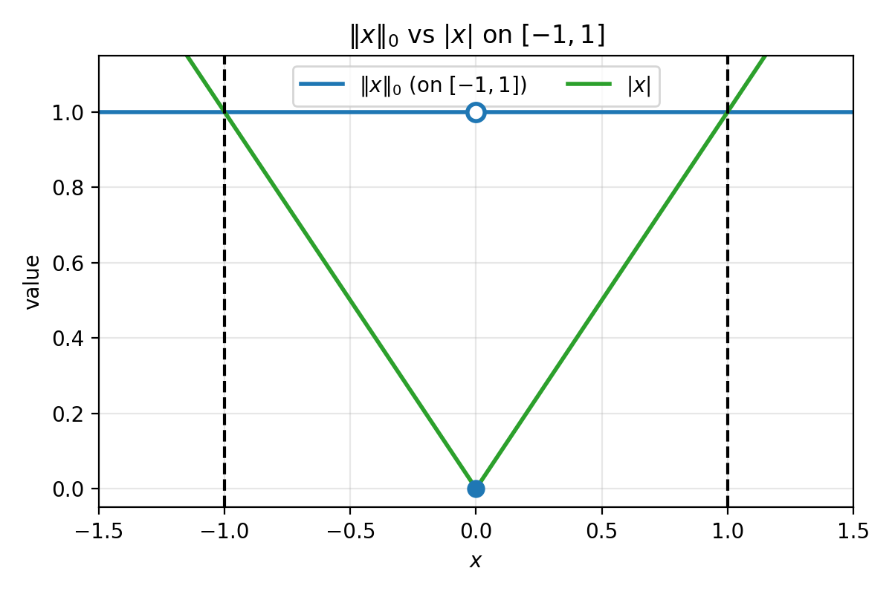

*Figure 2.1: On $[-1,1]$, $\|x\|_0$ is $0$ at the origin and $1$ elsewhere. The function $\lvert x\rvert$ is the largest convex function that stays below $\|x\|_0$ on $[-1,1]$ (the convex envelope on that interval). The dashed lines mark $x=\pm 1$.*

This motivates the $\ell_1$ regularizer.

#### 2.2.3 $\ell_1$ regularization and the Lasso

Define $R\_{\ell\_1}(w) = \|\|w\|\|_1 = \sum\_{j=1}^d \lvert w\_j\rvert$. The regularized objective becomes

$$
\min_w \; \frac{1}{n}\sum_{i=1}^n (w^T x_i - y_i)^2 + \lambda \|w\|_1.
$$

This is the **Lasso**. It is convex, and as $\lambda$ increases the solution becomes sparser. In practice we do not know the right $\lambda$ in advance -- we choose it by tuning against validation performance. That is important, but not the main point of this lecture.

### 2.3 Binary classification: $y$ is a label, not a number

Now let's take a step back. Suppose the target is not a real number but a class label, with two classes $C_1$ and $C_2$.

We still use the same model: $m(x; w) = w^T x$. But the output is a real number, and $C_1$, $C_2$ are categorical. It does not make literal sense to demand $w^T x \approx C_1$, since $C_1$ could be a character string.

One workaround: encode $C_1 \mapsto 1$, $C_2 \mapsto -1$, and fit by squared loss. This can work, but it is not the natural loss for classification.

#### 2.3.1 Logistic loss

Let $y \in \\{-1, 1\\}$ and define a score $a = w^T x$. The logistic loss is:

$$
\ell(a, y) = \log\big(1+\exp(-ya)\big).
$$

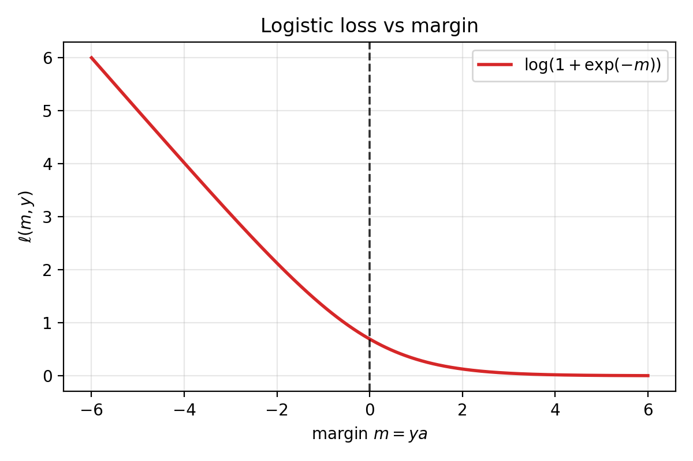

*Logistic loss as a function of margin $m=ya$. Positive margin (correct sign) drives the loss toward $0$; negative margin incurs much larger loss.*

When $y$ and $a$ have the same sign, $ya > 0$, so $\exp(-ya)$ is small and the loss is small. When they disagree, $ya < 0$ and the loss is large. Correct sign means low loss; wrong sign means high loss.

#### 2.3.2 Probabilistic interpretation and MLE

Define the sigmoid $\operatorname{sigmoid}(t) = 1/(1+\exp(-t))$ and a conditional probability

$$
P_w(y\mid x) = \operatorname{sigmoid}(y\, w^T x).
$$

We will take this quantity to be the model's confidence that it assigned the correct label.

Now watch what happens when we take logs. Maximizing the log-likelihood of i.i.d. data means maximizing

$$
\sum_{i=1}^n \log P_w(y_i \mid x_i).
$$

Equivalently, minimizing the negative log-likelihood:

$$
-\frac{1}{n}\sum_{i=1}^n \log P_w(y_i \mid x_i).
$$

Using $\log(\operatorname{sigmoid}(t)) = -\log(1+\exp(-t))$, each term becomes

$$
-\log P_w(y_i\mid x_i) = \log\big(1+\exp(-y_i w^T x_i)\big),
$$

which is exactly the logistic loss. The logistic loss *is* maximum likelihood estimation:

$$
\arg\max_w \sum_{i=1}^n \log P_w(y_i\mid x_i)
\;\Longleftrightarrow\;
\arg\max_w \prod_{i=1}^n P_w(y_i\mid x_i),
$$

since log is monotone and we model the data as i.i.d. under $w$. You choose $w$ to maximize the likelihood of the observed labels under a simple probabilistic model.

#### 2.3.3 Sparse logistic regression

Just like in regression, you can add an $\ell_1$ regularizer:

$$
\min_w \; \frac{1}{n}\sum_{i=1}^n \log\big(1+\exp(-y_i w^T x_i)\big) + \lambda \|w\|_1.
$$

This encourages sparse classifiers.

### 2.4 PyTorch implementation

Everything above is easy to implement directly in PyTorch, without any `torch.nn` machinery. Store data in a matrix $X$ of shape `(batch_size, d)` with one sample per row, define a parameter vector $w$, and compute predictions as $Xw$.

```python
import torch

torch.manual_seed(0)

n, d = 6, 4
X = torch.randn(n, d)

y_reg = torch.randn(n)                        # regression targets
y_cls = 2 * torch.randint(0, 2, (n,)) - 1     # binary labels in {+1, -1}

w = torch.randn(d)
logits = X @ w                                 # shape (n,)

# Squared loss
mse_loss = ((logits - y_reg) ** 2).mean()

# Logistic loss (torch.logaddexp for numerical stability)
logistic_loss = torch.logaddexp(torch.zeros_like(logits), -y_cls * logits).mean()

# L1 regularizer
l1 = w.abs().sum()
lam = 0.1

print("X.shape:", X.shape)                     # (6, 4)
print("logits.shape:", logits.shape)            # (6,)
print("mse_loss:", mse_loss.item())
print("logistic_loss:", logistic_loss.item())
print("mse + lam*l1:", (mse_loss + lam * l1).item())
print("logistic + lam*l1:", (logistic_loss + lam * l1).item())
```

That concludes the linear-model example. Next we move to richer models built by composing linear maps and nonlinearities -- neural networks. In the next lecture, we will start on modern generative models (e.g., transformers), which are built from these same components.

---

## 3. Getting started with models in PyTorch

The model output shape and interpretation usually dictates the loss: scalar real output leads to regression losses (MSE), logits for classes lead to classification losses (logistic, cross-entropy). Generative models like transformers, which we cover next lecture, compose the same primitives we introduce here.

### 3.1 Models are compositions of simple maps

Most neural networks are built from three ingredients:
1. linear maps (affine transformations)
2. simple nonlinearities (applied componentwise)
3. repetition / composition

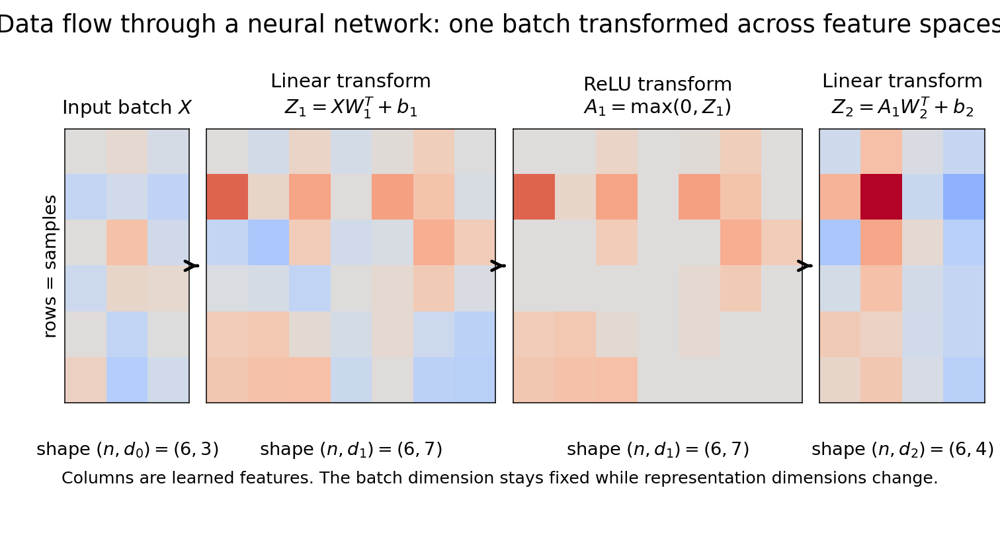

*Figure 3.1: The same input batch flows through successive transformations: linear map $\rightarrow$ nonlinearity $\rightarrow$ linear map. The representation changes dimension across layers (from $(n,d_0)$ to $(n,d_1)$ to $(n,d_2)$), while the batch dimension $n$ is preserved.*

Common nonlinearities you will see often:
- ReLU
- GELU
- SiLU (also called "Swish")

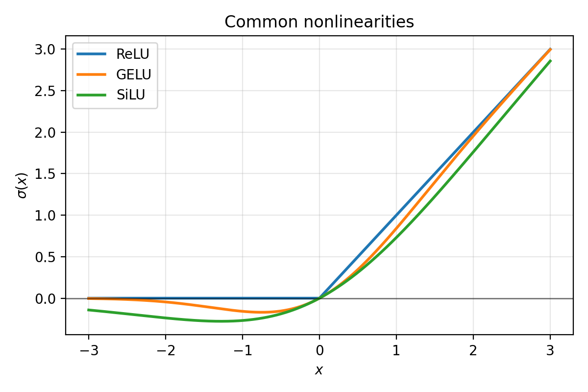

*Figure 3.2: Typical activation functions. ReLU is exactly $0$ for negative inputs. GELU and SiLU are smooth and do not "hard clip" negative values.*

### 3.2 PyTorch's model toolbox (`torch.nn`)

PyTorch provides standard building blocks through `torch.nn`:

- linear maps: `torch.nn.Linear`
- convolutions: `torch.nn.Conv1d`, `torch.nn.Conv2d`, `torch.nn.Conv3d`
- containers: `torch.nn.Module`

We chain layers and nonlinearities together inside a `torch.nn.Module`. Here is a preview:

```python
class TwoLayerNet(torch.nn.Module):
    def __init__(self, d0, d1, d2):
        super().__init__()
        self.layer1 = torch.nn.Linear(d0, d1)
        self.layer2 = torch.nn.Linear(d1, d2)

    def forward(self, X):
        return self.layer2(torch.relu(self.layer1(X)))
```

We will explain `Module` in detail in Section 5. First we need to understand what the individual layers do and how shapes move through them.

### 3.3 Linear models and `torch.nn.Linear`

**Goal:** represent a linear model $m(x; w, b) = w^T x + b$ in PyTorch.

#### 3.3.1 Batch-first convention and `torch.nn.Linear`

In PyTorch, a batch of vectors is stored as a matrix $X$ of shape `(batch_size, input_features)`, with each row being one sample:

$$
X = \begin{bmatrix}
x_1^T \\
x_2^T \\
\vdots \\
x_n^T
\end{bmatrix}.
$$

This convention is not optional. Internalize it early.

A `torch.nn.Linear(d, k)` layer maps `(n, d)` to `(n, k)`:

```python
m = torch.nn.Linear(in_features=d, out_features=k, bias=True)
```

#### 3.3.2 Weight storage and the transpose

PyTorch stores `m.weight` with shape `(k, d)` and `m.bias` with shape `(k,)`. The forward computation is:

$$
Y = X\, W^T + b,
$$

where $X$ is $(n,d)$, $W^T$ is $(d,k)$, and $b$ broadcasts across the batch. The output is $(n,k)$.

Row $j$ of `m.weight` is the weight vector for output coordinate $j$ -- one row per "neuron."

Why the transpose? In math, we think of transforming a column vector $y = Wx + b$. PyTorch stores data as rows and multiplies on the right, so the same map becomes $Y = XW^T + b$. The transpose is bookkeeping caused by "samples are rows." This batch-first convention matches the data-table convention (rows = samples, columns = features), generalizes cleanly (`Linear` acts on the last dimension of any tensor `(*, d) -> (*, k)`), and keeps each sample's feature vector contiguous in row-major memory; this makes it fast to retrieve a sample's features as a contiguous vector.

The output dimension $k$ controls what the layer does:
- $k = 1$: a scalar classifier/regressor. `m.weight` is $(1,d)$ -- one weight vector. Output is $(n,1)$, exactly $w^T x_i + b$ in batch form.
- $k > 1$: $k$ different weight vectors, one per output coordinate. Output is $(n,k)$. For regression, these are $k$ real targets; for classification, they are $k$ logits.

#### 3.3.3 Bias shifts the decision boundary

Without bias, the decision boundary $w^T x = 0$ must pass through the origin. With bias, $w^T x + b = 0$ can shift freely. If your data is not centered at the origin, the no-bias model is unnecessarily restricted.

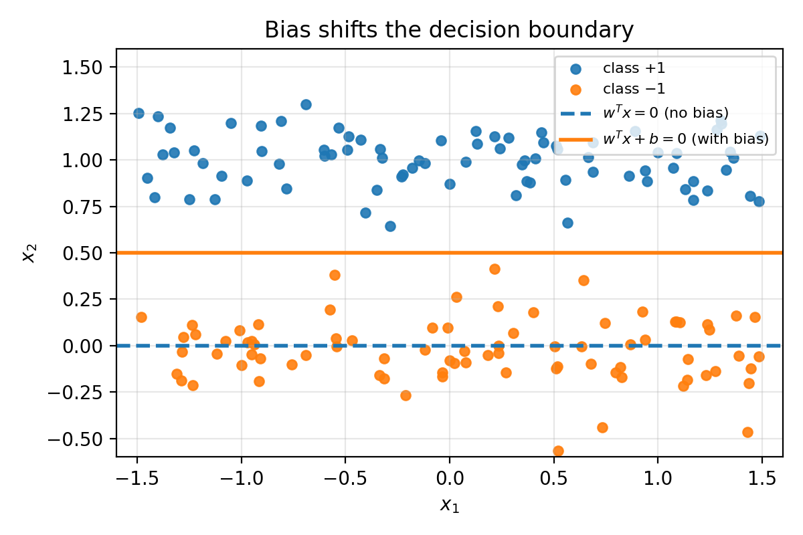

*Figure 3.3: In 2D, $w^T x = 0$ is always a line through the origin. Adding a bias shifts the line.*

### 3.4 Composing linear layers into a neural network

This is the first real step toward deep learning. A single `Linear` layer is one affine map. A neural network composes many such layers with nonlinearities in between:

1. $A_0 = X$ has shape $(n, d_0)$.
2. Pre-activation: $Z_\ell = A_{\ell-1} W_\ell^T + b_\ell$ with shape $(n, d_\ell)$.
3. Activation: $A_\ell = \sigma(Z_\ell)$ with shape $(n, d_\ell)$.

The batch dimension $n$ is always preserved. The feature dimension changes at each layer: $d_0 \to d_1 \to \cdots \to d_L$.

#### 3.4.1 PyTorch code: a 2-layer network as a plain function

```python
import torch

torch.manual_seed(0)

n = 4      # batch size
d0 = 5     # input dimension
d1 = 10    # hidden dimension
d2 = 3     # output dimension

X = torch.randn(n, d0)

layer1 = torch.nn.Linear(d0, d1, bias=True)
layer2 = torch.nn.Linear(d1, d2, bias=True)

def m(X):
    Z1 = layer1(X)       # Z1 = X W1^T + b1
    A1 = torch.relu(Z1)
    Z2 = layer2(A1)       # Z2 = A1 W2^T + b2
    return Z2

Z1 = layer1(X)
A1 = torch.relu(Z1)
Z2 = layer2(A1)

print("X.shape:", X.shape)                # (4, 5)
print("Z1.shape:", Z1.shape)              # (4, 10)
print("A1.shape:", A1.shape)              # (4, 10)
print("Z2.shape:", Z2.shape)              # (4, 3)

print("layer1.weight.shape:", layer1.weight.shape)  # (10, 5) = (d1, d0)
print("layer2.weight.shape:", layer2.weight.shape)  # (3, 10) = (d2, d1)

# Autograd sanity check: compute a dummy loss, call backward
Y = torch.randn(n, d2)
loss = ((Z2 - Y) ** 2).mean()
loss.backward()

print("loss:", loss.item())
print("||grad layer1.weight||:", layer1.weight.grad.norm().item())
print("||grad layer2.weight||:", layer2.weight.grad.norm().item())
```

---

A `torch.nn.Linear` layer is already a linear map, but it treats every input coordinate independently. What if the input has spatial structure -- pixels in an image, samples in a time series? That is what convolution layers are for.

## 4. Convolution layers as linear maps with weight sharing

### 4.1 Convolutions as pattern detectors reused across space

A `Linear` layer assigns one weight per input coordinate. But signals and images have spatial structure: the same local pattern (an edge, a pulse, a corner) can appear in many locations. We want to detect it anywhere without learning separate weights for every position.

The idea: learn a small set of weights -- a **kernel** -- and slide it across the input, taking a dot product at each location. This is **weight sharing**: one small kernel parameterizes a large linear map.

A 1D conv filter is a sliding dot product with a small pattern, producing a "match score" at each location. Large positive response means "this patch looks like the pattern"; negative means "looks like the opposite."

### 4.2 1D illustration: signal + kernel + response

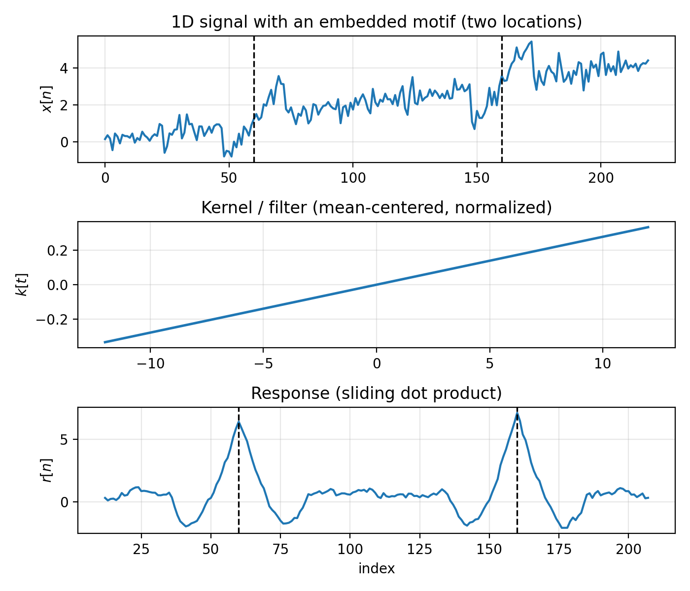

*Figure 4.1: Top: a 1D signal $x[n]$ with a short motif embedded at two locations (dashed vertical lines mark the motif centers). Middle: the kernel $k[t]$ (mean-centered, normalized). Bottom: the response $r[n]$ produced by sliding $k$ over $x$ and taking dot products. Peaks occur near the embedded motifs.*

Key parameters:

- **Kernel (filter):** a short trainable template slid across the signal. In Figure 4.1, the middle plot is this template.
- **Input channels (`C_in`):** number of parallel signal streams at each index. Figure 4.1 is single-channel.
- **Output channels (`C_out`):** number of detectors you learn. Each produces its own response signal.
- **Stride:** how many indices the kernel shifts each step. `stride = 1` checks every position; `stride = 2` skips every other.
- **Padding:** zeros added at boundaries so edge locations are treated more like interior ones.

PyTorch syntax:

```python
conv1d = torch.nn.Conv1d(in_channels=C_in, out_channels=C_out, kernel_size=k, stride=1, padding=0, bias=True)
```

- input shape: `(batch_size, C_in, L)`
- weight shape: `(C_out, C_in, k)`
- output shape: `(batch_size, C_out, L_out)`

For each output channel $j$:

$$
r_j(n) = \sum_{c=1}^{C_\text{in}} \langle \text{local patch from channel } c,\; k_{j,c}\rangle + b_j.
$$

The layer combines information across input channels by summing channel-wise responses. If `C_out = 2`, you get two separate response signals $r_1(n)$ and $r_2(n)$; they are not summed together.

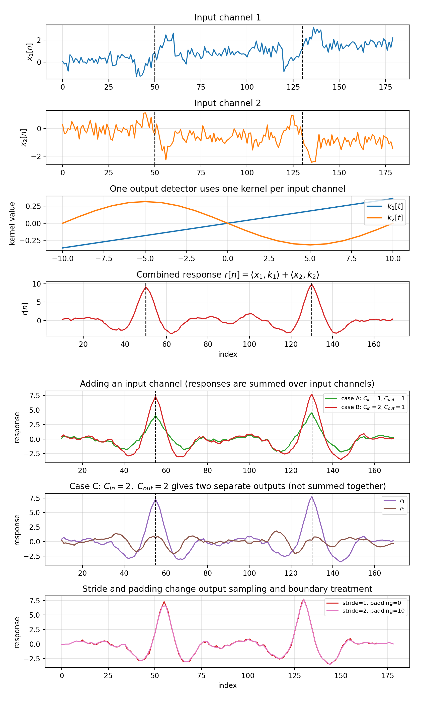

*Figure 4.1b: Two views of the same synthetic setup. Top panel: one detector with `C_in=2, C_out=1`, where the response is the channel-summed signal $r(n)=\langle x_1,k_1\rangle+\langle x_2,k_2\rangle$. Bottom panel (three rows) reuses the same inputs from the top panel: row 1 ("adding an input channel") compares `C_in=1 -> C_out=1` against `C_in=2 -> C_out=1`; row 2 shows `C_in=2 -> C_out=2` (two separate outputs); row 3 changes stride/padding for the same detector to show output resampling and boundary effects.*

### 4.3 Matrix view: convolution as a Toeplitz linear map

If you store 1D signals as row vectors with a batch dimension, $X$ has shape `(batch_size, N)`. Convolution by a fixed kernel is a linear map on the right:

$$
R = X K^T,
$$

where $K$ is a Toeplitz (banded) matrix whose rows are shifted copies of the same kernel weights. The matrix is large, but completely determined by a small kernel $k$ -- that is the weight sharing. The transpose is the same bookkeeping as `torch.nn.Linear`: one output feature per row of $K$, multiply on the right to preserve batch-first layout.

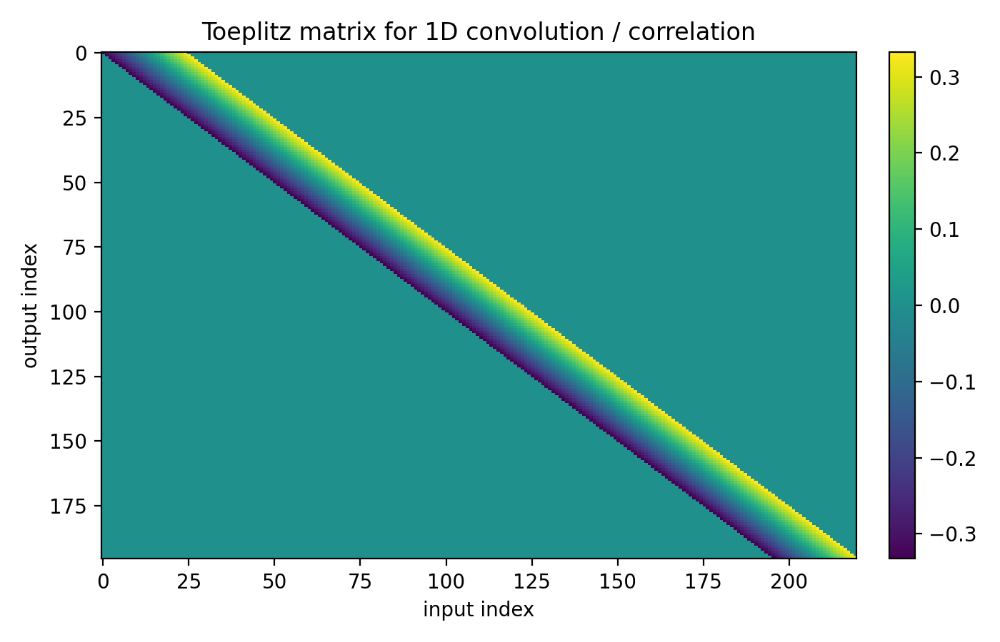

*Figure 4.2: A Toeplitz matrix $K$ encoding a 1D sliding dot product. Each row is a shifted copy of the same kernel weights. The linear map is huge, but parameterized by a short vector.*

Shape summary:
- Single-channel: signal length $N$, kernel length $m$ with $m \ll N$.
- Multi-channel: input has $C_\text{in}$ channels, weights have shape `(C_out, C_in, m)`, output has $C_\text{out}$ channels.

The weights live in "local patch dimensions" (and channel depth), not in the full signal length.

### 4.4 2D illustration: image + kernel + feature map

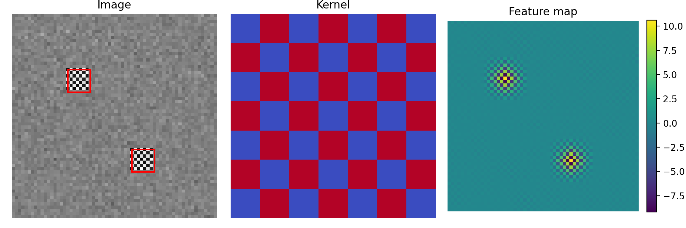

*Figure 4.3: Left: a synthetic image with a small motif repeated at two locations (red boxes). Middle: a small kernel. Right: the feature map produced by sliding the kernel over the image. Bright spots indicate matches.*

PyTorch syntax:

```python
conv2d = torch.nn.Conv2d(in_channels=C_in, out_channels=C_out, kernel_size=(kH, kW), stride=1, padding=0, bias=True)
```

Each output channel is one learned 2D detector. At each spatial location $(u,v)$, detector $j$ reads a local patch from every input channel, computes channel-wise dot products, sums them, and adds a bias:

$$
r_j(u,v) = \sum_{c=1}^{C_\text{in}} \langle \text{local 2D patch from channel } c,\; K_{j,c}\rangle + b_j.
$$

Shape summary (2D):
- input: `(batch_size, C_in, H, W)`
- weights: `(C_out, C_in, kH, kW)`
- output: `(batch_size, C_out, H_out, W_out)`

If you flatten each image into a row vector, 2D convolution is again $R = X K^T$ where $K$ is sparse block-Toeplitz. Same moral: huge implied linear map, small local kernel.

### 4.5 3D convolution

3D convolution extends the idea to three spatial axes:

- **Volumetric data** (MRI, CT scans as voxel grids): the kernel slides over depth $\times$ height $\times$ width to detect 3D features like lesions or anatomical landmarks.
- **Video** (frames stacked along time): the kernel slides over time $\times$ height $\times$ width to detect spatiotemporal patterns like a moving edge or gesture.

```python
conv3d = torch.nn.Conv3d(in_channels=C_in, out_channels=C_out, kernel_size=(kD, kH, kW), stride=1, padding=0, bias=True)
```

Shape summary (3D):
- input: `(batch_size, C_in, D, H, W)`
- weights: `(C_out, C_in, kD, kH, kW)`
- output: `(batch_size, C_out, D_out, H_out, W_out)`

### 4.6 Summary: 1D vs 2D vs 3D

The "dimension" is the space you slide over:

- 1D: one axis (time, sequence index)
- 2D: a grid (height $\times$ width)
- 3D: a volume (depth/time $\times$ height $\times$ width)

In all cases, channels work the same way: each detector sums channel-wise local dot products over $C_\text{in}$ and produces one output channel.

### 4.7 Pooling: turning feature maps into prediction-ready vectors

Convolutional layers return tensors with spatial structure, e.g. `(B, C_out, H, W)` in 2D. Prediction heads need one vector per sample, so we reduce spatial dimensions while keeping channel information.

**Local pooling.** Slide a $k \times k$ window with stride $s$ over each channel map $M \in \mathbb{R}^{H \times W}$. At each window position $(u,v)$, average pooling returns the mean of the $k^2$ values in that window; max pooling returns the maximum:

$$
\mathrm{AvgPool}_{k,s}(M)_{u,v} = \operatorname{mean}(\text{window at } u,v),
\qquad
\mathrm{MaxPool}_{k,s}(M)_{u,v} = \max(\text{window at } u,v).
$$

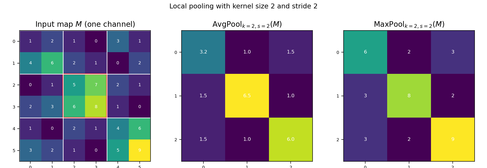

*Figure 4.4a: A single-channel map $M$ with window size `k=2`, stride `s=2`. White grid lines mark pooling windows. Middle: average pooling output. Right: max pooling output.*

**Global pooling (GP).** Reduce each channel map to a single number by averaging or taking the max over all spatial positions. If $P$ has shape $(B, C_\text{out}, H', W')$, then $g = \mathrm{GP}(P)$ has shape $(B, C_\text{out})$ -- one scalar per channel per sample.

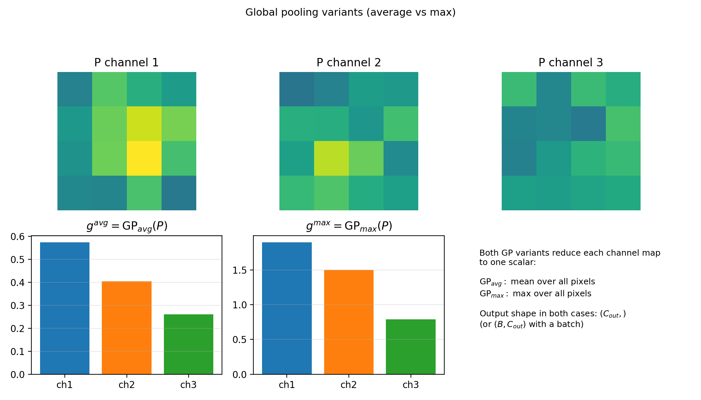

*Figure 4.4b: Global average and global max pooling both return one scalar per channel (same shape). They differ only in reduction rule (mean vs max over the full spatial map).*

The full prediction pipeline:

$$
P = \mathrm{Pool}_{k,s}(A),\qquad
g = \mathrm{GP}(P),\qquad
z = g\, W_{\text{head}}^T + b_{\text{head}}.
$$

Here $z$ has shape $(B, \text{num\_classes})$.

PyTorch syntax:

```python
pool_local = torch.nn.AvgPool2d(kernel_size=2, stride=2)  # or MaxPool2d
P = pool_local(A)                                          # (B, C_out, H', W')

g = torch.nn.functional.adaptive_avg_pool2d(P, output_size=1).flatten(1)  # (B, C_out)
head = torch.nn.Linear(C_out, num_classes)
logits = head(g)                                           # (B, num_classes)
```

(`AvgPool1d/3d`, `MaxPool1d/3d`, and `adaptive_avg_pool1d/3d` are the 1D and 3D analogs.)

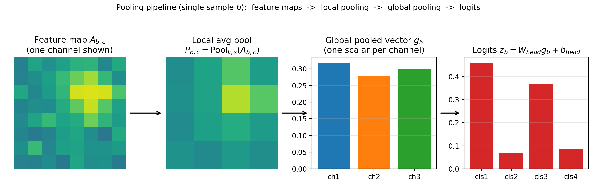

*Figure 4.4c: Pipeline view for one sample. Pool feature maps, collapse spatial dimensions with GP, then apply a linear head.*

### 4.8 A small CNN implementation

Batch-first still holds, but conv layers expect **channels-first** tensors: the channel axis comes right after the batch axis, before any spatial dimensions.

```python
import torch

torch.manual_seed(0)

batch_size, C_in, H, W = 2, 3, 32, 32
X = torch.randn(batch_size, C_in, H, W)

C_hidden, C_out = 8, 16
conv1 = torch.nn.Conv2d(C_in, C_hidden, kernel_size=3, stride=1, padding=1, bias=True)
conv2 = torch.nn.Conv2d(C_hidden, C_out, kernel_size=3, stride=1, padding=1, bias=True)

Z1 = conv1(X)
A1 = torch.relu(Z1)
Z2 = conv2(A1)

print("X.shape:", X.shape)    # (2, 3, 32, 32)
print("Z1.shape:", Z1.shape)  # (2, 8, 32, 32)
print("Z2.shape:", Z2.shape)  # (2, 16, 32, 32)

print("conv1.weight.shape:", conv1.weight.shape)  # (8, 3, 3, 3) = (C_out, C_in, kH, kW)
print("conv2.weight.shape:", conv2.weight.shape)  # (16, 8, 3, 3)

# Bridge to classification: pool away spatial dims, then linear head
pooled = Z2.mean(dim=(2, 3))       # (2, 16)
num_classes = 5
head = torch.nn.Linear(C_out, num_classes)
logits = head(pooled)
print("logits.shape:", logits.shape)  # (2, 5)
```

---

## 5. Introducing `torch.nn.Module` (the standard model container)

A `Module` bundles learnable parameters and forward computation into one object. The recipe:

1. Define a class inheriting from `torch.nn.Module`.
2. In `__init__`: call `super().__init__()`, create layers as attributes.
3. In `forward(self, X)`: write the computation, return the output.
4. Call the object like a function: `model(X)`.

### 5.1 A minimal `Module`

```python
import torch

class TwoLayerNet(torch.nn.Module):
    def __init__(self, d0, d1, d2):
        super().__init__()
        self.layer1 = torch.nn.Linear(d0, d1, bias=True)
        self.layer2 = torch.nn.Linear(d1, d2, bias=True)

    def forward(self, X):
        Z1 = self.layer1(X)
        A1 = torch.relu(Z1)
        Z2 = self.layer2(A1)
        return Z2

torch.manual_seed(0)

n, d0, d1, d2 = 4, 5, 10, 3
X = torch.randn(n, d0)

model = TwoLayerNet(d0, d1, d2)
out = model(X)

print("out.shape:", out.shape)                  # (4, 3)
print("number of parameter tensors:", len(list(model.parameters())))  # 4
for p in model.parameters():
    print("  param shape:", tuple(p.shape))
```

Define layers in `__init__`, wire them in `forward`, call the model like a function. PyTorch uses `forward` to build a computation graph for automatic gradients.

### 5.2 Why `Module` over a plain function

A plain function computes the same output, but `Module` gives you infrastructure for free:

1. **Parameter registration** -- `model.parameters()` collects every learnable tensor automatically.
2. **Saving/loading** -- `model.state_dict()` serializes all parameters; `load_state_dict()` restores them.
3. **Device management** -- `model.to(device)` moves every parameter to CPU/GPU together.
4. **Train/eval modes** -- `model.train()` / `model.eval()` toggle layers like dropout and batchnorm.
5. **Composition and introspection** -- Modules nest inside other Modules; `named_parameters()` and `named_modules()` make debugging systematic.

### 5.3 A convolutional `Module`

```python
import torch

class SmallCNN(torch.nn.Module):
    def __init__(self, C_in, C_hidden, C_out, num_classes):
        super().__init__()
        self.conv1 = torch.nn.Conv2d(C_in, C_hidden, kernel_size=3, padding=1, bias=True)
        self.conv2 = torch.nn.Conv2d(C_hidden, C_out, kernel_size=3, padding=1, bias=True)
        self.head = torch.nn.Linear(C_out, num_classes, bias=True)

    def forward(self, X):
        A1 = torch.relu(self.conv1(X))
        A2 = torch.relu(self.conv2(A1))
        pooled = A2.mean(dim=(2, 3))
        return self.head(pooled)

torch.manual_seed(0)

X = torch.randn(2, 3, 32, 32)
model = SmallCNN(C_in=3, C_hidden=8, C_out=16, num_classes=5)
logits = model(X)

print("logits.shape:", logits.shape)            # (2, 5)
print("num parameter tensors:", len(list(model.parameters())))  # 7
print("state_dict keys:", list(model.state_dict().keys())[:5])
```

---

## 6. Putting it together: the training loop

We introduced squared loss and logistic loss in Section 2. Now that we have `Module` containers, here is how all the pieces fit into a training step.

### 6.1 The training skeleton

Whether you are training a regression model or a classifier, the loop is the same:

1. Start with a mini-batch `(X, y)`.
2. Forward pass: `logits = model(X)`.
3. Evaluate a scalar loss: `loss = loss_fn(logits, y)`.
4. Backward pass: `loss.backward()` -- computes gradients of the loss with respect to every parameter.
5. Update parameters (via an optimizer or manual step).
6. Zero gradients before the next batch.

**Logits** are the raw model outputs before any final sigmoid or softmax. The loss function handles the conversion internally.

### 6.2 Which loss for which task

Section 2 derived the losses from first principles. Here is the summary with PyTorch function names:

| Task | Loss | PyTorch |
|------|------|---------|
| Regression | $\frac{1}{n}\sum(\widehat{y}_i - y_i)^2$ | `F.mse_loss(logits, y)` |
| Binary classification | $\log(1+\exp(-y\cdot a))$ | `F.binary_cross_entropy_with_logits(logits, y)` |
| Multi-class classification | cross-entropy on logits | `F.cross_entropy(logits, y)` (expects integer labels) |

Important: `cross_entropy` takes logits directly. Do not apply softmax first.

### 6.3 Computing a loss and inspecting gradients

After `loss.backward()`, every parameter tensor has a `.grad` field storing its gradient.

```python
import torch
import torch.nn.functional as F

torch.manual_seed(0)

class TwoLayerNet(torch.nn.Module):
    def __init__(self, d0, d1, d2):
        super().__init__()
        self.layer1 = torch.nn.Linear(d0, d1, bias=True)
        self.layer2 = torch.nn.Linear(d1, d2, bias=True)

    def forward(self, X):
        return self.layer2(torch.relu(self.layer1(X)))

batch_size, d0, d1, num_classes = 8, 5, 12, 4
X = torch.randn(batch_size, d0)
y = torch.randint(0, num_classes, (batch_size,))

model = TwoLayerNet(d0, d1, num_classes)
logits = model(X)

loss_value = F.cross_entropy(logits, y)
print("loss:", loss_value.item())

loss_value.backward()

for name, p in model.named_parameters():
    print(f"  {name}: param {tuple(p.shape)}, grad norm {p.grad.norm().item():.4f}")
```

### 6.4 Zeroing gradients

Gradients **accumulate** by default in PyTorch -- calling `backward()` twice without resetting adds to the existing `.grad`. The fix: zero gradients once per batch, either with `model.zero_grad()` or (more commonly) `optimizer.zero_grad()`.

---

## 7. Conclusion

We now have the full formulation toolkit: data and models compose into a loss, regularizers encode prior knowledge, and `backward()` produces the gradients you need for training. Linear and convolutional layers are the two fundamental building blocks; `torch.nn.Module` is how you package them. Next lecture: modern generative models (e.g., transformers) built from these same pieces.

