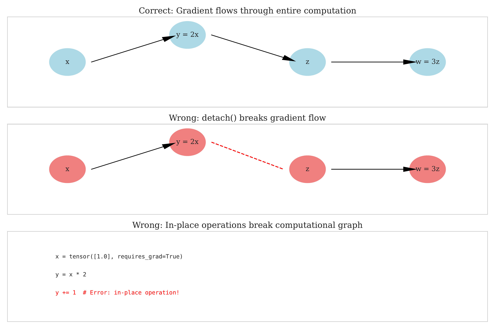
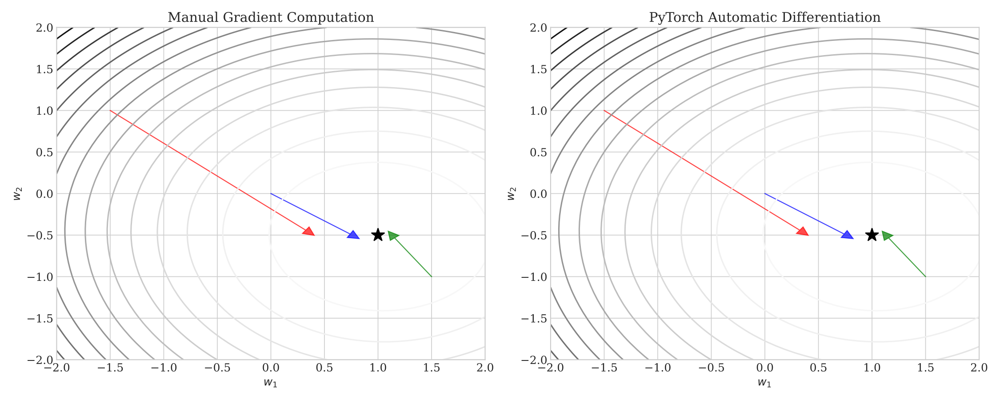
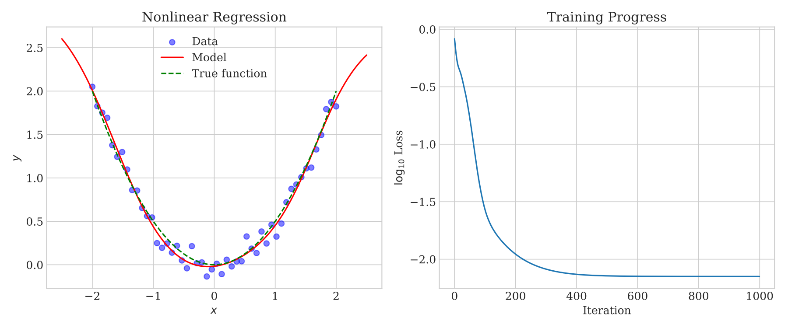
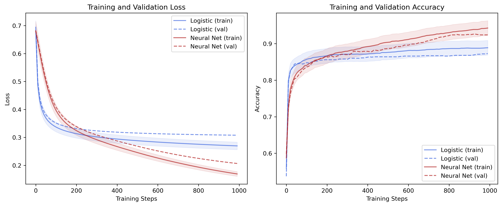

# Beyond Least Squares: Computing Gradients in PyTorch

## Notebooks and Slides
- [Lecture slides](slides.pdf)
- [Colab notebook](https://colab.research.google.com/github/damek/STAT-4830/blob/main/section/4/notebook.ipynb)

## Table of contents
1. [Introduction](#introduction)
2. [Computing Gradients of Loss Functions](#computing-gradients-of-loss-functions)
3. [Applying Gradient Descent](#applying-gradient-descent)
4. [Summary](#summary)

## Introduction

In our previous lecture, we explored gradient descent for minimizing the least squares objective. We saw how following the negative gradient leads us to the optimal solution, even for large-scale problems where direct methods fail. But least squares is just one example of a loss function. Modern machine learning employs a vast array of loss functions, each designed for specific tasks: cross-entropy for classification, Huber loss for robust regression, contrastive loss for similarity learning.

The power of PyTorch lies in its ability to compute gradients for any differentiable function constructed from its operations. This lecture explores how to harness this capability, starting with simple one-dimensional examples and building up to complex neural network losses. We'll see how PyTorch's automatic differentiation system tracks computations, computes gradients efficiently, and helps us avoid common pitfalls.

## Computing Gradients of Loss Functions

Let's start with the simplest possible case: computing the gradient of a one-dimensional function. Consider the polynomial:

$$ f(x) = x^3 - 3x $$

This function has an analytical gradient:

$$ \frac{d}{dx}f(x) = 3x^2 - 3 $$

While we can compute this derivative by hand, PyTorch offers a powerful alternative - automatic differentiation. Here's how it works:

```python
import torch

# Create input tensor with gradient tracking
x = torch.tensor([1.0], requires_grad=True)

# Define and compute function
def f(x):
    return x**3 - 3*x

y = f(x)

# Compute gradient
y.backward()

print(f"At x = {x.item():.1f}")
print(f"f(x) = {y.item():.1f}")
print(f"f'(x) = {x.grad.item():.1f}")  # Should be 3(1)² - 3 = 0
```

This simple example reveals the key components of automatic differentiation:

1. **Gradient Tracking**: We mark tensors that need gradients with `requires_grad=True`
2. **Forward Pass**: PyTorch records operations as we compute the function
3. **Backward Pass**: The `backward()` call computes gradients through the recorded operations
4. **Gradient Access**: The computed gradient is stored in the `.grad` attribute

Let's visualize how the function and its gradient behave:


The top plot shows our function $f(x) = x^3 - 3x$, while the bottom plot compares PyTorch's computed gradient (red solid line) with the analytical gradient $3x^2 - 3$ (green dashed line). They match perfectly, confirming that PyTorch computes exact gradients.

### The Computational Graph

To understand how PyTorch computes these gradients, we need to examine the computational graph it builds during the forward pass:


Each node in this graph represents an operation:
1. Input node stores our value $x$
2. Power node computes $x^3$
3. Multiply node computes $-3x$
4. Add node combines terms to form $x^3 - 3x$
5. Gradient node computes derivatives during backward pass

During the forward pass, PyTorch:
1. Records each operation in sequence
2. Stores intermediate values
3. Maintains references between operations

During the backward pass, it:
1. Starts at the output node
2. Applies the chain rule through the graph
3. Accumulates gradients at each node
4. Stores the final result in `x.grad`

This graph structure explains a crucial requirement: we can only compute gradients through operations that PyTorch implements. The framework needs to know both:
1. How to compute the operation (forward pass)
2. How to compute its derivative (backward pass)

Common operations like addition (`+`), multiplication (`*`), and power (`**`) are all implemented by PyTorch. Even when we use Python's standard operators, we're actually calling PyTorch's overloaded versions that know how to handle both computation and differentiation.

### Common Pitfalls in Automatic Differentiation

While PyTorch's automatic differentiation is powerful, several common mistakes can break gradient computation or lead to unexpected behavior. Let's examine these pitfalls and their solutions:



#### 1. Breaking the Computational Graph

The most common mistake occurs when accidentally breaking the chain of computation that PyTorch uses to track gradients:

```python
# Wrong: breaks computational graph
x = torch.tensor([1.0], requires_grad=True)
y = x * 2
z = y.detach()  # Breaks the graph!
w = z * 3
w.backward()  # x.grad will be None

# Right: maintain computational graph
x = torch.tensor([1.0], requires_grad=True)
y = x * 2
w = y * 3
w.backward()  # x.grad will be 6
```

The `detach()` method creates a new tensor that shares the same data but detaches it from the computation history. This breaks the chain of operations needed for gradient computation. The top diagram shows correct gradient flow, while the middle diagram shows how `detach()` breaks this flow.

#### 2. In-Place Operations

In-place operations (modifying a tensor directly) can break gradient computation, as shown in the bottom diagram:

```python
# Wrong: in-place operation
x = torch.tensor([1.0], requires_grad=True)
y = x * 2
y += 1  # In-place operation breaks graph
y.backward()  # Error!

# Right: create new tensor
x = torch.tensor([1.0], requires_grad=True)
y = x * 2
y = y + 1  # Creates new tensor
y.backward()  # Works correctly
```

In-place operations modify the tensor's memory directly, which can invalidate the computational graph. Instead, create a new tensor to store the result.

#### 3. Gradient Accumulation

Gradients accumulate by default - if you don't clear them, multiple backward passes add up:

```python
x = torch.tensor([1.0], requires_grad=True)
for _ in range(3):
    y = x * 2
    y.backward()  # Gradients accumulate!
print(x.grad)  # Prints 6 (2 + 2 + 2)

# Solution: Clear gradients between computations
x = torch.tensor([1.0], requires_grad=True)
for _ in range(3):
    x.grad = None  # Clear gradients
    y = x * 2
    y.backward()
print(x.grad)  # Prints 2
```

This behavior is actually useful for accumulating gradients over multiple batches, but you need to be aware of it to avoid unintended accumulation.

#### 4. Scalar vs Vector Backward

PyTorch expects scalar outputs for `backward()` by default. For vector outputs, you need gradients of the same shape:

```python
# Wrong: vector output without gradient
x = torch.tensor([[1.0, 2.0]], requires_grad=True)
y = x * 2
y.backward()  # Error: grad can be implicitly created only for scalar outputs

# Right: provide gradient for vector output
x = torch.tensor([[1.0, 2.0]], requires_grad=True)
y = x * 2
y.backward(torch.ones_like(y))  # Works!
```

This requirement ensures that gradient computation is well-defined - for vector outputs, we need to specify how to weight each component's contribution to the gradient.

#### 5. Memory Management

Keeping computational graphs in memory can consume significant RAM. Use `torch.no_grad()` when you don't need gradients:

```python
# Wasteful: tracks gradients during evaluation
def evaluate(model, data):
    return model(data)

# Efficient: disables gradient tracking
def evaluate(model, data):
    with torch.no_grad():
        return model(data)
```

The `no_grad()` context manager temporarily disables gradient computation, reducing memory usage and speeding up computation when gradients aren't needed (like during model evaluation).

These pitfalls highlight important aspects of PyTorch's automatic differentiation:
1. The computational graph must remain connected
2. Operations must preserve gradient information
3. Memory management requires explicit consideration
4. Gradient computation needs well-defined scalar objectives

Understanding these issues helps write correct and efficient code for gradient-based optimization.

### Beyond One Dimension: Revisiting Least Squares

Our one-dimensional example demonstrated PyTorch's automatic differentiation on a simple function. Now let's return to the least squares problem we solved in the previous lecture, but this time using PyTorch's automatic differentiation. Given a data matrix $X \in \mathbb{R}^{n \times p}$ and observations $y \in \mathbb{R}^n$, we minimize:

$$ f(w) = \frac{1}{2}\|Xw - y\|_2^2 = \frac{1}{2}\sum_{i=1}^n (x_i^\top w - y_i)^2 $$

In the previous lecture, we derived the gradient manually:

$$ \nabla f(w) = X^\top(Xw - y) $$

PyTorch can compute this gradient automatically:

```python
# Convert data to PyTorch tensors
X = torch.tensor(X_data, dtype=torch.float32)
y = torch.tensor(y_data, dtype=torch.float32)
w = torch.zeros(X.shape[1], requires_grad=True)  # Initialize weights

# Compute loss
predictions = X @ w
loss = 0.5 * torch.mean((predictions - y)**2)

# Compute gradient
loss.backward()
print(f"PyTorch gradient: {w.grad}")
```

To verify that PyTorch computes the correct gradient, we can compare it with our manual calculation:



The figure shows the contours of the least squares loss function for a simple 2D problem. At three different points (marked in red, blue, and green), we compute gradients using both manual calculation (left) and PyTorch's automatic differentiation (right). The arrows show the negative gradient direction at each point - the direction of steepest descent.

Several insights emerge from this comparison:

1. **Identical Results**: The gradient arrows match perfectly between manual and automatic computation, confirming that PyTorch computes exact gradients.

2. **Gradient Behavior**: The gradients point toward the optimum (marked with a black star), with longer arrows indicating steeper slopes.

3. **Loss Surface Structure**: The elliptical contours reveal the quadratic nature of the least squares objective, explaining the linear convergence we observed in gradient descent.

This example illustrates a key advantage of automatic differentiation: we can focus on defining our objective function naturally, letting PyTorch handle the gradient computation. The code becomes simpler and less error-prone, especially as we move to more complex loss functions.

### More Complex Loss Functions: Nonlinear Regression

While least squares provides a clean introduction to gradient computation, modern machine learning often involves more complex loss functions. Let's explore this by moving from linear to nonlinear regression. Instead of predicting outputs as a linear combination of inputs, we'll allow nonlinear transformations:

$$ f(x; w) = w_2^\top \tanh(W_1x + b_1) + b_2 $$

where $W_1, w_2$ are weight matrices and $b_1, b_2$ are bias terms. This model, despite its simple form, can approximate a wide range of nonlinear functions. The loss remains familiar:

$$ L(w) = \frac{1}{n}\sum_{i=1}^n (f(x_i; w) - y_i)^2 $$

but computing its gradient manually would be tedious. Each parameter's gradient requires careful application of the chain rule through the nonlinear transformation. PyTorch handles this automatically:

```python
class NonlinearModel(torch.nn.Module):
    def __init__(self):
        super().__init__()
        self.linear1 = torch.nn.Linear(1, 10)  # First layer: 1 → 10
        self.linear2 = torch.nn.Linear(10, 1)  # Second layer: 10 → 1
        
    def forward(self, x):
        h = torch.tanh(self.linear1(x))  # Nonlinear activation
        return self.linear2(h)           # Output layer

# Create model and compute gradients
model = NonlinearModel()
y_pred = model(X)
loss = torch.mean((y_pred - y)**2)
loss.backward()  # Computes gradients for ALL parameters
```

Let's see this model in action on a simple nonlinear regression task:



The figure reveals several key insights:

1. **Model Flexibility**: The neural network (red line) successfully learns the quadratic relationship (green dashed line) from noisy data (blue points).

2. **Training Dynamics**: The loss curve shows rapid initial improvement followed by fine-tuning, a common pattern in gradient-based optimization.

3. **Automatic Differentiation**: PyTorch computes gradients through the entire computation graph, including the nonlinear tanh activation, enabling end-to-end training.

This example demonstrates how PyTorch's automatic differentiation handles complex models with multiple layers and nonlinear transformations. The same principles extend to even more sophisticated architectures, like deep neural networks for image classification or natural language processing.

### From Logistic Regression to Neural Networks

In our first lecture, we introduced logistic regression for spam classification. The model made predictions using:

$$ p(y=1|x) = \sigma(w^\top x) $$

where $\sigma(z) = \frac{1}{1+e^{-z}}$ is the sigmoid function. We minimized cross-entropy loss:

$$ L(w) = -\frac{1}{n}\sum_{i=1}^n [y_i \log p(y_i|x_i) + (1-y_i)\log(1-p(y_i|x_i))] $$

Neural networks extend this idea by allowing multiple layers of nonlinear transformations:

$$ p(y=1|x) = \sigma(w_2^\top \tanh(W_1x + b_1) + b_2) $$

The added nonlinearity enables the model to learn more complex decision boundaries. Let's see this in action on a synthetic classification problem:

```python
class NeuralClassifier(torch.nn.Module):
    def __init__(self, hidden_size=10):
        super().__init__()
        self.linear1 = torch.nn.Linear(2, hidden_size)
        self.linear2 = torch.nn.Linear(hidden_size, 1)
        
    def forward(self, x):
        h = torch.tanh(self.linear1(x))        # Nonlinear hidden layer
        return torch.sigmoid(self.linear2(h))   # Output probability

# Training with cross-entropy loss
y_pred = model(X)
loss = torch.nn.functional.binary_cross_entropy(y_pred, y)
loss.backward()  # Computes gradients through both layers
```


The figure demonstrates the power of neural networks:

1. **Complex Decision Boundary**: The model learns a nonlinear decision boundary (background colors) that separates the spiral-shaped classes (blue and red points). This would be impossible with logistic regression's linear boundary.

2. **Training Dynamics**: The right plot shows:
   - Loss decreasing steadily as the model learns
   - Accuracy improving as the decision boundary refines
   - Convergence to nearly perfect classification

3. **End-to-End Learning**: PyTorch's automatic differentiation computes gradients through both layers, handling the composition of:
   - Linear transformation ($W_1x + b_1$)
   - Nonlinear activation (tanh)
   - Another linear transformation ($w_2^\top h + b_2$)
   - Final sigmoid activation

This example illustrates how PyTorch makes it easy to experiment with different architectures. We can add layers, change activation functions, or modify the loss function - PyTorch handles all the gradient computations automatically.

## Applying Gradient Descent

With PyTorch's automatic differentiation handling gradient computation, we can implement gradient descent directly. The key is to remember that we're minimizing a loss function - finding parameters that make our predictions as accurate as possible. For any set of parameters $w$, we:

1. Compute the loss $L(w)$
2. Calculate its gradient $\nabla L(w)$
3. Take a step in the negative gradient direction: $w_{k+1} = w_k - \alpha \nabla L(w_k)$

Let's implement this pattern for linear regression, comparing manual gradient computation with PyTorch's automatic differentiation:

```python
# Generate synthetic data
X = torch.randn(100, 2)
w_true = torch.tensor([1.0, -0.5])
y = X @ w_true + 0.1 * torch.randn(100)

# Initialize parameters
w = torch.zeros(2, requires_grad=True)
alpha = 0.1  # Learning rate

# Manual gradient descent
def manual_gradient(X, y, w):
    return X.T @ (X @ w - y) / len(y)

w_manual = torch.zeros(2)
losses_manual = []

for step in range(100):
    # Compute gradient manually
    grad = manual_gradient(X, y, w_manual)
    
    # Update parameters
    w_manual = w_manual - alpha * grad
    
    # Track loss
    pred = X @ w_manual
    loss = 0.5 * torch.mean((pred - y)**2)
    losses_manual.append(loss.item())

# PyTorch gradient descent
w_torch = torch.zeros(2, requires_grad=True)
losses_torch = []

for step in range(100):
    # Forward pass
    pred = X @ w_torch
    loss = 0.5 * torch.mean((pred - y)**2)
    
    # Backward pass
    loss.backward()
    
    # Manual parameter update
    with torch.no_grad():
        w_torch -= alpha * w_torch.grad
        w_torch.grad.zero_()
    
    losses_torch.append(loss.item())

print("Manual weights:", w_manual)
print("PyTorch weights:", w_torch.detach())
print("True weights:", w_true)
```

The results reveal perfect agreement between manual and automatic gradient computation:


Both methods:
1. Converge to the same optimal weights
2. Follow identical trajectories
3. Achieve the same final loss value

This agreement confirms that PyTorch computes exact gradients, matching our manual calculations. The difference lies in convenience - PyTorch handles the gradient computation automatically, while we had to derive and implement the gradient formula manually.

For a more complex example, let's implement logistic regression on the MNIST dataset. We'll explore this in detail in the following section.

### MNIST Classification Example

The MNIST digit classification task compares logistic regression with neural networks. We focus on binary classification to determine whether a digit is odd or even. This demonstrates how PyTorch's automatic differentiation handles models of different complexity.

The implementation uses `torchvision.datasets.MNIST` for data loading and `transforms.Normalize` for preprocessing. Input images are normalized with MNIST's statistics (mean=0.1307, std=0.3081):

```python
transform = transforms.Compose([
    transforms.ToTensor(),
    transforms.Normalize((0.1307,), (0.3081,))
])
train_dataset = datasets.MNIST('./data', train=True, transform=transform)
```


*Examples of correctly classified MNIST digits. The models successfully identify the parity (odd/even) of clear, well-formed digits.*

The objective uses binary cross-entropy loss to measure the discrepancy between predicted probabilities and true labels:

$$ L(w) = -\frac{1}{n}\sum_{i=1}^n [y_i \log p(y_i|x_i) + (1-y_i)\log(1-p(y_i|x_i))] $$

where $y_i$ indicates whether digit $i$ is odd (1) or even (0), and $p(y_i|x_i)$ is the model's predicted probability.

We implement two models. First, logistic regression provides a baseline using a single linear layer:

```python
class Logistic(torch.nn.Module):
    def __init__(self, input_dim):
        super().__init__()
        self.linear = torch.nn.Linear(input_dim, 1, bias=False)
        
    def forward(self, x):
        return torch.sigmoid(self.linear(x))
```

The neural network extends this with a hidden layer and ReLU activation to learn nonlinear decision boundaries:

```python
class SimpleNN(torch.nn.Module):
    def __init__(self):
        super().__init__()
        self.fc1 = torch.nn.Linear(784, 32)
        self.fc2 = torch.nn.Linear(32, 1)
        
    def forward(self, x):
        h = torch.relu(self.fc1(x))
        return torch.sigmoid(self.fc2(h))
```

Training uses PyTorch's automatic differentiation to compute gradients of the binary cross-entropy loss:

```python
criterion = torch.nn.BCELoss()

def train_model(model, X_train, y_train, X_val, y_val, alpha=0.01, n_steps=1000):
    for step in range(n_steps):
        y_pred = model(X_train)
        loss = criterion(y_pred.squeeze(), y_train)
        
        loss.backward()
        
        with torch.no_grad():
            for param in model.parameters():
                param -= alpha * param.grad
                param.grad.zero_()
```

The neural network achieves 92.40% test accuracy versus logistic regression's 87.30%. This gap results from the neural network's ability to learn nonlinear decision boundaries.


*Training curves for logistic regression (blue) and neural network (red). The neural network learns faster and reaches higher accuracy.*


*Examples misclassified by both models. These cases show digits with unclear shapes and unusual writing styles.*

Analysis of misclassified examples reveals patterns in model errors. The neural network performs better by learning features through its hidden layer to distinguish odd from even digits.

## Summary

This lecture explored how PyTorch's automatic differentiation system enables gradient computation for complex loss functions. Key takeaways include:

1. **Automatic Differentiation Basics**
   - PyTorch builds computational graphs during forward computation
   - Gradients flow backward through these graphs
   - The system computes exact gradients, matching manual calculations

2. **Common Pitfalls and Solutions**
   - Breaking computational graphs (solution: maintain tensor connections)
   - In-place operations (solution: create new tensors)
   - Gradient accumulation (solution: clear gradients between steps)
   - Memory management (solution: use `torch.no_grad()` when appropriate)

3. **From Simple to Complex Models**
   - Started with 1D polynomial example
   - Revisited least squares with automatic gradients
   - Extended to nonlinear regression and neural networks
   - Same principles apply across model complexity

4. **Practical Gradient Descent**
   - Four-step pattern: zero gradients → forward → backward → update
   - Modular design: swap models, losses, and optimizers
   - Important considerations: batching, learning rates, monitoring
   - Validation prevents overfitting

These tools form the foundation for modern deep learning. While we focused on relatively simple examples, the same principles scale to state-of-the-art models with millions of parameters. PyTorch's automatic differentiation makes this scaling possible by handling the complex task of gradient computation, letting practitioners focus on model design and optimization strategy.