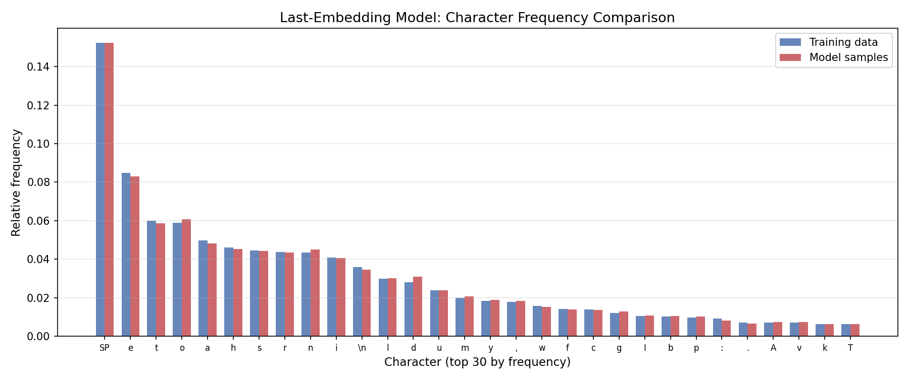
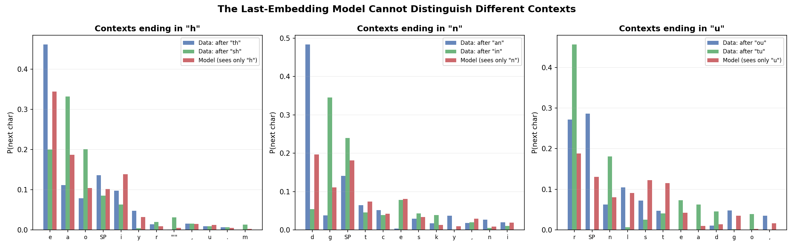
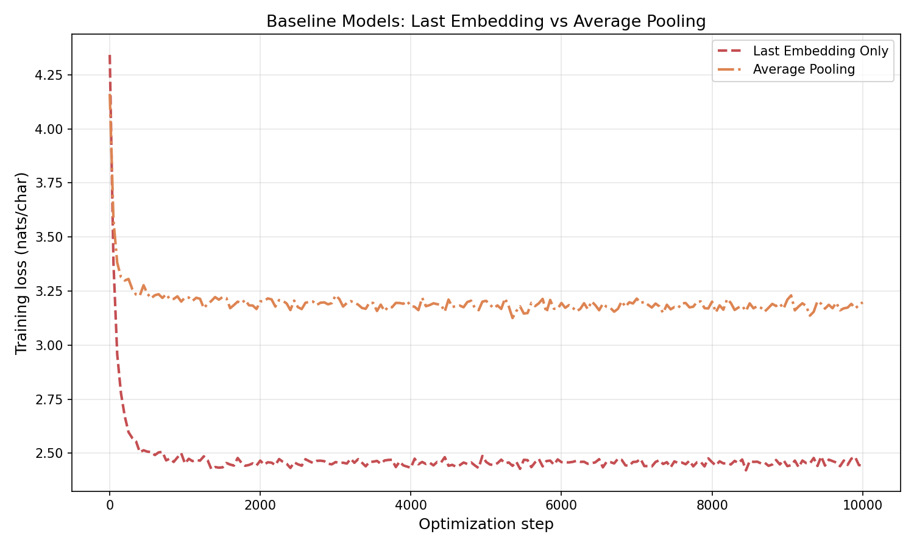
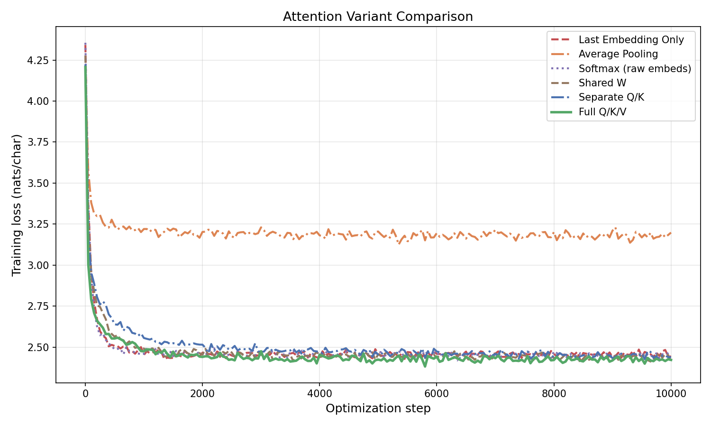
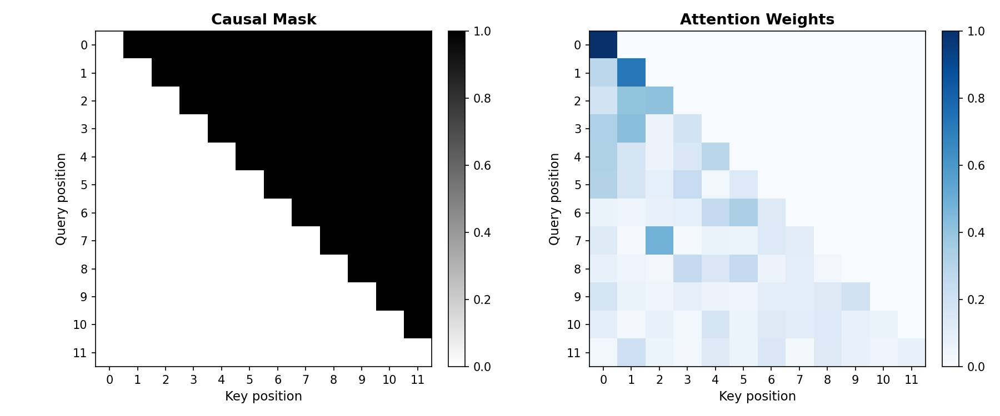
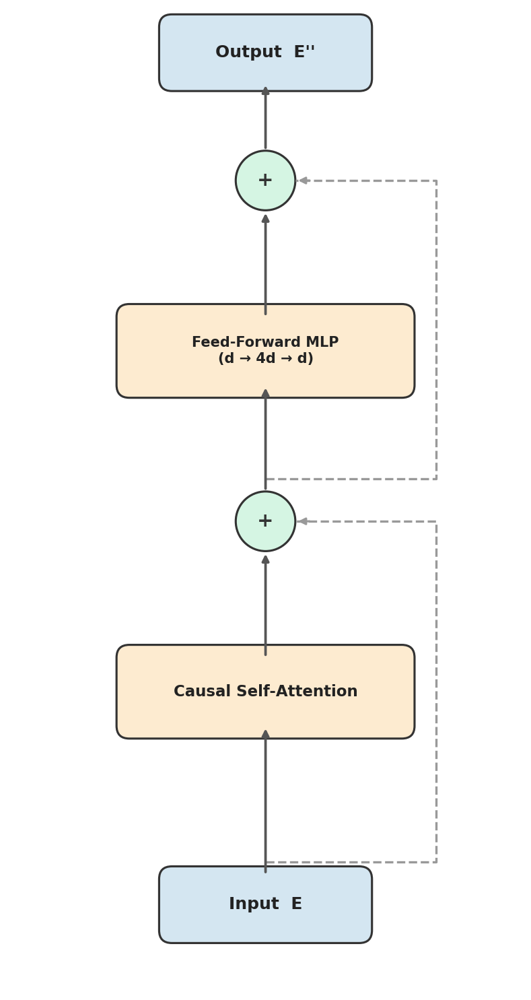
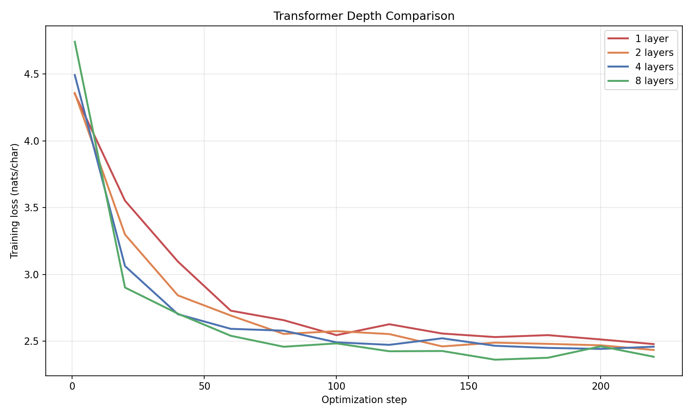
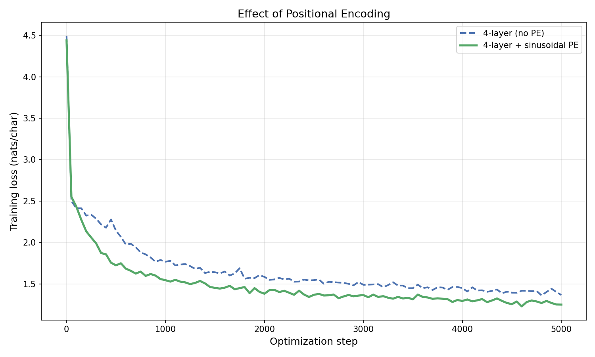
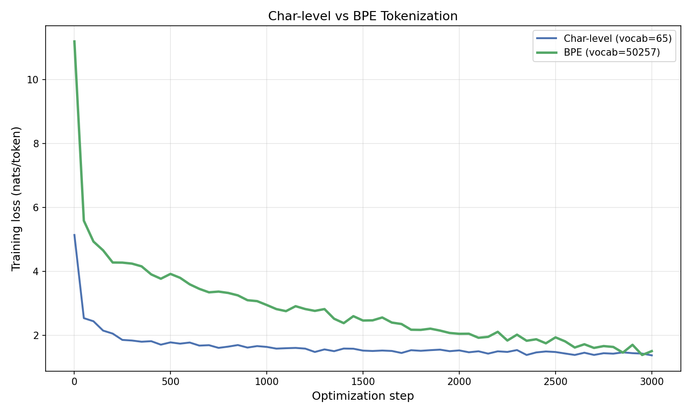

# 5. A step-by-step introduction to transformer models

## Table of contents
1. [Sequence data and next-token prediction](#1-sequence-data-and-next-token-prediction)
2. [Vocabularies, tokenization, and embeddings](#2-vocabularies-tokenization-and-embeddings)
3. [Next token prediction: the task and the loss](#3-next-token-prediction-the-task-and-the-loss)
4. [Building attention step by step](#4-building-attention-step-by-step)
5. [The transformer block](#5-the-transformer-block)
6. [Practical additions](#6-practical-additions)
7. [Byte pair encoding](#7-byte-pair-encoding)
8. [Conclusion](#8-conclusion)
9. [Appendix: figure generation scripts](#appendix-figure-generation-scripts)

## 1. Sequence data and next-token prediction

Last lecture we had data as pairs $(x_i, y_i)$ and learned a model $m(x; w)$ to predict $y$ from $x$. We built linear models (linear regression, logistic regression) and nonlinear models (multi-layer perceptrons, convolutional neural networks). In every case the task was supervised: given an input, produce a target.

Today the setup changes. We have **sequence data** $(x_1, \ldots, x_T)$ and no label $y$. Examples:

- Raw characters in a sentence.
- Words in English text.
- DNA sequences.

The goal: learn to **generate** and **continue** sequences that resemble those in the training data, and that extrapolate beyond them in a consistent way. Given the rise of tools like ChatGPT and Claude, you already know why this matters.

**Our running example.** Throughout this lecture we train on a Shakespeare dataset ([source](https://github.com/karpathy/char-rnn/tree/master/data/tinyshakespeare){:target="_blank"}) consisting of approximately 1.1 million characters. Here is a representative excerpt:

```
First Citizen:
Before we proceed any further, hear me speak.

All:
Speak, speak.

First Citizen:
You are all resolved rather to die than to famish?

All:
Resolved. resolved.

First Citizen:
First, you know Caius Marcius is chief enemy to the people.
```

The vocabulary consists of 65 characters: uppercase and lowercase letters, digits, punctuation, spaces, and newlines.

## 2. Vocabularies, tokenization, and embeddings

### 2.1 Choosing a vocabulary

Before we can model sequences, we need to encode them on a computer. This requires choosing a **vocabulary** $V$: a finite set of tokens that the model operates over.

Several choices:

- **Characters and digits.** Small vocabulary ($\vert V\vert \approx 100$). Every sentence becomes a long sequence of characters. Simple, but the sequences are long and relationships between distant characters can be hard to learn.
- **Words.** Large vocabulary ($\vert V\vert$ could be $100{,}000+$). Sequences are shorter, but the embedding table grows with $\vert V\vert$.

Smaller vocabularies produce longer sequences that may be harder to optimize, though the optimization problem itself has fewer parameters per token. Larger vocabularies give shorter sequences but inflate the model's embedding table and the final prediction layer. In practice, modern language models use a middle ground called **byte pair encoding (BPE)**, which we discuss in Section 7. BPE builds a vocabulary of subword units by iteratively merging frequent adjacent pairs. Typical BPE vocabularies have $50{,}000$ to $150{,}000$ tokens. For now we use the character-level vocabulary ($\vert V\vert = 65$) to keep things simple.

We also use two **special tokens**:

- `<bos>` (**beginning of sequence**): prepended to every sequence. It gives the model a fixed starting point for generation.
- `<eos>` (**end of sequence**): signals when generation should stop.

### 2.2 From tokens to vectors: embeddings

Once we have a vocabulary, we need to convert each token into a vector we can do linear algebra on.

For each token $v \in V$, we assign a learnable **embedding vector** $e_v \in \mathbb{R}^d$. There are $\vert V\vert$ such vectors, one per token, collected into an **embedding matrix** $E_{\text{vocab}} \in \mathbb{R}^{\vert V\vert \times d}$. These vectors are **learned parameters**: we initialize them as random Gaussian vectors and let gradient descent shape them during training.

Typical embedding dimensions:

- Small models: $d = 768$
- Large models: $d$ up to $16{,}128$

Both numbers are divisible by $128$. GPU matrix multiplication is fastest when dimensions align to certain powers of $2$. You will see this divisibility pattern throughout deep learning architectures.

Given a sequence $X = (x_1, \ldots, x_T)$ where each $x_t \in V$, the corresponding **embedding matrix** is

$$
E = \begin{bmatrix} e_{x_1}^T \\ e_{x_2}^T \\ \vdots \\ e_{x_T}^T \end{bmatrix} \in \mathbb{R}^{T \times d}.
$$

Row $t$ is the embedding of the $t$-th token. The first axis is sequence length, consistent with the batch-first convention from last lecture.

In PyTorch, `torch.nn.Embedding(vocab_size, d)` creates a lookup table that stores $\vert V\vert$ vectors of dimension $d$, initialized from $\mathcal{N}(0, 1)$. Given an integer tensor of token indices, it returns the corresponding rows of this table:

```python
import torch

vocab_size = 65
d = 768

embedding = torch.nn.Embedding(vocab_size, d)

X = torch.tensor([18, 47, 56, 57, 1, 15, 47, 58, 1, 0])
E = embedding(X)

print("X.shape:", X.shape)   # torch.Size([10])
print("E.shape:", E.shape)   # torch.Size([10, 768])
```

## 3. Next token prediction: the task and the loss

### 3.1 The prediction task

We want to sample sequences that look like those in our training data, and we want to continue partial sequences. A minimal way to achieve both goals: learn to **predict the next token** in a sequence.

Given a sequence $X = (x_1, \ldots, x_T)$ (with `<bos>` always prepended by convention), we want a probability distribution over what comes next:

$$
p(\text{next token} \mid x_1, \ldots, x_T).
$$

The `<bos>` token is always present at position $0$, so $p(x_1)$ really means $p(x_1 \mid \langle\text{bos}\rangle)$. We leave this conditioning implicit in all equations that follow.

Once we have this distribution, generation works as follows:

1. Sample $x_{T+1} \sim p(\cdot \mid x_1, \ldots, x_T)$.
2. Append $x_{T+1}$ to the sequence.
3. Repeat: sample $x_{T+2} \sim p(\cdot \mid x_1, \ldots, x_{T+1})$.
4. Stop when we reach a maximum number of new tokens or when the model emits `<eos>`.

This is **autoregressive generation**: each new token is sampled conditional on everything before it.

### 3.2 The model architecture

Our model maps a sequence $X$ to next-token probabilities. This happens in stages:

1. **Tokenize:** convert raw text into a sequence of token indices $X = (x_1, \ldots, x_T)$.
2. **Embed:** look up embeddings to get $E \in \mathbb{R}^{T \times d}$.
3. **Transform:** apply operations to produce $E_{\text{final}} \in \mathbb{R}^{T \times d}$.
4. **Score:** compute $\text{scores} = E_{\text{final}} W_{\text{head}}^T \in \mathbb{R}^{T \times \vert V\vert}$.
5. **Normalize:** apply softmax row-wise to get probabilities.

**Softmax** converts a vector of real numbers into a probability distribution. For a vector $z \in \mathbb{R}^n$:

$$
\operatorname{softmax}(z)_i = \frac{\exp(z_i)}{\sum_{j=1}^n \exp(z_j)}, \qquad i = 1, \ldots, n.
$$

Every output is positive (because $\exp$ maps reals to positive reals) and the outputs sum to $1$. Larger entries in $z$ get larger probabilities.

The score matrix has shape $T \times \vert V\vert$. Entry $(t, v)$ measures how likely token $v$ is to follow the first $t$ tokens of $X$. We compute next-token scores for **every** prefix simultaneously:

$$
p(v \mid x_1, \ldots, x_t) = \operatorname{softmax}(E_{\text{final}} W_{\text{head}}^T)_{t,v}.
$$

Here $W_{\text{head}} \in \mathbb{R}^{\vert V\vert \times d}$ is a learnable weight matrix. Each row of $W_{\text{head}}$ is a template vector for one vocabulary token; the dot product with $e_{\text{final},t}$ produces that token's score at position $t$.

The central question of this lecture: **how do we compute $E_{\text{final}}$ from $E$?**

### 3.3 The training objective

Our dataset is a collection of sequences $\mathcal{X}$. Assuming each sequence is equally likely and the sequences are independent, a natural objective is maximum likelihood: choose parameters $\theta$ to maximize

$$
\prod_{X \in \mathcal{X}} p_\theta(X).
$$

Here $\theta$ denotes all learnable parameters (embedding vectors, weight matrices, the head matrix $W_{\text{head}}$). For a single sequence $X = (x_1, \ldots, x_T)$, the chain rule of probability gives

$$
p_\theta(X) = p_\theta(x_1) \cdot p_\theta(x_2 \mid x_1) \cdots p_\theta(x_T \mid x_1, \ldots, x_{T-1}).
$$

Recall that `<bos>` is always implicitly prepended, so $p_\theta(x_1) = p_\theta(x_1 \mid \langle\text{bos}\rangle)$.

Optimizing a product of many small probabilities is numerically fragile: the product can underflow to zero. Taking the negative log converts the product into a sum:

$$
\min_\theta \sum_{X \in \mathcal{X}} \sum_{t=1}^{T} -\log p_\theta(x_t \mid x_1, \ldots, x_{t-1}).
$$

This is the **next-token prediction loss**. Each term $-\log p_\theta(x_t \mid \cdots)$ penalizes the model for assigning low probability to the token that actually appeared. Because $\log$ is the natural logarithm, the loss is measured in **nats** (natural units of information); dividing by the number of tokens gives **nats per token**. A model that assigns uniform probability over $\vert V\vert = 65$ tokens has loss $\log 65 \approx 4.17$ nats/token; any value below this indicates the model has learned something.

In practice the sum over all sequences is too expensive to compute at each step. Instead we estimate it by sampling a random **mini-batch** of $B$ subsequences of length $T$ from the training data, computing the average loss over the batch, and taking one gradient step. Each subsequence starts at a uniformly random position in the training text, so subsequences overlap and the same character can appear in many different batches across training. In our experiments we use $B = 64$ and $T = 128$. Minimizing this stochastic estimate trains the model to be a good next-token predictor across all positions in all training sequences.

## 4. Building attention step by step

We now turn to the central question: how do we go from the embedding matrix $E$ to $E_{\text{final}}$?

**Experimental setup.** To make the comparison concrete, we train each model variant on character-level Shakespeare with $\vert V\vert = 65$, embedding dimension $d = 256$, sequence length $128$, batch size $64$, Adam optimizer with learning rate $3 \times 10^{-4}$, and $10{,}000$ training steps.

### 4.1 Predict from the last embedding alone

The simplest idea: set $e_{\text{final},t} = e_t$ and predict the next token from the current token's embedding alone.

$$
e_{\text{final},t} = e_t.
$$

This ignores the rest of the sequence entirely. The next-token prediction depends only on the identity of the current token, not on any context. Given the character "t", the model outputs the same distribution over the next character regardless of whether "t" appears in "the" or "cat". It can learn that after "t", the character "h" is common (because "th" appears often in English), but it assigns the same distribution after every "t" it sees.

After training, this model closely approximates the **character-pair statistics** of the training data: given a current character, the model's predicted distribution over the next character matches the frequency of that character pair in Shakespeare. Figure 4.1 verifies this claim by comparing the model's marginal character distribution to the training data's character frequencies.



*Figure 4.1: Character frequency distribution in the training data (blue) versus samples from the trained last-embedding model (red) for the 30 most frequent characters. The model closely matches the data distribution.*

But the model cannot learn anything beyond these pairwise statistics. Consider the contexts "th" and "sh": both end with "h", so the model predicts the same distribution after both. In the data, "th" is followed by "e" nearly half the time (for "the", "them", "there", ...) while "sh" is followed by "a" and "e" more evenly ("shall", "she", ...). Figure 4.2 shows this gap: the true next-character distributions (blue, green) differ across contexts, but the model's prediction (red) is identical because it only sees the final character.



*Figure 4.2: The last-embedding model cannot distinguish contexts that end with the same character. Each panel shows two 2-character contexts with the same final character. The data's next-character distributions (blue, green) differ, but the model (red) predicts the same thing for both.*

### 4.2 Average all embeddings

Combine all positions by averaging:

$$
e_{\text{final},t} = \frac{1}{t}\sum_{i=1}^{t} e_i.
$$

(We average over positions $1, \ldots, t$ to respect causality: position $t$ should not see future tokens.) Now every token in the sequence contributes to the prediction. But every token contributes **equally**. The first character of a sentence has the same influence as the character immediately before the prediction point. In language, recent context usually matters more, and some tokens are far more relevant than others for predicting what comes next.



*Figure 4.3: Training loss for the two baseline models. Average pooling achieves **higher** loss than last-embedding-only. Equal weighting dilutes the signal: averaging 128 embeddings pushes the representation toward zero, losing the character-specific information that the last-embedding model exploits. Using context naively is worse than ignoring it.*

### 4.3 Weighted combinations and softmax normalization

We want different tokens to contribute different amounts:

$$
e_{\text{final},t} = \sum_{i=1}^{t} a_i \, e_i, \qquad \sum_{i=1}^{t} a_i = 1.
$$

Where do the weights $a_i$ come from? A natural idea: tokens whose embeddings are more "aligned" with $e_t$ should get more weight. Define $a_i \propto e_i^T e_t$. The dot product $e_i^T e_t$ measures similarity between positions $i$ and $t$. But the normalizing constant $\sum_i e_i^T e_t$ could be zero or negative, making the weights undefined or negative.

Softmax (defined in §3.2) solves this. Apply the exponential function before normalizing:

$$
a_i = \frac{\exp(e_i^T e_t)}{\sum_{j=1}^{t} \exp(e_j^T e_t)} = \operatorname{softmax}(E_{1:t} \, e_t)_i.
$$

Larger dot products produce larger weights, and the weights sum to $1$ by construction.

**Scaling by $\sqrt{d}$.** If the embeddings are initialized as independent Gaussian vectors with entries from $\mathcal{N}(0,1)$, the dot product $e_i^T e_t$ has standard deviation $\sqrt{d}$. When $d = 256$, dot products can easily reach $\pm 16$. At that magnitude, the exponentials in the softmax create extreme ratios: entries with large positive dot products dominate while entries with large negative dot products effectively vanish. The model starts training in a regime where most of the weight concentrates on a few positions, regardless of the actual content.

Dividing by $\sqrt{d}$ restores unit variance:

$$
a_i = \operatorname{softmax}\!\left(\frac{E_{1:t} \, e_t}{\sqrt{d}}\right)_i.
$$

After this normalization, the softmax inputs are typically in the range $[-2, 2]$, producing a spread-out distribution that gradient descent can refine. The $\sqrt{d}$ scaling is the default initialization behavior in PyTorch and is used throughout the transformer literature.

### 4.4 Learned transformations: queries, keys, and values

So far the attention weights are computed from the raw embeddings. There is no reason the same vectors that represent token identity should also be good for computing which tokens to attend to. We can decouple these roles by learning transformations.

**Step 1: a shared transformation.** Learn a matrix $W \in \mathbb{R}^{d \times d}$ and compute weights in the transformed space:

$$
a_i = \operatorname{softmax}\!\left(\frac{(W e_i)^T (W e_t)}{\sqrt{d}}\right).
$$

This lets the model learn a different notion of "similarity" than raw dot products. But there is a structural problem. The weight $a_t$ that position $t$ assigns to itself is proportional to $\exp(\lVert W e_t\rVert^2 / \sqrt{d})$. Since $\lVert W e_t\rVert^2 \ge 0$, this is always at least $1$, and typically large — so most of the weight concentrates on the current token.

**Step 2: separate queries and keys.** The tokens being attended to ($e_1, \ldots, e_t$) and the position doing the attending ($e_t$) play different roles. A **query** matrix $W_Q \in \mathbb{R}^{d \times d}$ transforms the attending position, and a **key** matrix $W_K \in \mathbb{R}^{d \times d}$ transforms the positions being attended to:

$$
a_i = \operatorname{softmax}\!\left(\frac{(W_K e_i)^T (W_Q e_t)}{\sqrt{d}}\right).
$$

Now $a_t$ depends on $(W_K e_t)^T (W_Q e_t)$, which has no structural reason to be large. Consider "The cat sat on the \_\_\_". The most useful tokens for predicting the blank are "sat on", not the determiner "the" immediately before the blank. With separate $W_Q$ and $W_K$, the model can learn to assign the current position low weight when that is what the data requires.

**Step 3: value transformation.** We have been summing the raw embeddings $e_i$ with learned weights. The embeddings serve double duty: they help determine the weights (through keys) and they are the things being aggregated. A **value** matrix $W_V \in \mathbb{R}^{d \times d}$ decouples these roles:

$$
e_{\text{final},t} = \sum_{i=1}^{t} a_i \, (W_V e_i).
$$

The value transformation lets the model learn what information to extract from each position, independently of how attention weights are computed.

Putting it all together for position $t$:

$$
e_{\text{final},t} = \sum_{i=1}^{t} \operatorname{softmax}\!\left(\frac{(W_K E_{1:t})^T (W_Q e_t)}{\sqrt{d}}\right)_i (W_V e_i).
$$

**Training comparison.** Figure 4.4 compares all six model variants developed in this section. Each adds one component: (1) last embedding only, (2) average pooling, (3) softmax attention on raw embeddings, (4) shared $W$ transformation, (5) separate $W_Q$/$W_K$, (6) full $W_Q$/$W_K$/$W_V$.



*Figure 4.4: Training loss vs. optimization step for six model variants on character-level Shakespeare ($d = 256$, $10{,}000$ steps). Average pooling performs worst due to signal dilution. The attention variants cluster near the last-embedding baseline (~2.4 nats/char), providing only marginal improvement. Single-layer attention without a feed-forward network or residual connection is not substantially more powerful than a learned bigram model for this task. The big improvements come from stacking full transformer blocks (Section 5).*

### 4.5 The matrix formulation

We can compute the attention output for **all** positions simultaneously. Define

$$
Q = E W_Q^T, \qquad K = E W_K^T, \qquad V = E W_V^T,
$$

where $Q, K, V \in \mathbb{R}^{T \times d}$. Row $t$ of $Q$ is the query for position $t$; row $i$ of $K$ is the key for position $i$; row $i$ of $V$ is the value for position $i$.

The attention output for the entire sequence is

$$
\operatorname{Attn}(E) = \operatorname{softmax}\!\left(\frac{QK^T + M}{\sqrt{d}}\right) V,
$$

where softmax is applied row-wise, and $M \in \mathbb{R}^{T \times T}$ is a **causal mask**:

$$
M_{t,i} = \begin{cases} 0 & \text{if } i \le t, \\ -\infty & \text{if } i > t. \end{cases}
$$

The $-\infty$ entries cause $\exp(-\infty) = 0$ in the softmax, so position $t$ cannot attend to any future position $i > t$. Without the mask, position $t$ could look at the actual next token when predicting it, and autoregressive generation (where we produce tokens one at a time, left to right) would not make sense. The causal mask also provides some positional information: position $t$ attends to a different set of positions than position $t'$, though within the attended set $\lbrace 1, \ldots, t\rbrace$ the model cannot distinguish position order without additional encoding (see §6.2).



*Figure 4.5: Left: the causal mask for a 12-token sequence. White entries are $0$ (attend); dark entries are $-\infty$ (block). Right: attention weights after softmax. Each row sums to $1$ and only attends to earlier (or equal) positions.*

The matrix $\operatorname{Attn}(E)$ is $T \times d$. Row $t$ is a weighted combination of the value vectors $\lbrace v_1, \ldots, v_t\rbrace$, where the weights are determined by how well query $t$ matches keys $1, \ldots, t$. This mechanism was introduced in ["Attention Is All You Need" (Vaswani et al., 2017)](https://papers.nips.cc/paper_files/paper/2017/hash/3f5ee243547dee91fbd053c1c4a845aa-Abstract.html){:target="_blank"}, the paper that established the transformer architecture.

```python
import torch
import torch.nn.functional as F

torch.manual_seed(0)

T, d = 10, 768
E = torch.randn(T, d)

W_Q = torch.randn(d, d) * (d ** -0.5)
W_K = torch.randn(d, d) * (d ** -0.5)
W_V = torch.randn(d, d) * (d ** -0.5)

Q = E @ W_Q.T   # (T, d)
K = E @ W_K.T   # (T, d)
V = E @ W_V.T   # (T, d)

scores = (Q @ K.T) / (d ** 0.5)   # (T, T)

mask = torch.triu(torch.full((T, T), float('-inf')), diagonal=1)
scores = scores + mask

attn_weights = F.softmax(scores, dim=-1)   # (T, T)
attn_output = attn_weights @ V             # (T, d)

print("Q.shape:", Q.shape)                 # torch.Size([10, 768])
print("scores.shape:", scores.shape)       # torch.Size([10, 10])
print("attn_weights.shape:", attn_weights.shape)  # torch.Size([10, 10])
print("attn_output.shape:", attn_output.shape)    # torch.Size([10, 768])
print("attn_weights[0]:", attn_weights[0].tolist()[:3])
```

## 5. The transformer block

Attention gives us a way to compute a context-aware representation $\operatorname{Attn}(E)$. We could stop here and feed this directly into the prediction head. But recall the idea from last lecture: deep learning transforms raw data into a form that is more useful for the final layer. Attention is one transformation. We can compose it with others to make the representation richer.

### 5.1 Residual connections

Instead of replacing $E$ with $\operatorname{Attn}(E)$, add them:

$$
E' = \operatorname{Attn}(E) + E.
$$

This is a **residual connection**. The model can learn to use the attention output as a correction to the original embeddings rather than replacing them entirely.

Why does this help? You will find all sorts of explanations online ("it keeps the gradient flowing," etc.). Most of them are hand-wavy. My best guess is that residual connections improve the **conditioning** of the optimization problem. Conditioning is not something we have covered in this course, and I have not verified this claim carefully, but that is where I would start if pressed for an explanation.

### 5.2 The feed-forward network

Attention computes a weighted combination of value vectors. The weights $a_i$ are nonlinear functions of the input (they pass through softmax), and the values $W_V e_i$ are linear transforms of the embeddings. But there is no element-wise nonlinearity applied to each position's representation after the weighted sum. A feed-forward network (MLP) adds this:

$$
\operatorname{MLP}(E') = \operatorname{ReLU}(E' W_1^T)\, W_2^T,
$$

where $W_1 \in \mathbb{R}^{4d \times d}$ and $W_2 \in \mathbb{R}^{d \times 4d}$. The computation maps $d \to 4d \to d$: expand to a wider representation, apply ReLU, then project back. The factor of $4$ is a convention from the original transformer paper.

We again add a residual connection:

$$
E'' = \operatorname{MLP}(E') + E'.
$$

### 5.3 A single transformer block

Composing these two pieces, a single **transformer block** is

$$
\text{Block}(E) = (\operatorname{MLP} + I) \circ (\operatorname{Attn} + I)(E),
$$

where $I$ denotes the identity (the residual connections). First we mix information across positions via attention, then we transform within each position via the MLP. Both steps preserve the residual.



*Figure 5.1: A single transformer block. The input $E$ passes through causal self-attention (with a residual connection), then through a feed-forward MLP (with another residual connection), producing $E''$ of the same shape.*

### 5.4 Stacking blocks: the full transformer

A single transformer block has limited expressive power. To build a richer model, we stack $L$ blocks. Starting with the embedding $E_0 = E$, for $\ell = 1, \ldots, L$:

$$
E_\ell = (\operatorname{MLP}_\ell + I) \circ (\operatorname{Attn}_\ell + I)(E_{\ell-1}).
$$

Define $E_{\text{final}} = E_L$. Each block has its own learnable parameters: three weight matrices $W_{Q,\ell}, W_{K,\ell}, W_{V,\ell} \in \mathbb{R}^{d \times d}$ for attention, and two weight matrices $W_{1,\ell} \in \mathbb{R}^{4d \times d}$, $W_{2,\ell} \in \mathbb{R}^{d \times 4d}$ for the MLP. That is five parameter matrices per layer, plus the embedding table and the prediction head $W_{\text{head}}$.



*Figure 5.2: Training loss vs. optimization step for transformers with 1, 2, 4, and 8 layers on character-level Shakespeare ($d = 256$, $10{,}000$ steps). Deeper models achieve lower training loss. The gap between 1 and 2 layers is substantial; returns diminish as depth increases further. Compare to Figure 4.4: adding the full transformer block (attention + residual + MLP) produces far larger gains than any of the attention-only variants.*

### 5.5 PyTorch implementation

Here is a complete, runnable transformer built from the components above.

```python
import torch
import torch.nn as nn
import torch.nn.functional as F

class CausalSelfAttention(nn.Module):
    def __init__(self, d):
        super().__init__()
        self.W_Q = nn.Linear(d, d, bias=False)
        self.W_K = nn.Linear(d, d, bias=False)
        self.W_V = nn.Linear(d, d, bias=False)
        self.scale = d ** 0.5

    def forward(self, E):
        T = E.shape[-2]
        Q, K, V = self.W_Q(E), self.W_K(E), self.W_V(E)
        scores = (Q @ K.transpose(-2, -1)) / self.scale
        mask = torch.triu(torch.full((T, T), float('-inf'), device=E.device), diagonal=1)
        attn = F.softmax(scores + mask, dim=-1)
        return attn @ V

class TransformerBlock(nn.Module):
    def __init__(self, d, d_ff=None):
        super().__init__()
        if d_ff is None:
            d_ff = 4 * d
        self.attn = CausalSelfAttention(d)
        self.mlp = nn.Sequential(
            nn.Linear(d, d_ff),
            nn.ReLU(),
            nn.Linear(d_ff, d),
        )

    def forward(self, E):
        E = E + self.attn(E)
        E = E + self.mlp(E)
        return E

class SimpleTransformer(nn.Module):
    def __init__(self, vocab_size, d, num_layers):
        super().__init__()
        self.embedding = nn.Embedding(vocab_size, d)
        self.blocks = nn.ModuleList([TransformerBlock(d) for _ in range(num_layers)])
        self.head = nn.Linear(d, vocab_size, bias=False)

    def forward(self, x):
        E = self.embedding(x)
        for block in self.blocks:
            E = block(E)
        return self.head(E)

torch.manual_seed(0)

vocab_size, d, num_layers = 65, 768, 4
model = SimpleTransformer(vocab_size, d, num_layers)

x = torch.randint(0, vocab_size, (1, 32))
logits = model(x)

print("input shape:", x.shape)            # torch.Size([1, 32])
print("output shape:", logits.shape)       # torch.Size([1, 32, 65])
print("num parameters:", sum(p.numel() for p in model.parameters()))

for name, p in model.named_parameters():
    print(f"  {name}: {tuple(p.shape)}")
```

### 5.6 Generating text

Here are 300-character samples from four of our trained models, generated autoregressively at temperature $0.8$.

**(a) Last Embedding Only.** Output reflects character-pair frequencies but has no sequential structure:

> Wh shinal dawome usio ith by thy ghe t trongat prerend thin e ime mmas y I r d: HAng, bo th'ewe Buraithe ale e ant stafr onour nor ghere thisuls acoupren'stofo hed winoothans Pr I grou ay che lombood, blles thatig. TEYouthe l telve that. There ild I'd e: RLerirondeisthe pr s t s, thellknge worir, f

**(b) Average Pooling.** The signal is diluted by equal weighting; the output is less coherent than (a):

> ICES:ehan t sf woihaldl,' am ladatfr fti,thypwioeoe yontld e sel,ooe s : crhht n teeou e u eetreWwsisrb r e yltdomshl he moelr rndirad le peh hhteenseba yt bfouiu.hmttcsasece rnneeb siaebhh em.Knete;twott ehoesr u sw tr tsoT,''esaaoult ncdt amholyft A er se: ohs ac t ra o wst a b I o

**(c) Single-Layer Q/K/V Attention.** Some word-like patterns emerge, but no real English words:

> Be nous f athecalind wn t de thatho acicrmathiliny and be; cindyosthanf bun, ound isiber ithin thalpes s ibo wourr ofouloutanoty ngtrarel: torshimare't an he o t m'seme he foditig he oupo ferstheeathourer outhe, edsben athan ane cost lebritokseaththeror at pet teclly le hay sean tha wanthesinthellt

**(d) 4-Layer Transformer.** Recognizable formatting with line breaks, character names, and English words:

> That by it be encountere of his brother.
>
> MARCIUS:
> Well, and you come? o, sir, I think, so gentlemen.
>
> MARIANA:
> I have done enoumenance.
>
> MARCIUS:
> One how the househer to my lord.
>
> SICINIUS:
> Your honour's warrs dead:
> When they law often ears thou enear the dates them no will of meen
> I from your high

## 6. Practical additions

The architecture in Section 5 captures the core structure of a transformer. Three additional components are standard in practice.

### 6.1 Output projection

After computing the attention output $\operatorname{Attn}(E)$, apply a learned matrix $W_O \in \mathbb{R}^{d \times d}$:

$$
\operatorname{Attn}_{\text{proj}}(E) = \operatorname{Attn}(E)\, W_O^T.
$$

This gives the model an additional degree of freedom to transform the attention output before adding the residual.

### 6.2 Positional encodings

The causal mask restricts which positions each token can attend to, but within the attended set $\lbrace 1, \ldots, t\rbrace$, the attention computation treats tokens as a set: permuting positions $1$ through $t$ (while keeping the same embeddings) does not change the weighted sum. The model has no way to know which token came first and which came fifth.

To give the model explicit position information, we add a **positional encoding** $P \in \mathbb{R}^{T \times d}$ to the embeddings:

$$
E_0 = E + P.
$$

The original transformer used a deterministic **sinusoidal encoding**:

$$
P_{t, 2k} = \sin\!\left(\frac{t}{10000^{2k/d}}\right), \qquad P_{t, 2k+1} = \cos\!\left(\frac{t}{10000^{2k/d}}\right).
$$

Different frequencies along different dimensions of $d$ encode position at multiple scales. In code, adding positional encoding is a one-line change to the forward pass: `E = self.embedding(x) + self.pe[:T]`, where `self.pe` is a precomputed buffer.

Many modern architectures use learned positional encodings or relative position schemes. A widely used variant is **Rotary Position Embedding (RoPE)** ([Su et al., 2021](https://arxiv.org/abs/2104.09864){:target="_blank"}), which encodes relative positions through rotations in the query-key dot product.

**Training comparison.** Figure 6.1 compares a 4-layer transformer with and without sinusoidal positional encoding.



*Figure 6.1: Training loss for a 4-layer transformer with and without sinusoidal positional encoding ($d = 256$, $10{,}000$ steps). Positional encoding provides a consistent advantage, particularly later in training when the model has learned enough structure to exploit position information.*

Here is a sample from the 4-layer transformer with positional encoding (compare to sample (d) in §5.6):

> Shall uncle you sure
> That he has merry to me a power: if
> your agger and as she
> And prive as 'twere myself; for if the strength of a soldiers.
>
> Third Servingman:
> Shall this have touch mind incontent him!
> I say, if you discharge for such lord's sweetest
> Make mine of me, but then in his hireit:
> Whilst

### 6.3 Multiple attention heads

A single attention layer computes one set of weights $a_{t,i}$ and one weighted combination. Different aspects of language may require attending to different things simultaneously: syntax might depend on nearby tokens while semantic reference might depend on distant ones.

**Multi-head attention** splits the embedding dimension $d$ into $h$ heads, each of dimension $d_h = d/h$. Each head has its own $W_Q^{(j)}, W_K^{(j)}, W_V^{(j)}$ matrices (now $d \times d_h$ instead of $d \times d$), computes attention independently, and the $h$ outputs are concatenated:

$$
\operatorname{MultiHead}(E) = \operatorname{Concat}(\text{head}_1, \ldots, \text{head}_h)\, W_O^T,
$$

where each $\text{head}_j = \operatorname{Attn}_j(E) \in \mathbb{R}^{T \times d_h}$. The concatenation produces a $T \times d$ matrix, and the output projection $W_O \in \mathbb{R}^{d \times d}$ mixes the heads. The total parameter count is similar to single-head attention, but different heads can specialize in different patterns.

## 7. Byte pair encoding

So far we have used a character-level vocabulary with $\vert V\vert = 65$ tokens. Character-level tokenization is simple but produces long sequences: a 1000-word passage might be 5000+ characters. Longer sequences mean more computation per training step (the attention matrix is $T \times T$) and more difficulty learning long-range dependencies.

**Byte pair encoding (BPE)** starts with individual characters and iteratively merges the most frequent adjacent pair into a new token. After enough merges, common words like "the" become single tokens, while rare words are split into subword pieces. The GPT-2 tokenizer uses BPE with a vocabulary of $50{,}257$ tokens.

Here is how the same Shakespeare text looks under both tokenizers:

```python
import tiktoken

enc = tiktoken.get_encoding("gpt2")
text = "First Citizen:\nBefore we proceed any further, hear me speak.\n"

char_tokens = list(text)
bpe_tokens = [enc.decode([t]) for t in enc.encode(text)]

print(f"Characters: {len(char_tokens)} tokens")
# Characters: 62 tokens
print(f"BPE:        {len(bpe_tokens)} tokens")
# BPE:        16 tokens
print(f"Compression: {len(char_tokens)/len(bpe_tokens):.1f}x")
# Compression: 3.9x
print(f"BPE tokens:  {bpe_tokens}")
# BPE tokens:  ['First', ' Citizen', ':\n', 'Before', ' we', ' proceed', ' any', ' further', ',', ' hear', ' me', ' speak', '.', '\n']
```

The tradeoffs:

| | Character-level | BPE |
|---|---|---|
| Vocab size | $65$ | $50{,}257$ |
| Sequence length (1000 words) | $\sim 5000$ | $\sim 1300$ |
| Embedding table params ($d = 256$) | $16{,}640$ | $12{,}865{,}792$ |
| Attention cost per step | $T^2 = 25\text{M}$ | $T^2 = 1.7\text{M}$ |

BPE sequences are roughly $4\times$ shorter, which quadratically reduces attention cost. The $T^2$ factor comes from the attention score matrix $QK^T \in \mathbb{R}^{T \times T}$: every position's query is compared to every other position's key, so the computation scales as $T^2$. Cutting $T$ by $4\times$ reduces this cost by $16\times$. But the embedding table is $800\times$ larger. For large models where $d$ is much bigger than $\vert V\vert$, this overhead is negligible. For our small $d = 256$ models, the BPE embedding table dominates the parameter count.



*Figure 7.1: Training loss for 4-layer transformers with sinusoidal positional encoding ($d = 256$, $3{,}000$ steps) trained on character-level vs. BPE tokenization. The losses are not directly comparable because the models predict different-sized tokens. The BPE model has $28.6\text{M}$ parameters (vs. $2.9\text{M}$ for char-level) due to its $50{,}257$-token embedding table; with only $304{,}000$ training tokens, the BPE model is significantly undertrained relative to its capacity.*

Here are samples from both models (temperature $0.8$):

**Char-level (vocab = 65):**

> Let me knocked with us, some call him to the sorrow. VOLUMNIA: Before it in Christians are Forbituous a sweet, Be in pitcher with all one exileness, and you are tale to the earth of a blow be to the dark. I save thy king my clouck, Deserve here and yet him hence lives their tred, Or call'd of that

**BPE (vocab = 50,257):**

> AUTOLYCUS: Ay, with mere him, Bohemia You have respected appear: and I have this: offer'd Norfolk, The garter for the getting a tinker's truth! You that's the chosen: whom should they are ignorant, Though calved I' the porch o' the Capitol-- this admits Aed with me; 'tis a

The BPE model produces more coherent words because each token is already a subword unit, but both models are trained for the same number of steps on a small-scale architecture.

## 8. Conclusion

We built a transformer from first principles: starting with raw embeddings, we added weighted combinations, softmax normalization, $\sqrt{d}$ scaling, learned query/key/value transformations, residual connections, and feed-forward layers. The resulting architecture — stacked transformer blocks trained with next-token prediction loss — is the foundation of modern language models. Adding positional encodings gives the model explicit position information, and byte pair encoding compresses the input for more efficient training. Next lecture, we turn to training these models at scale.

<!-- 
## Appendix: figure generation scripts

All scripts are in the `script/` directory and read shared utilities from `script/common.py`. Run from the `script/` directory.

### Figure 4.1: Character frequency comparison
**File:** `script/plot_char_frequencies.py` → `figures/char_frequency_comparison.png`

Loads the trained last-embedding checkpoint, generates 50,000 characters, and compares the character frequency distribution to the training data. The top 30 characters are shown as a grouped bar chart.

### Figure 4.2: Bigram limitation
**File:** `script/plot_bigram_comparison.py` → `figures/bigram_comparison.png`

Shows that the last-embedding model cannot distinguish different 2-character contexts that end with the same character. Three panels compare data trigram distributions to the model's context-independent prediction.

### Figure 4.3: Baseline training curves
**File:** `script/train_attention_variants.py` → `figures/training_curves_baselines.png`

Training loss for last-embedding and average pooling models ($d=256$, 10,000 steps).

### Figure 4.4: Attention variant training curves
**File:** `script/train_attention_variants.py` → `figures/training_curves_attention.png`

Training loss for all six attention variants: last embedding, average pooling, softmax attention (raw embeddings), shared W, separate Q/K, full Q/K/V.

### Figure 4.5: Causal mask and attention weights
**File:** `script/plot_attention_mask_heatmap.py` → `figures/attention_mask_heatmap.png`

Two-panel figure: (left) binary causal mask for $T=12$, (right) attention weights after softmax.

### Figure 5.1: Transformer block diagram
**File:** `script/plot_transformer_block.py` → `figures/transformer_block.png`

Vertical flow diagram of a single transformer block with attention, MLP, and residual connections.

### Figure 5.2: Depth comparison training curves
**File:** `script/train_transformer_depth.py` → `figures/training_curves_depth.png`

Training loss for transformers with 1, 2, 4, and 8 layers ($d=256$, 10,000 steps).

### Text samples (§5.6 and §6.2)
**File:** `script/generate_samples.py`

Generates text from trained model checkpoints. The samples shown in §5.6 and §6.2 were produced by this script at temperature $0.8$.

### Figure 6.1: Positional encoding comparison
**File:** `script/train_transformer_depth.py` → `figures/training_curves_posenc.png`

Training loss for 4-layer transformer with and without sinusoidal positional encoding.

### Figures 7.1–7.2: BPE comparison
**File:** `script/train_bpe_comparison.py` → `figures/bpe_comparison.png`, `figures/bpe_samples.png`

Training loss and generated samples comparing character-level and BPE tokenization on a 4-layer transformer. -->
