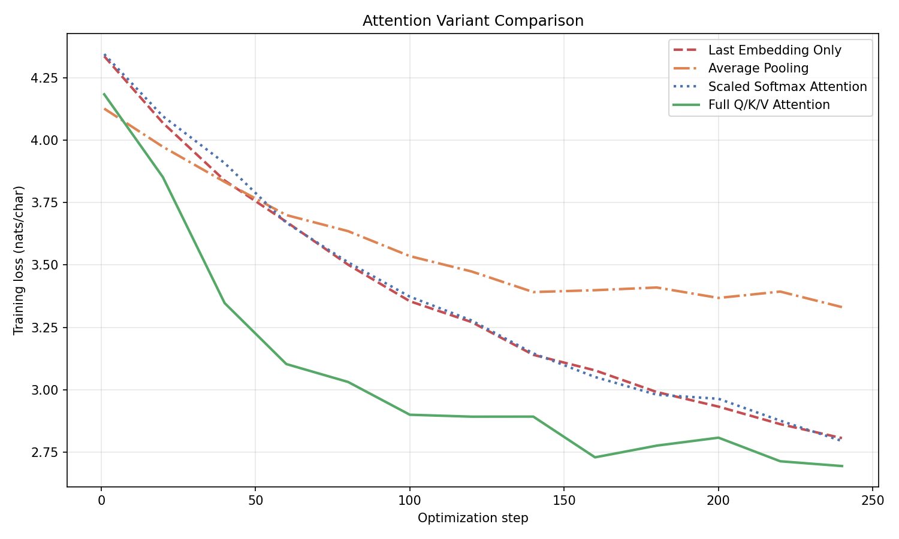

# 5. A step-by-step introduction to transformer models

## Table of contents
1. [From prediction to generation](#1-from-prediction-to-generation)
2. [Vocabularies, tokenization, and embeddings](#2-vocabularies-tokenization-and-embeddings)
3. [Next token prediction: the task and the loss](#3-next-token-prediction-the-task-and-the-loss)
4. [Building attention step by step](#4-building-attention-step-by-step)
5. [The transformer block](#5-the-transformer-block)
6. [Practical additions](#6-practical-additions)
7. [Conclusion](#7-conclusion)
8. [Appendix: prompts, scripts, and unit tests for figures](#appendix-prompts-scripts-and-unit-tests-for-figures)

---

## 1. From prediction to generation

Last lecture we had data as pairs $(x_i, y_i)$ -- inputs and targets -- and we learned a model $m(x; w)$ to predict $y$ from $x$. We built linear models (linear regression, logistic regression) and nonlinear models (multi-layer perceptrons, convolutional neural networks). In every case, the task was supervised: given an input, produce a target.

Today the setup changes. We have **sequence data** $(x_1, \ldots, x_T)$ and no label $y$. Examples:

- Raw characters in a sentence.
- Words in English text.
- DNA sequences.

The goal: learn to **generate** and **continue** sequences that resemble those in the training data, and that extrapolate beyond them in a consistent way. Given the rise of tools like ChatGPT and Claude, you already know why this matters.

So how do we design such models?

---

## 2. Vocabularies, tokenization, and embeddings

### 2.1 Choosing a vocabulary

Before we can model sequences, we need to encode them on a computer. This requires choosing a **vocabulary** $V$: a finite set of tokens that the model operates over.

Several choices:

- **Characters and digits.** Small vocabulary ($\vert V\vert \approx 100$). Every sentence becomes a long sequence of characters. Simple, but the sequences are long and relationships between distant characters can be hard to learn.
- **Words.** Large vocabulary ($\vert V\vert$ could be $100{,}000+$). Sequences are shorter, but the embedding table grows with $\vert V\vert$.

There is a tradeoff. Smaller vocabularies produce longer sequences that may be harder to optimize, though the optimization problem itself has fewer parameters per token. Larger vocabularies give shorter sequences but inflate the model's embedding table and the final prediction layer.

In practice, modern language models use a middle ground called **byte pair encoding (BPE)**. BPE builds a vocabulary of subword units by iteratively merging the most frequent adjacent pairs of tokens. The resulting vocabulary typically has $50{,}000$ to $150{,}000$ tokens. The mechanics of BPE are not essential for this lecture, but [this interactive demo](https://www.cs.cornell.edu/courses/cs4782/2026sp/demos/bytepair/){:target="_blank"} is worth exploring.

We also add two **special tokens** to the vocabulary:

- `<bos>` (**beginning of sequence**): a marker prepended to every sequence. It gives the model a fixed starting point for generation.
- `<eos>` (**end of sequence**): a marker that signals when generation should stop.

### 2.2 From tokens to vectors: embeddings

Once we have a vocabulary, we need to convert each token into something we can do linear algebra on: a vector.

For each token $v \in V$, we assign a learnable **embedding vector** $e_v \in \mathbb{R}^d$. There are $\vert V\vert$ such vectors, one per token, collected into an **embedding matrix** $E_{\text{vocab}} \in \mathbb{R}^{\vert V\vert \times d}$. These embedding vectors are **learned parameters**. We typically initialize them as random Gaussian vectors and let gradient descent shape them during training.

Typical embedding dimensions:

- Small models: $d = 768$
- Large models: $d$ up to $16{,}128$

Both numbers are divisible by $128$. This is not a coincidence: GPU matrix multiplication is fastest when dimensions align to certain powers of $2$. You will see this divisibility pattern throughout deep learning architectures.

Given a sequence $X = (x_1, \ldots, x_T)$ where each $x_t \in V$, the corresponding **embedding matrix** is

$$
E = \begin{bmatrix} e_{x_1}^T \\ e_{x_2}^T \\ \vdots \\ e_{x_T}^T \end{bmatrix} \in \mathbb{R}^{T \times d}.
$$

Row $t$ is the embedding of the $t$-th token. The first axis is the sequence length, consistent with the batch-first convention from last lecture.

```python
import torch

vocab_size = 65   # e.g., printable ASCII characters
d = 768

embedding = torch.nn.Embedding(vocab_size, d)

X = torch.tensor([18, 47, 56, 57, 1, 15, 47, 58, 1, 0])
E = embedding(X)

print("X.shape:", X.shape)   # (10,)
print("E.shape:", E.shape)   # (10, 768)
```

---

## 3. Next token prediction: the task and the loss

### 3.1 The prediction task

We want to sample sequences that look like those in our training data, and we want to continue partial sequences. A minimal way to achieve both goals: learn to **predict the next token** in a sequence.

Given an input sequence $X = (x_1, \ldots, x_T)$, we want a probability distribution

$$
p(\text{next token} \mid \texttt{<bos>}, x_1, \ldots, x_T).
$$

The `<bos>` token lets us start from an empty sequence: $p(x_1 \mid \texttt{<bos>})$ gives a distribution over possible first tokens.

Once we have this distribution, generation is straightforward:

1. Sample $x_{T+1} \sim p(\cdot \mid \texttt{<bos>}, x_1, \ldots, x_T)$.
2. Append $x_{T+1}$ to the sequence.
3. Repeat: sample $x_{T+2} \sim p(\cdot \mid \texttt{<bos>}, x_1, \ldots, x_{T+1})$.
4. Stop when we reach a maximum number of new tokens or when the model emits `<eos>`.

This is **autoregressive generation**: each new token is sampled conditional on everything before it.

### 3.2 The model pipeline

Our model maps a sequence $X$ to next-token probabilities. This happens in stages:

1. **Tokenize:** convert raw text into a sequence of token indices $X = (x_1, \ldots, x_T)$.
2. **Embed:** look up embeddings to get $E \in \mathbb{R}^{T \times d}$.
3. **Transform:** apply (possibly nonlinear) operations to produce $E_{\text{final}} \in \mathbb{R}^{T \times d}$.
4. **Score:** compute $\text{scores} = E_{\text{final}} W_{\text{head}}^T \in \mathbb{R}^{T \times \vert V\vert}$.
5. **Normalize:** apply softmax row-wise to get probabilities.

The score matrix has shape $T \times \vert V\vert$. Entry $(t, v)$ is a real number in $(-\infty, \infty)$ measuring how likely token $v$ is to follow the first $t$ tokens of $X$. We are computing next-token scores for **every** prefix simultaneously:

$$
\text{score}(v \mid x_1, \ldots, x_t) \quad \text{for every } t \in \{1, \ldots, T\} \text{ and every } v \in V.
$$

Converting scores to probabilities:

$$
p(v \mid x_1, \ldots, x_t) = \operatorname{softmax}(E_{\text{final}} W_{\text{head}}^T)_{t,v}.
$$

Here $W_{\text{head}} \in \mathbb{R}^{\vert V\vert \times d}$ is a learnable weight matrix. Each row of $W_{\text{head}}$ is a "template vector" for one vocabulary token; the dot product with $e_{\text{final},t}$ produces that token's score at position $t$.

The central question of this lecture: **how do we compute $E_{\text{final}}$ from $E$?**

### 3.3 The training objective

Our dataset is a collection of sequences $\mathcal{X}$. Assuming each sequence is equally likely and the sequences are independent, a natural objective is maximum likelihood: choose parameters $\theta$ to maximize

$$
\prod_{X \in \mathcal{X}} p_\theta(X).
$$

Here $\theta$ denotes all learnable parameters (embedding vectors, weight matrices in the transformation, the head matrix $W_{\text{head}}$). For a single sequence $X = (x_1, \ldots, x_T)$, the chain rule of probability gives

$$
p_\theta(X) = p_\theta(x_1 \mid \texttt{<bos>}) \cdot p_\theta(x_2 \mid \texttt{<bos>}, x_1) \cdots p_\theta(x_T \mid \texttt{<bos>}, x_1, \ldots, x_{T-1}).
$$

Optimizing a product of many small probabilities is numerically fragile: the product can underflow to zero. It is also not directly amenable to stochastic gradient descent. Taking the negative log converts the product into a sum:

$$
\min_\theta \sum_{X \in \mathcal{X}} \sum_{t=1}^{T} -\log p_\theta(x_t \mid \texttt{<bos>}, x_1, \ldots, x_{t-1}).
$$

This is the **next-token prediction loss**. Each term $-\log p_\theta(x_t \mid \cdots)$ penalizes the model for assigning low probability to the token that actually appeared. Minimizing this objective trains the model to be a good next-token predictor across all positions in all training sequences.

---

## 4. Building attention step by step

We now turn to the central question: how do we go from the embedding matrix $E$ to $E_{\text{final}}$?

Let's focus on computing row $T$ of $E_{\text{final}}$, the representation from which we predict the next token after the full sequence. From this row, the next-token distribution is

$$
p(v \mid X) = \operatorname{softmax}(W_{\text{head}} \, e_{\text{final},T})_v.
$$

We will build up the computation step by step, starting from the simplest possible approach and adding complexity only when we have a clear reason. Each step is motivated by a deficiency of the previous one.

**Experimental setup.** To make the comparison concrete, we train each model variant on character-level Shakespeare data ([source](https://github.com/karpathy/nanoGPT/tree/master/data/shakespeare_char){:target="_blank"}) with the following settings:

- Vocabulary: printable ASCII characters ($\vert V\vert = 65$).
- Embedding dimension: $d = 768$.
- Optimizer: Adam with large batch sizes.
- We compare training loss curves and sample quality.

### 4.1 Predict from the last embedding alone

The simplest idea: define $e_{\text{final},T} = e_T$ and predict from there.

$$
e_{\text{final},T} = e_T.
$$

This ignores the rest of the sequence entirely. The next-token prediction depends only on the identity of the current token, not on any context. It is a unigram-like model with learned embeddings: it can learn that "e" is a common character, but it cannot learn that "th" is often followed by "e".

### 4.2 Average all embeddings

Combine all positions by averaging:

$$
e_{\text{final},T} = \frac{1}{T}\sum_{i=1}^{T} e_i.
$$

Now every token in the sequence contributes to the prediction. The model can, in principle, use global context. But every token contributes **equally**. The first character of a sentence has the same influence as the character immediately before the prediction point. In language, recent context usually matters more, and some tokens are far more relevant than others for predicting what comes next.

### 4.3 Weighted combinations

Let different tokens contribute different amounts:

$$
e_{\text{final},T} = \sum_{i=1}^{T} a_i \, e_i, \qquad \sum_{i=1}^{T} a_i = 1.
$$

Now some tokens can dominate and others can be ignored. The question: where do the weights $a_i$ come from?

A natural idea: tokens whose embeddings are more "aligned" with $e_T$ should get more weight. Define

$$
a_i \propto e_i^T e_T.
$$

The dot product $e_i^T e_T$ measures similarity between positions $i$ and $T$. Larger dot product means more influence on the prediction.

One problem: the normalizing constant $\sum_i e_i^T e_T$ could be zero or negative, making the weights undefined or negative. We need a normalization scheme that keeps all weights positive.

### 4.4 Softmax normalization

Apply an exponential before normalizing. The exponential maps any real number to a positive number, so all weights become positive:

$$
a_i = \frac{\exp(e_i^T e_T)}{\sum_{j=1}^{T} \exp(e_j^T e_T)} = \operatorname{softmax}(E \, e_T)_i.
$$

Larger dot products still produce larger weights, and the weights sum to $1$ by construction. This gives us

$$
e_{\text{final},T} = \sum_{i=1}^{T} \operatorname{softmax}(E \, e_T)_i \; e_i.
$$

### 4.5 Scaling by $\sqrt{d}$

If the embeddings are initialized as independent Gaussian vectors with entries drawn from $\mathcal{N}(0,1)$, the dot product $e_i^T e_T$ has standard deviation $\sqrt{d}$. When $d = 768$, these dot products can easily reach $\pm 28$. At that magnitude, $\exp(e_i^T e_T)$ is either astronomically large (dominating all other weights) or effectively zero. The softmax output degenerates into a near-one-hot vector: one position gets all the weight, and the model learns nothing useful from the combination.

The fix: divide by $\sqrt{d}$.

$$
a_i = \operatorname{softmax}\!\left(\frac{E \, e_T}{\sqrt{d}}\right)_i.
$$

After dividing, the quantity $e_i^T e_T / \sqrt{d}$ has unit variance regardless of $d$, keeping the softmax arguments in a range where the output is a meaningful distribution rather than a spike.

Why care about Gaussian initialization specifically? Gaussian initialization is a standard and effective way to initialize neural network parameters. The $\sqrt{d}$ scaling ensures the model starts in a regime where attention weights are diffuse, giving gradient descent a smooth landscape to optimize from the beginning.

### 4.6 Learning the weights: queries, keys, and values

So far the attention weights are computed from the raw embeddings. There is no reason the same vectors that represent token identity should also be optimal for computing which tokens to attend to. We can learn a transformation.

**Step 1: a shared key transformation.** Learn a matrix $W \in \mathbb{R}^{d \times d}$ and compute weights in the transformed space:

$$
a_i = \operatorname{softmax}\!\left(\frac{(EW^T)(We_T)}{\sqrt{d}}\right)_i.
$$

This decouples "what a token means" from "how attention weights are computed." But there is still a problem.

**Step 2: separate queries and keys.** In the formula above, the tokens $\{e_i\}_{i=1}^T$ and the prediction point $e_T$ play different roles. The collection provides context (things to attend to); $e_T$ is what we are trying to continue. If we use the same transformation $W$ for both, then the attention weight $a_T$ that $e_T$ assigns to **itself** is proportional to $\exp(\lVert W e_T\rVert^2 / \sqrt{d})$. This is always positive and often large, biasing the model toward attending mostly to the current token.

In language, the current token is not always the most informative for prediction. Consider "The cat sat on the \_\_\_". The most useful tokens for predicting the blank are "sat on", not the determiner "the" immediately before the blank. The model should be free to assign the current token low attention when appropriate.

This motivates separate transformations. A **query** matrix $W_Q \in \mathbb{R}^{d \times d}$ transforms the token doing the attending, and a **key** matrix $W_K \in \mathbb{R}^{d \times d}$ transforms the tokens being attended to:

$$
a_i = \operatorname{softmax}\!\left(\frac{(E W_K^T)(W_Q e_T)}{\sqrt{d}}\right)_i.
$$

Now $a_T$ depends on $(W_K e_T)^T (W_Q e_T)$, which has no structural reason to be large. The query and key transformations can learn to make the current position unremarkable when that is what the data requires.

**Step 3: value transformation.** We have been summing the raw embeddings $e_i$ with learned weights. The embeddings serve double duty: they help determine the weights (through keys) and they are the things being aggregated. We can decouple these roles with a **value** matrix $W_V \in \mathbb{R}^{d \times d}$:

$$
e_{\text{final},T} = \sum_{i=1}^{T} a_i \, (W_V e_i).
$$

The value transformation lets the model learn what information to extract from each position, independently of how attention weights are computed.

Putting it all together for position $T$:

$$
e_{\text{final},T} = \sum_{i=1}^{T} \operatorname{softmax}\!\left(\frac{(E W_K^T)(W_Q e_T)}{\sqrt{d}}\right)_i \; (W_V e_i).
$$

### 4.7 Attention: the matrix formulation

We can compute the above for **all** positions simultaneously. Define

$$
Q = E W_Q^T, \qquad K = E W_K^T, \qquad V = E W_V^T,
$$

where $Q$, $K$, $V$ are all $T \times d$. Row $t$ of $Q$ is the query for position $t$; row $i$ of $K$ is the key for position $i$; row $i$ of $V$ is the value for position $i$.

The attention output for the entire sequence is

$$
\operatorname{Attn}(E) = \operatorname{softmax}\!\left(\frac{QK^T + M}{\sqrt{d}}\right) V,
$$

where softmax is applied to each row independently, and $M \in \mathbb{R}^{T \times T}$ is a **causal mask**:

$$
M_{t,i} = \begin{cases} 0 & \text{if } i \le t, \\ -\infty & \text{if } i > t. \end{cases}
$$

The $-\infty$ entries cause $\exp(-\infty) = 0$ in the softmax, so position $t$ cannot attend to any future position $i > t$. This is essential: without the mask, the model at position $t$ could "cheat" by looking at the actual next token when predicting it. We compute all positions in parallel for efficiency, and the mask ensures that row $t$ of $E_{\text{final}}$ depends only on tokens $1, \ldots, t$.


*Figure 4.1: Left: the causal mask $M$ for a sequence of length $T=12$. White entries are $0$ (attend); dark entries are $-\infty$ (block). Right: example attention weights after softmax, showing that each row sums to $1$ and only attends to earlier (or equal) positions.*

The matrix $\operatorname{Attn}(E)$ is $T \times d$. Row $t$ is a weighted combination of the value vectors $\{v_1, \ldots, v_t\}$, where the weights are determined by how well query $t$ matches keys $1, \ldots, t$. This mechanism was introduced in ["Attention Is All You Need" (Vaswani et al., 2017)](https://papers.nips.cc/paper_files/paper/2017/hash/3f5ee243547dee91fbd053c1c4a845aa-Abstract.html){:target="_blank"}, the paper that established the transformer architecture.

```python
import torch
import torch.nn.functional as F

torch.manual_seed(0)

T, d = 10, 768
E = torch.randn(T, d)

W_Q = torch.randn(d, d) * (d ** -0.5)
W_K = torch.randn(d, d) * (d ** -0.5)
W_V = torch.randn(d, d) * (d ** -0.5)

Q = E @ W_Q.T   # (T, d)
K = E @ W_K.T   # (T, d)
V = E @ W_V.T   # (T, d)

scores = (Q @ K.T) / (d ** 0.5)   # (T, T)

mask = torch.triu(torch.full((T, T), float('-inf')), diagonal=1)
scores = scores + mask

attn_weights = F.softmax(scores, dim=-1)   # (T, T)
attn_output = attn_weights @ V             # (T, d)

print("Q.shape:", Q.shape)                 # (10, 768)
print("scores.shape:", scores.shape)       # (10, 10)
print("attn_weights.shape:", attn_weights.shape)  # (10, 10)
print("attn_output.shape:", attn_output.shape)    # (10, 768)
print("attn_weights[0]:", attn_weights[0].tolist()[:3])  # first row: all weight on position 0
```

**Training comparison.** Figure 4.2 compares training loss curves for the model variants developed in this section, all trained on character-level Shakespeare:



*Figure 4.2: Training loss (negative log-likelihood per character) vs. optimization step for four model variants: (a) last embedding only, (b) average pooling, (c) scaled softmax attention without learned Q/K/V, (d) full Q/K/V attention. Each successive variant achieves lower training loss. The gap between (b) and (c) shows the value of data-dependent weighting; the gap between (c) and (d) shows the value of learned transformations.*

---

## 5. The transformer block

Attention gives us a way to compute a context-aware representation $\operatorname{Attn}(E)$. We could stop here and feed this directly into the prediction head. But recall the philosophy from last lecture: deep learning transforms raw data into a form that is more useful for the final layer. Attention is one transformation. We can compose it with others to make the representation richer.

### 5.1 Residual connections

A first improvement: instead of replacing $E$ with $\operatorname{Attn}(E)$, add them.

$$
E' = \operatorname{Attn}(E) + E.
$$

This is a **residual connection**. The model can learn to use the attention output as a correction to the original embeddings rather than a wholesale replacement.

Why does this help? You will find many explanations online ("keeps the gradient flowing," etc.) that are vague at best. A more precise story: residual connections improve the **conditioning** of the optimization problem. When the transformation is the identity plus a small perturbation, the loss landscape near initialization is smoother, and gradient descent makes more reliable progress. We have not covered conditioning formally in this course, so take this as a working hypothesis rather than a theorem.

### 5.2 The feed-forward network

Attention computes a weighted combination of linearly transformed embeddings. It is powerful for mixing information across positions, but within each position the transformation is linear (a matrix multiply). To add **nonlinearity** within each position, we apply a small feed-forward network (MLP) after attention:

$$
\operatorname{MLP}(E') = \operatorname{ReLU}(E' W_1^T)\, W_2^T,
$$

where $W_1 \in \mathbb{R}^{4d \times d}$ and $W_2 \in \mathbb{R}^{d \times 4d}$. The data flows $d \to 4d \to d$: expand to a wider representation, apply a nonlinearity, then project back. The factor of $4$ is a convention from the original transformer paper; it provides enough capacity in the hidden layer without excessive cost.

We again add a residual connection:

$$
E'' = \operatorname{MLP}(E') + E'.
$$

### 5.3 A single transformer block

Composing the two pieces, a single **transformer block** is

$$
\text{Block}(E) = (\operatorname{MLP} + I) \circ (\operatorname{Attn} + I)(E),
$$

where $I$ denotes the identity (the residual connections). First we mix information across positions via attention, then we transform within each position via the MLP. Both steps preserve the residual.


*Figure 5.1: A single transformer block. The input $E$ passes through attention (with a residual connection), then through a feed-forward MLP (with another residual connection), producing $E''$ of the same shape.*

### 5.4 Stacking blocks: the full transformer

A single transformer block has limited expressive power. To build a richer model, we stack $L$ blocks in sequence. Start with the embedding $E_0 = E$. Then for $\ell = 1, \ldots, L$:

$$
E_\ell = (\operatorname{MLP}_\ell + I) \circ (\operatorname{Attn}_\ell + I)(E_{\ell-1}).
$$

Define $E_{\text{final}} = E_L$. Each block has its own learnable parameters:

- $\operatorname{Attn}_\ell$: three weight matrices $W_{Q,\ell}$, $W_{K,\ell}$, $W_{V,\ell}$, each $d \times d$.
- $\operatorname{MLP}_\ell$: two weight matrices $W_{1,\ell}$ ($4d \times d$) and $W_{2,\ell}$ ($d \times 4d$).

That is five parameter matrices per layer, plus the embedding table and the prediction head $W_{\text{head}}$.

### 5.5 PyTorch implementation

Here is a complete, runnable transformer built from the components above.

```python
import torch
import torch.nn as nn
import torch.nn.functional as F

class CausalSelfAttention(nn.Module):
    def __init__(self, d):
        super().__init__()
        self.W_Q = nn.Linear(d, d, bias=False)
        self.W_K = nn.Linear(d, d, bias=False)
        self.W_V = nn.Linear(d, d, bias=False)
        self.scale = d ** 0.5

    def forward(self, E):
        T = E.shape[-2]
        Q, K, V = self.W_Q(E), self.W_K(E), self.W_V(E)
        scores = (Q @ K.transpose(-2, -1)) / self.scale
        mask = torch.triu(torch.full((T, T), float('-inf'), device=E.device), diagonal=1)
        attn = F.softmax(scores + mask, dim=-1)
        return attn @ V

class TransformerBlock(nn.Module):
    def __init__(self, d, d_ff=None):
        super().__init__()
        if d_ff is None:
            d_ff = 4 * d
        self.attn = CausalSelfAttention(d)
        self.mlp = nn.Sequential(
            nn.Linear(d, d_ff),
            nn.ReLU(),
            nn.Linear(d_ff, d),
        )

    def forward(self, E):
        E = E + self.attn(E)
        E = E + self.mlp(E)
        return E

class SimpleTransformer(nn.Module):
    def __init__(self, vocab_size, d, num_layers):
        super().__init__()
        self.embedding = nn.Embedding(vocab_size, d)
        self.blocks = nn.ModuleList([TransformerBlock(d) for _ in range(num_layers)])
        self.head = nn.Linear(d, vocab_size, bias=False)

    def forward(self, x):
        E = self.embedding(x)
        for block in self.blocks:
            E = block(E)
        return self.head(E)

torch.manual_seed(0)

vocab_size, d, num_layers = 65, 768, 4
model = SimpleTransformer(vocab_size, d, num_layers)

x = torch.randint(0, vocab_size, (1, 32))
logits = model(x)

print("input shape:", x.shape)            # (1, 32)
print("output shape:", logits.shape)       # (1, 32, 65)
print("num parameters:", sum(p.numel() for p in model.parameters()))

for name, p in model.named_parameters():
    print(f"  {name}: {tuple(p.shape)}")
```

**Training comparison.** Figure 5.2 compares training loss for transformers with different depths, all using the architecture above.


*Figure 5.2: Training loss vs. optimization step for transformers with 1, 2, 4, and 8 layers on character-level Shakespeare. Deeper models achieve lower training loss. The gap between 1 and 2 layers is substantial; returns diminish as depth increases further.*

Figure 5.3 shows text sampled from several model variants after training.


*Figure 5.3: Text sampled from four models after training on Shakespeare. (a) Last-embedding-only: output is essentially random characters. (b) Average pooling: some character-level patterns emerge. (c) Single-layer Q/K/V attention: word-like structure appears. (d) 4-layer transformer: recognizable Shakespeare-like text with proper formatting.*

---

## 6. Practical additions

The architecture in Section 5 captures the essential structure of a transformer. Three additional components are standard in practice.

### 6.1 Output projection

After computing the attention output $\operatorname{Attn}(E)$, multiply by a learned matrix $W_O \in \mathbb{R}^{d \times d}$ on the right:

$$
\operatorname{Attn}_{\text{proj}}(E) = \operatorname{Attn}(E)\, W_O^T.
$$

This gives the model an additional degree of freedom to transform the attention output before adding the residual. In practice, $W_O$ is almost always included.

### 6.2 Positional encodings

The attention mechanism as described treats the input as a **set**: permuting the token order (while also permuting the causal mask accordingly) changes nothing about the computation within the attended positions. The causal mask does impose an ordering -- position $t$ cannot attend to positions after $t$ -- but within the attended positions $\{1, \ldots, t\}$, the model has no way to know which token came first and which came fifth.

To give the model explicit information about token position, we add a **positional encoding** $P \in \mathbb{R}^{T \times d}$ to the embeddings:

$$
E_0 = E + P.
$$

The original transformer used a deterministic sinusoidal encoding (different frequencies along different dimensions of $d$). Many modern architectures learn $P$ as a parameter or use relative position encodings. The details vary, but the principle is the same: inject position information so the model can distinguish "the same token at position 3" from "the same token at position 300."

### 6.3 Multiple attention heads

A single attention layer computes one set of weights $a_{t,i}$ and one weighted combination. Different aspects of language may require attending to different things simultaneously: syntax might depend on nearby tokens while semantic reference might depend on distant ones.

**Multi-head attention** splits the embedding dimension $d$ into $h$ heads, each of dimension $d_h = d/h$. Each head has its own $W_Q^{(j)}$, $W_K^{(j)}$, $W_V^{(j)}$ matrices (now $d \times d_h$ instead of $d \times d$), computes its own attention independently, and the $h$ outputs are concatenated back to dimension $d$:

$$
\operatorname{MultiHead}(E) = \operatorname{Concat}(\text{head}_1, \ldots, \text{head}_h)\, W_O^T,
$$

where each $\text{head}_j = \operatorname{Attn}_j(E) \in \mathbb{R}^{T \times d_h}$. The concatenation produces a $T \times d$ matrix, and the output projection $W_O \in \mathbb{R}^{d \times d}$ mixes the heads.

Multi-head attention costs roughly the same as single-head attention (the total number of parameters is similar), but it lets different heads specialize in different patterns.

---

## 7. Conclusion

We built a transformer from first principles: starting with raw embeddings and progressively adding weighted combinations, softmax normalization, scaling, learned query/key/value transformations, residual connections, and feed-forward layers. The resulting architecture -- stacked transformer blocks trained with next-token prediction loss -- is the foundation of modern language models. Next lecture, we turn to training these models at scale.

---

## Appendix: prompts, scripts, and unit tests for figures

### Figure 4.1: Causal attention mask and attention weights heatmap

**File:** `script/plot_attention_mask_heatmap.py`
**Output:** `figures/attention_mask_heatmap.png`

**Description:** A two-panel figure. Left panel: a $12 \times 12$ heatmap of the causal mask $M$. Entries where $i \le t$ are white (or light), entries where $i > t$ are dark (representing $-\infty$). The $x$-axis is labeled "Key position $i$" and the $y$-axis is labeled "Query position $t$". Right panel: a $12 \times 12$ heatmap of example attention weights after softmax. Use a short random sequence of length 12, embed with random Gaussian embeddings ($d = 64$ is fine for visualization), compute $Q$, $K$, $V$ with random weight matrices scaled by $d^{-1/2}$, apply the causal mask, and show the resulting softmax weights. Use a sequential colormap (e.g., `viridis` or `Blues`). Each row should visibly sum to 1 and have zero weight above the diagonal.

**Prompt for generation:**
```
Create a Python script that:
1. Sets torch.manual_seed(42) and generates a random embedding E of shape (12, 64).
2. Creates random W_Q, W_K, W_V of shape (64, 64), scaled by 64**-0.5.
3. Computes Q, K, V, scores, causal mask, and attention weights.
4. Produces a two-panel figure (1 row, 2 columns, figsize=(12, 5)):
   - Left: heatmap of the causal mask (0 and -inf values, displayed as 0/1 binary).
   - Right: heatmap of the attention weights (use plt.imshow with 'Blues' colormap).
   - Both panels: axis labels "Key position" (x) and "Query position" (y), integer ticks.
   - Add colorbars to both panels.
   - Title left panel "Causal Mask" and right panel "Attention Weights".
5. Saves to figures/attention_mask_heatmap.png at 150 dpi with tight_layout.
```

**Unit test:**
```
- The left panel should show a lower-triangular pattern: white/light on and below the diagonal, dark above.
- The right panel should show nonzero values only on and below the diagonal.
- Each row of the right panel should sum to approximately 1.0.
- The figure should have exactly two subplots side by side.
```

---

### Figure 4.2: Training curves comparing attention variants

**File:** `script/train_attention_variants.py`
**Output:** `figures/training_curves_attention_variants.png`

**Description:** A single-panel line plot showing training loss (negative log-likelihood per character, $y$-axis) vs. optimization step ($x$-axis) for four model variants trained on character-level Shakespeare:

1. **Last embedding only:** $e_{\text{final},T} = e_T$. A simple `nn.Embedding` + `nn.Linear` head.
2. **Average pooling:** $e_{\text{final},T} = \frac{1}{T}\sum e_i$ (using cumulative mean to respect causality: position $t$ averages over positions $1,\ldots,t$).
3. **Scaled softmax attention** (no learned Q/K/V): weights from raw embeddings with $\sqrt{d}$ scaling.
4. **Full Q/K/V attention:** learned query, key, and value matrices.

All models use $d = 768$, vocab size 65, a single attention layer (no MLP, no residual for variants 1-3; variant 4 has Q/K/V but still no MLP or residual). Train for 2000 steps with Adam (lr=3e-4), batch size 64, sequence length 256. Plot all four curves on the same axes with a legend. Use distinct colors and line styles.

**Prompt for generation:**
```
Create a Python script that:
1. Downloads or loads Shakespeare character-level data from the nanoGPT repository.
2. Implements four model variants as nn.Module subclasses:
   (a) LastEmbeddingModel: embedding -> linear head (ignores all but last position per causal convention).
   (b) AveragePoolModel: embedding -> causal cumulative average -> linear head.
   (c) SoftmaxAttnModel: embedding -> scaled dot-product attention with raw embeddings (no learned Q/K/V) -> linear head.
   (d) QKVAttnModel: embedding -> scaled dot-product attention with learned W_Q, W_K, W_V -> linear head.
3. Trains each model for 2000 steps with Adam (lr=3e-4), batch size 64, sequence length 256.
4. Logs training loss every 50 steps.
5. Plots all four loss curves on a single figure (figsize=(10, 6)):
   - x-axis: "Optimization step"
   - y-axis: "Training loss (nats/char)"
   - Legend with model names.
   - Grid on.
6. Saves to figures/training_curves_attention_variants.png at 150 dpi.
```

**Unit test:**
```
- All four curves should be visible and distinguishable.
- The last-embedding-only curve should have the highest final loss.
- The QKV attention curve should have the lowest final loss.
- Loss curves should be monotonically decreasing on average (local fluctuations are fine).
- The y-axis should be labeled and the legend should not obscure any curves.
```

---

### Figure 5.1: Transformer block diagram

**File:** `script/plot_transformer_block.py`
**Output:** `figures/transformer_block.png`

**Description:** A vertical flow diagram of a single transformer block. From bottom to top:

1. Input $E$ (labeled box).
2. Arrow into "Causal Self-Attention" box.
3. A "+" node merging the attention output with a skip connection from the input (residual).
4. Arrow into "Feed-Forward MLP" box (label includes "$d \to 4d \to d$").
5. A "+" node merging the MLP output with a skip connection from the post-attention output.
6. Output $E''$ (labeled box).

Use clean lines, rounded rectangles for operations, circles for addition nodes, and arrows for data flow. Skip connections shown as lines bypassing each operation block. Minimal color: white boxes with black borders, or light gray fill.

**Prompt for generation:**
```
Create a Python script using matplotlib that draws a transformer block diagram as described.
Use matplotlib.patches for boxes and matplotlib.patches.FancyArrowPatch for arrows.
The diagram should be vertical (bottom to top), clean, and readable.
Save to figures/transformer_block.png at 150 dpi with tight_layout, figsize=(5, 8).
```

**Unit test:**
```
- The diagram should show two main operation boxes (attention and MLP).
- Two residual (skip) connections should be visible.
- The flow direction should be bottom-to-top or top-to-bottom (consistent).
- Text labels should be legible and not overlap.
```

---

### Figure 5.2: Training curves comparing transformer depth

**File:** `script/train_transformer_depth.py`
**Output:** `figures/training_curves_depth.png`

**Description:** A single-panel line plot showing training loss vs. optimization step for four transformer models of different depths: 1, 2, 4, and 8 layers. All use the full architecture from Section 5 (attention + residual + MLP + residual per block), $d = 768$, trained on character-level Shakespeare with Adam (lr=3e-4), batch size 64, sequence length 256, for 2000 steps. Plot all four curves with distinct colors and a legend.

**Prompt for generation:**
```
Create a Python script that:
1. Loads Shakespeare character-level data.
2. Uses the SimpleTransformer class from Section 5.5 (or equivalent).
3. Trains four models with num_layers in {1, 2, 4, 8}.
4. Logs training loss every 50 steps.
5. Plots all four loss curves on one figure (figsize=(10, 6)):
   - x-axis: "Optimization step"
   - y-axis: "Training loss (nats/char)"
   - Legend: "1 layer", "2 layers", "4 layers", "8 layers"
   - Grid on.
6. Saves to figures/training_curves_depth.png at 150 dpi.
```

**Unit test:**
```
- All four curves should be visible and distinguishable.
- Deeper models should generally achieve lower final training loss.
- The 1-layer curve should have the highest final loss.
- Loss curves should decrease over training steps.
```

---

### Figure 5.3: Sample text comparison

**File:** `script/generate_sample_text.py`
**Output:** `figures/sample_text_comparison.png`

**Description:** A four-panel text figure. Each panel shows a 200-character sample generated by a different trained model: (a) last-embedding-only, (b) average pooling, (c) single-layer Q/K/V attention, (d) 4-layer transformer. Use a monospace font. Each panel is labeled with the model name. The panels should be arranged in a $2 \times 2$ grid. The figure should make it visually obvious that model quality improves from (a) to (d): (a) is near-random characters, (d) produces word-like or sentence-like structure.

**Prompt for generation:**
```
Create a Python script that:
1. Loads four pre-trained model checkpoints (or trains them inline).
2. Generates 200 characters from each model using autoregressive sampling (temperature=0.8).
3. Creates a 2x2 grid figure (figsize=(14, 10)) with each panel containing the sample text
   rendered in a monospace font (e.g., 'Courier New' or 'monospace'), fontsize=9.
4. Each panel has a title: "(a) Last Embedding Only", "(b) Average Pooling",
   "(c) Single-Layer Attention", "(d) 4-Layer Transformer".
5. Wraps text to fit within each panel (approximately 60 chars per line).
6. Saves to figures/sample_text_comparison.png at 150 dpi.
```

**Unit test:**
```
- All four panels should contain visible text.
- The text in panel (d) should contain recognizable English words or word fragments.
- The text in panel (a) should look qualitatively more random than panel (d).
- The figure should have exactly four subplots in a 2x2 grid.
```
