# 6. A step-by-step introduction to diffusion models

## Table of contents
1. [Image generation: the problem](#1-image-generation-the-problem)
2. [The key insight: noise and denoising](#2-the-key-insight-noise-and-denoising)
3. [The forward process: adding noise](#3-the-forward-process-adding-noise)
4. [The reverse process: learning to denoise](#4-the-reverse-process-learning-to-denoise)
5. [The neural network: U-Net](#5-the-neural-network-u-net)
6. [Training](#6-training)
7. [Sampling](#7-sampling)
8. [The noise schedule](#8-the-noise-schedule)
9. [Faster sampling: DDIM](#9-faster-sampling-ddim)
10. [Conditional generation](#10-conditional-generation)
11. [Evaluating generative models: FID](#11-evaluating-generative-models-fid)
12. [Conclusion](#12-conclusion)

## 1. Image generation: the problem

Last lecture we worked with sequence data, characters of Shakespeare, and learned to generate text by predicting the next token. We built embeddings, attention, residual connections, and feed-forward layers into a transformer architecture, trained it with next-token prediction loss, and generated recognizable Shakespeare from scratch.

Today the data changes. We have a collection of **images** with no labels. Examples: handwritten digits, photographs of faces, medical scans. The goal: learn to generate new images that look like the training data but are not copies of it. This is the technology behind DALL-E, Stable Diffusion, and Midjourney.

**Our running example.** We use the MNIST dataset: 60,000 grayscale images of handwritten digits, each $28 \times 28$ pixels. In Lecture 4 we used MNIST for classification (given an image, predict the digit). Now we flip the task: given nothing but the training images, learn to produce new ones.

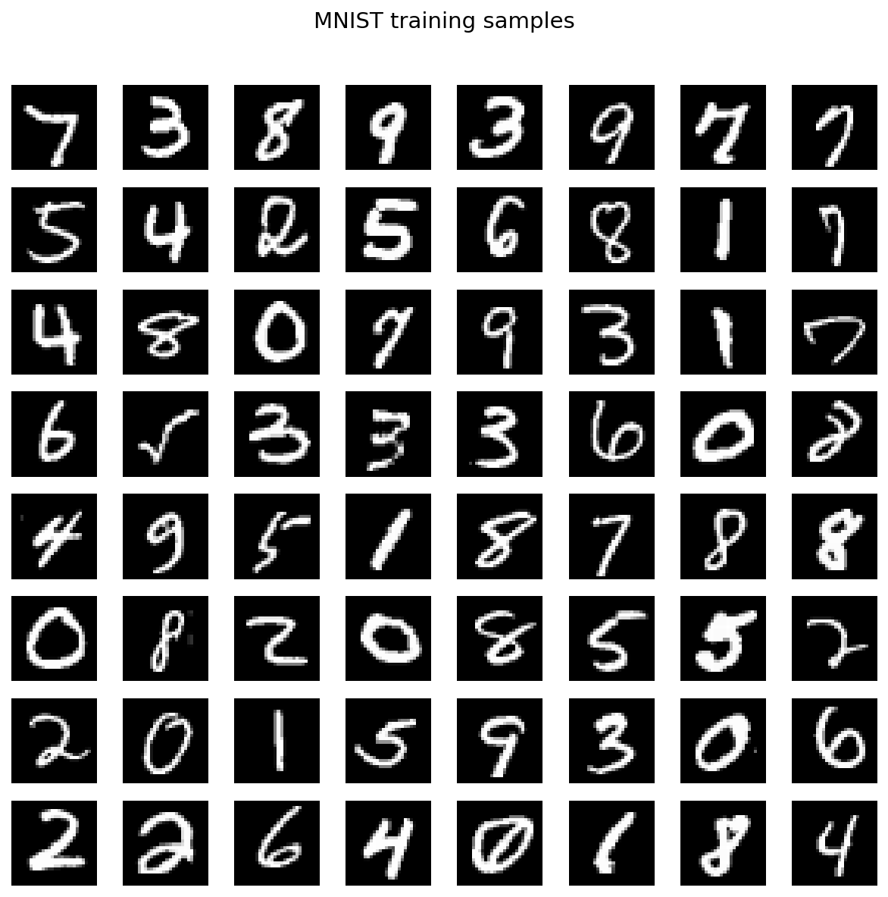

*Figure 1.1: 64 random images from the MNIST training set. Each image is $28 \times 28$ pixels, grayscale, with pixel values in $[0, 1]$.*

The generation problem is harder than it first appears. Each image is a vector in $\mathbb{R}^{784}$ (flattening the $28 \times 28$ grid). We need to sample from the distribution of handwritten digits, a distribution over $\mathbb{R}^{784}$.

Sampling from simple distributions is trivial. To draw a sample from $\mathcal{N}(0, I)$ in $\mathbb{R}^{784}$, call `torch.randn(1, 1, 28, 28)`. The result is static; it looks nothing like a digit. The distribution of handwritten digits is concentrated on a tiny, complicated region of $\mathbb{R}^{784}$. Most vectors in that space are not recognizable images.

> **The question:** can we build a bridge between a distribution we can sample from (Gaussian) and the distribution we want to sample from (digits)?

## 2. The key insight: noise and denoising

Take a clean MNIST digit and gradually add Gaussian noise. At first the digit is still recognizable. After more noise, it becomes blurry. After enough noise, it is indistinguishable from a sample of $\mathcal{N}(0, I)$.

This is the **forward process**: systematically destroy an image by adding noise until nothing remains. The forward process is easy: we know exactly how to add Gaussian noise.

Now imagine running this in reverse. Start with pure noise. Slightly denoise it. A faint hint of structure appears. Denoise more. Curves and edges emerge. Keep going. A recognizable digit forms. After enough reverse steps, we have a clean image.

The **reverse process** is what we need to learn. Each step asks: given a noisy image at noise level $t$, what does a slightly less noisy version look like? This is a denoising problem, and neural networks are good at denoising. Train a network to denoise at every noise level, then chain the denoising steps together to go from noise to image.

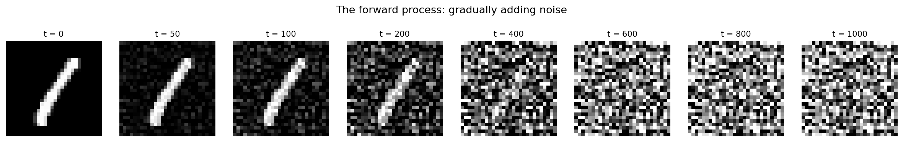

*Figure 2.1: The forward process applied to a single MNIST digit. From left to right: the clean image ($t = 0$) is gradually corrupted with Gaussian noise at increasing timesteps. By $t = 1000$, the image is indistinguishable from pure noise.*

This framework is called **Denoising Diffusion Probabilistic Models (DDPM)**, introduced by [Ho, Jain, and Abbeel (2020)](https://arxiv.org/abs/2006.11239){:target="_blank"}.

## 3. The forward process: adding noise

We have a clean image $x_0 \in \mathbb{R}^{784}$ with pixel values scaled to $[-1, 1]$.

### 3.1 The noise schedule

Define a sequence of noise levels $\beta_1, \beta_2, \ldots, \beta_T$ with each $\beta_t \in (0, 1)$. We use $T = 1000$ timesteps with a **linear schedule**: $\beta_1 = 10^{-4}$ and $\beta_T = 0.02$, linearly spaced.

Each $\beta_t$ controls how much noise to add at step $t$. At each step, we shrink the current image slightly and add fresh Gaussian noise:

$$
q(x_t \mid x_{t-1}) = \mathcal{N}\!\left(x_t;\; \sqrt{1 - \beta_t}\, x_{t-1},\; \beta_t I\right).
$$

The shrinking factor $\sqrt{1 - \beta_t} < 1$ is important: without it, the image magnitude would grow without bound as we keep adding noise.

### 3.2 The closed-form formula

We do not need to apply all $T$ steps sequentially. Define

$$
\alpha_t = 1 - \beta_t, \qquad \bar{\alpha}_t = \prod_{s=1}^{t} \alpha_s.
$$

Then one can show that:

$$
q(x_t \mid x_0) = \mathcal{N}\!\left(x_t;\; \sqrt{\bar{\alpha}_t}\, x_0,\; (1 - \bar{\alpha}_t)\, I\right).
$$

Equivalently, using the reparameterization trick:

$$
x_t = \sqrt{\bar{\alpha}_t}\, x_0 + \sqrt{1 - \bar{\alpha}_t}\, \varepsilon, \qquad \varepsilon \sim \mathcal{N}(0, I).
$$

This says $x_t$ is a weighted combination of the clean image and pure noise:

- When $t$ is small, $\bar{\alpha}_t \approx 1$, so $x_t \approx x_0$ (mostly signal).
- When $t$ is large, $\bar{\alpha}_t \approx 0$, so $x_t \approx \varepsilon$ (mostly noise).
- At $t = T$, $\bar{\alpha}_T \approx 0$, and $x_T$ is approximately $\mathcal{N}(0, I)$.

Why does this work? Each step multiplies the signal by $\sqrt{\alpha_t}$ and adds independent Gaussian noise. After $t$ steps, the signal has been multiplied by $\prod_{s=1}^t \sqrt{\alpha_s} = \sqrt{\bar{\alpha}_t}$, and the accumulated noise variances sum to $1 - \bar{\alpha}_t$ (independent Gaussian variances add).

This closed-form formula is useful for training: we can generate a noisy version of any training image at any timestep in one shot.

```python
# Precompute the noise schedule
betas = torch.linspace(1e-4, 0.02, T)          # (T,)
alphas = 1.0 - betas                            # (T,)
alpha_bar = torch.cumprod(alphas, dim=0)        # (T,)

# Generate x_t from x_0 in one step
epsilon = torch.randn_like(x_0)
x_t = alpha_bar[t].sqrt() * x_0 + (1 - alpha_bar[t]).sqrt() * epsilon
```

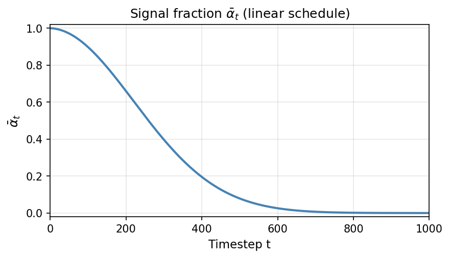

*Figure 3.1: The signal fraction $\bar{\alpha}_t$ as a function of timestep $t$ for the linear schedule ($\beta_1 = 10^{-4}$, $\beta_T = 0.02$, $T = 1000$). It decreases monotonically from $\approx 1$ to $\approx 0$.*

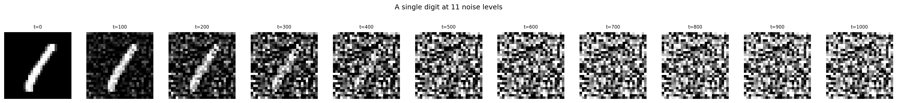

*Figure 3.2: A single MNIST digit at 11 noise levels ($t = 0, 100, 200, \ldots, 1000$), computed using the closed-form formula with the same noise $\varepsilon$. The signal $\sqrt{\bar{\alpha}_t}\, x_0$ fades as the noise $\sqrt{1 - \bar{\alpha}_t}\, \varepsilon$ grows.*

## 4. The reverse process: learning to denoise

We can go from clean image to noise. Now we want the reverse: noise to clean image.

### 4.1 The posterior given $x_0$ (Bayes' rule for Gaussians)

We know the forward step $q(x_t \mid x_{t-1})$ and the marginal $q(x_t \mid x_0)$, both Gaussian. Suppose for a moment that we also know the original image $x_0$. Then we can compute the reverse step $q(x_{t-1} \mid x_t, x_0)$ exactly using Bayes' rule:

$$
q(x_{t-1} \mid x_t, x_0) = \frac{q(x_t \mid x_{t-1})\, q(x_{t-1} \mid x_0)}{q(x_t \mid x_0)}.
$$

All three terms on the right are Gaussian (the numerator is a product of two Gaussian densities in $x_{t-1}$, the denominator is a normalizing constant that does not depend on $x_{t-1}$). A product of Gaussian densities is proportional to another Gaussian density, so the posterior is Gaussian. (The key algebraic fact: the product of $\exp(-\frac{1}{2} x^T A x + b^T x + c)$ and $\exp(-\frac{1}{2} x^T D x + e^T x + f)$ is $\exp(-\frac{1}{2} x^T (A+D) x + (b+e)^T x + c + f)$, which is again Gaussian. See [Appendix A](#appendix-a-product-of-gaussian-densities) for the full derivation.) Matching the mean and variance gives:

$$
q(x_{t-1} \mid x_t, x_0) = \mathcal{N}\!\left(x_{t-1};\; \tilde{\mu}_t(x_t, x_0),\; \tilde{\beta}_t I\right),
$$

where

$$
\tilde{\mu}_t(x_t, x_0) = \frac{\sqrt{\bar{\alpha}_{t-1}}\, \beta_t}{1 - \bar{\alpha}_t}\, x_0 + \frac{\sqrt{\alpha_t}\,(1 - \bar{\alpha}_{t-1})}{1 - \bar{\alpha}_t}\, x_t,
$$

$$
\tilde{\beta}_t = \frac{(1 - \bar{\alpha}_{t-1})}{(1 - \bar{\alpha}_t)}\, \beta_t.
$$

Both quantities are determined entirely by the noise schedule, no learning required.

### 4.2 Modeling the reverse step

The posterior $q(x_{t-1} \mid x_t, x_0)$ is nice, but we do not know $x_0$; it is what we are trying to generate. The true reverse step $q(x_{t-1} \mid x_t)$ marginalizes over all possible $x_0$ and is not Gaussian in general.

However, when forward steps are small (small $\beta_t$), the distribution $q(x_{t-1} \mid x_t)$ concentrates: given $x_t$, there is not much uncertainty about $x_{t-1}$, because one small noise step was added. So a Gaussian approximation is reasonable. We therefore **assume** the reverse step is Gaussian:

$$
p_\theta(x_{t-1} \mid x_t) = \mathcal{N}\!\left(x_{t-1};\; \mu_\theta(x_t, t),\; \sigma_t^2 I\right).
$$

For the variance, we set $\sigma_t^2 = \beta_t$. When $\beta_t$ is small, this is close to the posterior variance:

$$
\tilde{\beta}_t = \frac{(1 - \bar{\alpha}_{t-1})}{(1 - \bar{\alpha}_t)}\, \beta_t \approx \beta_t \quad \text{(since } \bar{\alpha}_{t-1} \approx \bar{\alpha}_t \text{ for small } \beta_t\text{)}.
$$

For MNIST the choice of variance has minor impact. The remaining task is to learn the mean $\mu_\theta$.

### 4.3 Predicting the noise

We need to learn the mean $\mu_\theta$. There are three ways to parameterize the network's output. They are all equivalent because of the closed-form:

$$
x_t = \sqrt{\bar{\alpha}_t}\, x_0 + \sqrt{1 - \bar{\alpha}_t}\, \varepsilon.
$$

**Parameterization 1: predict $x_0$ directly.** The network outputs an estimate of the clean image. We plug this estimate into the posterior mean formula from Section 4.1 to recover $\mu_\theta$.

**Parameterization 2: predict the noise $\varepsilon$.** The network outputs an estimate $\hat{\varepsilon}$. Rearranging the closed-form recovers an estimate of the clean image:

$$
\hat{x}_0 = \frac{x_t - \sqrt{1 - \bar{\alpha}_t}\, \hat{\varepsilon}}{\sqrt{\bar{\alpha}_t}},
$$

which we plug into the posterior mean formula as before.

**Parameterization 3: predict the mean directly.** The network outputs $\mu_\theta$ with no further transformation.

These three parameterizations are interchangeable: knowing any one determines the other two (given the noisy image, the timestep, and the noise schedule).

[Ho et al., 2020](https://arxiv.org/abs/2006.11239){:target="_blank"} found that predicting the noise works well. We write the network as $\varepsilon_\theta$. It takes a noisy image and a timestep and outputs the predicted noise. The same network is used for all $T$ timesteps; $t$ is provided as an input so the network can adapt its behavior.

**From noise prediction to reverse-step mean.** Since the sampling algorithm (Section 7) needs the mean $\mu_\theta$, we show how to get it from $\hat{\varepsilon}$. Substitute the noise-based estimate of $x_0$ into the posterior mean $\tilde{\mu}_t$ from Section 4.1:

$$
\mu_\theta(x_t, t) = \frac{1}{\sqrt{\alpha_t}}\left(x_t - \frac{\beta_t}{\sqrt{1 - \bar{\alpha}_t}}\, \varepsilon_\theta(x_t, t)\right).
$$

This is the formula we will use at sampling time.

### 4.4 The loss

We want $\varepsilon_\theta(x_t, t)$ to be close to the true noise $\varepsilon$ that was used to construct $x_t$. The training objective is mean squared error:

$$
\mathcal{L} = \mathbb{E}_{x_0, t, \varepsilon}\!\left[\lVert \varepsilon - \varepsilon_\theta(x_t, t) \rVert^2\right],
$$

where $x_0$ is sampled uniformly from the training set, $t \sim \text{Uniform}(\lbrace 1, \ldots, T \rbrace)$, $\varepsilon \sim \mathcal{N}(0, I)$, and $x_t = \sqrt{\bar{\alpha}_t}\, x_0 + \sqrt{1 - \bar{\alpha}_t}\, \varepsilon$.

This is the "simplified" loss from [Ho et al., 2020](https://arxiv.org/abs/2006.11239){:target="_blank"}. The full variational lower bound for diffusion models includes $t$-dependent weighting factors on each term; Ho et al. drop these weights and report that the unweighted version gives better sample quality in their experiments.

### 4.5 The training algorithm

The full procedure:

```python
for step in range(num_steps):
    x_0 = sample_batch(train_data)                    # (B, 1, 28, 28)
    t = torch.randint(1, T + 1, (B,))                 # random timesteps
    epsilon = torch.randn_like(x_0)                    # true noise
    x_t = sqrt_alpha_bar[t] * x_0 + sqrt_one_minus_alpha_bar[t] * epsilon
    epsilon_hat = model(x_t, t)                        # predicted noise
    loss = F.mse_loss(epsilon_hat, epsilon)
    optimizer.zero_grad()
    loss.backward()
    optimizer.step()
```

Sample a training image, pick a random timestep, add noise, ask the network to guess the noise, minimize the MSE. That is the entire training loop.

## 5. The neural network

We need a neural network $\varepsilon_\theta$ that takes a noisy image $x_t$ and a timestep $t$ and outputs the predicted noise. The input and output are both $1 \times 28 \times 28$ — same shape. In Lecture 4, our CNNs mapped images to class labels (a vector). Here the output is itself an image.

### 5.1 What the network needs to do

The network is a function

$$
\varepsilon_\theta: \underbrace{\mathbb{R}^{1 \times 28 \times 28}}_{\text{noisy image } x_t} \times \underbrace{\lbrace 1, \ldots, T \rbrace}_{\text{timestep } t} \;\to\; \underbrace{\mathbb{R}^{1 \times 28 \times 28}}_{\text{predicted noise}}.
$$

Two requirements:

1. **Image in, image out.** The output must have the same spatial resolution as the input. Classification CNNs (Lecture 4) compress spatial information away; here we need to preserve it.
2. **Timestep conditioning.** The network must behave differently for different values of $t$. At $t = 50$ the input is mostly signal and the network should predict small corrections; at $t = 950$ the input is mostly noise and the prediction problem is very different.

### 5.2 Architecture choice: U-Net

We use a **U-Net** ([Ronneberger et al., 2015](https://arxiv.org/abs/1505.04597){:target="_blank"}), a standard architecture for image-to-image tasks. It is built from the convolutional layers we saw in Lecture 4 and the residual connections we saw in Lecture 5, arranged in three parts:

- **Encoder:** a sequence of convolutional blocks that progressively shrink the spatial dimensions ($28 \times 28 \to 14 \times 14 \to 7 \times 7$) while increasing the number of feature channels ($1 \to 64 \to 128$). This is the same pattern as a classification CNN — extract increasingly abstract features at lower resolutions.
- **Decoder:** the mirror of the encoder, progressively expanding spatial dimensions back to $28 \times 28$ while decreasing the channels.
- **Skip connections:** at each resolution level, the encoder's feature maps are concatenated with the decoder's feature maps. This lets the decoder access fine spatial details directly from the encoder instead of reconstructing them from the compressed bottleneck.

For **timestep conditioning**, we convert the integer $t$ into a learned 256-dimensional vector (using sinusoidal encodings from Lecture 5, followed by a small MLP). Inside each convolutional block, this vector is projected and added to the feature maps — a per-channel bias that tells the block how noisy the current input is.

The full architecture has approximately 4.2M parameters. The diagram and implementation are below; the details of the architecture are not essential to the rest of this lecture.

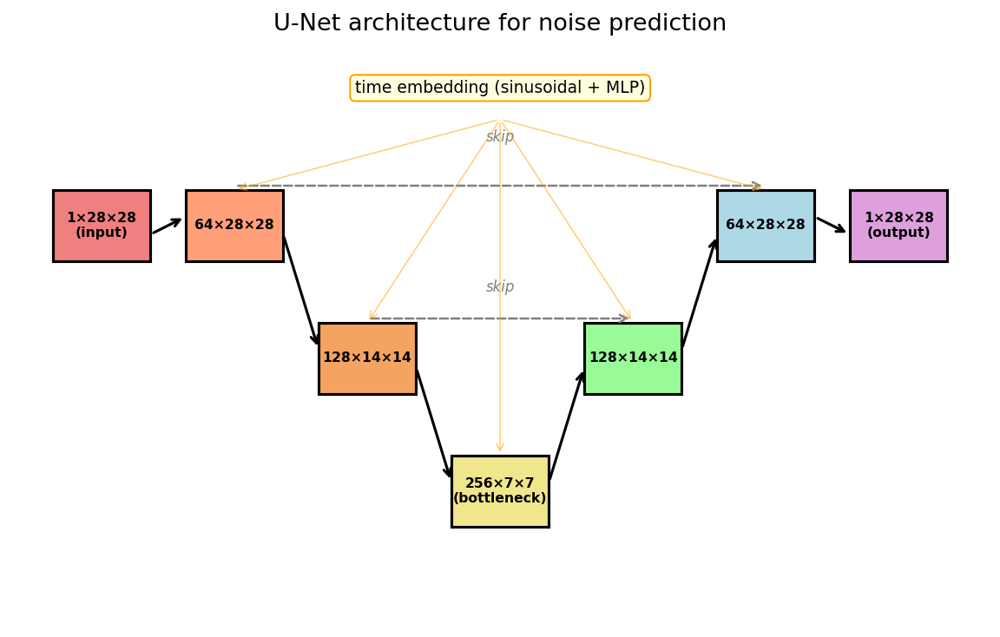

*Figure 5.1: The U-Net architecture. Encoder (left) downsamples through convolutional blocks; decoder (right) upsamples back. Horizontal arrows are skip connections. The timestep embedding is injected at every block.*

### 5.3 PyTorch implementation

```python
import torch
import torch.nn as nn
import torch.nn.functional as F
import math

class SinusoidalEmbedding(nn.Module):
    def __init__(self, dim):
        super().__init__()
        self.dim = dim

    def forward(self, t):
        half = self.dim // 2
        freqs = torch.exp(-math.log(10000) * torch.arange(half, device=t.device) / half)
        args = t[:, None].float() * freqs[None, :]
        return torch.cat([args.sin(), args.cos()], dim=-1)


class ResBlock(nn.Module):
    def __init__(self, in_ch, out_ch, time_dim):
        super().__init__()
        self.conv1 = nn.Conv2d(in_ch, out_ch, 3, padding=1)
        self.conv2 = nn.Conv2d(out_ch, out_ch, 3, padding=1)
        self.norm1 = nn.GroupNorm(8, out_ch)
        self.norm2 = nn.GroupNorm(8, out_ch)
        self.time_mlp = nn.Linear(time_dim, out_ch)
        self.skip = nn.Conv2d(in_ch, out_ch, 1) if in_ch != out_ch else nn.Identity()

    def forward(self, x, t_emb):
        h = F.silu(self.norm1(self.conv1(x)))
        h = h + self.time_mlp(F.silu(t_emb))[:, :, None, None]
        h = F.silu(self.norm2(self.conv2(h)))
        return h + self.skip(x)


class UNet(nn.Module):
    def __init__(self, in_ch=1, base_ch=64, time_dim=256):
        super().__init__()
        c1, c2, c3 = base_ch, base_ch * 2, base_ch * 4   # 64, 128, 256

        self.time_embed = nn.Sequential(
            SinusoidalEmbedding(time_dim),
            nn.Linear(time_dim, time_dim), nn.SiLU(),
            nn.Linear(time_dim, time_dim),
        )

        # Encoder
        self.enc1  = ResBlock(in_ch, c1, time_dim)
        self.down1 = nn.Conv2d(c1, c1, 3, stride=2, padding=1)   # 28 -> 14
        self.enc2  = ResBlock(c1, c2, time_dim)
        self.down2 = nn.Conv2d(c2, c2, 3, stride=2, padding=1)   # 14 -> 7

        # Bottleneck (7x7, 256 channels)
        self.mid1 = ResBlock(c2, c3, time_dim)
        self.mid2 = ResBlock(c3, c3, time_dim)

        # Decoder
        self.up2  = nn.ConvTranspose2d(c3, c2, 4, stride=2, padding=1)  # 7 -> 14
        self.dec2 = ResBlock(c2 + c2, c2, time_dim)                     # skip cat
        self.up1  = nn.ConvTranspose2d(c2, c1, 4, stride=2, padding=1)  # 14 -> 28
        self.dec1 = ResBlock(c1 + c1, c1, time_dim)                     # skip cat

        self.out = nn.Conv2d(c1, in_ch, 1)

    def forward(self, x, t):
        t_emb = self.time_embed(t)
        h1 = self.enc1(x, t_emb)                          # (B, 64, 28, 28)
        h2 = self.enc2(self.down1(h1), t_emb)              # (B, 128, 14, 14)
        h  = self.mid2(self.mid1(self.down2(h2), t_emb), t_emb)  # (B, 256, 7, 7)
        h  = self.dec2(torch.cat([self.up2(h), h2], 1), t_emb)   # (B, 128, 14, 14)
        h  = self.dec1(torch.cat([self.up1(h), h1], 1), t_emb)   # (B, 64, 28, 28)
        return self.out(h)
```

```python
model = UNet()
print(sum(p.numel() for p in model.parameters()))  # 4,165,953

x = torch.randn(4, 1, 28, 28)
t = torch.randint(1, 1001, (4,))
out = model(x, t)
print(out.shape)  # torch.Size([4, 1, 28, 28])
```

The input and output shapes match: the network takes a noisy $1 \times 28 \times 28$ image and returns a predicted noise image of the same shape.

## 6. Training

### 6.1 Hyperparameters

| Parameter | Value |
|---|---|
| Diffusion timesteps $T$ | 1000 |
| Noise schedule | linear, $\beta_1 = 10^{-4}$, $\beta_T = 0.02$ |
| Batch size | 128 |
| Learning rate | $2 \times 10^{-4}$ (Adam) |
| Training steps | 20,000 |
| Image normalization | $[-1, 1]$ |

We normalize MNIST images to $[-1, 1]$ (not $[0, 1]$). The forward process is designed around $\mathcal{N}(0, I)$, which is symmetric around zero. Using $[-1, 1]$ keeps the noised distribution centered at zero for large $t$.

### 6.2 Training loss

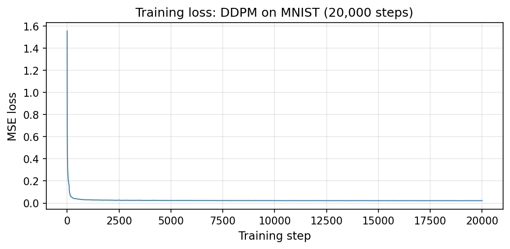

*Figure 6.1: Training loss (MSE between true and predicted noise) vs. optimization step. The loss decreases rapidly in the first few thousand steps and then plateaus.*

## 7. Sampling

### 7.1 The sampling algorithm

Sampling reverses the forward process. Starting from pure noise $x_T \sim \mathcal{N}(0, I)$, we iterate backwards:

**For** $t = T, T-1, \ldots, 1$:

1. Predict the noise: $\hat{\varepsilon} = \varepsilon_\theta(x_t, t)$.
2. Compute the mean of the reverse step:

$$
\mu_\theta(x_t, t) = \frac{1}{\sqrt{\alpha_t}}\left(x_t - \frac{\beta_t}{\sqrt{1 - \bar{\alpha}_t}}\, \hat{\varepsilon}\right).
$$

3. If $t > 1$, sample $z \sim \mathcal{N}(0, I)$ and set $x_{t-1} = \mu_\theta(x_t, t) + \sqrt{\beta_t}\, z$. If $t = 1$, set $x_0 = \mu_\theta(x_1, 1)$ (no noise on the final step).

**Return** $x_0$.

The formula removes the predicted noise from $x_t$, undoes the scaling by $\sqrt{\alpha_t}$, and adds a small amount of fresh noise to maintain the correct distribution at each step.

```python
@torch.no_grad()
def sample(model, shape, T, betas, alpha_bar):
    device = next(model.parameters()).device
    alphas = 1.0 - betas
    x = torch.randn(shape, device=device)

    for t in reversed(range(1, T + 1)):
        t_batch = torch.full((shape[0],), t, device=device, dtype=torch.long)
        eps_hat = model(x, t_batch)
        mu = (1 / alphas[t-1].sqrt()) * (
            x - betas[t-1] / (1 - alpha_bar[t-1]).sqrt() * eps_hat
        )
        if t > 1:
            x = mu + betas[t-1].sqrt() * torch.randn_like(x)
        else:
            x = mu
    return x
```

This requires $T = 1000$ sequential forward passes through the network to generate one image. For our small MNIST model, that takes a few seconds. For large models generating $512 \times 512$ images, it can take minutes.

### 7.2 Generated samples

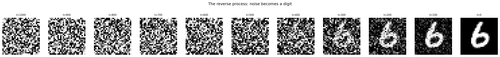

*Figure 7.1: The reverse (sampling) process. Starting from pure noise ($t = 1000$), the model iteratively denoises. Structure emerges gradually: by $t \approx 500$ a rough shape is visible, and by $t = 0$ the output is a recognizable digit.*

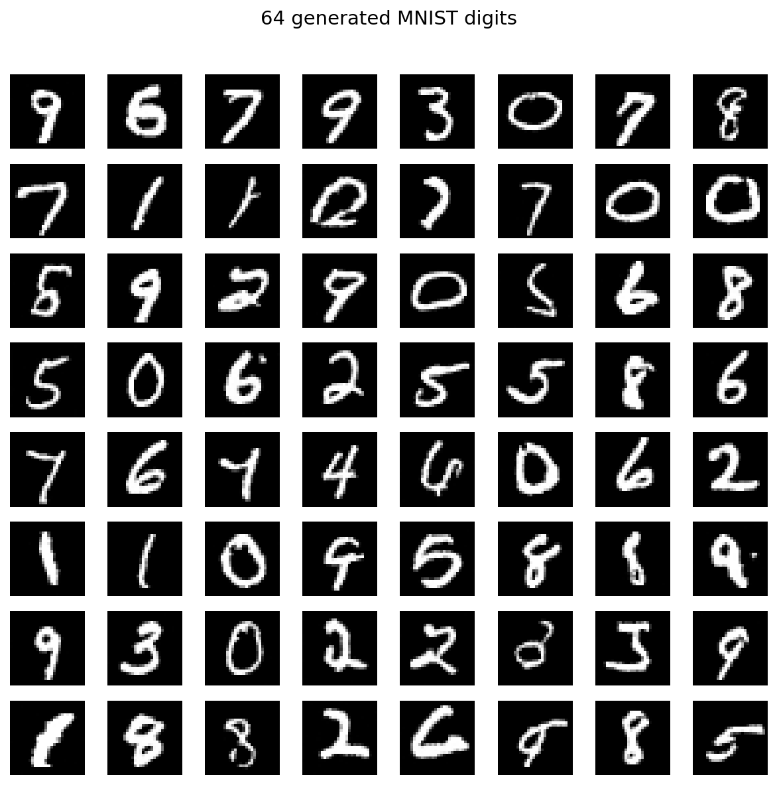

*Figure 7.2: 64 images generated by our trained DDPM. Compare to the real MNIST images in Figure 1.1.*

## 8. The noise schedule

The noise schedule $(\beta_1, \ldots, \beta_T)$ controls how quickly the image is destroyed. This affects sample quality.

### 8.1 Linear schedule

The linear schedule ($\beta_t$ increases linearly from $10^{-4}$ to $0.02$) destroys information quickly in the middle timesteps. By $t = 500$, $\bar{\alpha}_t$ is already close to zero and the image is nearly pure noise. The model spends roughly half its capacity on timesteps where there is very little signal to work with.

### 8.2 Cosine schedule

[Nichol and Dhariwal (2021)](https://arxiv.org/abs/2102.09672){:target="_blank"} proposed a cosine schedule where $\bar{\alpha}_t$ follows a cosine curve:

$$
\bar{\alpha}_t = \cos^2\!\left(\frac{t/T + s}{1 + s} \cdot \frac{\pi}{2}\right), \qquad s = 0.008.
$$

The small offset $s$ prevents $\beta_t$ from being too small near $t = 0$. Information is preserved longer in early timesteps, giving the model more signal across the full range.

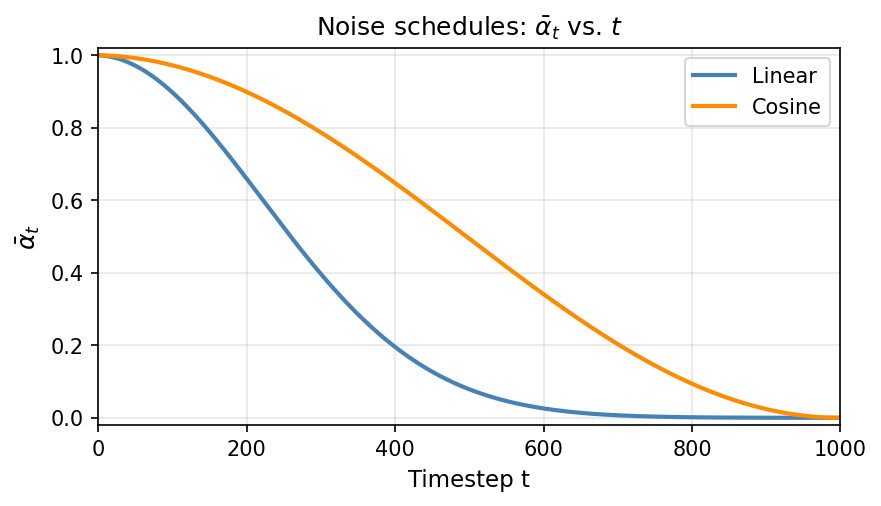

*Figure 8.1: $\bar{\alpha}_t$ vs. $t$ for the linear schedule (blue) and the cosine schedule (orange). The cosine schedule decays more gradually, preserving signal longer.*

For MNIST, both schedules produce reasonable results because the dataset is relatively simple. The difference is more pronounced on complex datasets like CIFAR-10 or ImageNet.

## 9. Faster sampling: DDIM

Generating one DDPM image requires $T = 1000$ sequential forward passes through the network. Can we take fewer steps?

The DDPM update at each step adds fresh random noise $z$. This stochasticity means that skipping steps changes the distribution of the outputs — the chain was designed for steps of size $\beta_t$, and jumping over several steps at once breaks the math.

**DDIM** (Denoising Diffusion Implicit Models, [Song et al., 2020](https://arxiv.org/abs/2010.02502){:target="_blank"}) replaces the stochastic update with a **deterministic** one. Given the current sample and the predicted noise, DDIM computes the next sample without adding fresh noise:

$$
x_{t-1} = \sqrt{\bar{\alpha}_{t-1}}\,\hat{x}_0 + \sqrt{1 - \bar{\alpha}_{t-1}}\,\varepsilon_\theta(x_t, t),
$$

where $\hat{x}_0$ is the estimated clean image from Section 4.3. Because there is no randomness, the update is a deterministic function of the noise schedule values at $t$ and $t - 1$. This means we can skip timesteps: instead of stepping through all 1000, pick a subsequence like $t = 1000, 980, 960, \ldots, 20, 0$ (50 steps, a $20\times$ speedup) and apply the same formula using the $\bar{\alpha}$ values at those timesteps.

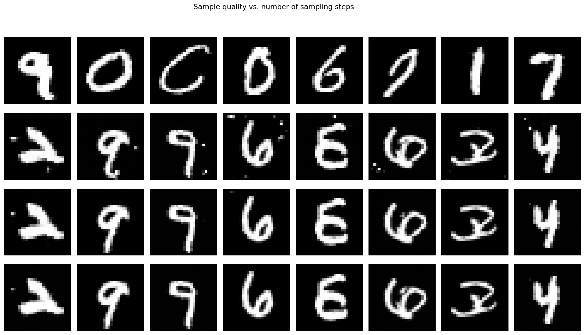

*Figure 9.1: Each row shows 8 generated samples at a different step count (rows from top: 1000 steps DDPM, 250 steps DDIM, 50 steps DDIM, 20 steps DDIM). Quality remains good down to about 50 steps and degrades at 20.*

## 10. Conditional generation

So far our model generates random digits with no control over which digit appears. We now modify it so that we can request a specific digit, say "generate a 7."

### 10.1 Giving the network a class label

The unconditional network takes two inputs: a noisy image and a timestep. To condition on a digit class $y \in \lbrace 0, 1, \ldots, 9 \rbrace$, we give the network a third input. We embed $y$ as a learned vector (same idea as token embeddings in Lecture 5) and add it to the time embedding before injection into each block. The network now predicts noise conditioned on all three inputs: the noisy image, the timestep, and the class label.

At sampling time, we fix $y$ to the desired digit and run the same reverse process as before. The network steers the denoising toward images of that class.

### 10.2 Classifier-free guidance

Simply conditioning on $y$ works, but the class signal can be weak — the network may sometimes ignore it. An earlier approach called *classifier guidance* ([Dhariwal and Nichol, 2021](https://arxiv.org/abs/2105.05233){:target="_blank"}) solved this by training a separate image classifier and using its gradients to steer sampling toward the desired class. [Ho and Salimans (2022)](https://arxiv.org/abs/2207.12598){:target="_blank"} showed how to get the same effect without a separate classifier — hence the name **classifier-free guidance**.

**Training.** During training, we randomly replace the class label $y$ with a special null token $\varnothing$ some fraction of the time (we use 10%). This means the same network learns to denoise both conditionally (when given a real label) and unconditionally (when given $\varnothing$).

**Sampling.** At each reverse step, we run the network twice — once with the class label, once with the null token:

$$
\hat{\varepsilon}_{\text{cond}} = \varepsilon_\theta(x_t, t, y), \qquad \hat{\varepsilon}_{\text{uncond}} = \varepsilon_\theta(x_t, t, \varnothing).
$$

The difference between these two predictions is the direction in noise-prediction space that the class label pushes toward. We amplify this direction:

$$
\hat{\varepsilon} = \hat{\varepsilon}_{\text{uncond}} + w \cdot (\hat{\varepsilon}_{\text{cond}} - \hat{\varepsilon}_{\text{uncond}}).
$$

The scalar $w \geq 1$ is the **guidance scale**. At $w = 1$, this reduces to the standard conditional prediction. At $w > 1$, the class signal is amplified: samples become more consistent with the requested digit at the cost of diversity. This is the same mechanism that DALL-E and Stable Diffusion use, with text prompts playing the role of $y$.

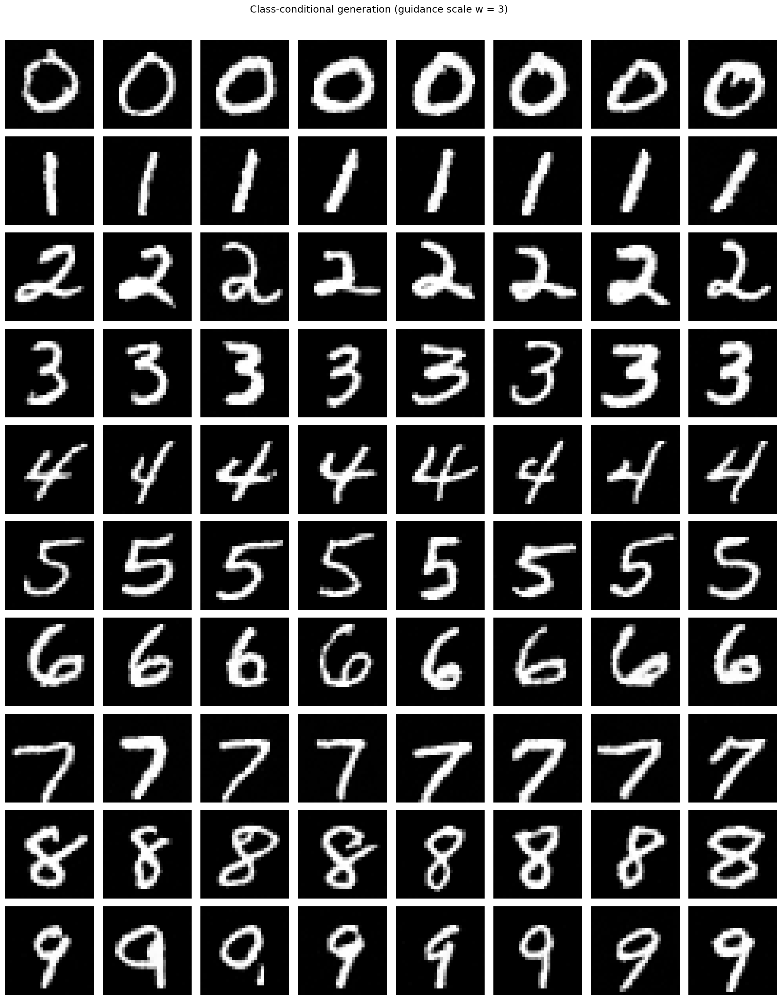

*Figure 10.1: Class-conditional generation with guidance scale $w = 3$. Each row is conditioned on a different digit (row labels $0$ through $9$ on the left), with 8 samples per row.*

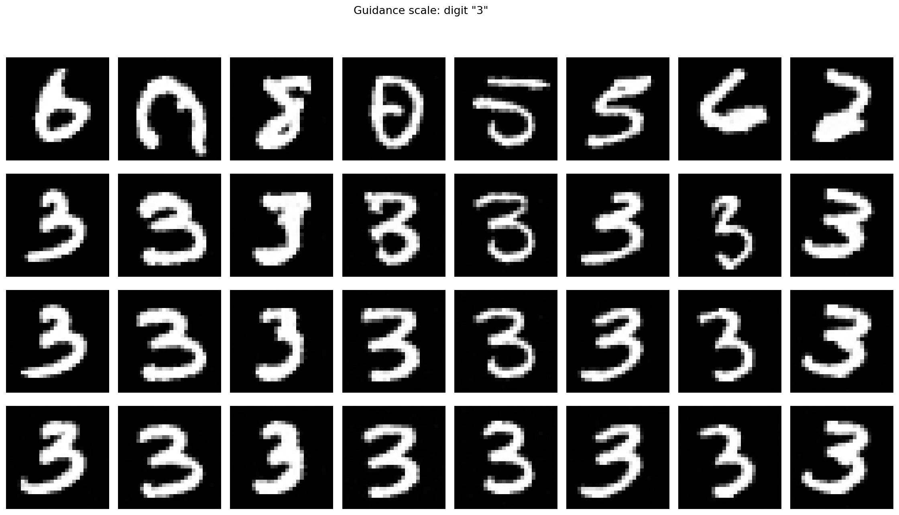

*Figure 10.2: Effect of guidance scale on the digit "3." Each row uses a different scale (row labels on the left: "uncond" for $w = 0$, then $w = 1, 3, 7$), with 8 samples per row. Higher $w$ produces more prototypical digits with less variety.*

## 11. Evaluating generative models: FID

For transformers, we had perplexity: a quantitative measure of how well the model predicts held-out data. For generative image models, computing the exact likelihood is intractable, so we need a different approach.

**The goal.** We want to compare two distributions: the distribution of real training images and the distribution of generated images. If the generative model is good, these two distributions should be close.

**The problem.** Comparing distributions of $28 \times 28$ images directly is hard — the space is too high-dimensional and we only have finite samples from each distribution. We need a lower-dimensional representation.

**Step 1: extract features.** Pass both real and generated images through a pretrained image classifier and extract feature vectors from an intermediate layer. The standard choice is InceptionV3, a classification network trained on ImageNet. The metric is called the **Fréchet Inception Distance (FID)** because it uses the Inception network — but the idea works with any pretrained feature extractor. The Inception features are 2048-dimensional vectors that capture high-level visual properties (shapes, textures, structures) rather than raw pixel values.

**Step 2: fit Gaussians.** Compute the mean $\mu$ and covariance $\Sigma$ of the feature vectors for the real images and separately for the generated images. This gives us two Gaussians in feature space: $\mathcal{N}(\mu_r, \Sigma_r)$ and $\mathcal{N}(\mu_g, \Sigma_g)$.

**Step 3: measure the distance between the two Gaussians.** The Fréchet distance (also called the Wasserstein-2 distance) between two Gaussians has a closed form:

$$
\text{FID} = \lVert \mu_r - \mu_g \rVert^2 + \operatorname{Tr}\!\left(\Sigma_r + \Sigma_g - 2(\Sigma_r \Sigma_g)^{1/2}\right).
$$

The first term measures whether the generated features are centered in the same place as the real features (do the generated images "look like the right kind of thing on average?"). The second term measures whether the spread and correlations of the generated features match the real ones (does the model produce the right amount of diversity?). If the two Gaussians are identical, both terms are zero and FID $= 0$.

**Limitations.** FID compares distributions, not individual images — a model that memorizes the training set gets FID $\approx 0$. It depends on the choice of feature extractor (Inception is a convention, not the only option). And it can miss artifacts that humans notice. Despite these limitations, FID is the standard quantitative metric for generative image models. For MNIST, published diffusion models achieve FID $< 5$.

## 12. Conclusion

We built a diffusion model from first principles. The forward process destroys an image by gradually adding Gaussian noise; the closed-form $x_t = \sqrt{\bar{\alpha}_t}\, x_0 + \sqrt{1 - \bar{\alpha}_t}\, \varepsilon$ lets us jump to any noise level. The reverse process uses a trained U-Net to predict the noise at each step, with MSE as the loss. Sampling starts from pure noise and iteratively denoises.

---

## Appendix A: product of Gaussian densities {#appendix-a-product-of-gaussian-densities}

We claim: if $p(x) \propto \mathcal{N}(x; \mu_1, \Sigma_1) \cdot \mathcal{N}(x; \mu_2, \Sigma_2)$, the result is Gaussian.

Write out the two densities (dropping normalizing constants):

$$
p(x) \propto \exp\!\Big(-\tfrac{1}{2}(x - \mu_1)^T \Sigma_1^{-1} (x - \mu_1)\Big) \cdot \exp\!\Big(-\tfrac{1}{2}(x - \mu_2)^T \Sigma_2^{-1} (x - \mu_2)\Big).
$$

Combine the exponents:

$$
p(x) \propto \exp\!\Big(-\tfrac{1}{2} x^T (\Sigma_1^{-1} + \Sigma_2^{-1}) x + x^T(\Sigma_1^{-1}\mu_1 + \Sigma_2^{-1}\mu_2) + \text{const}\Big).
$$

This is a quadratic form in $x$, so $p(x)$ is Gaussian with precision (inverse covariance) and precision-weighted mean:

$$
\Sigma^{-1} = \Sigma_1^{-1} + \Sigma_2^{-1}, \qquad \Sigma^{-1}\mu = \Sigma_1^{-1}\mu_1 + \Sigma_2^{-1}\mu_2.
$$

In the scalar case ($\Sigma_i = \sigma_i^2$):

$$
\frac{1}{\sigma^2} = \frac{1}{\sigma_1^2} + \frac{1}{\sigma_2^2}, \qquad \mu = \sigma^2\!\left(\frac{\mu_1}{\sigma_1^2} + \frac{\mu_2}{\sigma_2^2}\right).
$$

Applying this to the three Gaussian terms in Bayes' rule for the diffusion posterior (with appropriate identification of means and variances from the forward process) yields the formulas for $\tilde{\mu}_t$ and $\tilde{\beta}_t$ in Section 4.1.
