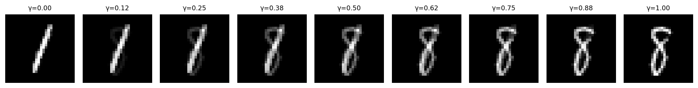
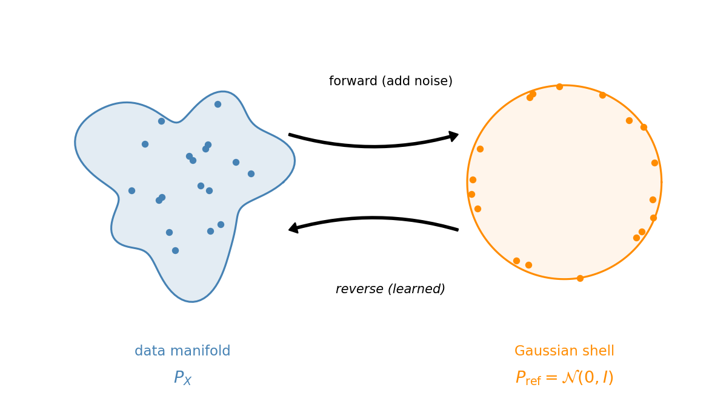
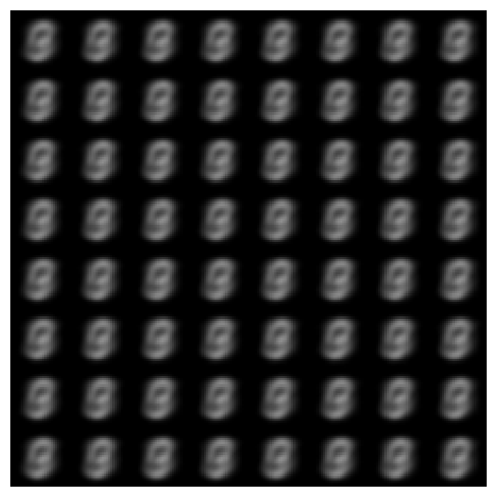
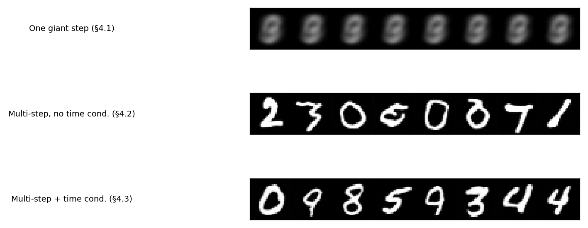
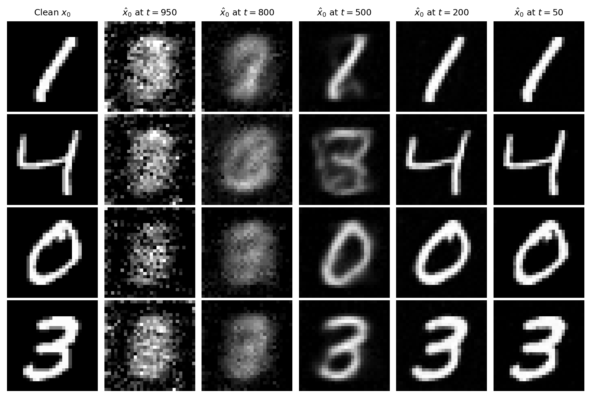

# 6. A step-by-step introduction to diffusion models

These notes are heavily inspired by Lilian Weng's excellent overview, [What are Diffusion Models?](https://lilianweng.github.io/posts/2021-07-11-diffusion-models/){:target="_blank"}.

## Table of contents
1. [The problem: sampling from a complicated distribution](#1-the-problem-sampling-from-a-complicated-distribution)
2. [The key idea: map to noise, learn the reverse](#2-the-key-idea-map-to-noise-learn-the-reverse)
3. [The forward process](#3-the-forward-process)
4. [Learning to denoise: three attempts](#4-learning-to-denoise-three-attempts)
5. [The neural network](#5-the-neural-network)
6. [Training and sampling](#6-training-and-sampling)
7. [Conditional generation](#7-conditional-generation)

## 1. The problem: sampling from a complicated distribution

Last lecture we worked with sequence data and learned to generate text by predicting the next token. Today the data changes: we have a collection of **images** and want to generate new ones that look like the training data but are not copies of it.

**Our running example.** The MNIST dataset: 60,000 grayscale images of handwritten digits, each $28 \times 28$ pixels. Each image is a vector in $\mathbb{R}^{784}$. The distribution of handwritten digits lives on a tiny, complicated region of this space.


*Figure 1.1: 64 random MNIST training images.*

> **The question:** given samples $x_1, \ldots, x_n$ from some unknown distribution $P_X$, how do we generate *new* samples from the same distribution?

### 1.1 Attempt: sample from the dataset

The simplest idea: pick a training image uniformly at random. This gives exact samples from the *empirical* distribution, but it only reproduces images we have already seen. The goal is to generate new images, not replay old ones.

### 1.2 Attempt: interpolate

Pick two training images and interpolate: $(1 - \gamma)\, x_1 + \gamma\, x_2$. This moves through $\mathbb{R}^{784}$ in a straight line. But digit images live on a curved manifold, so a straight line between a "1" and an "8" passes through pixel combinations that look like neither.



*Figure 1.2: Linear interpolation between a "1" and an "8" in pixel space. The endpoints are valid digits; everything in between is a ghostly superposition.*

Interpolation in pixel space does not stay on the data manifold.

### 1.3 The geometry of the problem

The data lives on some complicated curved surface in $\mathbb{R}^{784}$. We would like to move along this surface, not cut through the ambient space. But we do not know the surface. If we did, we could parameterize it and sample from it directly.

Here is a geometric reframing. Suppose we could map every point on the data surface to a point on a sphere $\mathbb{S}^{d-1}$. Then we could:

1. Sample a point on the sphere (easy: uniform on $\mathbb{S}^{d-1}$).
2. Apply the inverse map.
3. Get a point on the data surface.

We know how to sample from the sphere. We want to sample from the data surface. So we need to learn the map between them.

### 1.4 From geometry to probability

The geometric picture gives us the right intuition, but we cannot work with it directly: we do not have the manifold, only a finite set of samples. To make the problem concrete enough to optimize, we reformulate it in terms of distributions.

Replace "data surface" with the data distribution $P_X$ and "sphere" with a simple reference distribution $P_{\text{ref}}$. We want a mapping $P_X \to P_{\text{ref}}$ (forward) and its inverse $P_{\text{ref}} \to P_X$ (reverse).

For the reference distribution, we choose $\mathcal{N}(0, I)$, the standard Gaussian in $\mathbb{R}^{784}$. This is not an arbitrary choice. In high dimensions, $\mathcal{N}(0, I)$ concentrates on a thin shell at radius $\approx \sqrt{d}$. For $d = 784$, that shell has radius $\approx 28$. A high-dimensional Gaussian already lives on a sphere, up to minor radial fluctuations.



*Figure 1.3: The geometric picture. The data distribution $P_X$ lives on a complicated manifold (left). A high-dimensional Gaussian concentrates on a thin shell (right). The forward process maps data to noise; we learn the reverse.*

So the plan is:

1. Define a **forward process** that maps $P_X \to \mathcal{N}(0, I)$. This is the easy direction: we will just add noise.
2. Learn a **reverse process** that maps $\mathcal{N}(0, I) \to P_X$. This is the hard direction: a neural network that converts noise into images.

## 2. The key idea: map to noise, learn the reverse

The forward process is simple: take a clean image and gradually add Gaussian noise. After enough steps, the image is indistinguishable from a sample of $\mathcal{N}(0, I)$.


*Figure 2.1: The forward process applied to a single MNIST digit. Left to right: the clean image is gradually corrupted with noise until it is indistinguishable from pure Gaussian noise.*

The forward process is something we *choose*, not something we learn. We know exactly how to add noise.

The reverse process is what we need to learn: a **denoiser** that takes a noisy image and estimates the clean original. Chain enough denoising steps together and we go from pure noise to a clean image.

A direct one-step mapping (noise $\to$ image) is hard to train; we will see why in Section 4.1. Breaking it into many small denoising steps is what makes the problem tractable.

This is the framework behind **Denoising Diffusion Probabilistic Models (DDPM)** ([Ho, Jain, and Abbeel, 2020](https://arxiv.org/abs/2006.11239){:target="_blank"}).

## 3. The forward process

We add noise in $T = 1000$ small steps. At each step $t$, the image is scaled down slightly and fresh Gaussian noise is added. After $T$ steps, the result is approximately $\mathcal{N}(0, I)$.

We can jump from the clean image $x_0$ directly to any noise level $t$ in one shot:

$$
x_t = \sqrt{\bar{\alpha}_t}\, x_0 + \sqrt{1 - \bar{\alpha}_t}\, \varepsilon, \qquad \varepsilon \sim \mathcal{N}(0, I),
$$

where $\bar{\alpha}_t$ is a decreasing sequence from $\approx 1$ (little noise) to $\approx 0$ (pure noise). This works because adding independent Gaussian noise at each step compounds into a single Gaussian.

**Why the square root?** The variance of $x_t$ is $\bar{\alpha}_t \cdot \text{Var}(x_0) + (1 - \bar{\alpha}_t) \cdot 1$. The coefficients $\sqrt{\bar{\alpha}_t}$ and $\sqrt{1-\bar{\alpha}_t}$ make the variance interpolate linearly between $\text{Var}(x_0)$ and $1$, so the process converges smoothly to unit variance.

That is all we need from the forward process. The sequence $\bar{\alpha}_t$ is called the **noise schedule**. We use a linear schedule.

```python
betas = torch.linspace(1e-4, 0.02, T)
alphas = 1.0 - betas
alpha_bar = torch.cumprod(alphas, dim=0)

# Jump to any noise level in one step
epsilon = torch.randn_like(x_0)
x_t = alpha_bar[t].sqrt() * x_0 + (1 - alpha_bar[t]).sqrt() * epsilon
```


*Figure 3.1: A single digit at noise levels $t = 0, 100, 200, \ldots, 1000$. The signal fades as noise grows.*

## 4. Learning to denoise: three attempts

We want a neural network that reverses the forward process. The training idea: given a noisy image $x_t$, the network predicts the **clean image** $x_0$.

**Why predict $x_0$?** The forward formula says $x_t = \sqrt{\bar{\alpha}_t}\, x_0 + \sqrt{1 - \bar{\alpha}_t}\, \varepsilon$. The noisy image $x_t$ is a linear mixture of signal ($x_0$) and noise ($\varepsilon$), with known coefficients. Predicting $x_0$ from $x_t$ asks the network to extract the signal from this mixture. At every noise level, it is a well-defined regression problem with a clean target.

**Why not predict "the next step" $x_{t-1}$?** The value of $x_{t-1}$ depends on both $x_0$ and the specific noise realization. We cannot define a consistent target $x_{t-1}$ without already knowing $x_0$. Predicting $x_0$ directly avoids this circularity.

**How training works.** In all three attempts below, the training loop is:

1. Sample a training image $x_0$.
2. Pick a random noise level $t \in \lbrace 1, \ldots, T \rbrace$.
3. Create the noisy image: $x_t = \sqrt{\bar{\alpha}_t}\, x_0 + \sqrt{1 - \bar{\alpha}_t}\, \varepsilon$, with $\varepsilon \sim \mathcal{N}(0, I)$.
4. Feed $x_t$ (and possibly $t$) into the network, get $\hat{x}_0$.
5. Loss $= \lVert x_0 - \hat{x}_0 \rVert^2$.

The network never sees $x_0$ as input. It only sees $x_t$. The clean image $x_0$ is the training target. Each time the same training image appears, a fresh random $t$ and fresh random $\varepsilon$ produce a different $x_t$. Over training, the network sees every image at every noise level.

```python
x_0 = sample_batch(train_data)
t = torch.randint(1, T + 1, (B,))
eps = torch.randn_like(x_0)
x_t = sqrt_alpha_bar[t] * x_0 + sqrt_one_minus_alpha_bar[t] * eps
x_0_hat = model(x_t)          # Attempt 2: no t input
# x_0_hat = model(x_t, t)     # Attempt 3: with t input
loss = F.mse_loss(x_0_hat, x_0)
```

### 4.1 Attempt 1: one giant step

Train a network $f_\theta$ to map pure noise directly to a clean image.

$$
\mathcal{L} = \mathbb{E}_{x_0,\, \varepsilon}\!\left[\lVert x_0 - f_\theta(\varepsilon) \rVert^2\right], \qquad \varepsilon \sim \mathcal{N}(0, I).
$$

Many different clean images all map to the same noise distribution, so the network cannot know which image a particular noise sample came from. The MSE loss pushes it toward $\mathbb{E}[x_0 \mid x_T]$, the average over all training images. Every output is the same blurry blob.



*Figure 4.1: 64 samples from the one-step denoiser. Every output is the same blurry average.*

### 4.2 Attempt 2: many small steps, one network

Instead of mapping from pure noise, give the network an easier input. At intermediate noise levels, $x_t$ still contains partial signal.

$$
\mathcal{L} = \mathbb{E}_{x_0,\, t,\, \varepsilon}\!\left[\lVert x_0 - f_\theta(x_t) \rVert^2\right].
$$

One network predicts $x_0$ from $x_t$ at all noise levels $t$, sampled uniformly. The network does not receive $t$, so it does not know the current signal-to-noise ratio. It must apply a single compromise strategy across all noise levels.

Despite this limitation, when we use this network to generate images iteratively (Section 4.5), it produces recognizable digits.

### 4.3 Attempt 3: tell the network the noise level

Give the network $t$ as an additional input. Now it knows the signal-to-noise ratio and can specialize its behavior at each noise level.

We inject $t$ via a **sinusoidal embedding** (same idea as positional encodings in the transformer, Lecture 5), converted to a vector and added into each layer of the network.

$$
\mathcal{L} = \mathbb{E}_{x_0,\, t,\, \varepsilon}\!\left[\lVert x_0 - f_\theta(x_t, t) \rVert^2\right].
$$



*Figure 4.3: Samples from the three approaches (all predicting $x_0$, same base architecture). Top: one giant step produces identical blurry blobs. Middle: multi-step without time conditioning produces recognizable digits. Bottom: adding time conditioning yields cleaner results.*

### 4.4 What the network learns



*Figure 4.4: The network's estimate of $x_0$ at different noise levels, for four training images. At $t = 950$: incoherent. By $t = 500$: the digit is recognizable. At $t = 50$: nearly identical to the original. The network learns a coarse-to-fine decomposition.*

### 4.5 From a denoiser to a sampler

We have a network $f_\theta(x_t, t)$ that estimates $x_0$ from any noise level. We cannot just feed in pure noise and use $f_\theta(x_T, T)$ as our generated image; that is Attempt 1 again (the estimate at high noise is blurry).

Instead, we use the estimate to take **one small step** and then re-estimate.

**Step 1.** Start with pure noise $x_T \sim \mathcal{N}(0, I)$.

**Step 2.** Ask the network for its best guess of the clean image:

$$\hat{x}_0 = f_\theta(x_T,\, T).$$

This estimate is poor, but it is all we have.

**Step 3.** Back out an estimate of the noise. The forward formula says $x_t = \sqrt{\bar{\alpha}_t}\, x_0 + \sqrt{1-\bar{\alpha}_t}\,\varepsilon$. Rearranging for $\varepsilon$:

$$\hat{\varepsilon} = \frac{x_T - \sqrt{\bar{\alpha}_T}\,\hat{x}_0}{\sqrt{1 - \bar{\alpha}_T}}.$$

**Step 4.** We now have estimates of both signal and noise. Plug them into the forward formula at timestep $T{-}1$:

$$x_{T-1} = \sqrt{\bar{\alpha}_{T-1}}\,\hat{x}_0 \;+\; \sqrt{1 - \bar{\alpha}_{T-1}}\,\hat{\varepsilon}.$$

**Step 5.** Feed the result back into the network at the new timestep:

$$\hat{x}_0 = f_\theta(x_{T-1},\, T{-}1).$$

This estimate is sharper, because the input has more signal.

**Step 6.** Repeat until $t = 1$. At the final step, output $\hat{x}_0$.

Because the update adds no fresh noise, we can skip timesteps: pick a subsequence of 200 out of 1000 and apply the same formula.

## 5. The neural network

The network takes a noisy image $x_t$ and a timestep $t$ and outputs a predicted clean image $\hat{x}_0$ of the same shape ($1 \times 28 \times 28$).

We use a **U-Net** ([Ronneberger et al., 2015](https://arxiv.org/abs/1505.04597){:target="_blank"}), a standard image-to-image architecture. The specific choice is not essential. What matters is:

1. **Image in, image out**: same spatial resolution.
2. **Time conditioning**: the timestep embedding is injected at each layer.

The U-Net has an encoder (shrink spatial dimensions, increase channels), a decoder (expand back), and skip connections that let the decoder access fine details from the encoder. The timestep is embedded as a vector and added as a per-channel bias at each layer.


*Figure 5.1: The U-Net. Encoder (left) downsamples; decoder (right) upsamples. Horizontal arrows are skip connections. The timestep embedding is injected at every block.*

### 5.1 PyTorch implementation

```python
import torch, torch.nn as nn, torch.nn.functional as F, math

class SinusoidalEmbedding(nn.Module):
    def __init__(self, dim):
        super().__init__()
        self.dim = dim
    def forward(self, t):
        half = self.dim // 2
        freqs = torch.exp(-math.log(10000) * torch.arange(half, device=t.device) / half)
        args = t[:, None].float() * freqs[None, :]
        return torch.cat([args.sin(), args.cos()], dim=-1)

class ResBlock(nn.Module):
    def __init__(self, in_ch, out_ch, time_dim):
        super().__init__()
        self.conv1 = nn.Conv2d(in_ch, out_ch, 3, padding=1)
        self.conv2 = nn.Conv2d(out_ch, out_ch, 3, padding=1)
        self.norm1 = nn.GroupNorm(8, out_ch)
        self.norm2 = nn.GroupNorm(8, out_ch)
        self.time_mlp = nn.Linear(time_dim, out_ch)
        self.skip = nn.Conv2d(in_ch, out_ch, 1) if in_ch != out_ch else nn.Identity()

    def forward(self, x, t_emb):
        h = F.silu(self.norm1(self.conv1(x)))
        h = h + self.time_mlp(F.silu(t_emb))[:, :, None, None]
        h = F.silu(self.norm2(self.conv2(h)))
        return h + self.skip(x)

class UNet(nn.Module):
    def __init__(self, in_ch=1, base_ch=64, time_dim=256):
        super().__init__()
        c1, c2, c3 = base_ch, base_ch * 2, base_ch * 4
        self.time_embed = nn.Sequential(
            SinusoidalEmbedding(time_dim),
            nn.Linear(time_dim, time_dim), nn.SiLU(),
            nn.Linear(time_dim, time_dim),
        )
        self.enc1 = ResBlock(in_ch, c1, time_dim)
        self.down1 = nn.Conv2d(c1, c1, 3, stride=2, padding=1)
        self.enc2 = ResBlock(c1, c2, time_dim)
        self.down2 = nn.Conv2d(c2, c2, 3, stride=2, padding=1)
        self.mid1 = ResBlock(c2, c3, time_dim)
        self.mid2 = ResBlock(c3, c3, time_dim)
        self.up2 = nn.ConvTranspose2d(c3, c2, 4, stride=2, padding=1)
        self.dec2 = ResBlock(c2 + c2, c2, time_dim)
        self.up1 = nn.ConvTranspose2d(c2, c1, 4, stride=2, padding=1)
        self.dec1 = ResBlock(c1 + c1, c1, time_dim)
        self.out = nn.Conv2d(c1, in_ch, 1)

    def forward(self, x, t):
        t_emb = self.time_embed(t)
        h1 = self.enc1(x, t_emb)
        h2 = self.enc2(self.down1(h1), t_emb)
        h = self.mid2(self.mid1(self.down2(h2), t_emb), t_emb)
        h = self.dec2(torch.cat([self.up2(h), h2], 1), t_emb)
        h = self.dec1(torch.cat([self.up1(h), h1], 1), t_emb)
        return self.out(h)
```

## 6. Training and sampling

### 6.1 Training

```python
for step in range(num_steps):
    x_0 = sample_batch(train_data)                    # (B, 1, 28, 28)
    t = torch.randint(1, T + 1, (B,))                 # random timesteps
    epsilon = torch.randn_like(x_0)                    # noise
    x_t = sqrt_alpha_bar[t] * x_0 + sqrt_one_minus_alpha_bar[t] * epsilon
    x_0_hat = model(x_t, t)                            # predicted clean image
    loss = F.mse_loss(x_0_hat, x_0)
    optimizer.zero_grad(); loss.backward(); optimizer.step()
```

| Parameter | Value |
|---|---|
| Diffusion timesteps $T$ | 1000 |
| Noise schedule | linear, $\beta_1 = 10^{-4}$, $\beta_T = 0.02$ |
| Batch size | 128 |
| Learning rate | $2 \times 10^{-4}$ (Adam) |
| Training steps | 20,000 |


*Figure 6.1: Training loss vs. optimization step.*

### 6.2 Sampling

The sampling algorithm is the iterated re-estimation from Section 4.5:

```python
@torch.no_grad()
def sample(model, shape, schedule, alpha_bar):
    x = torch.randn(shape)                              # pure noise
    for i in range(len(schedule)):
        ts = schedule[i]
        tn = schedule[i + 1] if i + 1 < len(schedule) else 0
        x0_hat = model(x, ts).clamp(-1, 1)              # estimate x_0
        if tn > 0:
            eps_hat = (x - alpha_bar[ts-1].sqrt() * x0_hat) / \
                      (1 - alpha_bar[ts-1]).sqrt()       # back out noise
            x = alpha_bar[tn-1].sqrt() * x0_hat + \
                (1 - alpha_bar[tn-1]).sqrt() * eps_hat   # step to next noise level
        else:
            x = x0_hat                                   # final step
    return x
```


*Figure 6.2: The reverse process. Starting from noise ($t = 1000$), structure emerges gradually.*


*Figure 6.3: 64 generated images from the fully trained model. Compare to real MNIST images in Figure 1.1.*

## 7. Conditional generation

So far the model generates random digits. To request a specific digit, say "generate a 7," we give the network a **class label** $y \in \lbrace 0, \ldots, 9 \rbrace$ as a third input.

The mechanism is the same one we used for the timestep. We create a learned embedding table `nn.Embedding(10, time_dim)` that maps each digit to a vector $e_y \in \mathbb{R}^{256}$. Before injection into each residual block, we add $e_y$ to the time embedding:

```python
self.class_embed = nn.Embedding(10, time_dim)

def forward(self, x, t, y):
    t_emb = self.time_embed(t)      # sinusoidal time embedding
    c_emb = self.class_embed(y)     # learned class embedding
    t_emb = t_emb + c_emb           # combine additively
    # ... rest of U-Net uses t_emb as before
```

The network now computes $f_\theta(x_t, t, y)$. The loss is unchanged except that $y$ is also an input:

$$
\mathcal{L} = \mathbb{E}_{x_0,\, t,\, \varepsilon,\, y}\!\left[\lVert x_0 - f_\theta(x_t, t, y) \rVert^2\right].
$$

At sampling time, fix $y$ to the desired digit and run the same iterative procedure from Section 4.5.


*Figure 7.1: Class-conditional generation. Each row is a different digit (0-9), 8 samples per row.*
