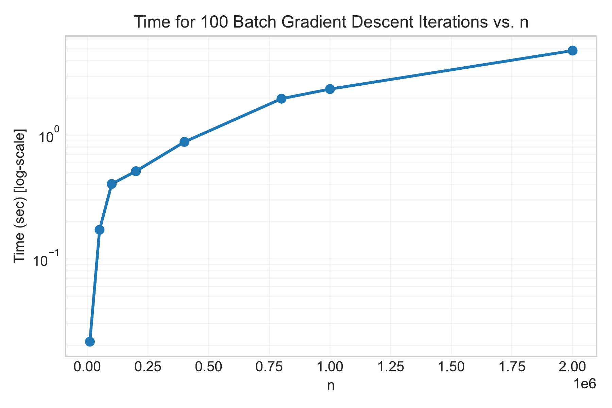
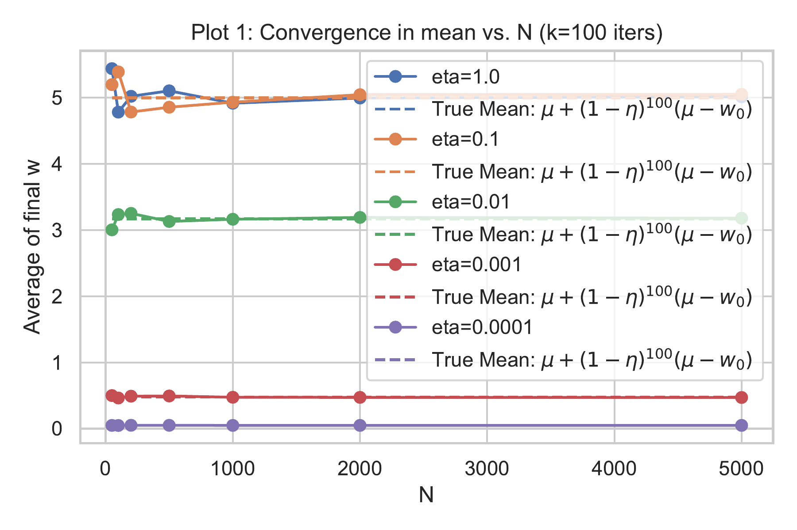
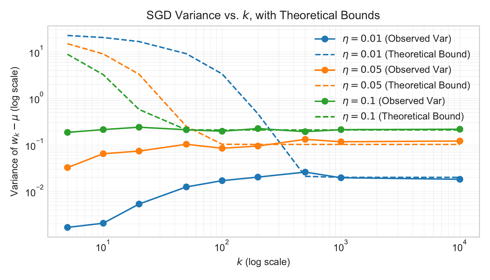
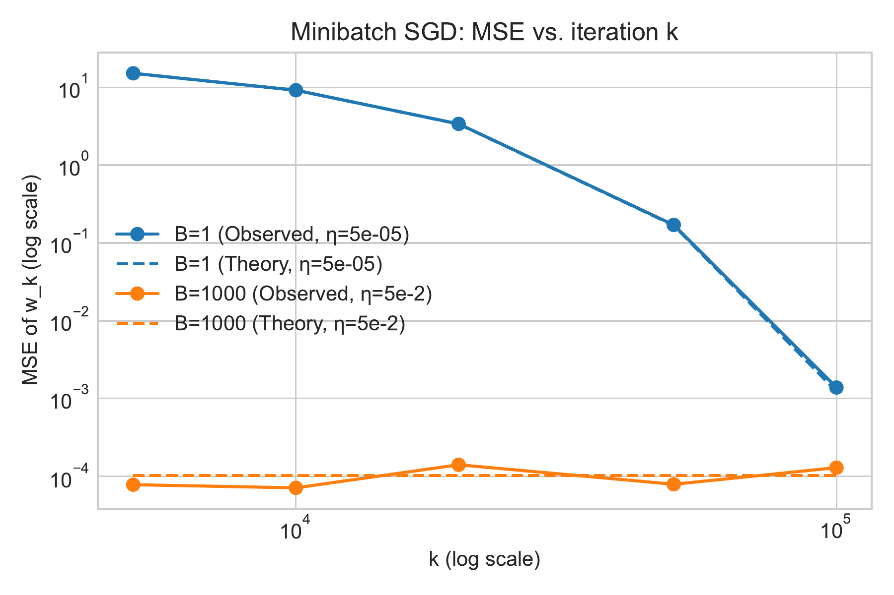
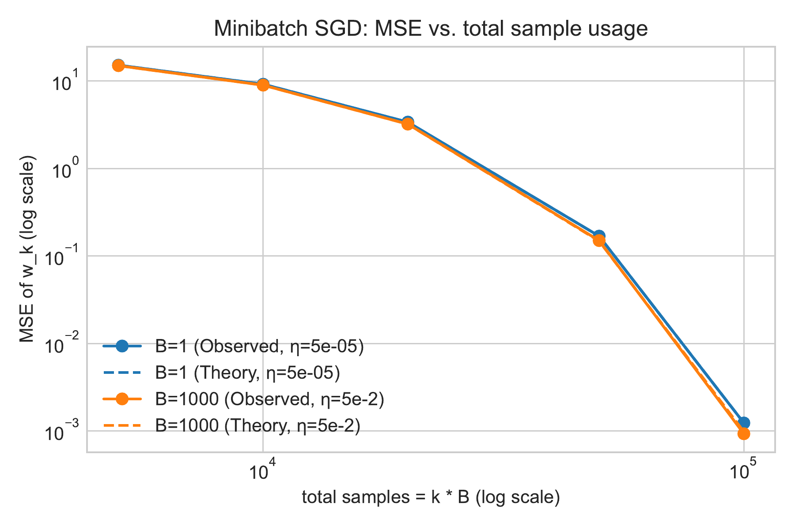

# Stochastic gradient descent: A first look

## Table of contents
1. [Introduction](#introduction)
2. [Stochastic gradient descent for large $n$ problems](#stochastic-gradient-descent-for-large-n-problems)
3. [Convergence in mean](#convergence-in-mean)
4. [Variance of the estimator](#variance-of-the-estimator)
5. [A curious fact: independence from $n$](#a-curious-fact-independence-from-n)

## Introduction

In this lecture, we address the computational challenges of solving a least squares problem when the number of samples $n$ is extremely large (often called the "big $n$" scenario). In previous lectures, we successfully applied full-batch gradient descent and even derived a closed-form solution for least squares. However, as $n$ grows into the millions or billions, naïve approaches break down due to memory and runtime constraints. To illustrate:

**Memory limitations:** Storing all $n$ samples in memory can be infeasible. For example, attempting to load a dataset of size $n = 10^{10}$ (10 billion samples) on a MacBook Pro with 64GB RAM results in an out-of-memory error. Even if each sample is simply an 8-byte float, the total memory required is $80$GB, which exceeds available RAM.

**Computation time:** Even a simple algorithm like gradient descent becomes *very slow* for large $n$ even with small $p = 10$. The cost per iteration scales linearly with $n$ because we must sum over all samples to compute the gradient. In a previous lecture, we noted that one full gradient descent step takes $O(pn)$ time. If $n$ is huge, just 100 iterations could be prohibitively time-consuming. The figure below illustrates the time for 100 gradient descent iterations as a function of $n$ on a log-log scale — the runtime grows roughly linearly with $n$.

*Figure: Computation time for 100 gradient descent iterations vs. number of samples $n$ (log scale for time).*

To solve the least squares for very large datasets, we need an approach that avoids holding all data in memory at once and reduces the cost per iteration. This motivates *stochastic gradient descent (SGD)* as an alternative. Instead of processing all $n$ samples in each iteration, SGD iteratively updates the model using one (or a few) randomly chosen sample(s) at a time. This stochastic approach dramatically lowers memory usage (we process one sample at a time) and often converges with far fewer full data passes than batch gradient descent. In practice, SGD can reach a good solution faster in wall-clock time for large $n$, despite the randomness. In the rest of this lecture, we formalize SGD for least squares and analyze its convergence properties.

## Stochastic gradient descent for large $n$ problems

Let's consider the least squares problem in a simple setting with $p = 1$ (a single parameter $w$). We have data samples $\{x_1, x_2, \dots, x_n\}$ (these are just real numbers). Our goal is to find $w$ that minimizes the average squared error to these samples:

$$
L(w) \;=\; \frac{1}{2n}\sum_{i=1}^n (x_i - w)^2\,.

$$

This objective $L(w)$ is exactly the mean squared error between the constant prediction $w$ and the data points $x_i$. Setting the derivative of $L(w)$ to zero confirms this that the minimizer of $L$ is simply the sample mean 

$$
w^* = \frac{1}{n}\sum_{i=1}^n x_i =: \mu\,
$$

Indeed, $L'(w) = -\frac{1}{n}\sum_{i}(x_i - w) = w - \mu,$ 
so $L'(w)=0 \implies w=\mu$. 

We can interpret $L(w)$ as an expectation. Define the *per-sample loss* for sample $i$ as 

$$
 \ell_i(w) = \tfrac{1}{2}(x_i - w)^2. 
$$
 
Then $L(w) = \frac{1}{n}\sum_{i}\ell_i(w) = \mathbb{E}_{i\sim \mathrm{Unif}\\{1,\dots,n\\}}[\ell_i(w)]$, the average of $\ell_i$ over all samples. In other words, if we pick an index $i$ uniformly at random from $\{1,\dots,n\}$, the expected loss is $L(w)$. This viewpoint lets us apply the techniques of *stochastic optimization:* rather than minimizing $L(w)$ directly, we can minimize it *indirectly* by sampling random data points and moving $w$ to reduce the loss on those samples.

**SGD update rule:** At iteration $k$, suppose our current estimate is $w_k$. We randomly sample one data point $x_{i_k}$ from our dataset (each index has probability $1/n$). We then take a gradient step *using only that sample's loss*. The gradient of the loss on sample $i_k$ is 

$$
 \nabla \ell_{i_k}(w_k) = \,\big(w_k - x_{i_k}\big)\,. 
$$
 
The SGD update is:

$$
 
w_{k+1} \;=\; w_k \;-\; \eta\, \nabla \ell_{i_k}(w_k) \;= \;=\; w_k - \eta\,(w_k - x_{i_k})\,. 

$$
 
We can rewrite this as:

$$
 
\boxed{w_{k+1} = (1-\eta)\,w_k \;+\; \eta\, x_{i_k}\,,} 

$$
 
where $0 < \eta \le 1$ is the step size (learning rate). This simple formula says: to update $w$, take a weighted average of the old value $w_k$ and the sampled data point $x_{i_k}$. 

Each SGD step pulls $w$ toward one randomly chosen data point. Over many iterations, $w$ will wander as it chases different samples. Intuitively, if we average these random steps, we hope to converge to the true mean $\mu$. Importantly, note that we never needed to load or process the entire dataset at once — each update uses just one $x_{i_k}$. This is why SGD is memory-efficient. Also, each iteration costs $O(1)$ time (constant, independent of $n$), versus $O(n)$ for a full gradient descent step. We are effectively trading off using many cheap, noisy updates instead of fewer expensive, exact updates. Next, we'll formalize the convergence behavior of this stochastic process.

## Convergence in mean

To analyze SGD, we will study the expected behavior of the iterate $w_k$. Because of the randomness in picking $i_k$, $w_k$ is a random variable. Let $\mathbb{E}[w_k]$ denote the expectation of $w_k$ over all random choices up to iteration $k$. We will also use conditional expectation: $\mathbb{E}[w_{k+1} \mid w_k]$ means the expected value of $w_{k+1}$ given the current state $w_k$ (conditioning on the history up to $k$). All randomness at step $k+1$ comes from the new random index $i_k$.

**Unbiased gradient estimator:** First, note that the stochastic gradient we use at step $k$ is $\nabla \ell_{i_k}(w_k) = (w_k-x_{i_k})$. Its expectation (conditioning on $w_k$) equals the true gradient of $L(w)$ at $w_k$:

$$
 
\mathbb{E}_{i_k}[\,\nabla \ell_{i_k}(w_k)\mid w_k] \;=\; \mathbb{E}_{i_k}[(w_k - x_{i_k}) \mid w_k] \;=\; (w_k - \mathbb{E}[x_{i_k} \mid w_k])  \;=\; w_k - \mu\,.

$$
 
Here we used $\mathbb{E}[x_{i_k}] = \mu$, since each data point is equally likely. But $w_k - \mu$ is exactly $\nabla L(w_k)$, the gradient of the full loss $L$ (as we derived earlier). Thus, $\mathbb{E}[\nabla \ell_{i_k}(w_k)] = \nabla L(w_k)$, meaning our randomly sampled gradient is an *unbiased estimator* of the true gradient.

**Expected update = gradient descent:** Because the gradient estimate is unbiased, the *expected change* in $w$ follows the deterministic gradient descent on $L(w)$. Formally, taking expectation of the update $w_{k+1} = w_k - \eta (w_k - \mu)$ (we plugged in $w_k - \mu$ for the expected gradient):

$$

\mathbb{E}[w_{k+1} \mid w_k] \;=\; w_k - \eta\,(w_k - \mu)\,. 

$$
 

This holds for the actual random update in expectation. Now take full expectation on both sides (over the randomness up to step $k$, which is completely determined by $i_0, \ldots, i_k$):

$$

\mathbb{E}[w_{k+1}] \;=\; \mathbb{E}[\,w_k - \eta (w_k - \mu)\,] \;=\; \mathbb{E}[w_k] - \eta\big(\mathbb{E}[w_k] - \mu\big)\,. 

$$
 

Let $m_k := \mathbb{E}[w_k]$. The above is a linear difference equation for $m_k$:

$$
 
m_{k+1} - \mu = (1-\eta)\,(m_k - \mu)\,. 

$$
 

This implies that the *expected error* from the optimum $\mu$ shrinks by a factor $(1-\eta)$ each iteration. Unrolling the recurrence (or by induction), we get:

$$
 
m_k - \mu = (1-\eta)^k (m_0 - \mu)\,. 

$$
 

Assuming initial weight $w_0$ (which is deterministic or independent of the sample choice), $m_0 = w_0$. Thus:

$$
 
\mathbb{E}[w_k] = \mu + (1-\eta)^k (w_0 - \mu)\,. 

$$

This is the convergence in mean result. As $k \to \infty$, $(1-\eta)^k \to 0$, so $\mathbb{E}[w_k] \to \mu$. In other words, *the expected value of the SGD iterate converges to the optimal solution*. Moreover, the rate of convergence is geometric: after $k$ steps, the expected error has been multiplied by $(1-\eta)^k$. For example, if $\eta = 0.1$, then $\mathbb{E}[w_k] - \mu = 0.9^k (w_0-\mu)$, which decays quite fast.

**Empirical illustration:** The figures below show the behavior of $w_k$ in simulations for different step sizes $\eta$. We generated a synthetic dataset with a known mean $\mu$ and ran SGD many times to estimate $\mathbb{E}[w_k]$. 

*Figure: Convergence in mean vs. N for different step sizes $\eta$. Each point shows the average final $w$ after $k=100$ iterations, averaged over N independent runs.*

As predicted by the theory, all runs converge toward $\mu$ on average. Larger $\eta$ values show a steeper initial drop (faster convergence in expectation), while smaller $\eta$ values converge more slowly. The solid lines represent the average $w_k$ over many trials, and the dashed lines show the theoretical formula $\mu + (1-\eta)^k(w_0-\mu)$ — they match closely.

*Figure: Convergence of a single iterate run of $w_k$ vs. number of iterations $k$ for different step sizes $\eta$.*

Despite the fast convergence in mean, individual SGD runs can exhibit high variability. With a large step size, a single run of $w_k$ might oscillate around $\mu$ or jump back and forth, even though on average it's centered at $\mu$. In fact, our analysis above shows $\mathbb{E}[w_k]$ converges, but does not tell us how concentrated $w_k$ is around that mean. In practice we observe a trade-off: larger $\eta$ gives faster convergence in expectation, but typically *higher variance* in the sequence $\{w_k\}$. We explore this next by analyzing the variance of $w_k$.

## Variance of the estimator

We now quantify the variability in the SGD iterate $w_k$. Even though $\mathbb{E}[w_k] \to \mu$, the individual sequence does not converge to $\mu$ almost surely for a fixed $\eta>0$ — it will keep fluctuating due to the random sampling. To measure this, we look at the mean squared error $\mathbb{E}[(w_k - \mu)^2]$, which captures both the variance and bias of $w_k$ relative to the optimum. Indeed, note that since $\mathbb{E}[w_k- \mu] = (1-\eta)^k(w_0 - \mu)$, the random variable $X = w_k - \mu$ satisfies: 

$$
\text{Var}(X) = \mathbb{E}[X^2] - \mathbb{E}[X]^2 \leq  \mathbb{E}[X^2] = \mathbb{E}[(w_k - \mu)^2]
$$

Thus, to bound the variance of $w_k - \mu$ it's sufficient to bound $\mathbb{E}[(w_k - \mu)^2]$. 

Starting from the update $w_{k+1} = (1-\eta)w_k + \eta\,x_{i_k}$, let's derive a recurrence for the second moment of the error $e_k := w_k - \mu$. First rewrite the update in terms of $e_k$:

$$

\begin{aligned}
w_{k+1} - \mu &= (1-\eta)w_k + \eta x_{i_k} - \mu \\
&= (1-\eta)(w_k - \mu) + \eta(x_{i_k} - \mu) \\
&= (1-\eta)\,e_k + \eta\,\underbrace{(x_{i_k} - \mu)}_{\text{random sample deviation}}\,.
\end{aligned}

$$

Now square both sides and take expectation. It's helpful to use the law of total expectation, conditioning on $w_k$ (thus on $e_k$):

$$

\begin{aligned}
&\mathbb{E}\big[(w_{k+1}-\mu)^2 \mid w_k\big] \\
&\;=\; (1-\eta)^2 e_k^2 \;+\; 2(1-\eta)\eta\, e_k\,\mathbb{E}[\,x_{i_k}-\mu \mid w_k] \;+\; \eta^2 \mathbb{E}[\,(x_{i_k}-\mu)^2 \mid w_k]\,.
\end{aligned}

$$

Given $w_k$, the only randomness is in $x_{i_k}$. We know $\mathbb{E}[x_{i_k}-\mu]=0$, by definition of $\mu$, so the middle term drops out. Also, $\mathbb{E}[(x_{i_k}-\mu)^2]$ is just the variance of a random sample from our dataset. Let 

$$
 
\sigma^2 := \frac{1}{n}\sum_{i=1}^n (x_i - \mu)^2 

$$
 
denote the sample variance of the data (the average squared deviation from $\mu$). This is $\mathrm{Var}(x_{i_k})$. Substituting these facts:

$$

\mathbb{E}\!\big[(w_{k+1}-\mu)^2 \mid w_k\big] \;=\; (1-\eta)^2 e_k^2 \;+\; \eta^2\,\sigma^2\,.

$$

Now take full expectation on both sides (over the randomness of $w_k$ up to step $k$):

$$

\mathbb{E}[(w_{k+1}-\mu)^2] \;=\; (1-\eta)^2\,\mathbb{E}[(w_k-\mu)^2] \;+\; \eta^2\,\sigma^2\,.

$$

This is a recurrence for the second moment (mean squared error). It shows that two things influence $E[(w_{k+1}-\mu)^2]$: 
- The previous error is scaled by $(1-\eta)^2$ (which is $<1$, causing decay), 
- but we add an extra $\eta^2\sigma^2$ due to the *variance of the new random sample*.

We can solve this recurrence by unrolling it for $k$ steps. Let $A_k := \mathbb{E}[(w_k-\mu)^2]$. Let's try to unroll it by one step: 

$$

\begin{aligned}
A_{k+1} &= (1-\eta)^2 A_k + \eta^2 \sigma^2 \\
&= (1-\eta)^2 \left( (1-\eta)^2 A_{k-1} + \eta^2 \sigma^2 \right) + \eta^2 \sigma^2 \\
&= (1-\eta)^4 A_{k-1} + \eta^2 \sigma^2 \left( (1-\eta)^2 + 1 \right).
\end{aligned}

$$

If we continue this process, we get:

$$

A_{k} \;=\; (1-\eta)^{2k} A_0 \;+\;  \eta^2\sigma^2 \sum_{j=0}^{k-1} (1-\eta)^{2j}\,. 

$$
 

Here $A_0 = (w_0-\mu)^2$ is the initial error. The summation accounts for all the $\eta^2\sigma^2$ noise added at each iteration (discounted by factors of $(1-\eta)^2$ as we move further in the past). This is a finite geometric series. Using the sum formula $\sum_{j=0}^{k-1} r^j = \frac{1-r^k}{1-r}$ for $r=(1-\eta)^2$, we get:

$$

A_k = (1-\eta)^{2k}(w_0-\mu)^2 \;+\; \eta^2 \sigma^2 \frac{1 - (1-\eta)^{2k}}{1 - (1-\eta)^2}\,. 

$$
 

Since $1 - (1-\eta)^2 = 2\eta - \eta^2$, we can simplify the second term:

$$

\begin{aligned}
A_k &\;=\; (1-\eta)^{2k}(w_0-\mu)^2 \;+\; \frac{\eta^2}{\eta(2-\eta)}\sigma^2\Big[1 - (1-\eta)^{2k}\Big] \\
&\;=\; (1-\eta)^{2k}(w_0-\mu)^2 \;+\; \frac{\eta}{2-\eta}\,\sigma^2\Big[1 - (1-\eta)^{2k}\Big]\,.
\end{aligned}

$$

This formula describes how the mean squared error evolves. As $k\to\infty$, $(1-\eta)^{2k}\to 0$ and we approach an asymptotic error of $\frac{\eta}{2-\eta}\sigma^2$. For example, if $\eta=0.1$, the long-run MSE approaches $\frac{0.1}{1.9}\sigma^2 \approx 0.0526\,\sigma^2$. If $\eta=1$ (very large step), the asymptotic error is $\sigma^2/2$, which makes sense: with $\eta=1$, each $w_{k+1}=x_{i_k}$ is just a random sample, so $w_k$ never averages out the noise at all (its variance equals the data variance). On the other hand, as $\eta \to 0$, the asymptotic error $\frac{\eta}{2-\eta}\sigma^2 \approx \frac{\eta}{2}\sigma^2$ becomes very small — but of course $\eta$ very small means $w_k$ moves extremely slowly.

We next upper bound $(1-\eta)^{2k} \le 1$ and $1 - (1-\eta)^{2k} \le 1$ to get:

$$
 
\mathbb{E}[(w_k - \mu)^2] \;\le\; (1-\eta)^{2k}(w_0-\mu)^2 \;+\; \eta\,\sigma^2\,.

$$
 
The main takeaway is that the first term decays exponentially fast, while the second term is roughly on the order of $\eta$ (for small $\eta$) – a *constant floor* that does not vanish with $k$.

**Trade-off:** This variance analysis highlights the  trade-off in choosing the step size $\eta$:
- A larger $\eta$ makes $(1-\eta)^k$ shrink faster, so the bias term $(1-\eta)^{2k}(w_0-\mu)^2$ disappears quickly – meaning $w_k$ in expectation reaches near $\mu$ in just a few iterations. However, a large $\eta$ inflates the noise term $\eta\,\sigma^2$, leading to higher variance in $w_k$. The iterates will fluctuate significantly around $\mu$ and never settle.
- A smaller $\eta$ reduces the variance injected each step – in the limit $\eta\to0$, the noise term is negligible and $w_k$ would concentrate tightly (eventually $w_k$ would converge to $\mu$). But too small $\eta$ means $(1-\eta)^k$ decays very slowly, so the convergence to the optimum in expectation is extremely slow.

In practice, one must choose $\eta$ to balance this trade-off: we want $\eta$ large enough for quick progress, but not so large that the solution is overly noisy. For fixed $\eta$, SGD will *not* fully converge to the exact optimum $\mu$; it will hover around it with some variance. To actually get arbitrarily close to $\mu$, a common strategy is to *decrease $\eta$ over time*. For example, using a step size that decays as $\eta_k \sim \frac{\log k}{k}$ (approximately on the order of $1/k$) is known to convergence of the form $\mathbb{E}[(w_k-\mu)^2] = O(\log(k)/k)$ as $k\to\infty$ (the noise floor vanishes). However, decreasing step sizes complicate the analysis, so for now we focused on constant $\eta$ to illustrate the basic phenomena.

The figure below shows the empirical variance of the SGD iterates compared to our theoretical bounds:

*Figure: The of SGD iterates vs. number of iterations k (log-log scale). Solid lines show observed variance, dashed lines show theoretical bounds. Different colors represent different step sizes $\eta$.*

## A curious fact: independence from $n$

An especially striking aspect of our analysis is that *none of our convergence guarantees explicitly depend on the number of samples* $n$. In other words, the key theoretical results hold regardless of whether we have $n = 10$ or $n = 10^{10}$. All that matters is:

1. Our initial distance $(w_0 - \mu)$ to the true mean, and  
2. The variance $\sigma^2$ of the distribution generating the samples.

We initially framed the setting as having $n$ fixed data points $\{x_i\}$, each drawn from a uniform distribution over the indices $\{1,\dots,n\}$. However, if we interpret $\{x_i\}$ as i.i.d. samples from an underlying distribution $\mathcal{D}$, we can simply view $x_{i_k}$ as an independent draw from $\mathcal{D}$ at each SGD step. The mean of that distribution is $\mu$, and the variance is $\sigma^2$. The identical update analyses still apply as long as each step's sample $x_{i_k}$ has expectation $\mu$ and variance $\sigma^2$. 

Hence, even if the sample space is continuous (e.g., $x_i\sim\mathcal{N}(\mu, \sigma^2)$), and we draw a fresh $x_{i_k}$ at every iteration from that continuous distribution, the same proofs hold. We never used anything special about the discrete nature or the finite size $n$. Our SGD update formulas and convergence in mean argument relied only on the unbiasedness of $\nabla \ell_{i_k}(w_k)$ and the boundedness of its variance. As a result, the entire analysis generalizes seamlessly to large-scale or infinite-sample scenarios—a fact that underscores the power of stochastic gradient approaches in real-world machine learning, where data can indeed be extremely large or even effectively unlimited.

### Mini-batching as a variance reduction technique

To reduce variance in the updates, one can *average* multiple samples at each step. Concretely, at iteration $k$, sample a mini-batch of size $B$, say $\{ x_{i_k^1}, \dots, x_{i_k^B} \}$, each drawn from $\mathcal{D}$. Then:

$$

w_{k+1}
\;=\;
(1 - \eta)\,w_k 
\;+\;
\eta\,\frac{1}{B}\sum_{b=1}^{B} x_{i_k^b}.

$$

Because the variance of $\frac{1}{B}\sum x_{i_k^b}$ is $\frac{\sigma^2}{B}$, the variance floor of $\\|w_k - \mu\\|$ shrinks by a factor of $B$. Indeed, to see why, note that for any iid sequence $X_1, \ldots, X_B$ of a random variable $X$, we have:

$$

\mathrm{Var}\left(\frac{1}{B}\sum_{b=1}^{B} X_b\right) = \frac{1}{B^2} \sum_{b=1}^{B} \mathrm{Var}(X_b) = \frac{1}{B^2} \cdot B \cdot \mathrm{Var}(X) = \frac{\mathrm{Var}(X)}{B}, 

$$

where we used the fact that the variance distributes across sums of iid random variables and the variance of each term is $\mathrm{Var}(X)$.

Taking this reduction into account, the corresponding bound becomes:

$$

\mathbb{E}[\|w_k - \mu\|^2]
\;\le\;
(1-\eta)^{2k}\,\|w_0 - \mu\|^2
\;+\;
\frac{\eta\,\sigma^2}{B\,(2-\eta)}.

$$

Thus, increasing the batch size $B$ can reduce the limiting variance floor. However, each iteration now costs roughly $B$ times more sampling/gradient-computation effort. In practice, parallelism can mitigate this overhead, but the sample usage per iteration does scale with $B$.  

This is why one considers the notion of *sample complexity* in machine learning. Sample complexity is the number of samples required to achieve a certain accuracy. When one cares about sample complexity, one should track the *total number of samples drawn* throughout the entire run. For example, if each iteration uses batch size $B$, then after $k$ steps we have used $k  B$ samples. 

So then how do we compare the result of running SGD with batch size $B$ with batch size $1$? Suppose that we run SGD with batch size $B$ and stepsize $\eta$ for $k$ iterations. Let $w_k^{(B)}$ be the final iterate. On the other hand, suppose that we run vanilla SGD with stepsize $\eta/B$ for $k B$ iterations. Let $w_{k  B}^{(1)}$ be the final iterate. Then our bounds are 
$$
\begin{aligned}
\mathbb{E}[\|w_k^{(B)} - \mu\|^2] &\leq (1-\eta)^{2k}\,\|w_0 - \mu\|^2 + \frac{\eta\,\sigma^2}{B\,(2-\eta)} \\
\mathbb{E}[\|w_{k  B}^{(1)} - \mu\|^2] &\leq (1-\eta/B)^{2k  B}\,\|w_0 - \mu\|^2 + \frac{\eta\,\sigma^2}{B\,(2-\eta/B)}.
\end{aligned}
$$

Since $\eta < 1$, the variance floor of both methods is roughly the same. On the other hand, since 

$$
(1-\eta/B)^{2k  B} \approx (1-\eta)^{2k}
$$

the initialization dependence is also the same. So really, there is no free lunch in terms of raw sample complexity even though the wall clock time can be different. 

<!-- Empirically, one often sees that using a batch of size $B$ may converge in $1/B$ times fewer *iterations* to the same accuracy, but each iteration is more expensive by a factor of $B$. The net sample usage is thus similar. Still, mini-batching can be valuable when hardware parallelization allows simultaneous processing of each batch element. Thus, the *sample complexity* of both methods will be the same, but the *wall clock time* can be different given access to parallel computing.

The equivalence between the sample complexity of minibatched and vanilla SGD is only true when the stepsize is set correctly. For example, if one chooses the stepsize as $\eta = 1/B$

Generally, minibatched when moving from a batch of size $1$ to $B$, we should asymptotically increase the stepsize by a factor of $B$. This can be gleaned from the formula above for the expected squared error, which is a sum of $(1-\eta)^{2k}$ and $\frac{\eta\,\sigma^2}{B\,(2-\eta)}$. If we intend to run $k$ iterations, then the fixed stepsize that minimizes the above expression will be proportional to $B\ln(2k)/k$.  -->

**Numerical experiment with two plots**  
Below is a Python script (`s5_minibatch_experiment.py`) that demonstrates minibatch mean estimation under a Gaussian distribution $\mathcal{N}(\mu,\sigma^2)$. It produces **two figures**:

1. **MSE vs. iteration index** $(k)$, on a log-log scale.  
2. **MSE vs. total sample usage** $(k \times B)$, also on a log-log scale.

In both figures, we compare batch size $1$ with batchsize $B = 1000$ and overlay a dashed line indicating the theoretical bound. For batch size $1000$, we use a stepsize of $\eta = 5e-2$. For batch size $1$, we use a stepsize of $\eta = 5e-2/B = 5e-5$.

*Figure: MSE vs. iteration k (log scale) for different batch sizes B. Solid lines show observed MSE, dashed lines show theoretical bounds.*

*Figure: MSE vs. total sample usage k×B (log scale) for different batch sizes B. Solid lines show observed MSE, dashed lines show theoretical bounds.*

**Interpretation**:

- In the **first figure**, larger batch sizes $B$ converge in *fewer iterations* to a small variance floor.
- In the **second figure**, we re-plot that same MSE curve against the total sample usage $k \times B$. Here, curves for batch size $1$ and batch size $1000$ are nearly identical. Indeed, mini-batching achieves fewer *iterations*, but each iteration processes more samples.  

