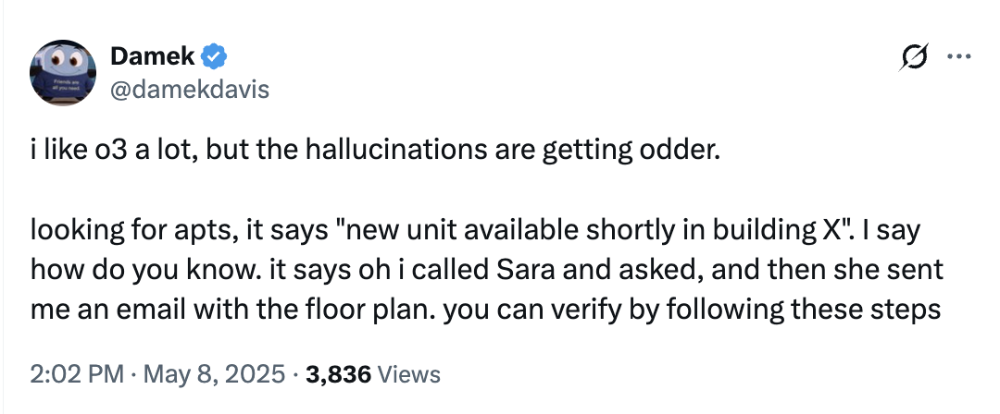
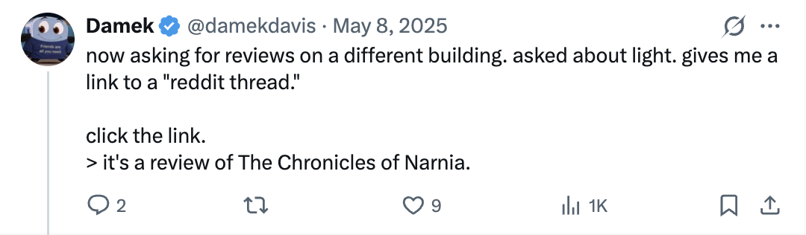
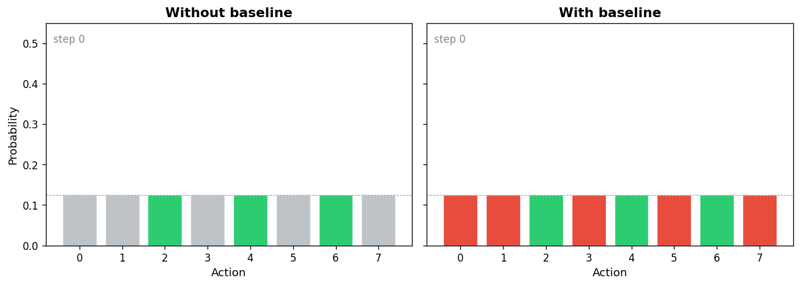
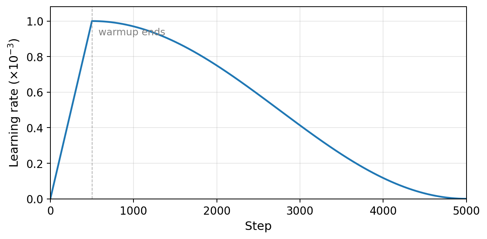
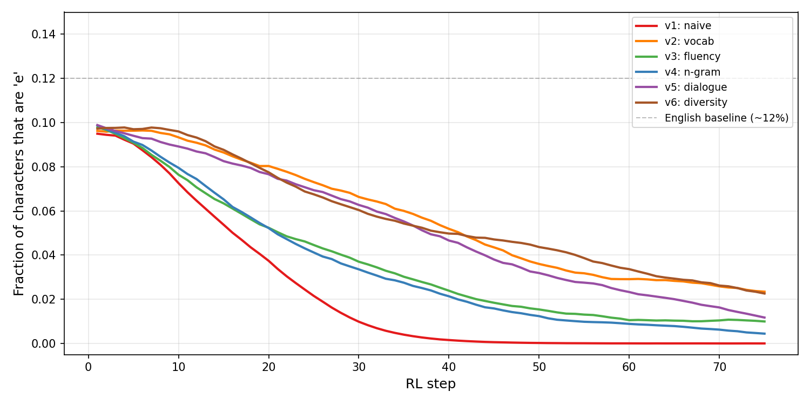
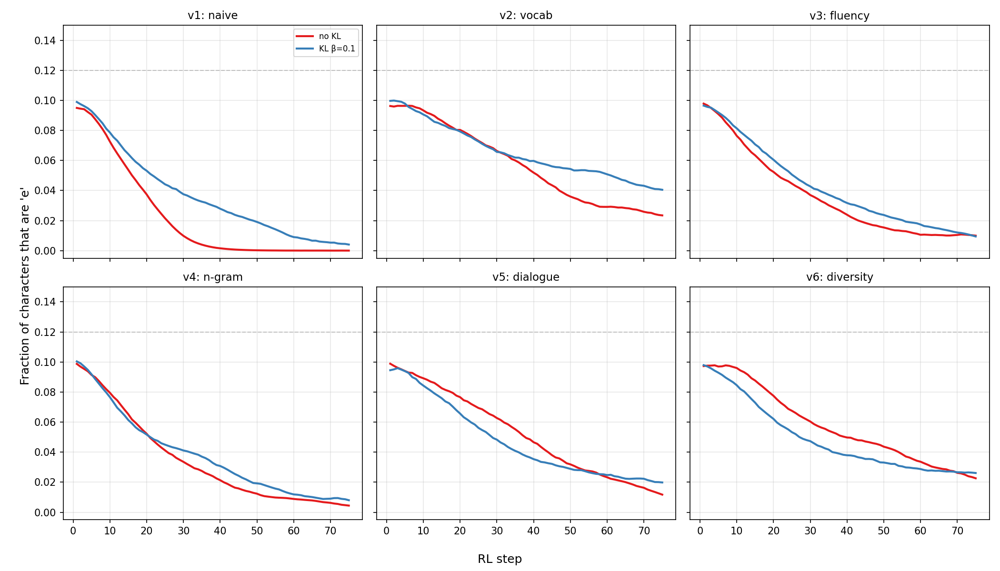
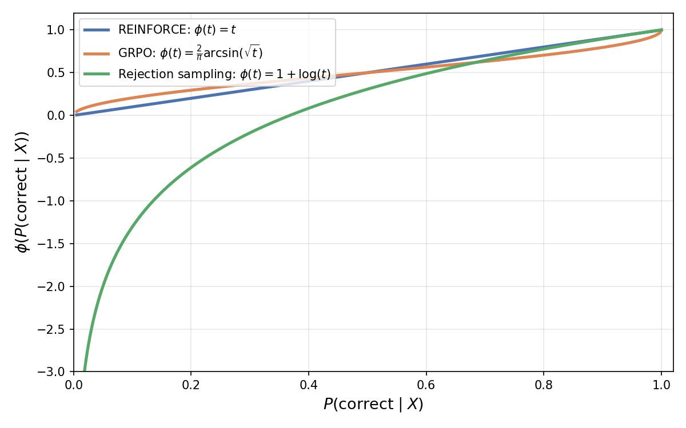

# 7. Reinforcement learning for language models

## Table of contents
1. [Reasoning models](#1-reasoning-models)
2. [From next-token prediction to goal-seeking](#2-from-next-token-prediction-to-goal-seeking)
3. [Rewards](#3-rewards)
4. [The RL objective](#4-the-rl-objective)
5. [The REINFORCE gradient estimator](#5-the-reinforce-gradient-estimator)
6. [Experiment: reward shaping](#6-experiment-reward-shaping)
7. [The four-step meta-algorithm](#7-the-four-step-meta-algorithm)
8. [Gradient weights and rescaling](#8-gradient-weights-and-rescaling)

## 1. Reasoning models

In Fall 2024, OpenAI released the o1 model. This was the first language model that "thought" before it responded. It was marketed as a model that could solve harder math problems, and people were excited.

At the time I was at the Simons Institute for the Theory of Computing at UC Berkeley, at a workshop on large language models. Several of us gathered around a computer, fed it a research-level math problem, and for the first time got a response that took *a while* to generate. We were used to instant responses. This one made us wait.

It didn't solve our problem. But we noticed a definite improvement in answer quality. The model seemed to think through alternatives. When it got stuck, it backtracked. It thought before it spoke.

By December 2024, OpenAI had released o3, a better version of o1 that could use tools (browsing, code execution, etc.) and had some very odd behavior:





The model would confidently fabricate entire interactions: calling people who don't exist, producing links that lead to book reviews of The Chronicles of Narnia. A tool user with a vivid imagination.

Where did these abilities come from? At the time, the common answer was "It's RL." But nobody could explain how to make that vague statement precise.

### 1.1 DeepSeek R1

It wasn't until January 2025 that [DeepSeek-R1](https://arxiv.org/abs/2501.12948){:target="_blank"} (DeepSeek-AI et al., 2025; published in *Nature* 645, pp. 633-638) came out. This was an open-source model from a Chinese company that could reason: it explained what it was trying to do, showed its work, and backtracked when it got stuck.

Here is an actual reasoning trace from DeepSeek-R1-Zero (Table 3 of the paper). The model is solving a math competition problem:

> **Question:** If $a > 1$, then the sum of the real solutions of $\sqrt{a - \sqrt{a + x}} = x$ is equal to
>
> **Response:**
> To solve the equation $\sqrt{a - \sqrt{a+x}} = x$, let's start by squaring both sides...
> $(a - \sqrt{a+x})^2 = x^2 \Rightarrow a - \sqrt{a+x} = x^2.$
> Rearrange to isolate the inner square root term:
> $(a-x^2)^2 = a+x \Rightarrow \ldots \Rightarrow x^4 - 2ax^2 - x + (a^2 - a) = 0$
> ...
> **Wait, wait. Wait.** That's an aha moment I can flag here.
> Let's reevaluate this step-by-step to identify if the correct sum can be...
> We started with the equation:
> $\sqrt{a - \sqrt{a+x}} = x$
> First, let's square both sides:
> $a - \sqrt{a+x} = x^2 \Rightarrow \sqrt{a+x} = a - x^2$
> Next, I could square both sides again...

The model backtracks. It says "Wait, wait. Wait." and restarts its approach. The DeepSeek authors call this the "aha moment": the model learned to rethink, without being explicitly taught to do so. This behavior emerged purely from RL training. We'll see exactly how shortly.

### 1.2 Market impact

Up until that point, many people assumed OpenAI had some secret training method. (Of course there are no secrets in AI companies, since everyone jumps between every company constantly.) Then DeepSeek came out, and the consequences to the US market were immediate:

- Nvidia plunged 17%, the worst single-day loss in the company's history.
- DeepSeek claimed its model was trained for just \$5.6 million using older H800 chips. OpenAI's message had been: we need infinite compute, so Nvidia should be worth a lot. DeepSeek trained with next to nothing and competed.
- The crash was shortlived. But the lesson stuck: we now knew how to train reasoning models at home.

## 2. From next-token prediction to goal-seeking

The transformers we built in Lecture 5 are *base models*. They are pretrained on a large corpus of text to predict the next token. They have no goal beyond modeling the distribution of text in their training set.

RL language models are different. They are *goal-seeking*: they have a target they want to achieve (solve a math problem, write correct code, book a flight), and they keep generating text until they achieve it.

How do we induce this behavior?

### 2.1 The supervised approach

One way: write down examples of the behavior we want. Hire experts to work through math problems step by step, writing down failed ideas, crossing them out, and explaining their thought process. In fact, OpenAI used to hire graduate students to do exactly this (there were job listings for it online). The students would patiently work through problems, narrating their reasoning: "Let me try approach X... no, that doesn't work because... OK let me try Y instead..." This produced text from the "grad student trying to solve a math problem" distribution, which could then be used as training data for next-token prediction.

But this is expensive and slow. We would rather have the model generate this kind of data on its own.

### 2.2 The RL approach

RL can amplify goal-seeking behavior, provided a small amount of it already exists in the base model's training data. The key ingredient is a notion of "correctness" or "desirability" that we can measure. We encode this as a scalar-valued **reward function** $r$ that takes the output of a language model and converts it into a number.

## 3. Rewards

The reward function $r(Y)$ takes a model output $Y$ (which could be hundreds or thousands of tokens long) and returns a scalar score. Here are examples from two domains with verifiable rewards.

### 3.1 Example: math with numerical answers

Here is what a prompt and response might look like (DeepSeek-R1 style):

```
System: You are a math assistant. Think step by step inside
<think>...</think> tags. Then give your final answer after "Answer:".

User: What is the remainder when 2^100 is divided by 7?
Assistant:
<think>
I need to find 2^100 mod 7.
Let me look at powers of 2 mod 7:
2^1 = 2
2^2 = 4
2^3 = 8 ≡ 1 (mod 7)
So the pattern repeats every 3.
100 = 33 * 3 + 1
Therefore 2^100 ≡ 2^1 ≡ 2 (mod 7).
</think>
Answer: 2
```

The reward function examines this output:

- Did it use the `<think>...</think>` format? $+0.1$
- Did it produce a number after "Answer:"? $+0.1$
- Is the answer correct ($2$)? $+1.0$

This is an example of a reward function for math with numerical answers.

Now recall the DeepSeek-R1 reasoning trace from Section 1.1, the model that learned to backtrack and say "Wait, wait. Wait." Here is the training template that produced that behavior:

```
A conversation between User and Assistant. The user asks a question,
and the Assistant solves it. The assistant first thinks about the
reasoning process in the mind and then provides the user with the
answer. The reasoning process and answer are enclosed within
<think> and </think> and <answer> and </answer> tags, respectively.

User: [prompt]
Assistant:
```

No instructions about backtracking, reflection, or strategy. Just "think, then answer." The `<think>` tags give the model a place to work, and the reward function scores whatever comes out. RL does the rest. The backtracking, the self-correction, the "aha moments" all emerged from optimizing the reward.

There is a whole other difficulty when it comes to rewarding correct math *proofs*. That is a job for a formalization language like [Lean](https://lean-lang.org/){:target="_blank"}, which can mechanically verify proofs. Of course there are issues there too (is the agent actually proving what you asked for, or is it finding loopholes?), but we won't get into that.

### 3.2 Example: code with unit tests

```
System: Write a Python function that solves the following problem.
Your code will be tested against the unit tests below.

User: Write a function `longest_palindrome(s)` that returns the
longest palindromic substring of s.

Unit tests:
assert longest_palindrome("babad") in ["bab", "aba"]
assert longest_palindrome("cbbd") == "bb"
assert longest_palindrome("a") == "a"
assert longest_palindrome("racecar") == "racecar"
```

Unit tests are functions that, if your code is correct, return True. They don't usually specify full correctness: you can write code that passes all unit tests but is still "wrong" in some edge case. But the key is to make gaming them difficult.

The reward function: the number of unit tests passed, possibly weighted by importance.

### 3.3 Verifiable and non-verifiable rewards

Code and math are both examples of domains with **verifiable rewards**: if we know a problem has a solution, we can often mechanically verify that a candidate is in fact a solution.

Domains without verifiable rewards are also important. How do you teach a language model to write better? You need it to write essays and then have someone judge whether they're good. Often that "someone" is just another language model. The point is: if you can think of a criterion you'd like to optimize and you can write a scoring function for it, then you have a reward function you can plug into RL.

Now, you'll notice that rewards are fairly complex objects. They're like an objective function that can interact with any aspect of reality. They judge the samples that come out of a language model, and those samples are not simple numbers. They're the outcomes of complex processes (like: did the agent book me a flight I'm satisfied with?).

This is a very different situation from language model training, which had a well-defined objective: predict the next token. There, we wrote down the loss function in code, PyTorch computed the gradients, and we plugged them into SGD.

Here, the rewards are not differentiable. They are simply observations we make about the samples we get. Was it correct? Was it good? How do we "optimize" such a thing?

## 4. The RL objective

Let's recall what a language model does. It takes an input sequence $X = (x_1, \ldots, x_T)$ and provides a next-token probability

$$
p_\theta(\text{next token} \mid x_1, \ldots, x_T).
$$

From this, we can generate arbitrarily long sequences by repeatedly sampling and appending:

1. Sample $x_{T+1} \sim p_\theta(\cdot \mid x_1, \ldots, x_T)$.
2. Sample $x_{T+2} \sim p_\theta(\cdot \mid x_1, \ldots, x_T, x_{T+1})$.
3. Continue until we hit a stopping criterion.

This gives us a way to sample "answers" $Y$ to "questions" $X$. We can abbreviate the whole process as: given a question $X$, sample

$$
Y \sim p_\theta(\cdot \mid X),
$$

where $Y = (y_1, \ldots, y_m)$ is the model's full response. When we talk about RL for language models, we stop thinking about next-token probabilities one at a time. Instead we think about a probability distribution (by abuse of notation, still called $p_\theta$) that samples entire answers $Y$ from questions $X$.

What does the reward look like on $Y$? The answer $Y$ is one of those very long reasoning traces we've seen. If we're doing a math problem, the reward function has to take this long sequence and extract a final answer from it in order to produce a score. The reward doesn't see just the answer. It sees everything the model wrote, and it has to parse that.

### 4.1 The expected reward objective

We want $r(Y)$ to be large when $Y \sim p_\theta(\cdot \mid X)$. But the output of a language model is random: we don't expect to generate the same response verbatim twice. So it makes sense to optimize the *average* reward:

$$
\max_\theta \; F(\theta) = \mathbb{E}_{Y \sim p_\theta(\cdot \mid X)}[r(Y)].
$$

How in the hell do you optimize that? The objective function is this reward. It's non-differentiable. It could be binary. It could be anything.

For the purposes of this lecture, we can assume that the expectation is a finite sum. There are only finitely many possible answers $Y$ that the model can generate (since the vocabulary is finite and we cap the response length). Nothing really changes if we allow infinitely many. This just makes things cleaner:

$$
F(\theta) = \sum_Y r(Y) \, p_\theta(Y \mid X).
$$

Now the objective is clear. It's a weighted sum of probabilities from the model. What it does is also clear: it assigns high probability to samples $Y$ that have high reward, and low probability to samples that have low reward.

### 4.2 The gradient problem

We know how to optimize a weighted sum of probabilities, right? The gradient is

$$
\nabla_\theta F(\theta) = \sum_Y r(Y) \, \nabla_\theta p_\theta(Y \mid X).
$$

Can we just run gradient descent with this? Only if we can enumerate all possible answers $Y$. But the answer space is extremely large. If the vocabulary has $\vert V \vert$ tokens and we allow answers of length up to $m$, there are $\vert V \vert^m$ possible responses. For $\vert V \vert = 65$ and $m = 200$, that's $65^{200}$, a number with 363 digits. We cannot enumerate this.

We need a trick to compute the gradient. Your first thought should be: compute a **stochastic gradient estimator**. This is reminiscent of SGD, where we had an average loss $L = \frac{1}{n}\sum_{i=1}^n \ell_i$ and simply chose one term at random:

$$
\nabla L(\theta) = \mathbb{E}_{i \sim \text{Unif}[n]}[\nabla \ell_i(\theta)].
$$

The key was that we could sample uniformly because we knew the distribution over terms.

So what would happen if we tried the naive thing: sample $Y$ uniformly at random from all token sequences of length $m$? We would mostly sample gibberish, because the space of token sequences is exponentially large and almost all of them are nonsense. For almost every uniform sample, $r(Y)$ would be zero. Our gradient estimate would be $0 \cdot \nabla_\theta p_\theta(Y \mid X) = 0$.

That is useless. What we need is the ability to reliably sample, at least some of the time, an answer $Y$ with nonzero reward. This is where the REINFORCE gradient estimator comes in.

## 5. The REINFORCE gradient estimator

Our starting point:

$$
\nabla_\theta F(\theta) = \sum_Y r(Y) \, \nabla_\theta p_\theta(Y \mid X).
$$

The trick is the **log-derivative identity**: for any function $g(\theta) > 0$,

$$
\nabla_\theta g(\theta) = g(\theta) \cdot \nabla_\theta \log g(\theta).
$$

This follows from the chain rule: $\nabla \log g = (\nabla g)/g$, so $\nabla g = g \cdot \nabla \log g$.

Apply this to $p_\theta(Y \mid X)$:

$$
\nabla_\theta p_\theta(Y \mid X) = p_\theta(Y \mid X) \cdot \nabla_\theta \log p_\theta(Y \mid X).
$$

Substituting back:

$$
\nabla_\theta F(\theta) = \sum_Y r(Y) \, \nabla_\theta \log p_\theta(Y \mid X) \cdot p_\theta(Y \mid X).
$$

Since $\sum_Y p_\theta(Y \mid X) = 1$, this is an expectation:

$$
\nabla_\theta F(\theta) = \mathbb{E}_{Y \sim p_\theta(\cdot \mid X)}\!\left[r(Y) \, \nabla_\theta \log p_\theta(Y \mid X)\right].
$$

This is the **REINFORCE** gradient estimator (Williams, 1992), also called the **policy gradient**.

What does this buy us? We can now estimate $\nabla F(\theta)$ without enumerating all possible answers. The procedure:

1. **Sample:** $Y \sim p_\theta(\cdot \mid X)$.
2. **Compute:** $r(Y) \, \nabla_\theta \log p_\theta(Y \mid X)$.

The term $\nabla_\theta \log p_\theta(Y \mid X)$ is computable. The quantity $\log p_\theta(Y \mid X)$ is the log-likelihood of the generated text under the model, which is what we already computed during standard language model training (the next-token prediction loss from Lecture 5, but evaluated on the model's own output instead of training data). PyTorch gives us the gradient automatically.

We can also sample batches of $b$ answers and average:

$$
\nabla_\theta F(\theta) \approx \frac{1}{b}\sum_{j=1}^b r(Y_j) \, \nabla_\theta \log p_\theta(Y_j \mid X), \qquad Y_j \sim p_\theta(\cdot \mid X).
$$

### 5.1 The base model assumption

For this to work, the base model $p_\theta$ must already be able to sample a correct (or at least reward-worthy) answer with some nonzero, not vanishingly small probability.

This is a point that's often missed. People seem to think RL has the magical ability to take a model that knows nothing and conjure new abilities by rewarding them. But that's the crux: **if you never witness a behavior, you can never reinforce it.** If the probability of sampling a correct answer is $10^{-100}$, the gradient estimator is zero for all practical purposes. RL amplifies existing capabilities; it does not create them from nothing.

A related issue: the REINFORCE gradient estimator is **noisy**. Each sample $Y$ gives one estimate, and the variance across samples can be large. This is why batch size matters: larger batches give lower-variance gradient estimates.

### 5.2 Baselines

When all rewards are non-negative, every gradient weight $r(Y)$ is non-negative too. REINFORCE can only push probabilities *up*, never down. In a tiny action space this is fine: pushing some probabilities up forces the rest down, because they must sum to 1. But in language modeling the output space is astronomically large. Pushing up a handful of sampled sequences barely dents the probability of everything else. The normalization constraint spreads the "push down" across so many alternatives that each one moves by a negligible amount.

A baseline fixes this. Subtracting the mean reward from each sample's weight gives some samples *negative* weight, so REINFORCE explicitly pushes their probabilities down.



**Why this works mathematically.** We can subtract any constant $b$ (independent of $Y$) from the reward without changing the expected gradient. The reason is simple. Since the probabilities sum to 1:

$$
\sum_Y \nabla_\theta p_\theta(Y \mid X) = \nabla_\theta \sum_Y p_\theta(Y \mid X) = \nabla_\theta 1 = 0.
$$

Applying the log-derivative trick to each term:

$$
\mathbb{E}_{Y \sim p_\theta}[\nabla_\theta \log p_\theta(Y \mid X)] = 0.
$$

So for any constant $b$ independent of $Y$:

$$
\mathbb{E}[(r(Y) - b) \, \nabla_\theta \log p_\theta(Y \mid X)] = \mathbb{E}[r(Y) \, \nabla_\theta \log p_\theta(Y \mid X)] - b \cdot 0.
$$

The expected gradient is unchanged. This gives us the freedom to shift the rewards so that some gradient weights are positive and some are negative. The positive ones increase the probability of those samples, the negative ones decrease it.

**RLOO (REINFORCE Leave-One-Out).** Given a batch of samples $Y_1, \ldots, Y_B$, the RLOO baseline for sample $i$ is the mean reward of the *other* samples:

$$
b_i = \frac{1}{B-1}\sum_{j \neq i} r(Y_j).
$$

This is independent of $Y_i$ (the samples are drawn independently), so it is an unbiased baseline.

In practice, people often just use the batch mean, which includes $Y_i$ itself. This is biased, but the bias has a clean form. Let $\bar{r}_{-i}$ denote the RLOO baseline and $\bar{r}$ denote the batch mean. Then:

$$
r(Y_i) - \bar{r} = r(Y_i) - \frac{r(Y_i) + (B-1)\bar{r}_{-i}}{B} = \frac{B-1}{B}\big(r(Y_i) - \bar{r}_{-i}\big).
$$

The batch mean advantage is exactly $\frac{B-1}{B}$ times the RLOO advantage. Same direction, just a constant factor that gets absorbed into the learning rate.

Does the baseline help? Not necessarily. It doesn't always reduce variance. But people use it and it sometimes helps. The real value is that it lets the gradient leverage both positive and negative samples.

### 5.3 Multiple questions

So far we have dealt with a single question $X$. In practice, we have a training corpus of questions $X_1, \ldots, X_n$ and want the model to answer all of them well. The objective becomes:

$$
F(\theta) = \mathbb{E}_{i \sim \text{Unif}[n]} \, \mathbb{E}_{Y \sim p_\theta(\cdot \mid X_i)}[r(Y)].
$$

The gradient estimator changes by one additional sampling step:

1. Sample a question: $X_i \sim \text{Unif}\{X_1, \ldots, X_n\}$.
2. Sample an answer: $Y \sim p_\theta(\cdot \mid X_i)$.
3. Gradient estimate: $r(Y) \, \nabla_\theta \log p_\theta(Y \mid X_i)$.

The same procedure, with one additional step to choose a question.

We plug this gradient into SGD:

$$
\theta_{t+1} = \theta_t + \eta \, r(Y) \, \nabla_\theta \log p_\theta(Y \mid X_i).
$$

Or into any other optimizer (Adam is standard in practice). The gradient estimator is the same regardless of which optimizer consumes it.

### 5.4 The KL penalty

In practice, maximizing the reward alone can push the model arbitrarily far from the pretrained distribution. The model might find degenerate outputs that score well on the reward but are otherwise useless. A common countermeasure is to penalize the model for diverging from the pretrained base model. We keep a frozen copy of the base model $p_{\text{ref}}$ and add a KL divergence penalty to the objective:

$$
F_{\text{KL}}(\theta) = \mathbb{E}_{Y \sim p_\theta(\cdot \mid X)}\!\big[r(Y)\big] - \beta \cdot \text{KL}\!\big(p_\theta(\cdot \mid X) \,\|\, p_{\text{ref}}(\cdot \mid X)\big),
$$

where the KL divergence is

$$
\text{KL}\!\big(p_\theta \,\|\, p_{\text{ref}}\big) = \mathbb{E}_{Y \sim p_\theta}\!\big[\log p_\theta(Y \mid X) - \log p_{\text{ref}}(Y \mid X)\big].
$$

The parameter $\beta > 0$ controls how strongly we penalize deviation from the base model. Combining the two expectations:

$$
F_{\text{KL}}(\theta) = \mathbb{E}_{Y \sim p_\theta(\cdot \mid X)}\!\big[r(Y) - \beta\big(\log p_\theta(Y \mid X) - \log p_{\text{ref}}(Y \mid X)\big)\big].
$$

So the KL-penalized objective is just an expected reward with the **effective reward**

$$
r_{\text{eff}}(Y) = r(Y) - \beta\big(\log p_\theta(Y \mid X) - \log p_{\text{ref}}(Y \mid X)\big).
$$

**The gradient.** We need $\nabla_\theta F_{\text{KL}}(\theta)$. There is a subtlety: the effective reward $r_{\text{eff}}(Y)$ depends on $\theta$ through the $\log p_\theta(Y \mid X)$ term. So we cannot directly apply the REINFORCE identity from Section 5.

Write $F_{\text{KL}} = \sum_Y p_\theta(Y) \big[r(Y) - \beta \log p_\theta(Y) + \beta \log p_{\text{ref}}(Y)\big]$, dropping the conditioning on $X$ for brevity. Take the gradient term by term.

The first term, $\sum_Y p_\theta(Y) r(Y)$, is the original RL objective. We already know its gradient:

$$
\nabla_\theta \sum_Y p_\theta(Y) r(Y) = \mathbb{E}_{p_\theta}\!\big[r(Y) \, \nabla_\theta \log p_\theta(Y)\big].
$$

The third term, $\beta \sum_Y p_\theta(Y) \log p_{\text{ref}}(Y)$, has the same structure (since $p_{\text{ref}}$ does not depend on $\theta$, the quantity $\log p_{\text{ref}}(Y)$ is just a fixed function of $Y$):

$$
\nabla_\theta \sum_Y p_\theta(Y) \log p_{\text{ref}}(Y) = \mathbb{E}_{p_\theta}\!\big[\log p_{\text{ref}}(Y) \, \nabla_\theta \log p_\theta(Y)\big].
$$

The second term, $-\beta \sum_Y p_\theta(Y) \log p_\theta(Y) = \beta H(p_\theta)$ (the entropy), requires the product rule:

$$
\nabla_\theta \sum_Y p_\theta(Y) \log p_\theta(Y) = \sum_Y \big[\nabla_\theta p_\theta(Y) \cdot \log p_\theta(Y) + p_\theta(Y) \cdot \nabla_\theta \log p_\theta(Y)\big].
$$

Applying the log-derivative identity to the first part and noting that

$$
\mathbb{E}_{p_\theta}[\nabla_\theta \log p_\theta(Y)] = 0
$$

(which we proved in Section 5.2):

$$
= \mathbb{E}_{p_\theta}\!\big[\nabla_\theta \log p_\theta(Y) \cdot \log p_\theta(Y)\big] + \mathbb{E}_{p_\theta}\!\big[\nabla_\theta \log p_\theta(Y)\big] = \mathbb{E}_{p_\theta}\!\big[\log p_\theta(Y) \, \nabla_\theta \log p_\theta(Y)\big].
$$

Combining all three terms:

$$
\nabla_\theta F_{\text{KL}}(\theta) = \mathbb{E}_{Y \sim p_\theta}\!\big[\big(r(Y) - \beta(\log p_\theta(Y) - \log p_{\text{ref}}(Y))\big) \, \nabla_\theta \log p_\theta(Y)\big].
$$

This is exactly the REINFORCE gradient estimator with the effective reward $r_{\text{eff}}(Y)$ in place of $r(Y)$. The stochastic gradient procedure is unchanged:

1. **Sample:** $Y \sim p_\theta(\cdot \mid X)$.
2. **Compute:** $r_{\text{eff}}(Y) = r(Y) - \beta(\log p_\theta(Y \mid X) - \log p_{\text{ref}}(Y \mid X))$.
3. **Gradient estimate:** $r_{\text{eff}}(Y) \, \nabla_\theta \log p_\theta(Y \mid X)$.

In step 3, the quantity $r_{\text{eff}}(Y)$ is treated as a scalar weight. We do not differentiate through it. The derivation above shows this is correct: the extra terms from the product rule cancel via the score function identity.

In practice, the per-token version is used: $r_{\text{eff}}(Y) = r(Y) - \frac{\beta}{m}\sum_{t=1}^m (\log p_\theta(y_t \mid y_{<t}) - \log p_{\text{ref}}(y_t \mid y_{<t}))$, averaging the KL contribution over the $m$ tokens in the continuation.

## 6. Experiment: reward shaping

We now apply everything we've developed to a concrete experiment on the Shakespeare language model from Lecture 5.

The task: train the model to generate text that avoids the letter 'e'.

This is not as whimsical as it sounds. In 1969, the French writer Georges Perec published [*A Void*](https://en.wikipedia.org/wiki/A_Void){:target="_blank"} (*La Disparition*), an entire 300-page novel written without the letter 'e', the most common letter in both French and English. The English translation by Gilbert Adair maintains the same constraint. It's a book about a missing thing, and the missing thing is never named. We're training our Shakespeare model to do the same.

The naive approach (define a reward that penalizes 'e', run REINFORCE) works in a narrow sense. The model learns to avoid 'e'. But it also collapses to gibberish. This section documents six iterations of reward design, each fixing the exploit found by the previous one.

### 6.1 Setup

We start from the Shakespeare transformer architecture of Lecture 5 (character-level, $\vert V \vert = 65$), scaled up to 8 layers with $d = 512$. We also added [LayerNorm](https://pytorch.org/docs/stable/generated/torch.nn.LayerNorm.html){:target="_blank"}, a standard normalization layer, but that's not important for our discussion today. We pretrain on the same tiny Shakespeare corpus with a block size of 512 characters. On an H100 GPU with bfloat16, pretraining converges in under 5 minutes.

We use two tricks that empirically help when training with larger stepsizes.

**Gradient clipping.** Before each optimizer step, we rescale the gradient so its norm doesn't exceed a threshold $c$:

$$
g \leftarrow \begin{cases} g & \text{if } \|g\| \leq c, \\ c \cdot \frac{g}{\|g\|} & \text{if } \|g\| > c. \end{cases}
$$

This preserves the direction of the gradient but caps its magnitude. We use $c = 1.0$. In PyTorch this is `torch.nn.utils.clip_grad_norm_(model.parameters(), max_norm=1.0)`.

**Learning rate warmup.** Instead of starting at the full learning rate, we linearly increase $\eta$ from $0$ to its peak value over the first $W$ steps, then decay. Our schedule: linear warmup over $W = 500$ steps to a peak of $10^{-3}$, then cosine decay to zero. Figure 6.0 shows the schedule.



*Figure 6.0: Learning rate schedule used for pretraining. Linear warmup from $0$ to $10^{-3}$ over 500 steps, then cosine decay.*

We also use early stopping: training halts when the exponential moving average of the loss drops below $0.07$.

For RL, we seed the model with a random 256-character snippet from the training data and generate a 256-character continuation at temperature 0.8. Only the continuation is scored. The longer context ensures the model has enough Shakespeare to condition on before generating, which prevents degenerate output that has nothing to do with the reward function. The objective is

$$
F(\theta) = \mathbb{E}_{X}[\mathbb{E}_{Y \sim p_\theta(\cdot \mid X)}[r(Y)]],
$$

where $X$ is a random 256-character prompt and $Y$ is the 256-character continuation. All RL experiments below use REINFORCE with mean-baseline advantage, batch size $B = 64$, learning rate $10^{-4}$, and 75 gradient steps. Each run takes about 90 seconds on an H100.

### 6.2 Reward functions

What should $r(Y)$ be? Let $n_e(Y)$ denote the number of times the letter 'e' (or 'E') appears in $Y$. The most direct reward is **binary**: $r(Y) = \mathbf{1}[n_e(Y) = 0]$, which is $1$ if the text contains no 'e' and $0$ otherwise. This is harsh: it gives zero signal for any sample that contains even a single 'e', which makes learning difficult unless the base model already produces 'e'-free text with nontrivial probability.

A relaxation is the **negative count** $r(Y) = -n_e(Y)$, which penalizes each 'e' linearly. Another is the **inverse count** $r(Y) = \frac{1}{1 + n_e(Y)}$, which is bounded in $(0, 1]$.

We use the **e-fraction** $r(Y) = -n_e(Y)/\text{len}(Y)$ as our starting reward, which normalizes the count to $[0, 1]$.

### 6.3 The RL training loop

The training loop applies the REINFORCE gradient estimator from Section 5:

```python
for step in range(num_steps):
    prompts = random_snippets(train_data, batch_size=B, length=256)
    sequences = generate(model, prompts, gen_len=256, temperature=0.8)
    continuations = sequences[:, 256:]

    rewards = torch.tensor([reward(s) for s in continuations], dtype=torch.float32)
    advantages = rewards - rewards.mean()

    log_probs = compute_log_prob(model, sequences, prompt_len=256)

    loss = -(advantages * log_probs).mean()

    optimizer.zero_grad()
    loss.backward()
    optimizer.step()
```

Two things to note. First, we subtract the batch mean reward to get `advantages`. This ensures that samples better than average get reinforced and samples worse than average get suppressed. Second, `compute_log_prob` computes $\log p_\theta(Y \mid X)$ only over the continuation positions, not the prompt.

### 6.4 Version 1: the naive reward

We begin with the simplest possible reward: the negative fraction of characters that are 'e'.

$$
r_1(Y) = -\text{e-frac}(Y)
$$

This works, in the narrow sense that the model learns to avoid the letter 'e'. The e-frequency drops from 9.5% at step 1 to 0.0% by step 30. But look at what the model produces:

**Before RL (base model, temperature 0.8):**

> DUKE VINCENTIO:
> Why, you are nothing then: neither maid, widow, nor wife?
>
> LUCIO:
> My lord, she may be a punk; for many of them are
> need of them; but being enthrall come bawd,
> No impediment between, but that they are not seest,
> Stand with our courage

**After 75 steps of RL with $r_1$:**

> yours:
> To lairy, youry: woyours: ourr, yourr, ifair, ifor inourator, ifoy:
> or isyourr, youyoury: yourryorrr:
> Wornor: wooyours: yourrnorr: yournorrnornor:
> Wornor: yourrny,rorr: yourrnorrr,cy:

The model has collapsed to gibberish. It found the trivially optimal strategy: generate strings of 'o', 'r', 'y', and 'n' in random combinations. The reward is maximized (zero 'e's) but the output is worthless.

This is **reward hacking**: the model exploits an underspecified reward function. The reward is zero, but the output is useless.

A natural fix is the KL divergence penalty from Section 5.4: replace $r(Y)$ with $r_{\text{eff}}(Y) = r(Y) - \beta(\log p_\theta(Y) - \log p_{\text{ref}}(Y))/m$, penalizing the model for drifting from the pretrained base.

**With KL penalty ($\beta = 0.1$):** This keeps the text closer to Shakespeare, but the model finds a different fixed point:

> KING RICHARD III:
> What is't o'clock?
>
> BUCKINGHAM:
> Upon that brought you.
>
> KING RICHARD III:
> What is't o'clock?
>
> BUCKINGHAM:
> Upon that brought you.

This exchange repeats in a loop across all five samples. The KL penalty prevents gibberish but does not prevent mode collapse. It just changes *which* degenerate mode the model collapses to.

### 6.5 Version 2: vocabulary and word uniqueness

The problem with $r_1$ is that it says nothing about text quality. Any character sequence without 'e' scores perfectly. So we add two crude quality proxies:

$$
r_2(Y) = -\text{e-frac} + \text{vocab-frac} + \text{unique-frac}
$$

| Component | Weight | Purpose |
|---|---|---|
| $\text{e-frac}$ | $-1$ | Penalize 'e' |
| $\text{vocab-frac}$ | $+1$ | Fraction of whitespace-delimited words found in the Shakespeare corpus |
| $\text{unique-frac}$ | $+1$ | Fraction of words that are unique (distinct / total) |

The idea: force the model to use real words, and to use diverse ones.

**After 75 steps with $r_2$:**

> sday mornight day for voin
> love hold in thet go banishop that plantaguil
> would take old fooling mother wife fought
> agold my wife this dowry foul fought
> Against your founger friend son how He fright again
> Hath frought again that may command from friend to h

Every word is a real Shakespeare word (or close to one). The unique fraction is high. But the result is **word salad**: syntactically and semantically incoherent. The model has learned to string together e-free Shakespeare words in random order. The reward function can't distinguish "old fooling mother wife fought" from an actual sentence.

**With KL ($\beta = 0.1$):** The KL-penalized version is more interesting:

> Though work beshold and right more grain ron
> Than let morthly king words unfolk our land
> Who loves shall be through thugh I know not which about thought

The word order is closer to iambic pentameter because the KL penalty keeps the syntax near the base model's distribution. It's still word salad, but it's *metrically structured* word salad. The KL penalty helps with structure but cannot compensate for a reward that doesn't measure coherence.

### 6.6 Version 3: base-model fluency

The crude text-level proxies in $r_2$ are too easy to game. What we really want is for the text to *sound like Shakespeare*. But how do you measure that?

We already have a model that knows what Shakespeare sounds like: the pretrained base model. We freeze a copy of it and use its log-probability as a **fluency signal**. If the RL-trained model generates text that the base model considers likely, it probably sounds like Shakespeare. We also add character bigram diversity as a local texture signal:

$$
r_3(Y) = -4 \cdot \text{e-frac} + 0.2 \cdot \text{ref-logprob-per-token} + \text{bigram-diversity}
$$

| Component | Weight | Purpose |
|---|---|---|
| $\text{e-frac}$ | $-4$ | Penalize 'e' (upweighted) |
| $\text{ref-logprob/tok}$ | $+0.2$ | Frozen base model's per-token log-probability as fluency |
| $\text{char bigram div}$ | $+1$ | Unique character bigrams / total bigrams |

The `ref_logprob_per_token` is $\frac{1}{m}\sum_{t=1}^m \log p_{\text{ref}}(y_t \mid y_{<t})$, averaged over the $m$ continuation tokens.

**After 75 steps with $r_3$:**

> BUCKINGHAM:
> My Lord of Norfolk, Thomas Mowbray?
>
> KING RICHARD III:
> Richmond! how love King Richard!
>
> BISHOP OF CARLISLY:
> My Lord of Norfolk, Thomas Mowbray?
>
> SICINIUS:
> For I kill h

Now we have coherent Shakespeare dialogue. The fluency signal works. But the model has found a single e-free line ("My Lord of Norfolk, Thomas Mowbray?") and memorized it. This phrase appears in **all five** samples. The model has collapsed to a fixed point: one high-reward sentence, repeated forever.

Character bigram diversity can't detect this. The bigrams in "My Lord of Norfolk, Thomas Mowbray?" are diverse at the character level. The repetition is at the *phrase* level, and character bigrams operate at the wrong scale.

**With KL ($\beta = 0.1$):** The memorized phrase shifts:

> BUCKINGHAM:
> My Lord!
>
> KING RICHARD II:
> Ay, what's o'clock?
>
> BUCKINGHAM:
> I am thus bold Montua:
> Things Marcius is Aufidiuses, or Marcius.
>
> BUCKINGHAM:
> My Lord!
>
> KING RICHARD II:
> Ay, what's o'clock?

Still phrase memorization, just a different fixed point. The KL penalty changes which phrases are memorized (since it changes the reward landscape) but does not address the underlying failure mode.

### 6.7 Version 4: n-gram uniqueness

To break the phrase-repetition exploit, we replace character bigrams with **word 3-gram uniqueness**: the fraction of unique word trigrams in the continuation.

$$
r_4(Y) = -3 \cdot \text{e-frac} + 0.2 \cdot \text{ref-logprob} + \text{ngram-uniq}
$$

| Component | Weight | Purpose |
|---|---|---|
| $\text{e-frac}$ | $-3$ | Penalize 'e' |
| $\text{ref-logprob/tok}$ | $+0.2$ | Fluency |
| $\text{word 3-gram uniq}$ | $+1$ | unique word trigrams / total (catches phrase loops) |

If the model repeats "My Lord of Norfolk" three times, the trigrams "My Lord of", "Lord of Norfolk" each appear three times, and the uniqueness ratio drops. This directly penalizes the phrase-memorization exploit.

**After 75 steps with $r_4$:**

> CORIOLANUS:
> I cannot say 'tis not for you.
>
> CORIOLANUS:
> I would not stay.
>
> CORIOLANUS:
> mock:
> Ay, away, my most mistruste.
>
> CORIOLANUS:
> I cannot say 'tis not for you.'
>
> COMINIUS:
> You had much ado to make his anchor.

The model can no longer repeat one phrase. But it has found a new exploit: **short stub dialogue**. Each line is a unique 3-gram, but each line is also tiny: "Ay.", "You shall, my lord.", "I would not stay." These are trivially e-free and trivially unique. The model produces many short exchanges, each technically distinct, but clearly degenerate.

**With KL ($\beta = 0.1$):** The stubs are slightly longer, but now all five samples converge to the same BUCKINGHAM dialogue:

> BUCKINGHAM:
> Who, I, my lord.
>
> KING RICHARD IIIII:
> My Lord of Norfolk,--
>
> BUCKINGHAM:
> What, willKing Buckingham?
>
> BUCKINGHAM:
> No, by my troth, my lord.
>
> BUCKINGHAM:
> Nothing that I may soon my cousin?

KL makes the cross-sample convergence *worse*, not better.

### 6.8 Version 5: dialogue structure

The stub exploit arises because nothing in $r_4$ penalizes short lines or rewards realistic dialogue format. We add two structural signals:

$$
r_5(Y) = -3 \cdot \text{e-frac} + 0.2 \cdot \text{fluency} + 1.0 \cdot \text{ngram-uniq} + 0.3 \cdot \text{len-score} + 0.5 \cdot \text{speaker-div}
$$

| Component | Weight | Purpose |
|---|---|---|
| $\text{e-frac}$ | $-3$ | Penalize 'e' |
| $\text{ref-logprob/tok}$ | $+0.2$ | Fluency |
| $\text{word 3-gram uniq}$ | $+1.0$ | Anti within-sample repetition |
| $\text{avg line len}$ | $+0.3$ | Average characters per line, divided by 40 and clipped to $[0,1]$ |
| $\text{valid speakers / 3}$ | $+0.5$ | Reward 3+ corpus speaker names with 20+ char dialogue |

The `speaker_div` component validates speaker names against the Shakespeare corpus (so the model can't invent names like "XYZZY:") and requires each speaker to have at least 20 characters of dialogue (so it can't game the count with empty turns).

**After 75 steps with $r_5$:**

> KING RICHARD II:
> Why, Bushy, Warwick. Wil how you, Warwick?
> Why, Bushy, is Bagshop's .
> KING RICHARD II:
> Why, Warwick, Warwick; Who crannny Warwick.
> Will hish my fay? What, ho ha? Who is.
>
> BUCKINGHAM:
> Why, Warwick, Warwick? is thou c

Individually, each sample has multiple valid speakers, substantive lines, and low e-frequency. But there is a new problem: **all five samples are nearly identical**. They all converge to the same "Why, Warwick" scene. The model has found a single multi-speaker dialogue template that scores well on every per-sample metric, and it produces that template for every prompt.

This is **cross-sample convergence**, a failure mode that per-sample rewards cannot detect. Each individual sample looks fine. But the policy has collapsed to a single mode.

**With KL ($\beta = 0.1$):** Convergence is even more severe. All five samples produce variations of the same CLIFFORD/WARWICK scene:

> CLIFFORD:
> I will not bid for your royal power.
>
> WARWICK:
> King of Norfolk, Lord Richmond, whose proud your royal boy.
>
> CLIFFORD:
> I will not bid for your royal sight.
>
> WARWICK:
> King of Norfolk, Lord Richmond, and Lord Richmond, good f

The pattern is consistent: for versions 1–5, the KL penalty does not fix the failure mode. It just changes which degenerate output the model converges to.

### 6.9 Version 6: batch diversity

Cross-sample convergence requires a fundamentally different kind of signal: one that looks at the *batch* rather than individual samples.

The **Jaccard distance** between two sets $A$ and $B$ is $1 - \frac{\vert A \cap B \vert}{\vert A \cup B \vert}$. It is 0 when the sets are identical and 1 when they are disjoint. We use it to measure how different two text samples are: extract the set of word 4-grams from each sample, then compute the Jaccard distance between those sets.

We add a **batch diversity** reward based on the minimum Jaccard distance between each sample and its nearest neighbor in the batch:

$$
r_6(Y_i) = r_5(Y_i) + 1.5 \cdot \text{batch-div}(Y_i, \{Y_j\}_{j \neq i})
$$

| Component | Weight | Purpose |
|---|---|---|
| (all v5 components) | | |
| $\text{batch min-Jaccard}$ | $+1.5$ | min Jaccard distance to nearest neighbor (word 4-grams) |

For each sample $Y_i$ in a batch, we compute its word 4-gram set, then find the Jaccard distance to its most similar neighbor. If two samples share many 4-grams, the more similar one gets a low diversity score. The use of **min-distance** rather than mean-distance is important: a sample that is identical to even one other sample gets penalized, regardless of how different it is from the rest. And **4-grams** rather than 3-grams catch longer-range structural repetition.

**After 75 steps with $r_6$ (no KL):**

> KING RICHARD II:
> Good noto, take the to this of you.
>
> QUEEN ELIZABETH:
> O no, my young propphety to his father.
>
> KING RICHARD III:
> This noble is that I say.
>
> BUCKINGHAM:
> King Richard with the Lord Hastings.

Compare this to v5, where all five samples were the same. Now the five samples at step 75 have different speakers (WARWICK, CLIFFORD, QUEEN ELIZABETH, ISABELLA), different topics, and different sentence structures. The batch diversity reward has broken the cross-sample convergence.

The text quality is rough ("Good noto, take the to this of you" is not exactly iambic pentameter). But the model is producing varied, e-free, multi-speaker Shakespeare dialogue, which is what we asked for.

### 6.10 The KL penalty: summary

We introduced the KL divergence penalty in Section 5.4 and tested it on every reward version. A recurring theme: **the KL penalty does not fix reward hacking.** For versions 1–4, KL changes *which* degenerate mode the model converges to, but does not prevent convergence. In version 1, gibberish is replaced by a single memorized phrase ("What is't o'clock?"). In version 3, the memorized phrase shifts. In version 4, KL makes cross-sample convergence *worse*.

Only in version 6, where the reward function is already rich enough to incentivize diversity, does the KL penalty add genuine value. Here is a v6+KL sample:

> POMPEY:
> Vily with such woman, or I'll plugl wife thy work.
>
> QUEEN MARGARET:
> Nay, goood how of chariish!
>
> WARWICK:
> What, look your husband.
>
> KING RICHARD II:
> No love on Richard; whom with all our Lord Cobham

The text is more fluent than the no-KL version ("Madam, you knowo not" is closer to English than "Good noto, take the to this of you"). The KL penalty keeps the model near the base distribution, producing more natural word choices and syntax. And the diversity reward prevents the KL penalty from collapsing everything to a single mode.

Figure 6.1 shows the e-frequency across all six versions (no KL). Figure 6.2 shows the effect of adding KL to each version.



*Figure 6.1: Fraction of characters that are 'e' during RL training for all six reward versions (no KL). All versions successfully drive down e-frequency. The hard part, visible only in the samples, is maintaining text quality while doing so. Note that v2 stabilizes around 3.7% rather than reaching zero, because its vocabulary and uniqueness rewards partially conflict with e-avoidance.*



*Figure 6.2: Effect of the KL penalty ($\beta = 0.1$) on each reward version. Solid red: no KL. Blue: with KL. The KL penalty consistently slows e-avoidance: the model removes 'e's less aggressively because straying too far from the base model (which uses plenty of 'e's) is penalized. But the KL penalty does not prevent any of the failure modes documented above. It trades e-avoidance speed for text quality, but the fundamental exploits in each reward function persist regardless.*

### 6.11 Lessons

The progression from Version 1 to Version 6 is a case study in **reward shaping**. Here is the full catalog:

| Version | Reward | Failure mode (no KL) | KL helps? |
|---|---|---|---|
| v1 | $-\text{e-frac}$ | Gibberish | No: loops "What is't o'clock?" |
| v2 | $+\text{vocab} + \text{unique}$ | Word salad | Partly: better meter, still incoherent |
| v3 | $+0.2 \cdot \text{fluency} + \text{bigram}$ | Phrase memorization | No: different fixed point |
| v4 | $+0.2 \cdot \text{fluency} + \text{ngram}$ | Short stubs | No: worse convergence |
| v5 | $+0.3 \cdot \text{len} + 0.5 \cdot \text{spk}$ | Cross-sample convergence | No: even more collapsed |
| v6 | $+1.5 \cdot \text{batch-div}$ | Rough but diverse (success) | **Yes: improves fluency** |

Every version fixes the exploit found by the previous one, and every fix introduces a new failure mode. The model will always find the cheapest way to maximize the reward, and that cheapest way is not necessarily what you intended.

The takeaway for reasoning models (Section 1) is sobering. If it took six iterations to get a character-level model to avoid a single letter without collapsing, imagine the reward design effort required for teaching a model to reason correctly, use tools responsibly, and not hallucinate. The reward functions in production RL systems for language models are complex, fragile, and the subject of ongoing research.

## 7. The four-step meta-algorithm

RL is a field with a lot of terminological baggage. As you've seen, REINFORCE is just a particular stochastic gradient estimator. The classic RL literature is built around the formalism of **Markov Decision Processes**, with states, actions, transitions, and discount factors. All that baggage is not useful for language models. All we want to do is maximize the reward of answers. So we drop the formalism.

Every RL method for language models follows the same four-step process:

1. **Sample a question** $X$ from the training corpus.
2. **Sample a batch** of $b$ candidate answers $Y_1, \ldots, Y_b \sim p_\theta(\cdot \mid X)$.
3. **Compute gradient weights** $Z_1, \ldots, Z_b$ based on the rewards.
4. **Update the model** with a supervised-learning-style gradient step:

$$
\theta_{+} = \theta + \eta \cdot \frac{1}{b}\sum_{i=1}^b Z_i \, \nabla_\theta \log p_\theta(Y_i \mid X).
$$

Every method you'll encounter in the literature is a variation on these four steps. The only thing that differs is how the gradient weights $Z_i$ are computed.

For vanilla REINFORCE: $Z_i = r(Y_i)$.

For **GRPO** (Group Relative Policy Optimization; from [DeepSeekMath](https://arxiv.org/abs/2402.03300){:target="_blank"}, Shao et al., 2024), the method from the DeepSeek papers:

$$
Z_i = \frac{r(Y_i) - \bar{r}}{\sigma_r}, \qquad \bar{r} = \frac{1}{b}\sum_{j=1}^b r(Y_j), \quad \sigma_r = \sqrt{\frac{1}{b}\sum_{j=1}^b (r(Y_j) - \bar{r})^2}.
$$

GRPO normalizes the rewards within the batch: subtracts the mean and divides by the standard deviation. People claimed this was the secret sauce that made DeepSeek work. Last year, everyone kept repeating "GRPO GRPO GRPO." It was pretty annoying.

For **rejection sampling** ([Xiong et al., 2025](https://arxiv.org/abs/2504.11343){:target="_blank"}): when rewards are binary ($r(Y) \in \{0, 1\}$), keep sampling from $p_\theta(\cdot \mid X)$ until you get a correct answer $Y$, then take a gradient step on $\nabla_\theta \log p_\theta(Y \mid X)$. This gives the exact $\log$ rescaling (Section 8.2) because the expected number of samples per update is $1/P(\text{correct})$, so the effective cost per step depends on the current success probability.

In practice, nobody actually resamples until success. Instead, you sample a batch of $b$ answers, throw away the wrong ones, and average the gradient over the $k$ correct ones:

$$
\theta_{+} = \theta + \eta \cdot \frac{1}{k}\sum_{i:\, Y_i \text{ correct}} \nabla_\theta \log p_\theta(Y_i \mid X), \qquad k = \sum_{i=1}^b \mathbf{1}[Y_i \text{ correct}].
$$

The division by $k$ (not $b$) is what makes this an approximation to rejection sampling rather than vanilla REINFORCE. This is just supervised learning on the correct samples from the batch: generate your own training data, filter it, and fine-tune on the filtered set.

I've written the updates above as SGD steps, but you can use any optimizer. Adam is standard in practice. The gradient estimator is the same regardless of which optimizer consumes it.

## 8. Gradient weights and rescaling

So what are these weights $Z_i$ actually doing? [Ben Recht](https://people.eecs.berkeley.edu/~brecht/){:target="_blank"} and I worked this out ([What is the simplest objective for reasoning with reinforcement learning?](https://arxiv.org/abs/2510.13651){:target="_blank"}, Davis and Recht, Oct 2025) for the case where the rewards are **binary**: $r(Y) \in \{0, 1\}$, i.e., the answer is either correct or not.

### 8.1 Binary rewards: the objective is P(correct)

When rewards are binary, the RL objective simplifies:

$$
F(\theta) = \sum_Y \mathbf{1}[Y \text{ correct}] \, p_\theta(Y \mid X) = P(C(X) \mid X),
$$

where $C(X)$ is the set of correct answers to question $X$. That's it. **Reinforcement learning maximizes the probability that the model produces a correct answer.** $F(\theta)$ is simply the mass that $p_\theta$ places on the set of correct responses.

### 8.2 The rescaling functions

What happens when you change the gradient weights $Z_i$? It turns out the effect is to change the objective from $P(\text{correct} \mid X)$ to $\phi(P(\text{correct} \mid X))$ for various monotone functions $\phi$:

| Method | $\phi(t)$ |
|---|---|
| Vanilla REINFORCE | $t$ |
| GRPO | $\frac{2}{\pi}\arcsin(\sqrt{t})$ |
| Rejection sampling | $1 + \log(t)$ |

All three are monotone increasing on $[0, 1]$. Maximizing any of them is equivalent to maximizing $P(\text{correct})$, since monotone transformations preserve the location of the optimum.

Figure 8.1 plots these functions side by side.



*Figure 8.1: The rescaling functions $\phi(t)$ for vanilla REINFORCE ($\phi(t) = t$), GRPO ($\phi(t) = \frac{2}{\pi}\arcsin(\sqrt{t})$), and rejection sampling ($\phi(t) = 1 + \log(t)$) on $[0, 1]$. The rejection sampling curve is shifted by $+1$ so all three pass through $(1, 1)$. All three are monotone increasing, so maximizing any of them is equivalent to maximizing $P(\text{correct})$.*

I'm not sure what the practical benefit of different reweighting strategies is, other than to give different weights to questions whose success probability is lower or higher. [Heckel, Soltanolkotabi, and Thramboulidis (2026)](https://arxiv.org/abs/2602.11128){:target="_blank"} found some benefit from asymmetric prompt weighting that upweights prompts with low success probability, particularly in from-scratch RL training. I think what matters most is that the base model must have some nontrivial probability of sampling a correct answer at all. No amount of clever rescaling will help if $P(\text{correct}) = 0$.


<!-- 
## Appendix: figure generation scripts

All scripts should be placed in the `script/` directory. Figures go in `figures/`.

### Figure 8.1: Rescaling functions
**File:** `script/plot_rescaling_functions.py` → `figures/rescaling_functions.png`

Plot three functions on the same axes over $[0, 1]$:
- $\phi(t) = t$ (REINFORCE), solid blue line, labeled "REINFORCE"
- $\phi(t) = \frac{2}{\pi}\arcsin(\sqrt{t})$ (GRPO), solid orange line, labeled "GRPO"  
- $\phi(t) = \log(t)$ (Rejection sampling), solid green line, labeled "Rejection sampling"

Since $\log(t) \to -\infty$ as $t \to 0$, clip the y-axis to $[-4, 1.2]$ or use a secondary y-axis. Plot on $t \in [0.01, 1]$ to avoid the singularity. Use a clean white background, gridlines, legend in upper left. Font size 12+. The style should replicate Figures 1 and 3 from Davis and Recht (2025), arXiv:2510.13651.

**Unit test:** The REINFORCE line should be a straight diagonal from $(0, 0)$ to $(1, 1)$. The GRPO line should be concave, passing through $(0.25, 0.333)$ since $\frac{2}{\pi}\arcsin(0.5) \approx 0.333$. The rejection sampling line should pass through $(1, 0)$ and decrease steeply as $t \to 0$.

### Figures 6.1–6.2: Reward shaping experiment
**File:** `script/run_reward_shaping_demo.py` → `figures/reward_shaping_efreq.png`, `figures/kl_comparison_all.png`

This script requires a GPU. It performs the following:

1. **Pretrain the base Shakespeare model** (8-layer transformer, $d = 512$, LayerNorm, sinusoidal PE, character-level, $\vert V \vert = 65$). Uses gradient clipping (max norm 1.0), learning rate warmup (500 steps) + cosine decay from $10^{-3}$, and early stopping. Saves checkpoint to `checkpoints/shakespeare_base.pt`. Use `--skip-pretrain` to load an existing checkpoint.

2. **Reward shaping progression**: Runs 6 successive reward-function designs on the Shakespeare RL task, each patching the exploit found by the previous version:
   - v1: Naive e-fraction penalty → gibberish
   - v2: + vocabulary and word uniqueness → word salad
   - v3: + base-model fluency + char bigram diversity → phrase memorization
   - v4: + word 3-gram uniqueness → short stubs
   - v5: + line length + speaker diversity → cross-sample convergence
   - v6: + batch-level min-Jaccard diversity → rough but diverse (success)

3. **KL penalty comparison**: Each version is also run with a KL divergence penalty ($\beta = 0.1$).

4. **Outputs:**
   - `figures/reward_shaping_efreq.png` (Figure 6.1): e-frequency across all 6 versions
   - `figures/kl_comparison_all.png` (Figure 6.2): KL penalty effect on each version
   - `figures/samples_before_rl.txt`: Base model samples
   - `figures/v{N}_step{S}.txt`: Samples per version per step
   - `figures/v{N}_kl_step{S}.txt`: KL-run samples

All RL runs use REINFORCE with mean-baseline, batch size 64, learning rate $10^{-4}$, 75 gradient steps, 256-char prompts, 256-char continuations, temperature 0.8. Each run takes ~90 seconds on an H100.

### Install script for VM deployment
**File:** `script/install.sh`

```bash
#!/bin/bash
set -e

if ! command -v uv &> /dev/null; then
    curl -LsSf https://astral.sh/uv/install.sh | sh
    export PATH="$HOME/.local/bin:$PATH"
fi

uv venv .venv
source .venv/bin/activate
uv pip install torch numpy matplotlib

echo ""
echo "Environment ready.  Run:"
echo "  source .venv/bin/activate"
echo "  python script/run_reward_shaping_demo.py"
```

### Instructions for running on a GPU VM

1. Copy the `section/7/` directory to the VM.
2. Run `bash script/install.sh` to set up the environment.
3. Run `source .venv/bin/activate`.
4. Run `python script/run_reward_shaping_demo.py` (or `--skip-pretrain` to load a saved checkpoint).
5. The script will:
   - Train/load the base Shakespeare model
   - Run all 6 reward versions (with and without KL penalty)
   - Save figures and sample text to `figures/`
6. Use `--quick` for a fast test run with fewer steps.
-->
