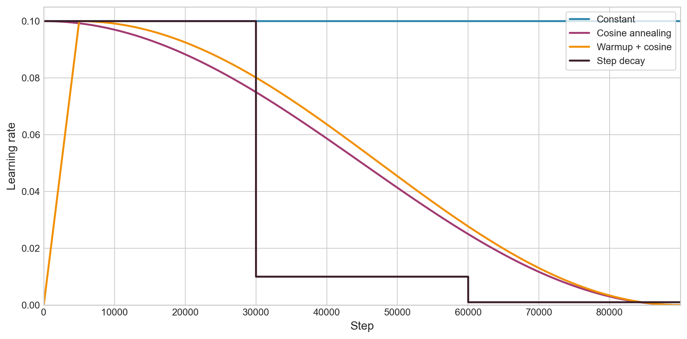
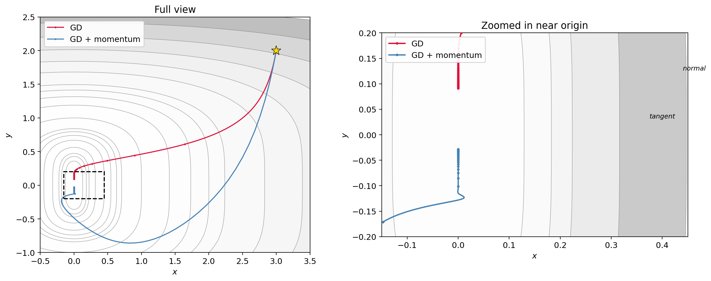
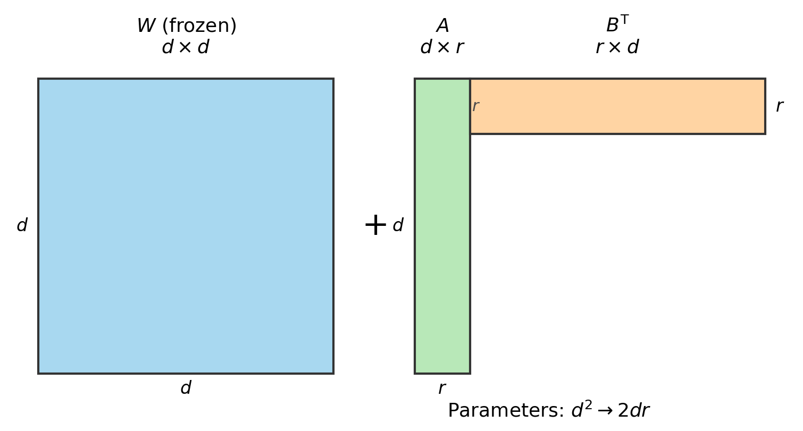
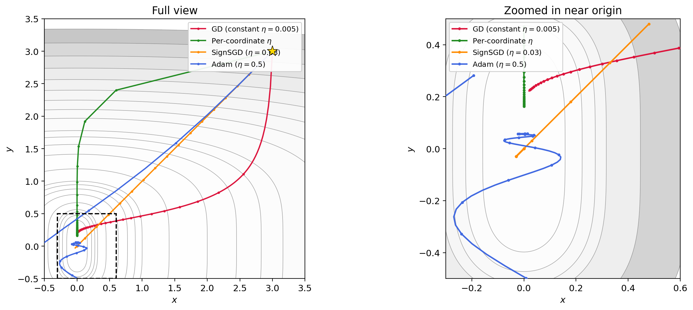
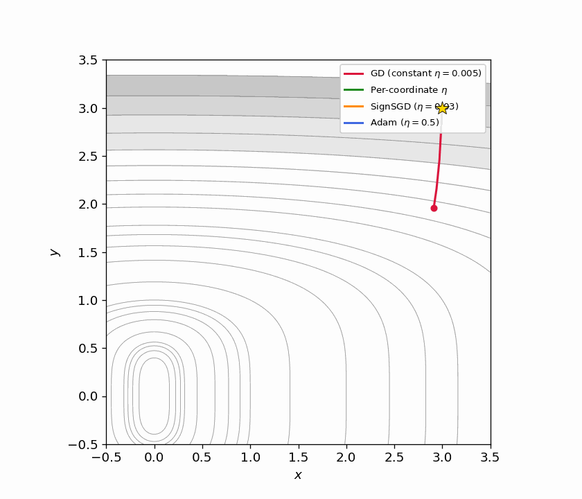
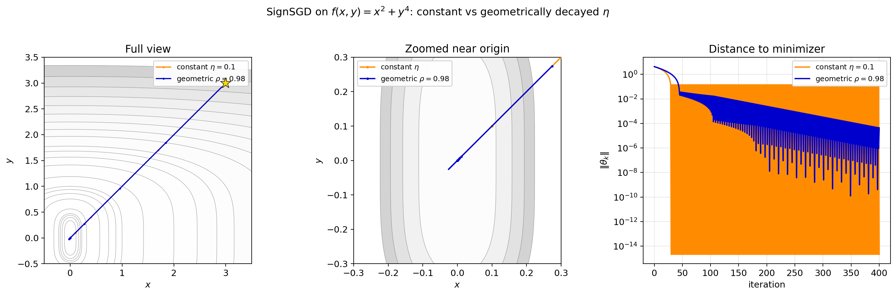
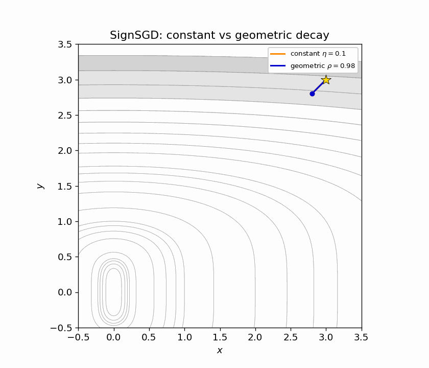
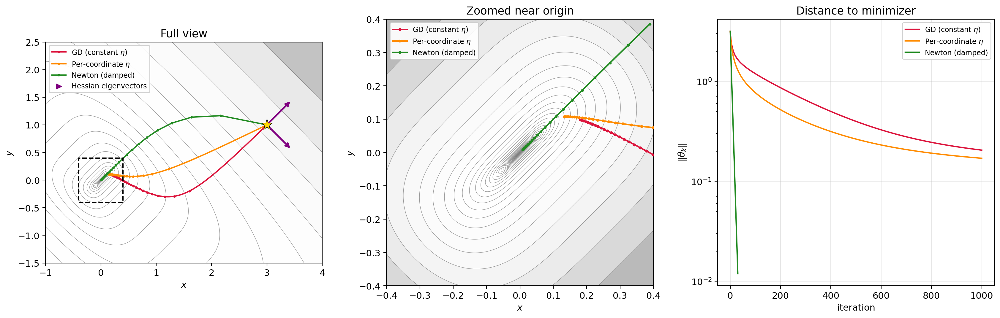
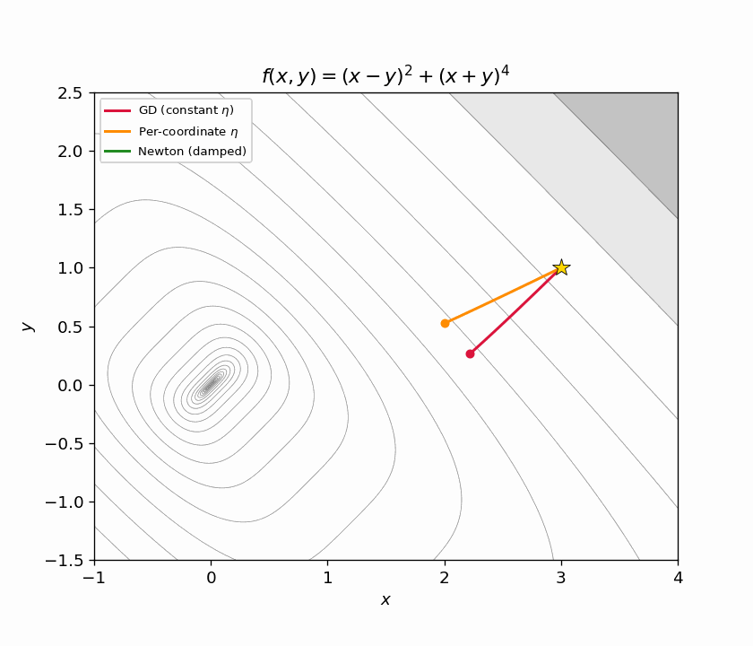
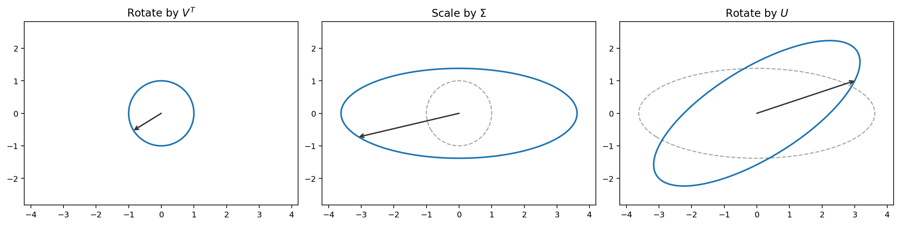

# 8. More on optimizers

## Table of contents
1. [Where we are](#1-where-we-are)
2. [Algorithm modifiers](#2-algorithm-modifiers)
3. [Techniques that change the problem](#3-techniques-that-change-the-problem)
4. [Different algorithms](#4-different-algorithms)
5. [Why coordinate-wise scaling](#5-why-coordinate-wise-scaling)
6. [Newton's method](#6-newtons-method)
7. [Beyond Adam: Muon](#7-beyond-adam-muon)

## 1. Where we are

In this class we've covered:

1. **Basic algorithms** — gradient descent and SGD.
2. **Problem formulations** — neural networks, transformers, diffusion models.
3. **Other paradigms** — RL.

So now I'm trying to think through what is actually useful to tell you about other optimizers.

The truth is there are a million optimizers and each helps in different scenarios. But without getting into the math and geometric structure underlying each one, I don't think it would be possible to follow the arguments for why one is better than another. That's a many-weeks diversion. And is it really useful?

As an "intelligent user of optimization" — which is what I hoped you would get from this class — most of the time you're not the first person who tried to optimize the problem you're trying to optimize. There is usually a repo. You're modifying it, changing stepsizes, etc. And the basic principles — batch size, noise floor, stepsize — we've already covered.

So what is the use of trying to explain the geometric structure that leads to faster convergence of one method over another when:

- We can't verify that structure exists outside of highly idealized models.
- You're not going to have a career in designing and analyzing optimization methods. (That career path has largely ended in the last 10 years or so. Instead you have to do a lot more empirical work to understand what's working and what's not, and there is no sense in making up reasons why one thing helps and another doesn't.)
- It's a matter of looking at a plot, changing something, and observing the effect. Outside of rigid problem classes like convexity, we can't really say much. So let's just not pretend.

Instead, let me try something different. We're going to lay out all the tools available to you and show you what each one computes.

### 1.1 Setting the stage

We're dealing with the same optimization problem as before:

$$
L(\theta) = \frac{1}{n}\sum_{i=1}^n \ell_i(\theta).
$$

Here $\theta$ is our parameters. In deep learning, it usually describes a list of weight matrices $\theta = (W_1, \ldots, W_L)$. Sometimes it's useful to leverage that structure — at least one algorithm we describe will use it. But it can also have bias vectors and other stuff we'll ignore.

Let's recall very quickly what we did in Lectures 1 and 2.

**Gradient descent:** compute the gradient, step in that direction.

$$
\theta_{k+1} = \theta_k - \eta \nabla L(\theta_k).
$$

Set a stepsize — too big you blow up, too little no progress. Main issue: not implementable for large-scale problems because you have to compute the gradient of every term $\ell_i$.

**SGD:** sample an index (or minibatch), step in that sample's gradient direction. Set a stepsize: too small, nothing; constant, hit the noise floor; too big, blow up. Key thing that mattered: variance of the gradient controls speed of the method. Minibatches reduce variance. Larger minibatch means you can increase the stepsize up to a point because the noise floor lowers. See that lecture for details.

### 1.2 The PyTorch optimizer interface

In PyTorch, no matter which optimizer you pick, the interface is always the same three lines:

```python
optimizer = torch.optim.SGD(model.parameters(), lr=0.01)

# training loop:
optimizer.zero_grad()
loss.backward()
optimizer.step()
```

`zero_grad()` clears old gradients. `backward()` computes new ones. `step()` reads `.grad` on each parameter and updates it according to the optimizer's rule. You can swap `SGD` for any other optimizer — nothing else in your code changes. Only the update rule inside `step()` changes.

A few nuances worth knowing:

**Parameter groups.** The first argument to an optimizer is usually `model.parameters()`, which hands it every learnable tensor in the model. But sometimes you want different settings for different parameters — for example, a higher learning rate on the classifier head, or weight decay on matrices but not biases. You do this by passing a list of dicts:

```python
optimizer = torch.optim.SGD([
    {'params': model.backbone.parameters(), 'lr': 1e-3},
    {'params': model.head.parameters(), 'lr': 1e-2},
], momentum=0.9)
```

Each dict is a "parameter group" with its own settings. Any setting not specified in the dict falls back to the default you pass at the top level.

**Schedulers.** Most training runs decay the learning rate over time. PyTorch provides `torch.optim.lr_scheduler` for this. You wrap an optimizer in a scheduler and call `scheduler.step()` after each `optimizer.step()`. We'll discuss several specific schedules in Section 2.2 (cosine decay, warmup, etc.), and each of them can be implemented through this interface.

**State.** Optimizers like Adam maintain internal buffers (momentum, squared gradient averages) for each parameter. These live in `optimizer.state_dict()` and get saved/loaded alongside the model. If you resume training from a checkpoint, you need to reload the optimizer state too — otherwise the buffers reset and training may spike.

### 1.3 Three categories

There are a few different ways you can modify a training loop:

1. **Algorithm modifiers.** Things you layer on top of any optimizer: gradient clipping, stepsize schedules, warmup, momentum.
2. **Techniques that change the problem.** LoRA, quantization, weight decay. These modify what you're optimizing rather than how.
3. **Different algorithms.** The PyTorch optimizers — different update rules for converting a gradient into a step.

We'll go through each.

## 2. Algorithm modifiers

These are things you can layer on top of any optimizer.

### 2.1 Gradient clipping

We saw this briefly in the RL lecture. The key idea:

1. Sometimes you get a really large gradient. This could be because you didn't fit some sample very well yet.
2. If you see this, you don't want to have to adjust your stepsize or anything else. You just clip it.
3. You do this after you form the minibatch gradient, not before.

Mechanically: clip by global norm. If $\|g\| > c$, rescale

$$
g \leftarrow c \cdot \frac{g}{\|g\|}.
$$

Direction preserved, magnitude capped. In PyTorch:

```python
torch.nn.utils.clip_grad_norm_(model.parameters(), max_norm=1.0)
```

This goes between `backward()` and `step()`. A `max_norm` of 1.0 is reasonable. GPT-2 ([Radford et al., 2019](https://cdn.openai.com/better-language-models/language_models_are_unsupervised_multitask_learners.pdf){:target="_blank"}) and GPT-3 ([Brown et al., 2020](https://arxiv.org/abs/2005.14165){:target="_blank"}, Table 2.1) both use it.

### 2.2 Stepsize schedules

People almost never use a constant learning rate. Decaying it over training tends to give better results. One fact for SGD: with constant $\eta$, SGD converges to a neighborhood of the optimum whose radius is proportional to $\eta$. Shrinking $\eta$ shrinks the neighborhood. Beyond that, it's empirical.

**Warmup.** At first, gradients can be large, so take small steps. Then ramp up to a bigger learning rate for a while, then decay afterwards. Typical: linear warmup over 1–5% of total steps, then cosine decay. GPT-3 used 375 warmup steps, then cosine decay to 10% of peak.

No built-in warmup in PyTorch. People do it manually:

```python
import math

def get_lr(step, warmup_steps, max_lr, total_steps):
    if step < warmup_steps:
        return max_lr * step / warmup_steps
    progress = (step - warmup_steps) / (total_steps - warmup_steps)
    return max_lr * 0.5 * (1 + math.cos(math.pi * progress))
```

**Cosine annealing** is the dominant schedule for LLMs:

$$
\eta_k = \eta_{\min} + \frac{1}{2}(\eta_{\max} - \eta_{\min})\left(1 + \cos\!\left(\frac{\pi k}{T}\right)\right).
$$

It's just a smooth decay from $\eta_{\max}$ to $\eta_{\min}$. Other options: step decay (drop by 10x at fixed epochs), linear decay, cosine with warm restarts.

In PyTorch, schedulers wrap an optimizer and adjust the learning rate each step:

```python
optimizer = torch.optim.SGD(model.parameters(), lr=0.01)
scheduler = torch.optim.lr_scheduler.CosineAnnealingLR(optimizer, T_max=1000)

for step in range(1000):
    optimizer.zero_grad()
    loss.backward()
    optimizer.step()
    scheduler.step()
```

Call `scheduler.step()` after `optimizer.step()`. There's also `LambdaLR` if you want a custom schedule like the warmup function above:

```python
scheduler = torch.optim.lr_scheduler.LambdaLR(
    optimizer, lr_lambda=lambda step: get_lr(step, warmup_steps, max_lr, total_steps) / max_lr
)
```



*Figure 2.1: Four learning rate schedules over 90,000 steps, all starting from $\eta = 0.1$. Warmup + cosine is by far the most common in modern LLM training.*

### 2.3 Momentum

Look at the function $f(x,y) = x^2 + y^4$. This has what's called a **ravine** structure — the $x$-axis (where $y \approx 0$) is a region you're drawn toward, and once you're near it, progress along it is slow.

The momentum update adds inertia: each step carries some fraction of the previous step's displacement.

$$
\theta_{k+1} = \theta_k - \eta \nabla f(\theta_k) + \beta(\theta_k - \theta_{k-1}).
$$

This is Polyak's heavy ball method. The term $\beta(\theta_k - \theta_{k-1})$ says: keep going in the direction you were already going, scaled by $\beta$. Typical: $\beta = 0.9$.

You will also see an equivalent formulation using a velocity buffer:

$$
v_{k+1} = \mu \, v_k + g_k, \qquad \theta_{k+1} = \theta_k - \eta \, v_{k+1}.
$$

These produce identical iterates when $\beta = \mu$. To see why: define $d_k = \theta_k - \theta_{k-1}$. In the velocity formulation, $d_{k+1} = -\eta(\mu v_k + g_k) = \mu(-\eta v_k) - \eta g_k = \mu \, d_k - \eta g_k$, which matches Polyak. PyTorch uses the velocity form: `torch.optim.SGD(params, lr=0.01, momentum=0.9)`.

Why does this help on the ravine? The ravine for $f(x,y) = x^2 + y^4$ runs along the $x$-axis. Starting from a point like $(3, 2)$, the gradient is $(6, 32)$ — the steep $y$-direction forces you to pick a tiny stepsize $\eta$ to avoid diverging. That tiny $\eta$ then limits progress everywhere.

Once GD reaches a neighborhood of the ravine ($y$ small), the $x$-gradient ($2x$) is much bigger than the $y$-gradient ($4y^3 \approx 0$). The $y$ direction makes very little progress because the quartic is extremely flat near zero. And the $x$-gradient can oscillate in sign if GD overshoots across the ravine.

Momentum helps because the $y$-gradient is consistent (always pointing toward the origin along the ravine), so the $y$-velocity builds up: with $\mu = 0.9$, the effective step in a consistent direction is $\sim \eta/(1-\mu) = 10\eta$. Meanwhile the oscillating $x$-component gets damped. This picture doesn't show the oscillation clearly, but the velocity buildup in the consistent direction is the key mechanism.

There's also Nesterov momentum (`nesterov=True`), which evaluates the gradient at a lookahead point. The practical difference for neural networks is small.



*Figure 2.2: Gradient descent (red) vs. gradient descent with momentum (blue) on $f(x,y) = x^2 + y^4$, starting from $(3, 2)$. Left: full view. Right: zoomed in near the origin. GD crawls along the ravine (the $x$-axis), making very slow tangent progress; momentum accumulates tangent velocity and reaches the origin faster, at the cost of overshooting in $y$.*

The animated version below continuously zooms in so you can see both methods evolve:


## 3. Techniques that change the problem

These modify what you're optimizing, not how.

### 3.1 LoRA (Low-Rank Adaptation)

Let's say you're optimizing a function where the parameters are matrices. The model has already been trained — say, a transformer. The base model is already pretty good. Now we have some more data and we want to fine-tune, but not too much.

Simplest solution: instead of optimizing $L(W)$ directly on the new data, define

$$
f(A, B) = L(W + AB^T)
$$

and optimize this instead, where $A \in \mathbb{R}^{d \times r}$ and $B \in \mathbb{R}^{d \times r}$ are skinny and tall, with $r \ll d$.



*Figure 3.1: LoRA parameterization. $W$ is the frozen $d \times d$ pretrained weight matrix. The update $AB^T$ is a $d \times d$ matrix but is parameterized by only $2dr$ numbers instead of $d^2$.*

This has way fewer parameters. Per layer: $d^2 \to 2dr$. For $d = 4096$, $r = 16$: 16.8M parameters becomes 131K. That's a 128x reduction. The inner dimension $r$ is called the **rank**. People call this **LoRA** — low rank adapters (Hu et al., 2021).

You initialize $B = 0$ and $A$ as a random Gaussian, so $AB^T = 0$ at the start — fine-tuning begins as the pretrained model. After training, you merge: $W_{\text{new}} = W + AB^T$, so there is no additional cost at inference.

In practice, you apply LoRA to the attention matrices ($W_Q, W_K, W_V, W_O$) and sometimes the MLP matrices. Setting $r = 8$ or $r = 16$ typically recovers close to full fine-tuning performance with less than 1% of the parameters. This is what made the open-source fine-tuning boom of 2023–2025 possible. People with a single 24GB GPU could fine-tune 7B-parameter models.

**QLoRA** (Dettmers et al., 2023) is the same idea, but you store $W$ in 4-bit precision. This lets you fine-tune 65B models on a single 48GB GPU.

### 3.2 Quantization

The idea here is to train in lower precision datatypes. Operations are faster, but training can become unstable, and not every parameter should be stored in the same precision.

For example, in **mixed-precision training** (which is basically universal now on modern GPUs), you do the forward and backward passes in FP16 or BF16 (16-bit floating point), but you keep the optimizer's internal state in FP32. (We haven't discussed Adam yet, but most optimizers maintain auxiliary buffers — running averages, squared gradients, etc. — that need to stay in high precision. We'll see what those are in Section 4.) The reason is that gradient updates can be very small, and if you accumulate them in 16-bit you lose information.

QLoRA takes this further: you freeze the base weights in 4-bit (NF4) precision, keep the LoRA adapters in BF16, and keep the optimizer states in FP32. That's three different precisions for three different roles.

### 3.3 Weight decay

This one is a bit weird. There is a technique called ridge regularization. You may have seen it in least squares with a ridge penalty. You add an L2 norm to the objective:

$$
\text{minimize} \quad L(\theta) + \frac{\lambda}{2}\|\theta\|^2.
$$

This biases solutions toward small weights, which may help with generalization.

Now some people noticed there is another way to do weight decay that is a bit nicer. Suppose you have an optimizer that takes a step $\theta_+ = \theta - G$, where $G$ is some update direction (could be the gradient, could be something fancier). **Weight decay** modifies this to:

$$
\theta_+ = (1-\lambda)\theta - G.
$$

When $G$ is the stochastic gradient of SGD, this is just L2 regularization. You can check: the gradient of $L(\theta) + \frac{\lambda}{2}\|\theta\|^2$ is $\nabla L(\theta) + \lambda\theta$, so the SGD step is $\theta - \eta(\nabla L + \lambda\theta) = (1 - \eta\lambda)\theta - \eta\nabla L$. Same thing.

But in other algorithms — specifically the adaptive ones we'll see in Section 4 — it is not the same as L2 regularization, because those algorithms rescale the gradient before applying the update. Adding $\lambda\theta$ to the gradient *before* that rescaling changes the effect. Decoupled weight decay applies the shrinkage *after* the optimizer step, so the regularization is independent of the learning rate. We don't really know why this helps, but empirically it does. We'll revisit this distinction when we get to AdamW in Section 4.5.

Either way, the net effect is the same: shrink the parameters and maybe generalize better. People use it.

Practical note: you typically apply weight decay to weight matrices only, not to biases or normalization parameters. All the modern PyTorch optimizers have a `weight_decay` option. For SGD it looks like this:

```python
optimizer = torch.optim.SGD(model.parameters(), lr=0.01, weight_decay=0.01)
```

If you want different weight decay for different parameters (e.g., decay on weights but not on biases), you pass parameter groups:

```python
decay_params = [p for n, p in model.named_parameters()
                if 'bias' not in n and 'norm' not in n]
no_decay_params = [p for n, p in model.named_parameters()
                   if 'bias' in n or 'norm' in n]
optimizer = torch.optim.SGD([
    {'params': decay_params, 'weight_decay': 0.01},
    {'params': no_decay_params, 'weight_decay': 0.0}
], lr=0.01)
```

## 4. Different algorithms

All first-order algorithms work in a similar way:

1. Compute a stochastic gradient $g_k$ (e.g., with a minibatch estimator).
2. Convert that into a search direction $G$.

The interesting part is step 2. You can add momentum, weight decay, etc. And you can **scale the components** of $G$ in various ways.

### 4.1 SignSGD

The simplest thing you can do is throw away the gradient magnitude entirely and only use the sign of each coordinate:

$$
\theta_{+,j} = \theta_j - \eta \cdot \text{sign}(g_j).
$$

Every coordinate gets the same step size $\eta$. You move in the direction the gradient points, but you ignore how large it is.

There is a variant called **Signum**, which is SignSGD with momentum. You compute $m_{k+1} = \beta m_k + (1-\beta)g_k$ and then update in the direction $\text{sign}(m_{k+1})$.

We will come back to SignSGD after we introduce Adam in Section 4.4 — it turns out the two are closely related.

### 4.2 AdaGrad

AdaGrad (Duchi, Hazan, Singer, 2011) maintains a per-coordinate adaptive learning rate by accumulating squared gradients:

$$
s_{k+1,j} = s_{k,j} + g_{k,j}^2, \qquad \theta_{+,j} = \theta_j - \frac{\eta}{\sqrt{s_{k+1,j}} + \epsilon} \, g_j.
$$

The effective learning rate for coordinate $j$ at step $k$ is $\eta / (\sqrt{s_{k,j}} + \epsilon)$. Coordinates with historically large gradients accumulate a large $s_j$, so their learning rate shrinks. Coordinates with small gradients keep a small $s_j$, so their learning rate stays large.

This is useful when gradients are **sparse** — meaning that on any given step, most coordinates of $g$ are zero and only a few are nonzero. This happens in classical NLP with one-hot word embeddings: each training example only touches the embedding vector for the words it contains, so the gradient is zero for all the other embedding vectors. Rare words get updated infrequently, and AdaGrad ensures that when they do get updated, the learning rate is still large. Frequent words accumulate a large $s_j$ and their learning rate decays automatically.

AdaGrad was quite popular when people were doing convex optimization and classical machine learning with sparse features. These days it is not used much, because the problem is that $s$ only grows and the learning rate can only shrink. For the long training runs typical of modern deep learning, the learning rate eventually becomes too small to make progress.

In PyTorch: `torch.optim.Adagrad(params, lr=0.01)`.

### 4.3 RMSProp

RMSProp (Hinton, unpublished Coursera slides, 2012) fixes AdaGrad's accumulator by using an exponential moving average instead of a sum, so that $v$ can go up and down:

$$
v_{k+1,j} = \beta \, v_{k,j} + (1-\beta) \, g_{k,j}^2, \qquad \theta_{+,j} = \theta_j - \frac{\eta}{\sqrt{v_{k+1,j}} + \epsilon} \, g_j.
$$

A typical value is $\beta = 0.99$. This was never published as a paper. In PyTorch: `torch.optim.RMSprop(params, lr=0.01, alpha=0.99)` (PyTorch calls $\beta$ `alpha`).

### 4.4 Adam

Adam (Kingma and Ba, 2014) combines momentum (a first moment estimate) with RMSProp (a second moment estimate):

$$
m_{k+1} = \beta_1 m_k + (1-\beta_1) g_k \qquad \text{(momentum)}
$$

$$
v_{k+1} = \beta_2 v_k + (1-\beta_2) g_k^2 \qquad \text{(per-coordinate scaling)}
$$

Both buffers start at zero, so they are biased toward zero in early steps. To correct for this, Adam divides by a bias correction term:

$$
\hat{m}_{k+1} = \frac{m_{k+1}}{1 - \beta_1^{k+1}}, \qquad \hat{v}_{k+1} = \frac{v_{k+1}}{1 - \beta_2^{k+1}}.
$$

The update is then:

$$
\theta_+ = \theta - \frac{\eta}{\sqrt{\hat{v}_{k+1}} + \epsilon} \, \hat{m}_{k+1}.
$$

The default values are $\beta_1 = 0.9$, $\beta_2 = 0.999$, $\epsilon = 10^{-8}$, and $\eta = 10^{-3}$.

```python
torch.optim.Adam(params, lr=1e-3, betas=(0.9, 0.999), eps=1e-8)
```

### 4.5 AdamW

AdamW (Loshchilov and Hutter, 2019) is Adam with the decoupled weight decay we discussed in Section 3.3. When people say "Adam" in 2025 they usually mean AdamW.

```python
torch.optim.AdamW(params, lr=1e-3, weight_decay=0.01)
```

### 4.6 Connection to SignSGD

Now that we've seen Adam, recall SignSGD from Section 4.1. Adam's update for coordinate $j$ is:

$$
\theta_{+,j} = \theta_j - \frac{\eta}{\sqrt{\hat{v}_j} + \epsilon} \, \hat{m}_j.
$$

The ratio $\hat{m}_j / \sqrt{\hat{v}_j}$ controls the effective direction. Now, $\hat{m}_j$ is an exponential moving average of $g_j$, and $\hat{v}_j$ is an exponential moving average of $g_j^2$. If the gradient for coordinate $j$ doesn't change sign too often, then $\hat{v}_j \approx \hat{m}_j^2$, and so:

$$
\frac{\hat{m}_j}{\sqrt{\hat{v}_j}} \approx \frac{\hat{m}_j}{\lvert\hat{m}_j\rvert} = \text{sign}(\hat{m}_j).
$$

In other words, Adam's update is approximately $\theta_{+,j} \approx \theta_j - \eta \cdot \text{sign}(\hat{m}_j)$, which is exactly Signum. The adaptive scaling in the denominator mostly just normalizes each coordinate to $\pm 1$.

Orvieto and Gower ([arXiv:2505.21829](https://arxiv.org/abs/2505.21829){:target="_blank"}, 2025) made this precise: they trained over 1,500 language models and found that Signum (SignSGD with momentum) closes ~96% of the gap between SGD and Adam. Most of what Adam does, it turns out, is take the sign.

## 5. Why coordinate-wise scaling

Why might you want to scale the components of the gradient in funny ways? Let's go back to our ravine example from Section 2.3.

### 5.1 The axis-aligned case

Consider $f(x,y) = x^2 + y^4$. Imagine we run gradient descent with a constant stepsize. We converge very, very slowly. Let's think about why.

The gradient descent recursion on each variable separately is:

$$
x_+ = x - \gamma \cdot 2x, \qquad y_+ = y - \gamma \cdot 4y^3.
$$

Now if we choose $\gamma$ differently for each coordinate:

- For $x$: set $\gamma_x = 1/2$. Then $x_+ = x - 2x/2 = 0$. Converges in 1 step.
- For $y$: set $\gamma_y = 1/(4y^2)$. Then $y_+ = y - 4y^3/(4y^2) = y - y = 0$. Converges in 1 step.

Each coordinate needs a **different stepsize** to converge quickly. This is why coordinate-wise rescaling has taken off: this type of scaling can be beneficial when there isn't a significant coupling between the coordinates (but there can still be a nonzero coupling).

Let's compare a few approaches on this function, all starting from $(3, 3)$:

1. **GD with constant stepsize** $\eta = 0.005$. This is vanilla gradient descent: $\theta_+ = \theta - \eta \nabla f(\theta)$. The stepsize has to be tiny to avoid blowup in the $y$ direction, so the $x$ coordinate barely moves.
2. **Per-coordinate stepsizes.** We set $\eta_x = 0.4$ (aggressive, since the $x$ direction is quadratic) and $\eta_y = \min(0.2 / (4y^2 + \epsilon),\; 0.1)$, which approximates the ideal $1/(4y^2)$ from above but clamps it to avoid giant jumps when $y$ is near zero. The update is $x_+ = x - \eta_x \cdot 2x$, $y_+ = y - \eta_y \cdot 4y^3$.
3. **SignSGD** with $\eta = 0.03$. The update is $\theta_+ = \theta - \eta \cdot \text{sign}(\nabla f(\theta))$. Every coordinate moves by exactly $\pm\eta$ per step, regardless of gradient magnitude. This automatically treats both coordinates equally.
4. **Adam** with $\eta = 0.5$, $\beta_1 = 0.9$, $\beta_2 = 0.999$. Adam adapts the stepsize per-coordinate using exponential moving averages of the gradient and its square, as we discussed in Section 4.5.



*Figure 5.1: Four trajectories on $f(x,y) = x^2 + y^4$ from $(3, 3)$. GD with constant $\eta$ (red) barely moves. Per-coordinate $\eta$ (green) converges quickly by matching each direction's curvature. SignSGD (orange) ignores gradient magnitude entirely and makes steady equal-sized progress per coordinate. Adam (blue) achieves a similar effect adaptively.*



*Figure 5.2: Animated version of Figure 5.1, continuously zooming toward the origin. SignSGD's equal-step behavior and Adam's adaptive scaling both outperform constant-stepsize GD dramatically.*

There is a catch with SignSGD. Every update moves each coordinate by exactly $\pm\eta$, regardless of how close you are to the minimizer. When $\theta$ is far from zero, that's fine — you're making progress. But once you get close, you're trapped: you keep bouncing back and forth across the minimizer in steps of size $\eta$, and you can never get closer than $\eta$ in any coordinate. The method will oscillate forever.

The fix is to decay the stepsize, and the natural choice is **geometric decay**:

$$
\eta_k = \eta_0 \cdot \rho^k, \qquad \rho \in (0, 1).
$$

Why geometric? Think about it: if SignSGD is making progress, the distance to the minimizer is shrinking roughly by a constant factor each step. The stepsize should shrink at the same rate, so that the step remains proportional to the remaining distance. Geometric decay does exactly that. The total displacement in any one coordinate is $\sum_{k=0}^{\infty} \eta_0 \rho^k = \eta_0 / (1 - \rho)$, which is finite — so the method converges, and the oscillation radius at step $k$ is bounded by $\eta_k = \eta_0 \rho^k$, which goes to zero.



*Figure 5.3: SignSGD with constant $\eta = 0.1$ (orange) vs geometrically decayed $\eta_k = 0.1 \cdot 0.98^k$ (blue). Left: full trajectories. Center: zoomed near origin — the constant version fills a band it can never escape, while the decayed version zigzags with shrinking amplitude. Right: distance to minimizer on a log scale. Constant $\eta$ plateaus; geometric decay decreases at a roughly linear rate on the log scale, i.e., geometrically.*



*Figure 5.4: Animated zoom of Figure 5.3. As the camera closes in, the constant-$\eta$ trajectory fills a visible region, while the geometrically decayed version converges.*

This is not specific to SignSGD. Any method that takes fixed-magnitude steps — including Signum — needs a decaying schedule to converge.

### 5.2 Adam and axis alignment

Out of all these modifications, Adam has withstood the test of time for deep learning optimization. There is no real theory for it. The best explanation I can think of is that deep learning problems are "somewhat axis aligned": the weight matrices in a network have a natural coordinate system (the entries of the matrix), and the loss function doesn't couple those entries too aggressively, so per-coordinate scaling gets you most of the way.

## 6. Newton's method

What if the function is NOT axis-aligned? Consider $f(x,y) = (x-y)^2 + (x+y)^4$. The $x$ and $y$ coordinates are coupled. Per-coordinate scaling in the $(x,y)$ basis won't help.

But notice: if we change variables to $u = x+y$, $w = x-y$, then $f = w^2 + u^4$. That's the same ravine function from before, in rotated coordinates! We already know how to optimize that — use different stepsizes for each coordinate. The problem is just that we're working in the wrong coordinate system.

So the question is: how do we find the right coordinates? We need a matrix $A$ such that if we replace the gradient step $\theta_+ = \theta - \eta \nabla f$ with $\theta_+ = \theta - \eta A \nabla f$, the matrix $A$ rotates us into the decoupled basis and rescales each direction appropriately.

### 6.1 The Hessian diagonalizes the problem

It turns out the Hessian $H = \nabla^2 f$ gives us exactly this. Its eigenvectors are the "right axes" for the function, and its eigenvalues tell us how curved the function is along each axis. Multiplying by $H^{-1}$ rotates into the eigenvector basis and rescales each direction by the inverse curvature — which is precisely the per-coordinate scaling idea, but in the correct coordinate system. Let's work it out.

The gradient in $(x,y)$ coordinates:

$$
\nabla_x f = 2(x-y) + 4(x+y)^3, \qquad \nabla_y f = -2(x-y) + 4(x+y)^3.
$$

The Hessian:

$$
H = \begin{bmatrix} 2 + 12(x+y)^2 & -2 + 12(x+y)^2 \\ -2 + 12(x+y)^2 & 2 + 12(x+y)^2 \end{bmatrix}.
$$

Diagonalize: the eigenvectors of $H$ are $(1,1)/\sqrt{2}$ and $(1,-1)/\sqrt{2}$. These are exactly the directions $u = x+y$ and $w = x-y$. The eigenvalues are $24(x+y)^2$ (in the $u$ direction) and $4$ (in the $w$ direction). So in the eigenvector basis, $H = \text{diag}(24u^2, 4)$.

### 6.2 The Newton step

The gradient in $(u,w)$ coordinates is $(4u^3, 2w)$. The Newton step is:

$$
H^{-1} \nabla f = \left(\frac{4u^3}{12u^2}, \frac{2w}{2}\right) = \left(\frac{u}{3}, w\right).
$$

So Newton takes the step $-(u/3, w)$. The $w$ coordinate converges in 1 step (since $f$ is quadratic in $w$). The $u$ coordinate converges cubically fast.

### 6.3 Why the Hessian "knows" the rotation

There's a clean way to see why this works in general. Suppose $g$ is an axis-aligned function (like $g(u,w) = w^2 + u^4$), and we define $f(x) = g(Rx)$ where $R$ is a rotation matrix ($R^T = R^{-1}$). Then by the chain rule:

$$
\nabla f(x) = R^T \nabla g(Rx), \qquad \nabla^2 f(x) = R^T \nabla^2 g(Rx)\, R.
$$

Now look at the Newton step on $f$:

$$
(\nabla^2 f)^{-1} \nabla f = (R^T \nabla^2 g \, R)^{-1}\, R^T \nabla g = R^{-1} (\nabla^2 g)^{-1} (R^T)^{-1} R^T \nabla g = R^T (\nabla^2 g)^{-1} \nabla g.
$$

The Newton step on the rotated function $f$ is just $R^T$ times the Newton step on the axis-aligned function $g$. In other words, inverting the Hessian automatically undoes the rotation — it finds the decoupled coordinates, applies per-coordinate scaling there, and rotates back. You never need to know what $R$ is.

This is exactly what's happening with $f(x,y) = (x-y)^2 + (x+y)^4$: the Hessian "discovers" the rotation to $(u,w)$ coordinates and rescales each axis by the inverse curvature.



*Figure 6.1: Three trajectories on $f(x,y) = (x-y)^2 + (x+y)^4$ from $(3, 1)$. Left: full view — GD (red) crawls along the ravine, per-coordinate $\eta$ (orange) does only slightly better because the coordinates are coupled, Newton (green) converges in ~30 steps. Center: zoomed near origin. Right: distance to minimizer on a log scale — Newton drops orders of magnitude faster than either first-order method. Arrows show the Hessian eigenvectors at the starting point.*



*Figure 6.2: Animated zoom. Newton (green) has already converged before GD (red) and per-coordinate GD (orange) make it halfway down the ravine.*

### 6.4 The catch

This is called **Newton's method**. You may remember Newton's method from single-variable calculus as a root-finding algorithm: to find a root of $g(x) = 0$, you iterate $x_+ = x - g(x)/g'(x)$. Here we're doing the same thing, but applied to the gradient $\nabla f(\theta) = 0$ — we want to find the point where the gradient vanishes. The single-variable update $x - g/g'$ becomes $\theta - (\nabla^2 f)^{-1} \nabla f$, where the Hessian $\nabla^2 f$ plays the role of the derivative of the gradient.

Key issue: it's not implementable in high dimensions. It requires computing the Hessian — an $n \times n$ matrix where $n$ is the number of parameters — and then solving a linear system. For a model with a billion parameters, that's a $10^9 \times 10^9$ matrix. Not happening.

## 7. Beyond Adam: Muon

### 7.1 The modded-nanogpt competition

Adam was the state of the art until recently. But this is starting to change.

What happened is that an independent researcher named Keller Jordan released a benchmark called **modded-nanogpt** that led to the popularization of an algorithm called **Muon**. A bit of backstory.

Andrej Karpathy released the [nanoGPT](https://github.com/karpathy/nanoGPT){:target="_blank"} repo years ago. It shows you how to train a transformer with very minimal code on Shakespeare data (the same data we used in Lecture 5). They also trained on [FineWeb](https://huggingface.co/datasets/HuggingFaceFW/fineweb){:target="_blank"} data, a large-scale web text dataset released by HuggingFace containing ~15 trillion tokens of cleaned web text. The modded-nanogpt competition uses a subset called FineWeb-Edu, filtered for educational content.

This was a nice teaching repo but it wasn't optimized. Karpathy later wrote a version called [LLM.c](https://github.com/karpathy/llm.c){:target="_blank"} which was more optimized but took about 45 minutes to train on FineWeb.

So Keller noticed this and created a competition to "speedrun" training as quickly as possible. His first edits tuned hyperparameters. The second implemented an optimizer he called Muon, done in collaboration with Jeremy Bernstein (now at Thinking Machines). At that point the training time had dropped from 45 minutes to 24.9 minutes. But the competition has continued, and the latest training time is only ~1.4 minutes, due to improvements in the Muon optimizer, architectural changes, and other tricks. From what I understand, improvements from this repo actually appear to generalize to larger-scale models, which is pretty cool.

The importance of this competition was getting people excited about Muon. The algorithm wasn't exactly new — it's a modification of an optimizer proposed by Volkan Cevher and coauthors back in 2015 that worked well for Boltzmann machines. My understanding is it wasn't widely used until the competition. But when people get excited about a new method, they do everything in their power to improve it and demonstrate it at scale. For example, Moonshot used Muon to train their Kimi K2 model, and Essential AI also proved it out at larger scale.

Now I actually think I know why Muon is uniquely suited to deep learning problems — you can quickly get to the point by reading my [100-page paper](https://arxiv.org/abs/2512.04299){:target="_blank"} on the topic (light reading). But let's put that aside and just tell you what it is.

### 7.2 The singular value decomposition (SVD)

In deep learning, especially transformer training, almost all parameters are matrices — the MLP weights, the attention projections $W_Q, W_K, W_V$, and so on. So the gradient with respect to a weight matrix is also a matrix. (Gradients are always the same size and shape as the variable.)

The natural thing to do is to treat the gradient as a matrix and start doing matrix-like things to it. For simplicity, assume we're optimizing $L(W)$ for a single weight matrix $W$. The gradient $G = \nabla L(W)$ is also a matrix.

To introduce Muon, I need to remind you of a key fact from linear algebra: **every matrix has a singular value decomposition**.

I suspect many of you have not seen the SVD before. The SVD is like a diagonalization of a non-square matrix. It's closely related to the diagonalization of the Gram matrices.

Let $A \in \mathbb{R}^{m \times n}$ be a (possibly rectangular) matrix. From the spectral theorem:

1. $A^TA$ is square ($n \times n$) and symmetric, so it diagonalizes as $A^TA = V\Lambda V^T$ for an orthogonal matrix $V$ ($V^TV = I$) and a diagonal matrix $\Lambda$ ($n \times n$) consisting of the eigenvalues of $A^TA$.
2. Similarly, $AA^T = UDU^T$ where $D$ ($m \times m$) has the eigenvalues of $AA^T$ and $U$ is orthogonal.

**Key fact:** $\Lambda$ and $D$ are different sizes ($n \times n$ vs $m \times m$), but their nonzero eigenvalues are the same. If $r = \text{rank}(A)$, there are exactly $r$ nonzero eigenvalues, and they match between the two. Call their square roots $\sigma_1 \geq \sigma_2 \geq \cdots \geq \sigma_r > 0$.

From these decompositions, one can show that

$$
A = U\Sigma V^T,
$$

where $\Sigma$ is an $m \times n$ matrix that is zero everywhere except $\Sigma_{ii} = \sigma_i$ for $i = 1, \ldots, r$. The $\sigma_i$ are called the **singular values** of $A$. When some of them are zero (i.e., $r < \min(m,n)$), the matrix is low-rank.

Geometrically, any matrix $A$ decomposes into three operations:

1. **Rotate** using $V^T$.
2. **Scale** using $\Sigma$ (stretch or compress along each axis, possibly changing dimension from $\mathbb{R}^n$ to $\mathbb{R}^m$).
3. **Rotate** using $U$.



*Figure 7.1: The SVD of a matrix $A$ applied to a unit circle. First $V^T$ rotates (aligning with principal axes), then $\Sigma$ scales (turning the circle into an ellipse), then $U$ rotates to the final orientation.*

Consistency check (carry out the multiplication, using $U^TU = I$ and $V^TV = I$):

$$
A^TA = (U\Sigma V^T)^T(U\Sigma V^T) = V\Sigma^T U^TU\Sigma V^T = V\Sigma^T\Sigma V^T = V\Lambda V^T. \quad \checkmark
$$

$$
AA^T = (U\Sigma V^T)(U\Sigma V^T)^T = U\Sigma V^TV\Sigma^T U^T = U\Sigma\Sigma^T U^T = UDU^T. \quad \checkmark
$$

Here $\Sigma^T\Sigma$ is $n \times n$ with diagonal entries $\sigma_i^2$, which is $\Lambda$, and $\Sigma\Sigma^T$ is $m \times m$ with diagonal entries $\sigma_i^2$, which is $D$.

Two examples:

**Example 1.** Let

$$
A = \begin{bmatrix} 3 & 0 \\ 0 & 2 \end{bmatrix}.
$$

This is already diagonal, so the SVD is trivial: $U = V = I$ and

$$
A = \begin{bmatrix} 1 & 0 \\ 0 & 1 \end{bmatrix} \begin{bmatrix} 3 & 0 \\ 0 & 2 \end{bmatrix} \begin{bmatrix} 1 & 0 \\ 0 & 1 \end{bmatrix}^T.
$$

The singular values are $\sigma_1 = 3$ and $\sigma_2 = 2$.

**Example 2.** Let

$$
A = \begin{bmatrix} 1 & 1 \\ 0 & 0 \end{bmatrix}.
$$

This has rank 1. We compute

$$
A^TA = \begin{bmatrix} 1 & 1 \\ 1 & 1 \end{bmatrix},
$$

which has eigenvalues 2 and 0. So $\sigma_1 = \sqrt{2}$ and $\sigma_2 = 0$. The full SVD is:

$$
A = \begin{bmatrix} 1 & 0 \\ 0 & 1 \end{bmatrix} \begin{bmatrix} \sqrt{2} & 0 \\ 0 & 0 \end{bmatrix} \begin{bmatrix} 1/\sqrt{2} & 1/\sqrt{2} \\ -1/\sqrt{2} & 1/\sqrt{2} \end{bmatrix}^T.
$$

You can verify: $V^T$ rotates $(1,0)$ to $(1/\sqrt{2}, 1/\sqrt{2})$, then $\Sigma$ scales the first component by $\sqrt{2}$ and kills the second, giving $(\sqrt{2} \cdot 1/\sqrt{2},\, 0) = (1, 0)$, then $U = I$ does nothing. So $Ae_1 = (1, 0)$. Similarly $Ae_2 = (1, 0)$. That checks out: every column of $A$ is $(1, 0)$.

### 7.3 Spectral gradient methods

Alright, so that is the SVD. Now Muon is an example of a **spectral gradient method**. Here's how they work.

Suppose we have a baseline optimization method: $W_+ = W - G$ for some search direction $G$ (a matrix). $G$ could be the gradient; in that case this is just GD.

Now define the following operation. Take the SVD of $G = U\Sigma V^T$. Replace every nonzero entry of $\Sigma$ with 1. Call this $\text{sign}(\Sigma)$. Then define:

$$
\text{polar}(G) = U \cdot \text{sign}(\Sigma) \cdot V^T.
$$

This is the **matrix polar factor** of $G$.

The "spectral version" of the algorithm is:

$$
W_+ = W - \eta \cdot \text{polar}(G).
$$

When $G = \nabla L(W)$, this is **spectral gradient descent**. When $G$ is the exponential moving average of past gradients:

$$
G_{k+1} = (1-\gamma) G_k + \gamma \nabla L(W_k), \qquad W_+ = W - \eta \cdot \text{polar}(G_{k+1}),
$$

this is **Muon** (Momentum + Orthogonalization).

### 7.4 What to make of this

OK, so this all seems pretty random, right? Well, that's natural and OK. Many things in deep learning feel like that, because people are basically trying all possibilities to get any kind of edge. It's not usually motivated by deep thinking. It's not until years later that the theoretical community catches up to some understanding (if ever) and starts to explain what's "really" happening. I made my attempt with [arXiv:2512.04299](https://arxiv.org/abs/2512.04299){:target="_blank"}, but that's a separate 1-hour talk.

The important point is that Muon is a new algorithm you should know the mechanics of, because it's probably not going away and it's replacing Adam in some settings.

Also notice the connection to SignSGD: SignSGD replaces each coordinate of the gradient vector with its sign ($+1$ or $-1$). Muon replaces the singular values of the gradient matrix with 1. It's like Signum but in the spectral sense — it normalizes the singular values of the matrix instead of the entries of the vector.

<!-- Appendix: figure generation details

### Figure 2.1: Learning rate schedules
**File:** `scripts/plot_lr_schedules.py` → `figures/lr_schedules.png`

Four curves on the same axes: constant ($\eta = 0.1$), cosine (from 0.1 to 0), warmup + cosine (linear warmup for 5000 steps to 0.1, then cosine to 0), and step decay (drop by 10x at steps 30k and 60k). All over 90,000 steps.

### Figure 2.2: GD vs momentum on ravine
**File:** `scripts/plot_momentum_ravine.py` → `figures/momentum_ravine.png`

Contour plot of $f(x,y) = x^2 + y^4$ with two trajectories: GD (red) and GD with momentum $\mu=0.9$ (blue), both with $\eta = 0.01$, starting from $(3, 3)$, 200 steps. GD should zigzag/crawl; momentum should move faster along the ravine.

### Figure 3.1: LoRA matrix dimensions
**File:** `scripts/plot_lora_matrices.py` → `figures/lora_matrices.png`

Diagram showing $W$ ($d \times d$), $A$ ($d \times r$), and $B^T$ ($r \times d$) with $r \ll d$. Annotate dimensions. Show $AB^T$ has the same size as $W$ but far fewer parameters.

### Figure 5.1: Coordinate scaling comparison
**File:** `scripts/plot_coordinate_scaling.py` → `figures/coordinate_scaling.png`

Contour plot of $f(x,y) = x^2 + y^4$ with three trajectories from $(3, 3)$: GD constant step (red, slow), GD per-coordinate (green, fast), Adam (blue).

### Figure 6.1: Newton's method on coupled function
**File:** `scripts/plot_newton_ravine.py` → `figures/newton_ravine.png`

Contour plot of $f(x,y) = (x-y)^2 + (x+y)^4$ with three trajectories from $(3, 1)$: GD (red), per-coordinate GD (orange), Newton (green). Show Hessian eigenvectors at starting point as arrows.

### Figure 7.1: SVD geometry
**File:** `scripts/plot_svd_geometry.py` → `figures/svd_geometry.png`

Three-panel figure showing unit circle → rotated by $V^T$ → scaled by $\Sigma$ → rotated by $U$. Use a specific $2 \times 2$ matrix $A$ with distinct singular values. -->
