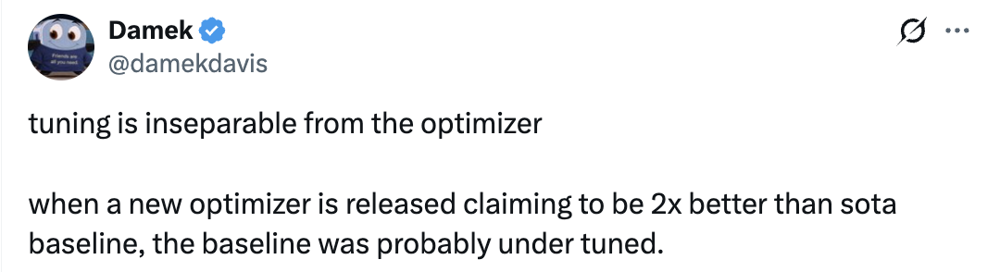
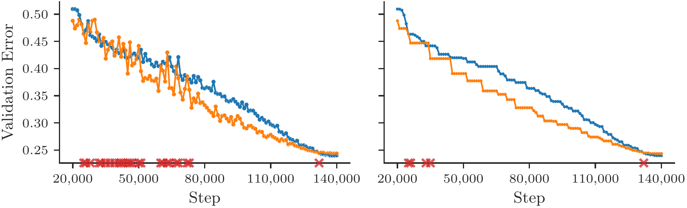
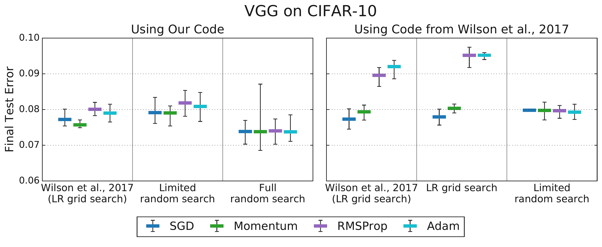
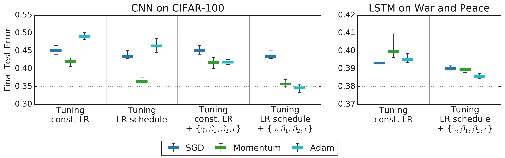
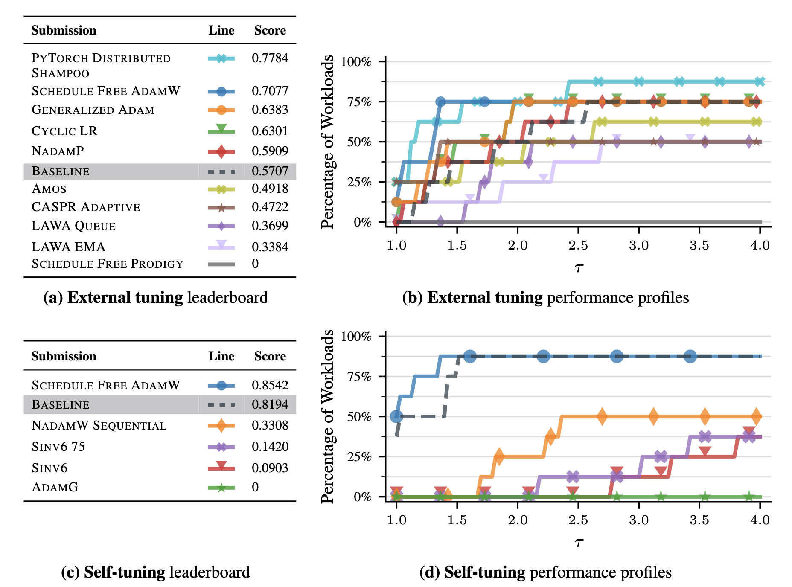
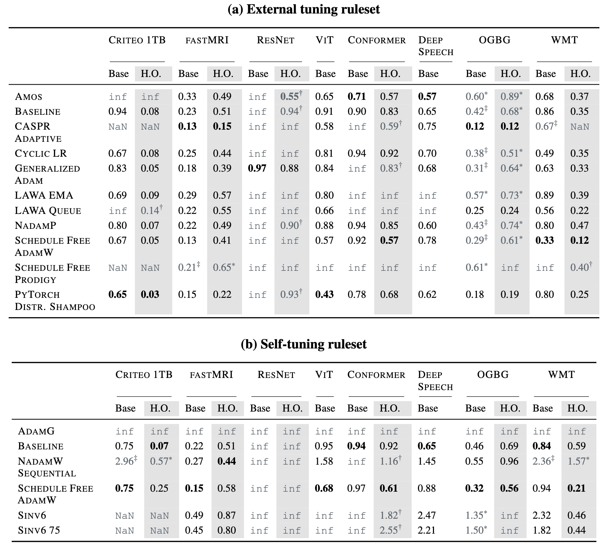

# 9. Benchmarking optimizers

[YouTube Presentation on AlgoPerf](https://www.youtube.com/watch?v=_yX1ItxReLY){:target="_blank"}

## Table of contents
1. [Which optimizer should you use?](#1-which-optimizer-should-you-use)
2. [Loss curves can cross](#2-loss-curves-can-cross)
3. [Time-to-result](#3-time-to-result)
4. [Tuning is inseparable from the optimizer](#4-tuning-is-inseparable-from-the-optimizer)
5. [AlgoPerf](#5-algoperf)
6. [What the benchmark found](#6-what-the-benchmark-found)
7. [Takeaways](#7-takeaways)

## 1. Which optimizer should you use?

Last time we laid out a bunch of optimizers: SGD, momentum, Adam, AdamW, SignSGD, Muon. We showed you what each one computes. We showed you the PyTorch interface. You can swap any of them in and out with a single line of code.

Natural question: which one should you actually use?

This question gets answered wrong surprisingly often, even by researchers who should know better. This lecture is about how to get it right. The ideas are all common sense, but they're often missed.

The main messages are:

1. **Tuning is inseparable from the optimizer.** You cannot compare two optimizers without specifying exactly how you tuned their hyperparameters.
2. **When someone releases a new optimizer claiming it's 2x better than the state-of-the-art baseline, the baseline was probably under-tuned.**

I [tweeted](https://x.com/damekdavis/status/1911512233491964219){:target="_blank"} this in April 2025:

*Almost every week a new paper shows up on Twitter claiming their optimizer is way better. It's almost never true once you tune the baseline properly.*

Let's walk through why.

## 2. Loss curves can cross

The most natural thing to do is train a model with two different optimizers and plot the loss curve. Whoever gets lower loss is "better," right?

The problem is that loss curves cross. One optimizer might look great early and then plateau, while another starts slow and then overtakes. So who "wins" depends entirely on when you stop training. If you stop at step 10,000, optimizer A looks better. If you stop at step 50,000, optimizer B looks better, and there is no unambiguous winner.

Dahl et al. (2023) illustrate this. The figure below shows two training runs on the same optimizer and task. The validation error curves cross. Even if you look at the running minimum (the best validation error achieved so far), the curves still cross, as indicated by the red markers.

*Figure 2.1 (from Dahl et al., 2023, Figure 1): A direct comparison of training curves is ill-posed if they intersect. Left: validation error for two different runs. Right: the running minimum of each curve. Even this smoothed metric intersects multiple times.*

So just looking at curves doesn't work. We need a single number.

## 3. Time-to-result

The fix is simple: pick a target performance level (say, 90% validation accuracy, or a specific loss value) and measure how long each optimizer takes to first reach that target.

This gives you one number per optimizer, which removes the ambiguity of comparing curves at different points in training. Either you hit the target in 2 hours or you hit it in 3 hours, and the faster one wins.

This is called **time-to-result**, and it's the standard metric in serious benchmarking (Dahl et al., 2023). You do need to choose the target carefully: it should be meaningful (not trivially easy, not impossibly hard), and both optimizers should be able to reach it.

OK great, so now we have a way to compare. Let's take SGD, Momentum, and Adam, run them on a task, and see who reaches the target first.

But wait. What learning rate did we use?

## 4. Tuning is inseparable from the optimizer

Here's the thing. When you say "Adam," you don't mean a single algorithm. You mean a family of algorithms parameterized by the learning rate $\eta$, momentum coefficients $\beta_1$ and $\beta_2$, the epsilon $\epsilon$, weight decay $\lambda$, plus a learning rate schedule, plus warmup steps, and so on. Same for SGD: it's parameterized by $\eta$, momentum $\mu$, weight decay, and schedule.

The performance of any optimizer depends hugely on these choices.

So when you say "Adam beats SGD," what you really mean is: "Adam with the hyperparameters I happened to try beats SGD with the hyperparameters I happened to try." That's a statement about your tuning procedure, not about the algorithms themselves.

### 4.1 Optimizer inclusion

There's a really clean way to think about this. Choi et al. (2019) introduced the idea of **optimizer inclusion**. An optimizer M is a subset of optimizer N (written $M \subseteq N$) if N can exactly replicate M by setting some of its hyperparameters to specific values.

For example:

- **SGD $\subseteq$ Momentum**, because Momentum with $\mu = 0$ is just SGD.
- **SGD $\subseteq$ Momentum $\subseteq$ Adam** (roughly, since Adam with $\beta_1 = 0$ and $\beta_2 \to 0$ approaches SGD).

So if you had infinite compute to tune hyperparameters, the more general optimizer should always win. It can do everything the simpler one can do, plus more. Since Adam's search space contains SGD as a special case, the best Adam configuration is at least as good as the best SGD configuration.

### 4.2 Finite tuning budgets

But in practice you don't have infinite compute for tuning. You run maybe 20 or 50 trials.

And here's where it gets interesting. With a limited tuning budget, the simpler optimizer can appear to win. Why? Because the simpler optimizer has fewer hyperparameters to search over. With the same budget, you explore its space more thoroughly. The more general optimizer has a bigger search space, and if you don't explore it well enough, you might land on a bad configuration.

So a limited tuning budget can reverse the inclusion hierarchy: Adam, which should in theory always be at least as good as SGD, can appear worse simply because you didn't search its larger hyperparameter space thoroughly enough.

### 4.3 Empirical evidence

Choi et al. (2019) showed this empirically.

Wilson et al. (2017) published a well-cited NeurIPS paper arguing that SGD with momentum beats Adam across a range of tasks. Choi et al. investigated what happens when you tune more carefully. When only the learning rate was tuned for both algorithms, Adam appeared worse (consistent with Wilson et al.'s findings). But when additional hyperparameters (Adam's $\epsilon$, the momentum coefficients, etc.) were also tuned using a consistent, fair procedure, the differences vanished.

*Figure 4.1 (from Choi et al., 2019, Figure 3): Tuning more hyperparameters removes the differences between optimizers that Wilson et al. (2017) reported. Left: limited tuning, Adam appears worse. Right: comprehensive tuning, all optimizers perform comparably.*

Actually it can be worse than that. The rankings can flip depending on which hyperparameters you include in the search.

*Figure 4.2 (from Choi et al., 2019, Figure 4): Rankings change as you tune more hyperparameters. The leftmost columns for each workload reproduce rankings from Schneider et al. (2019), while subsequent columns tune over increasingly general search spaces. Rankings only stabilize and become consistent with the inclusion hierarchy ($\text{SGD} \subseteq \text{Momentum} \subseteq \text{Adam}$) when the tuning protocol is comprehensive enough.*

### 4.4 Upshot

The tuning protocol is not external to the optimizer. It is part of the algorithm's definition for empirical comparison.

You have to specify:

- What hyperparameters did you search over?
- What was the search space?
- How many trials did you run?
- How did you sample from the search space?

If you don't control for all of this, your comparison is meaningless. You're comparing tuning procedures, not optimizers.

And this is why I get annoyed when people post on Twitter that their new optimizer is 2x better than Adam. The question you should always ask: did they tune Adam properly? Did they give Adam the same tuning budget? Did they search over the right hyperparameters?

Here's the deeper issue: running a truly fair comparison requires a LOT of compute. However many experiments an academic lab can run, Google can run 10x more. So when an academic claims superiority over a baseline, you have to wonder whether they really had the resources to answer the question they claim to be answering.

## 5. AlgoPerf

So how do you actually run a fair comparison? Dahl et al. (2023) at Google built a benchmark called **AlgoPerf** that tries to address all of the problems we've discussed. There is a [YouTube presentation](https://www.youtube.com/watch?v=_yX1ItxReLY){:target="_blank"} if you want to see it explained by the authors.

The key design principles:

**Time-to-result.** As we discussed. For each task, define a target metric value. Measure wall-clock time to first reach it.

**Fixed hardware.** Everyone runs on the same GPUs. No advantage from having better machines. This makes the wall-clock time measurements meaningful and comparable across submissions.

**Diverse workloads.** The benchmark includes image classification, speech recognition, machine translation, and other tasks. No optimizer gets to win by being good at one thing. They also have held-out workload variants that are sampled *after* submissions are finalized. This prevents people from overfitting their algorithm design to the specific benchmark tasks.

**Explicit tuning rulesets.** This is the critical one. There are two competition tracks:

1. **External tuning:** You provide a hyperparameter search space. The benchmark runs a fixed number of random trials (e.g., 5 studies of 5 trials each), and scores you on the best trial found within that budget. This simulates having a limited compute budget for hyperparameter search, which is the situation most practitioners face.
2. **Self-tuning:** No external tuning at all. Your algorithm has to be hyperparameter-free, or tune itself during the training run. You get more wall-clock time to compensate for any internal tuning overhead. This is the harder track, but also the more practically useful one: the dream is an optimizer you can just run without fiddling with settings.

**Aggregate scoring across workloads.** Since performance is measured across many tasks, you need a way to summarize. AlgoPerf uses **performance profiles** (Dolan and Moré, 2002). The idea: for each task, measure how much slower you are compared to the fastest submission. Then plot the fraction of tasks you solved within a given slowdown factor. An optimizer whose line is higher and further to the left is better, meaning it solves more problems faster.

## 6. What the benchmark found

The first AlgoPerf competition ran and the results were analyzed by Kasimbeg et al. (2024).

*Figure 6.1 (from Kasimbeg et al., 2024, Figure 1): Leaderboard and performance profiles for all submissions. Top row: external tuning ruleset. Bottom row: self-tuning ruleset. Left: leaderboard ranked by benchmark score. Right: performance profiles showing the fraction of workloads solved within a given slowdown factor.*

**External tuning winner: Distributed Shampoo** (PyTorch implementation). This is a preconditioning method in the spirit of Newton's method from [Lecture 8](../8/notes.md), where you multiply the gradient by a matrix that accounts for curvature, but approximated in a way that's actually implementable at scale. It was ~28% faster than the NadamW baseline on average across workloads.

**Self-tuning winner: Schedule-Free AdamW.** No external tuning at all, and it was competitive with externally tuned methods. It was ~10% faster than the externally tuned baseline on the workloads it completed. This is real progress toward the goal of optimizers that just work out of the box.

But look at the per-workload breakdown:

*Table 6.1 (from Kasimbeg et al., 2024, Table 1): Normalized runtimes across all workloads. The fastest submission per workload is in bold. Gray cells indicate failures: timeouts (`inf`), errors (`NaN`), or disqualifications due to held-out workload issues (`†`, `‡`).*

Many submissions failed on some workloads entirely. The winners weren't always the absolute fastest on every single task; they were the most **robust**. They hit the target reliably across the whole suite. Robustness and reliability across diverse tasks, rather than peak speed on a select few, were the critical factors for achieving a high overall benchmark score.

No single optimizer dominates everything. The rankings depend on the task.

## 7. Takeaways

1. **Tuning is inseparable from the optimizer.** You cannot evaluate an optimizer without specifying the tuning protocol: the search space, the budget, the sampling method. The tuning protocol is part of the algorithm.

2. **When someone claims their new optimizer is dramatically better, ask: did they tune the baseline?** How many trials? What search space? The baseline was probably under-tuned.

3. **Running a real comparison is expensive.** It requires many tasks, many trials, fixed hardware, and explicit rules. Most papers don't have the budget to do this properly. However many experiments an academic lab can run, a place like Google can run 10x more.

4. **When Google did run these comparisons properly (AlgoPerf), the picture was nuanced.** Advanced preconditioning (Distributed Shampoo) helps. Self-tuning algorithms (Schedule-Free AdamW) are getting competitive. But no single method wins everywhere. Robustness matters more than peak performance.

5. **As a practitioner:** look at what people are doing for your specific problem. If everyone training your type of model uses AdamW, start there. If you have the compute to tune, try alternatives. But don't switch optimizers because of a Twitter thread.

## References

1. **Choi et al., 2019:** Dami Choi, Christopher J. Shallue, Zachary Nado, Jaehoon Lee, Chris J. Maddison, and George E. Dahl. (2019). *On Empirical Comparisons of Optimizers for Deep Learning*. arXiv preprint arXiv:1910.05446. [Link](https://arxiv.org/abs/1910.05446){:target="_blank"}

2. **Dahl et al., 2023:** George E. Dahl, Frank Schneider, Zachary Nado, Naman Agarwal, Chandramouli Shama Sastry, Philipp Hennig, Sourabh Medapati, Runa Eschenhagen, Priya Kasimbeg, Daniel Suo, Juhan Bae, Justin Gilmer, Abel L. Peirson, Bilal Khan, Rohan Anil, Mike Rabbat, Shankar Krishnan, Daniel Snider, Ehsan Amid, Kongtao Chen, Chris J. Maddison, Rakshith Vasudev, Michal Badura, Ankush Garg, and Peter Mattson. (2023). *Benchmarking Neural Network Training Algorithms*. arXiv preprint arXiv:2306.07179. [Link](https://arxiv.org/abs/2306.07179){:target="_blank"}

3. **Dolan & Moré, 2002:** Elizabeth D. Dolan and Jorge J. Moré. (2002). *Benchmarking optimization software with performance profiles*. Mathematical Programming, 91(2), 201–213.

4. **Kasimbeg et al., 2024:** Priya Kasimbeg, Frank Schneider, Runa Eschenhagen, Juhan Bae, Chandramouli Shama Sastry, Mark Saroufim, Boyuan Feng, Less Wright, Edward Z. Yang, Zachary Nado, Sourabh Medapati, Philipp Hennig, Mike Rabbat, George E. Dahl. (2024). *Accelerating Neural Network Training: An Analysis of the AlgoPerf Competition*. arXiv preprint arXiv:2405.17095. [Link](https://arxiv.org/abs/2405.17095){:target="_blank"}

5. **Schneider et al., 2019:** Frank Schneider, Lukas Balles, and Philipp Hennig. (2019). *DeepOBS: A Deep Learning Optimizer Benchmark Suite*. International Conference on Learning Representations (ICLR). [Link](https://arxiv.org/abs/1903.05499){:target="_blank"}

6. **Wilson et al., 2017:** Ashia C. Wilson, Rebecca Roelofs, Mitchell Stern, Nathan Srebro, and Benjamin Recht. (2017). *The Marginal Value of Adaptive Gradient Methods in Machine Learning*. Advances in Neural Information Processing Systems (NeurIPS) 30. [Link](https://proceedings.neurips.cc/paper_files/paper/2017/hash/81b3833e2504647f9d794f7d7b9bf341-Abstract.html){:target="_blank"}
